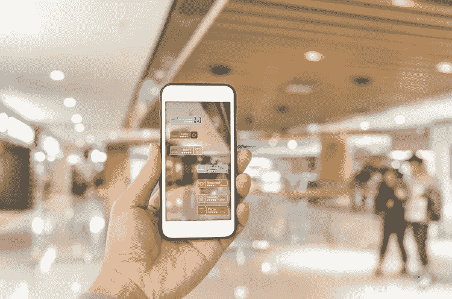
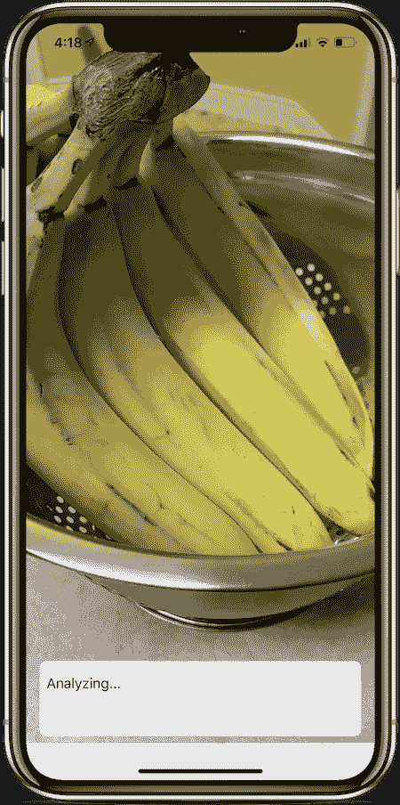
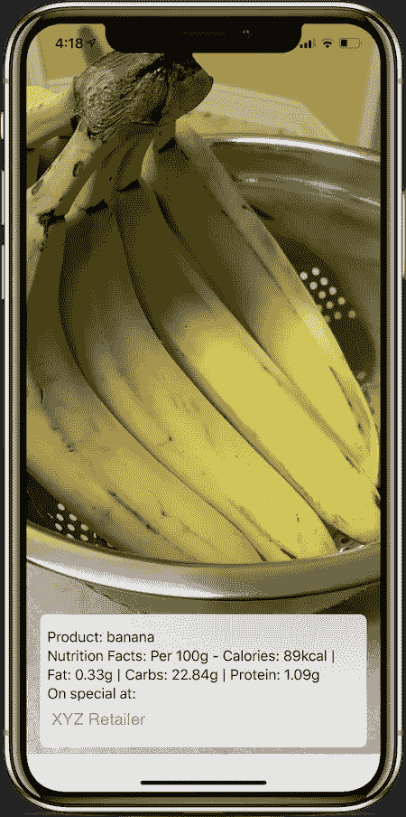

# 增强现实——新现实

> 原文：<https://medium.datadriveninvestor.com/augmented-reality-the-new-reality-2bead2582e44?source=collection_archive---------21----------------------->

想象一下，走在街上，能够看到最近的洗手间或最近的有免费 Wi-Fi 的咖啡店在哪里。想想看，如果你能看到一个新书架如何适合你的卧室，设计一个家会变得多么容易。如果能够指向杂货店中的一件商品，查看它的营养成分以及它是否在打折，那该有多好。有了增强现实，这一切都有可能。增强现实能够将计算机生成的图像叠加到我们的真实世界视图上，以提供只有用户才能看到的复合视图。我们在日常生活的许多领域以及工作场所都能看到这项技术。

**什么事？**

那么什么是增强现实呢？在定义它之前，我们需要确保它不会与虚拟现实混淆。两者的区别在于，在虚拟现实中，用户感知的是一个完全改变的世界视图，而 AR 则将与现实世界集成的图像叠加在一起，以创建一种互动体验。此外，AR 与物理世界交织在一起，为用户提供了多种感官体验。在某些方面，这项技术可以模糊现实和虚拟生活之间的界限。然而，AR 已经进入了从医疗保健到室内设计的惊人数量的应用。

**它是如何工作的？**

要实现图像叠加，需要几个关键要素。增强现实使用传感器、相机、投影仪、处理器、反射器和标记的组合来生成真实世界的这种改变的视图。此外，还有不同类型的增强现实，如基于**标记、无标记、基于投影、**和**基于叠加。**

这些 AR 类型的主要区别在它们的标题中有解释。基于标记的 AR 使用摄像机和某种视觉标记来显示图像。另一方面，无标记使用更多的处理能力来根据用户的位置提供图像。这种类型的 AR 中的关键组件包括 GPS、数字罗盘和速度计。在 AR 的另一方面，基于投影的技术使用人造光将图像投影到表面上。这在与他人合作处理图像时特别有用。最后，基于叠加的 AR 可以用计算机生成的图像部分或全部取代现有的图像。这是在设计一个家或者甚至玩一个游戏的时候使用的。

**ARKit 和 ARCore**

这些增强现实框架允许开发者在选定的平台上提供创新技术。ARKit for iOS 和 ARCore(多平台支持)实际上是一样的，没有明显区别。每个平台都使用映射、表面、照明和阴影来生成与现实世界共存的图像。这两个框架都为开发人员提供了技术进步的机会，并为消费者市场提供了功能。此外，他们可以使用机器学习模型来提供关于被可视化主题的近实时信息，使用户体验更加丰富和愉快。

**用在哪里？**

增强现实的用途实际上是无穷无尽的。今天，我们对科技的使用可能比我们意识到的更多。还记得 Pokémon Go 吗？你用 Snapchat 的面部滤镜吗？这些是我们经常使用的 AR 的常见例子。此外，这项技术已经进入了许多行业，其中最重要的是医疗保健行业。

医疗行业的人一直在使用 AR 进行体检，甚至外科手术。外科医生可以看到大脑上的重叠图像，以准确地看到需要切口的位置以及他们所看到的细节。据说这提供了更多的准确性和精确性，从而导致更成功的手术。此外，AR 还有一个协作软件，允许两个人面对面交流。因此，允许医生使用共享图像在世界各地教其他医生如何进行手术。这使得医生能够接触到世界各地更多的患者，特别是那些医疗保健不方便的地区。

许多公司也在利用这项技术来进一步满足消费者的需求。宜家和 Wayfair 提供了一个应用程序，让顾客在购买之前可以直观地了解一件新的家居用品的外观。甚至像美国航空公司这样的航空公司也为乘客提供一种服务，这种服务会引导他们通过机场，告诉他们最近的洗手间，甚至会指引他们到登机口。

总之，很明显，这项技术已被证明在我们的日常生活中是有用的。有一天，我们可能会看到它以隐形眼镜或眼镜的形式最终消除对智能手机的需求。考虑用手在全息图像上滑动来接听电话，而不是拿着手机。有了增强现实，这个以及我们任何最疯狂的技术梦想都可能成为新的现实。随着我们在所有技术领域的进步，我们的成就是无限的。

最初发布于 2018 年 12 月 6 日@ [aiapplied.ca](https://www.aiapplied.ca/2018/12/06/augmented-reality-the-new-reality/)