# 🚲🛴Austin(得克萨斯州)分享了使用 Pyspark 🛴的微移动性数据分析🚲

> 原文：<https://medium.datadriveninvestor.com/austin-texas-shared-micromobility-data-analysis-using-pyspark-627e8b11cee2?source=collection_archive---------8----------------------->

credit: [https://www.sae.org/shared-mobility/](https://www.sae.org/shared-mobility/)

如今，城市正面临着快速的人口增长，这需要对创新的共享微移动解决方案(电动滑板车、自行车、汽车等)的高需求，作为应对传统交通停滞的额外交通工具。

作为一名用户，我产生了一些好奇心，去发现和分析公共可用的关于共享微机动车辆出行的信息。为此，我做了一些研究，并偶然发现了[奥斯汀市的官方开放城市门户](https://data.austintexas.gov/Transportation-and-Mobility/Shared-Micromobility-Vehicle-Trips/7d8e-dm7r/data)，在那里我发现了一个数据集，其中包含向奥斯汀市交通局报告的共享微型汽车出行数据，这是共享小型汽车移动系统操作规则的一部分。

基本上，报告指标仅包括符合以下标准的行程:

*   行程距离大于或等于 0.1 英里且小于 500 英里
*   行程持续时间少于 24 小时

然而，我在导出数据之前设置了一些过滤器，以减少体积并避免一些无用的差异。查询过滤器符合以下标准:

*   行程距离大于或等于 500 且小于 20000 米
*   行程持续时间大于或等于 500 秒且小于 15000 秒
*   旅行发生在 2019 年 1 月 1 日至 2019 年 12 月 31 日之间

这篇文章的目的是浏览数据，找出隐藏的见解。

## SparkSession 定义:

首先，我将从定义 SparkSession 开始，这是用 DataFrame API 编程 Spark 的入口点。我将按照构建器模式创建一个 SparkSession:

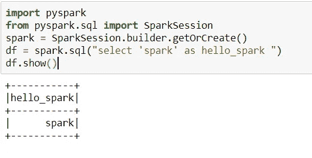

SparkSession Creation

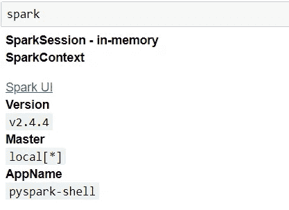

SparkSession attributes

一旦定义了 SparkSession，我将把重点放在加载合适的库上，这些库在整个分析阶段都是有用的。

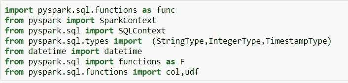

## 数据接收和描述:

在这一部分中，我将加载数据并对其进行描述，如果需要的话执行一些清理，然后分析数据集属性在如上所述的过滤期内的演变方式。

我将让 Spark 推断 csv 数据的模式。

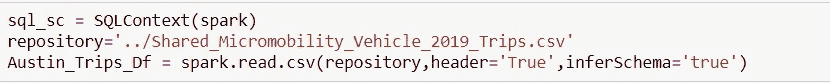

Spark CSV data ingestion

导入数据后要执行的第一个操作是了解数据的外观。

函数`count`返回摄取数据的容量。

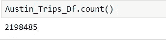

Number of rows

函数`printSchema`有助于更多地了解数据帧中包含的数据类型。

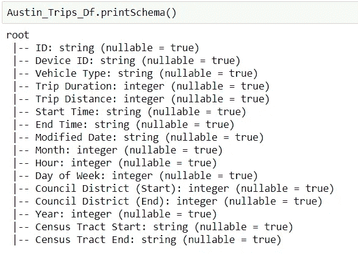

Dataframe schema

## 数据清理和转换:

我将通过运行一些基本的 Pyspark 函数来执行清理操作，如下所示:

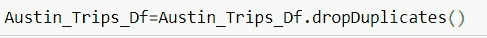

Remove duplicates

Remove null values

通过之前的清理功能已经删除了 24 行。

下一步是删除未使用的列，如年份和修改日期。

Remove useless columns

为了从 Spark 的良好性能中获益，我需要为我的所有列分配更准确的数据类型。这就是为什么，我决定使用用户定义函数(udf)将开始时间和结束时间列从字符串类型转换为时间戳类型。

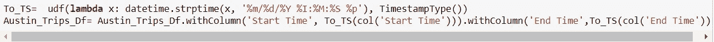

Spark 中的时间戳差异可以通过将时间戳列转换为 long 类型，减去两个 long 值得到秒差异，然后将结果除以 60 得到分钟差异来计算。

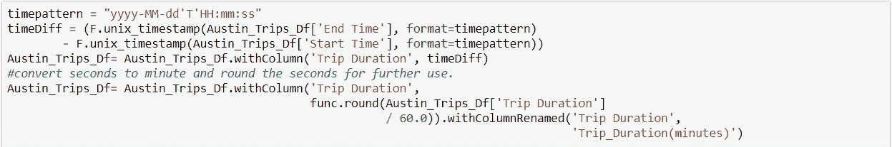

Trip Duration in minutes calculation

然后，我将通过使用`describe`函数计算相关列的统计数据来检查新创建的列“Trip_Duration(minutes)”。

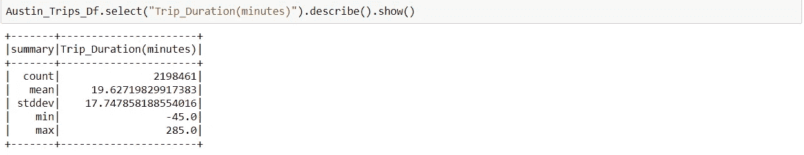

Calculate Trip_Duration(minutes) statistics

\_(ツ)_/的统计数据显示旅行持续时间为负值，我不确定使用电动滑板车或自行车能让人们回到过去。\_(ツ)_/

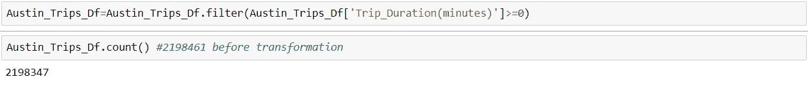

Filter negative values

通过过滤，我剔除了 114 条记录。

我决定将星期转换为工作日，如下所示:

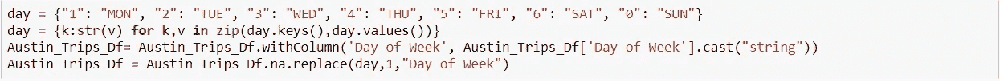

在这个级别，我将使用 udf 添加一个与周末相关的列，以便稍后分析使用率。

最后一步是检查前几次操作产生的新模式

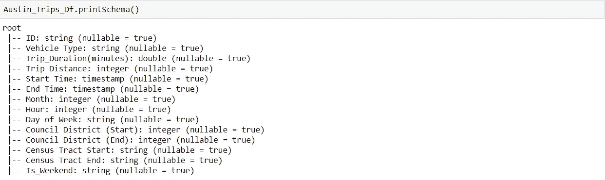

## 统计定量分析；

## 按组计数:

要按组统计出现的次数，我需要链接:

*   groupBy()
*   计数()

一起。在下面的例子中，我将计算:

*   **一周中各天的行数**

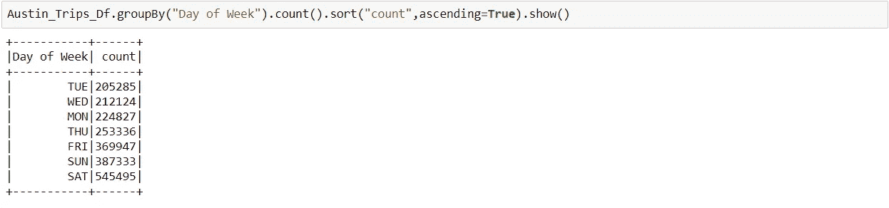

*   **每月行数**

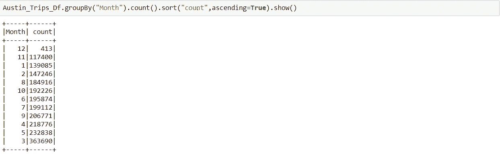

**交叉制表:**

[交叉制表](http://en.wikipedia.org/wiki/Contingency_table)提供一组变量的频率分布表。在 Spark 中，用户能够交叉制表一个数据帧的两列，以便获得在这些列中观察到的不同对的计数。

下面是一个如何使用交叉表获取列联表的例子。

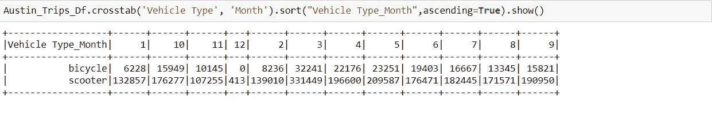

看看每月的骑行数字，电动滑板车骑行随着时间的推移大幅增加

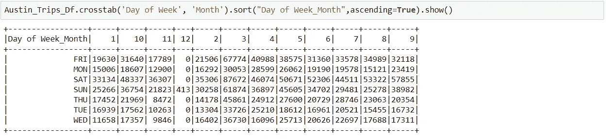

## 熊猫的数据可视化:

在这一章中，我将重点画一些图表，以便找出并展示见解。

从熊猫数据框中创建图表很容易。我将使用 matplotlib 库来创建图形。为此，我将导入库并指定“内联模式”来内联显示图形:

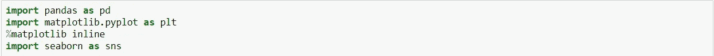

下面的代码片段将创建一个熊猫数据框架:

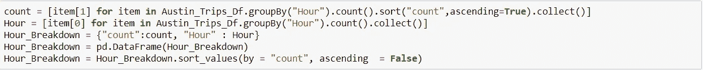

Hour_Breakdown Pandas DF

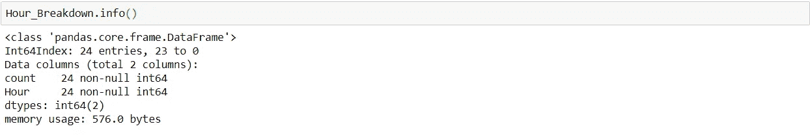

我对基于工作日、一天中的时间、月份和年份的乘车比较感兴趣。

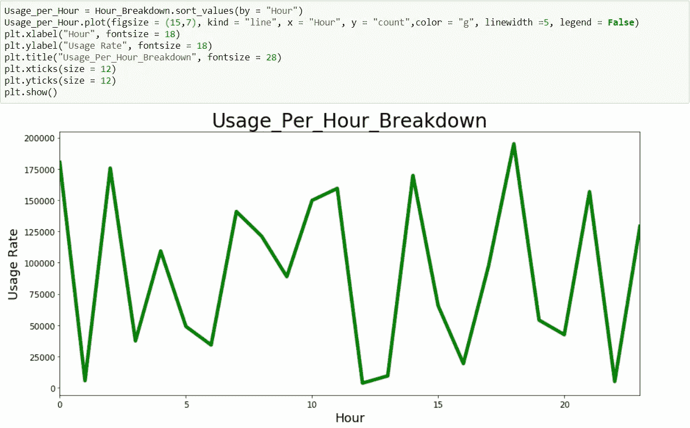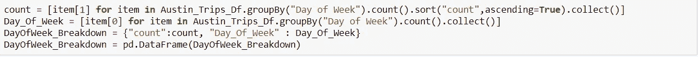

DayOfWeek_Breakdown Pandas DF

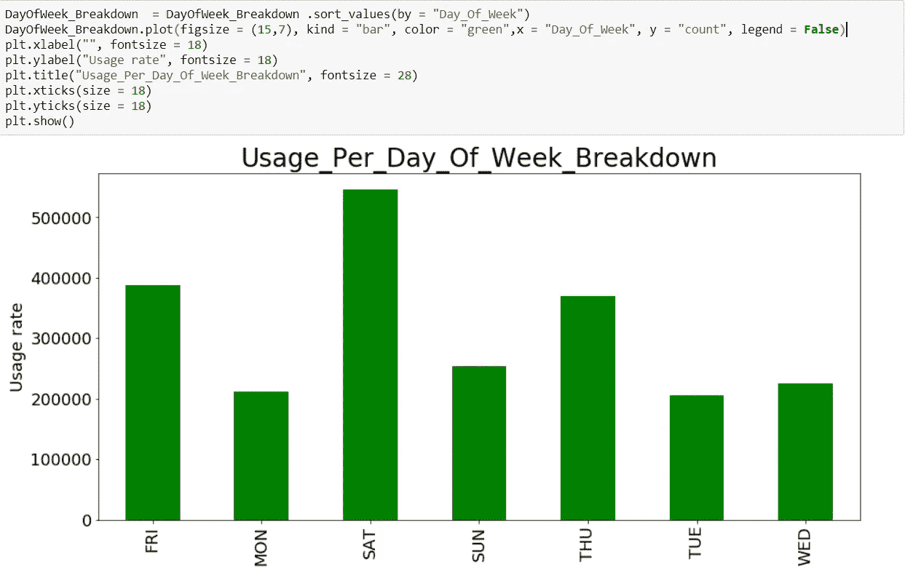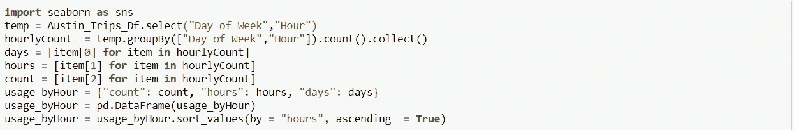

usage_byHour Pandas DF

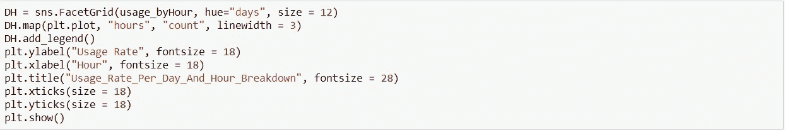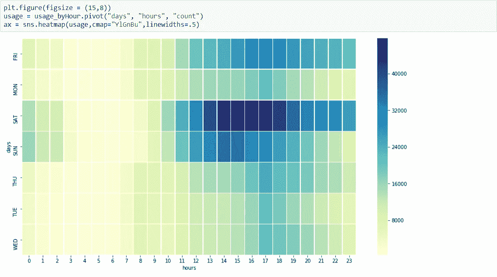

Usage heatmap

**结论**

有趣的结果体现在上面的情节中:

*   深夜 0 点至 3 点之间，使用量预计在工作日最低。然而，它在周六和周日(周末深夜出游)激增。
*   由于家人或朋友的活动(购物、会议等)，周六下午 2 点到 7 点之间的使用量会急剧增加。
*   使用率与工作日下午 5 点左右开始的高峰时间直接相关。
*   从数据中可以清楚地看出，用户对这种新的微型移动服务有很大的需求。奥斯汀市似乎也迅速采用并鼓励了相关的潜力。

我希望这篇文章能够帮助您理解如何使用 Spark 查询数据，包括如何创建和使用数据帧、运行 SQL 查询、对结果应用函数以及在图形中可视化数据。我用过的 pySpark [笔记本](https://github.com/A-Hajjej/DS_Austin_Texas_Mobilities/blob/master/pyspark%20micromobility%20trips%20analysis.ipynb)在 Github 内有售。

谢谢你的阅读，如果你有任何问题，让我知道，我会尽我所能回答他们。