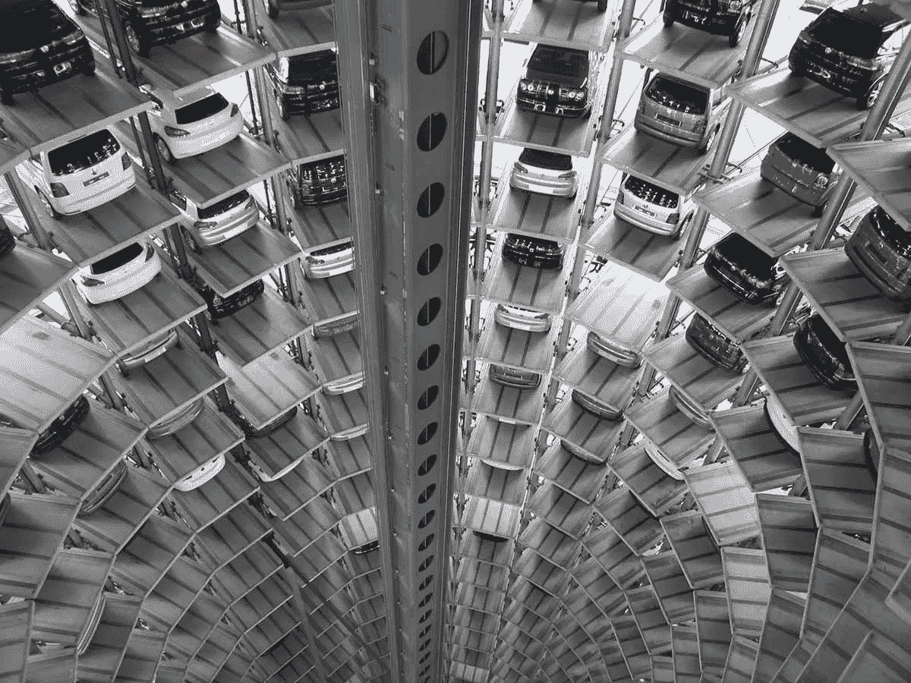
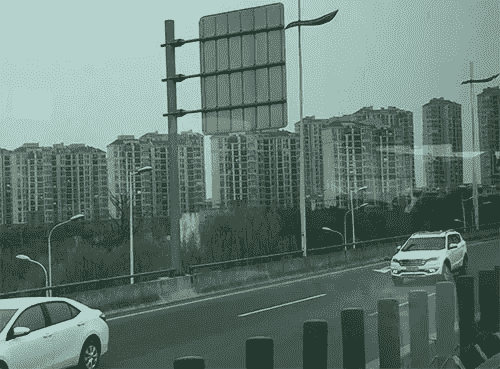

# 澳大利亚应该做好电击治疗的准备

> 原文：<https://medium.datadriveninvestor.com/australia-should-prepare-for-electric-shock-treatment-d4d19ecd81a7?source=collection_archive---------5----------------------->

Photo from Pixabay on Pexels

# 作为一个国家，是时候抓住新出现的机遇了。或者梦游被遗忘。

在澳大利亚北部，150 万辆新型电动汽车(NEV)几个月前从中国工厂下线。中国生产的电动汽车比其他任何国家都多。

拥有 14 亿人口的中国，其目标并不是让每个人都拥有一辆汽车，而是让每个人在需要的时候都能拥有 T2 汽车。从战略上讲，这是有道理的。

根据经济学家在[的一篇文章，中国也是最大的电池生产国。此外，西欧的排放法规正在收紧。英国和法国已经表示，他们认为 2040 年后仅由内燃机驱动的汽车将不再有市场。](https://www.economist.com/briefing/2019/04/04/chinas-plans-for-the-electrified-autonomous-and-shared-future-of-the-car)

Shanghai The Bund: Author photo

在[上海](https://en.wikipedia.org/wiki/Shanghai)，这个人口比澳大利亚(2600 万)还多的城市，有 600 万辆汽车。为了应对交通拥堵，每年可以发放的牌照数量有严格的限额。它有一个抽奖式的系统，中奖者有机会购买一个盘子。你有 0.2%的胜算。

为了减轻废气污染，中央分隔带种植了树木和开花灌木，每一种都在底部周围涂上独特的白色油漆，以防止讨厌的昆虫。在北京，为了缓解拥堵和污染，实行了道路空间配给制。根据车牌的最后几个数字，车主每周需要使用一天公共交通工具。凭借无与伦比的数据和监控水平，违反限制的车主每三个小时就会被罚款。

最近在北京和上海呆了一段时间后，我不得不说交通拥堵似乎不是特别严重。

Beijing congestion? | Author photo

# 目标不是拥有汽车，而是获得机动性

在澳大利亚，我们已经看到了像隔壁的汽车和 T2 的 GoGet 这样的新服务的出现。这些拼车服务意味着车主可以在车辆闲置时从车辆中赚钱。对于许多没有停车位或者可能不想要注册和保险费用的市中心居民来说，这也使他们更容易获得车辆。那是几年前的我。

中国有更大比例的汽车被不止一方使用，要么是出租车，要么是拼车。这大大超过了西方的情况。

# 不同部门的合作

[滴滴出行](https://didiglobal.com/)是一家拼车公司。它让拥有超过 5.5 亿注册用户的优步相形见绌。根据《经济学人》4 月 4 日[的一篇文章](https://www.economist.com/briefing/2019/04/04/chinas-plans-for-the-electrified-autonomous-and-shared-future-of-the-car)，科技公司阿里巴巴和腾讯都是滴滴出行的投资者，滴滴出行现在已经扩展到东南亚，并将很快进入印度和欧洲。

这些技术巨头也在投资汽车。滴滴出行建造自主机器人轴的计划正在进行中。自动驾驶出租车肯定会依赖强大的人工智能产业。幸运的是，与绿色汽车和电动汽车一样，人工智能产业被列为中国制造 2025 政策的发展领域之一。

Hangzhou at night: Author photo

# 中国制造 2025

该政策是中国工业发展的十年蓝图。该报告于 2015 年发布，旨在推动中国向价值链上游移动，从而减少工资不平等并促进发展。

这一点在广东已经很明显了。马丁·雅克将其描述为曾经为世界制造廉价、大规模生产商品的地方它已经爬上了价值阶梯，进入了服务经济。

“深圳和广州，像广东的许多城市一样，现在看起来维护得很好，很繁荣，与以前它们像中国的蛮荒西部时大不相同。”

> 一家美国智库称“中国制造 2025”政策是“对美国技术领导力的生存威胁”。

雅克将转折点归因于 2010 年 5 月至 6 月的大规模工资上涨。罢工影响了包括本田和富士康(雇佣了 27 万人的电子制造商)在内的工厂。他写道，“它不再能保持竞争优势。劳动力变得过于昂贵、要求过高，人们的期望也发生了变化。”

政策中列出的十个提升价值链的行业包括人工智能、铁路、绿色汽车。

> “电气化和自主化的共同挑战正在让西方的现有企业捉襟见肘，以至于一些(或许很多)企业将会垮掉。”

# 国家战略

很难理解，当存在如此明显的环境需求、它带来的技术简化，以及全球需求时，为什么会对澳大利亚的角色有抵触情绪。人们不禁要问，这是因为缺乏战略思维，还是因为过度依赖旧货币——燃油消费税——的收入。总之，[燃料消费税](https://en.wikipedia.org/wiki/Fuel_taxes_in_Australia)每年产生 100 亿美元左右的收入。

中国并不是第一个拥有国家战略的国家，这一战略阐明了清晰的愿景和实现愿景的方法。明治维新见证了 T2 在 1868 年后开始了快速现代化的进程。

由于害怕西方入侵，日本系统地着手研究世界各地工业中使用的所有系统和工艺。它精选了它认为最好的系统和方法。他们包括一支以英国海军为基础的海军。德国的铁路。法国教育。然后，它模仿这些系统，但注入了明显的日本特色。

日本从脆弱和孤立变成了世界第二大经济体。它发生的速度被马丁·雅克描述为“一个非凡的历史现象”

# 为什么国家战略很重要

很容易看出技术、人工智能和汽车制造如何能够共享利益和共生。合作将有助于每个行业的繁荣，并创造出一个全新的子行业。中国在这方面表现出了领导力。

中国(NEV)销售 460 万辆新电动汽车的命令在全球产生了[连锁反应](https://www.wri.org/blog/2018/12/how-china-raised-stakes-electric-vehicles)。它已经禁止在 2040 年后销售内燃机汽车。通用汽车(GM)已经计划到 2030 年拥有 20 款 NEV。福特也在积极参与竞争。

有了明确的方向，企业必须迎接挑战，以保持竞争力。这就是商业的本质。但是*国家*也需要这么做。

毫无疑问，澳大利亚有聪明的方法可以从新出现的宏观经济图景中创造出富有成效的情景。它可以选择采用和修改世界上其他好的系统。例如，新西兰的宽带或土著关系可以作为榜样。

适应其他系统让我们免于重复发明。然而，我们不需要向任何人借钱。澳大利亚可以清除石板，从零开始。澳大利亚制造 2025 战略。

策略是做什么的？

战略让我们思考我们未来想要什么。愿景是什么？理想情况下，2030 年的澳大利亚会是什么样子？我们向内看，看到我们的优势。我们向外看，寻找机会和威胁。

好的战略利用优势来利用机会。澳大利亚有充足的阳光，广阔且大多无人居住的内陆地区。这难道不能用来利用太阳能吗？海岸线长达 25，760 米。这种力量不能用来产生波浪能吗？

> 煤几乎完全过时了。大多数发达国家已经签署协议，在未来 10 到 20 年内，煤炭不会成为它们能源结构的一部分。

澳大利亚有一个战略选择:看到并抓住周围强大的机会。或者保持现状，继续做它正在做的事情——梦游般地被遗忘。

*原载于 2019 年 5 月 3 日*[*【https://mvmm.com.au】*](https://mvmm.com.au/australia-should-prepare-for-electric-shock-treatment/)*。*