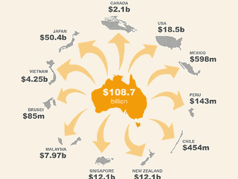

# 澳大利亚在拉丁美洲的官方代表权——我们应该做得更多吗？

> 原文：<https://medium.datadriveninvestor.com/australias-official-representation-in-latin-america-should-we-do-more-2430a1cb5ffe?source=collection_archive---------9----------------------->

在澳大利亚以亚洲为中心的国际贸易关系中，拉丁美洲处于什么位置？两个截然不同的地区形成了复杂的贸易关系，因此澳大利亚在拉丁美洲地区缺乏官方代表。由于语言和地理位置等基本因素成为了贸易壁垒，澳大利亚需要将注意力从亚洲和欧洲转移开来，专注于一个快速增长且潜力巨大的市场。

诚然，拉丁美洲有着曲折的过去，历史上政治局势动荡，经常被更稳定的国家忽视。但这是一个不断变化和发展的景观，在上个世纪有了突飞猛进的发展。包括墨西哥、智利、阿根廷、哥伦比亚和秘鲁在内的一些全球增长最快和最大的经济体，拉丁美洲正在发展成为对外国投资者极具吸引力的市场。

从拉丁美洲的角度来看，该地区的国家需要寻找新的机会。虽然他们中的许多人正在寻求与该地区最大的贸易伙伴之一美国恢复关系，但其现任政府对贸易和外国投资采取了更具保护主义的态度。拉丁美洲应该向澳大利亚寻求贸易机会。澳大利亚贸易署称，澳大利亚是世界上投资和做生意最安全的地方之一。尽管这个国家的人口仅占世界人口的 0.32%，但它是世界上第 13 大经济体，国内生产总值约为 1.9 万亿澳元。随着高生产力水平，高技能和受过良好教育的劳动力以及政治和经济的稳定，拉丁美洲国家与澳大利亚发展关系是有意义的。

截然不同的经济和文化背景带来了做生意的挑战。拉丁美洲贸易的复杂性可以被视为国际投资的障碍。澳大利亚投资者肯定会面临各种挑战，如语言障碍、商业文化和最佳实践的差异、不同的法律和金融要求、缺乏对当地市场的了解以及腐败。哥伦比亚和墨西哥等国家仍在试图切断与国内贩毒和暴力问题的联系，而阿根廷刚刚从阻碍外国投资的前保护主义政策中恢复过来。

但这也不全是坏消息，尽管澳大利亚在拉丁美洲地区缺乏官方代表，但过去几年来，这些地区之间的贸易一直在稳步增长。该地区各国政府一直在改变政策和框架，以使国际投资更加容易，并通过双边协议鼓励国际贸易。澳大利亚政府正在努力促进与拉丁美洲的贸易。2015 年至 2016 年间，澳大利亚与拉美的贸易总额达到惊人的 112 亿澳元。随着经济的持续增长，澳大利亚投资者在该地区的外国投资机会也在不断增加。

外交关系的改善正在鼓励这两个地区之间的贸易；澳大利亚越来越认识到需要在该地区有更多的官方代表。最近，波哥大领事馆升级为大使馆，这是澳大利亚在该地区的第六个海外机构，显示了两国关系更加牢固的前景。澳大利亚政府承认[在波哥大](https://foreignminister.gov.au/releases/Pages/2017/jb_mr_170310.aspx?w=tb1CaGpkPX%2FlS0K%2Bg9ZKEg%3D%3D)设立澳大利亚大使馆是近半个世纪以来其外交网络最大规模扩张的一部分。每年有 14，000 名澳大利亚游客访问哥伦比亚，大使馆将大大加强澳大利亚在该地区的存在。不要忘记，哥伦比亚是拉丁美洲第四大经济体，最近在政治上已经稳定下来；哥伦比亚与澳大利亚的年度贸易总额为 5 亿澳元，澳大利亚在该国的投资总额为 30 亿澳元。新的稳定正在澳大利亚处于全球领先地位的行业创造机会，如采矿、油气、教育、农业综合企业和保险。

哥伦比亚与智利、秘鲁和墨西哥都是太平洋联盟的成员，是拉丁美洲贸易自由化、经济融合和与印太接触的最坚定支持者。去年刚刚通过的一项新的自由贸易协定允许秘鲁和澳大利亚之间进行贸易。

2016 年，澳大利亚教育机构招收了 17，000 名哥伦比亚学生，这一惊人数字表明了地区之间的联系正在加强。许多澳大利亚大学依靠外国学生的学费来为澳大利亚公民提供有效的教育，并为他们的服务付费。澳大利亚的大学正逐渐转向拉丁美洲，吸引来自该地区各地的学生。随着巨大的收入流从这个市场而来，由于中产阶级的快速增长和拉丁美洲学生旅行能力的增强，毫无疑问[澳大利亚大学想要吸引拉丁美洲学生](https://bestinau.com.au/australian-universities-turn-towards-latin-america/)。

该区域作为一个整体在过去几年里取得了重大进展；经济增长降低了贫困水平，经济联盟的形成鼓励了贸易关系，对腐败的摒弃提高了投资者的信心。对澳大利亚投资者来说幸运的是，当地公司可以协助安全检查、尽职调查报告、降低风险等。给那些想投资的人更大的信心。

拉丁美洲并非没有问题；然而，澳大利亚继续与拉丁美洲建立贸易关系并增加他们在该地区的官方存在是完全有经济意义的。该地区各国政府已经看到了国际贸易的好处，因此他们正在尽一切努力通过尽可能简化这一过程来鼓励国际投资。

该地区的持续增长为澳大利亚投资者在从采矿到基础设施和农业等多个领域创造了机会。许多这些部门是澳大利亚和拉丁美洲的主要产业，这给了澳大利亚竞争优势。澳大利亚在知识和技能方面可以为该地区提供很多东西，反之亦然。

如果澳大利亚继续重视该地区的重要性，并继续理解拥有官方代表的重要性，那么澳大利亚和拉丁美洲之间的[贸易将会有一个光明的未来](https://www.bizlatinhub.com/australia-international-trade-latin-america/)；随着时间的推移，目前的互利关系只会加强。