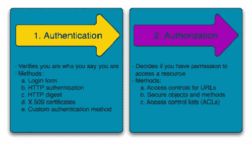
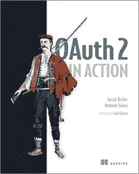

# 身份验证与授权

> 原文：<https://medium.datadriveninvestor.com/authentication-vs-authorization-716fea914d55?source=collection_archive---------0----------------------->

今天我要讨论两个大多数人容易混淆的话题。当涉及到安全性和获得对系统的访问时，这两个术语经常结合在一起使用。这两个术语都是非常关键的话题，通常作为 web 服务基础设施的关键部分与 web 联系在一起。然而，这两个术语完全不同，概念完全不同。现在您可能想知道这些术语是什么，它们被称为身份验证和授权。认证意味着确认你自己的身份，而授权意味着被允许进入系统。更简单地说，认证是验证自己的过程，而授权是验证您有权访问什么的过程。

## 证明

身份验证是验证您的凭据，如用户名/用户 ID 和密码，以验证您的身份。然后，系统会检查您是否如您所说使用了您的凭证。无论是在公共网络还是私有网络中，系统都通过登录密码来验证用户身份。通常通过用户名和密码进行身份验证，尽管还有其他各种方式进行身份验证。

身份验证因素决定了系统在授权个人访问任何内容之前用来验证个人身份的许多不同元素。一个人的身份可以由这个人所知道的来确定，并且当涉及到安全性时，至少两个或所有三个认证因素必须被验证，以便授予某人对系统的许可。根据安全级别，身份验证因素可能与以下因素之一不同:

*   **单因素身份验证:**这是最简单的身份验证方法，需要密码来授权用户访问特定系统，如网站或网络。该人可以仅使用其中一个凭证来请求访问系统以验证其身份。例如，仅要求用户名的密码是使用单因素身份验证来验证登录凭证的一种方式。
*   **双因素认证:**这种认证需要两步验证过程，不仅需要用户名和密码，还需要一条只有用户知道的信息。使用用户名和密码以及机密信息使得黑客更难窃取有价值的个人数据。
*   **多因素身份验证:**这是最高级的身份验证方法，需要两个或更多独立身份验证类别的安全级别，以授予用户访问系统的权限。这种形式的身份验证利用相互独立的因素来消除任何数据泄露。金融机构、银行和执法机构通常会使用多因素身份认证。

## 批准

授权发生在您的身份被系统成功认证之后，因此系统赋予您对信息、文件、数据库、资金等资源的完全访问权。但是，只有在确定了您访问系统的能力和权限后，授权才会验证您的权限，授予您访问资源的权限。换句话说，授权是确定经过身份验证的用户是否有权访问特定资源的过程。一个很好的例子是，一旦通过身份验证验证并确认了员工 ID 和密码，下一步将是确定哪个员工有权进入哪个楼层，这是通过授权完成的。

对系统的访问受到身份验证和授权的保护，它们经常相互结合使用。尽管两者背后有不同的概念，但是它们对于 web 服务基础设施都是至关重要的，尤其是在被授权访问系统的时候。理解每个术语非常重要，也是安全性的一个关键方面。

 [## 身份验证和授权的区别

### 在安全性方面，这两个术语经常结合在一起使用，尤其是在涉及到获取…

www.differencebetween.net](http://www.differencebetween.net/technology/difference-between-authentication-and-authorization/) 

# **DDI 推荐资源**

*   [***《OAuth 2 在行动》由贾斯汀·里奇和安东尼奥·桑索***](http://go.datadriveninvestor.com/authb/mb/mp000001/t)

