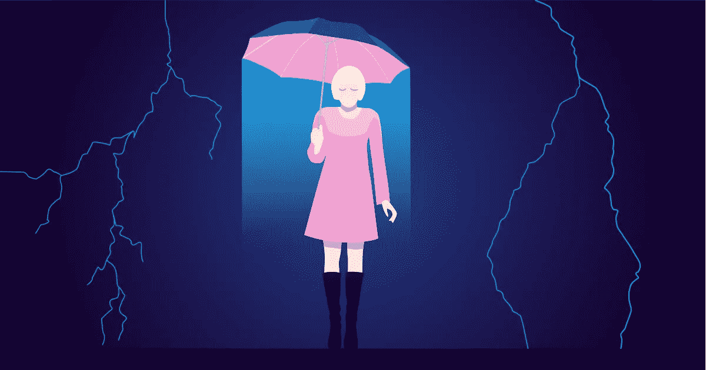

# 自闭症:如何监控 3 个最大的压力因素

> 原文：<https://medium.datadriveninvestor.com/autism-how-to-monitor-the-3-biggest-stress-factors-4c302243470d?source=collection_archive---------2----------------------->

作者:[帕特里克·格布哈特](https://blog.paessler.com/author/patrick-gebhardt)

对于患有自闭症的人，包括阿斯伯格综合症和其他轻度自闭症，环境影响可能是一个主要问题。这是因为大多数自闭症患者对环境影响高度敏感。这种敏感性会严重影响注意力的集中，即使像阿斯伯格综合症患者一样，受影响的人表现出高于平均水平的智力。

> **ASD** 自闭症谱系障碍的病因尚未完全阐明。几个因素肯定在它的发展中起作用。出生前、出生中和出生后的遗传影响和生物过程会损害大脑的发育并导致自闭症。它不是由教育错误、家庭冲突或疫苗接种引起的。

比注意力受损更糟糕的是焦虑、恐慌和强迫症，这是由被认为令人不安的环境影响造成的。因此，显然需要考虑一些机制和方法，使那些受影响的人能够避免负面刺激，同时又不必放弃他们日常生活的很大一部分。因为，正如我们在之前的一篇关于这个话题的文章中已经指出的:自闭症患者有着特殊的兴趣和非凡的才能，他们为社会做出了很多贡献。因此，逃避学校、工作和私人生活中的日常问题的隐居不是一个解决办法。

# 1.滴答作响的时钟感觉就像飞机起飞

有没有人告诉过你，为了看得更清楚，他们停车时不得不把收音机音量调低？虽然这可能有点道理，但其余的都是笑话。从患有自闭症的人嘴里说出来，同样的话一点也不好笑。

当房间里非常嘈杂时，自闭症患者经常会被妨碍他们的物体绊倒，因为噪音他们显然没有察觉到。他们的动作变得笨拙和缓慢，因为他们对房间的感知不同，对细节的关注比他们原本应该做的要少。看到和抓住一幅图像的能力是由连接在一起形成一个整体的单个细节实现的。似乎超负荷的听觉刺激阻碍了对图像或空间的详细的视觉感知。距离模糊，难以定位。就好像自闭症患者不能在声音一大就定位物体或人一样。这种对噪音的敏感性甚至会导致发音错误，即“讨厌声音”，这反过来会引发恶心、偏头痛或严重焦虑等身体反应。

当听到声音时，会产生振动，振动以声波的形式在空气中传播，并被我们的耳朵所感知。声波的音量可以用声压来衡量，声压是用分贝来衡量的。分贝越大，声压越高。耳朵承受的声级负荷以分贝为单位。反过来，音高是用频率来衡量的:频率越高，声音越大。声压和频率构成了音量主观感知的基础。

下面是一些 dB 值的实际例子:一架飞机起飞超过 120 dB 及以上的所谓痛阈。在这些数值下，我们的耳朵会受到严重损伤。一场演唱会的值在 100 到 115 dB 之间，电锯 95 dB，吸尘器 75，电视 60，鸟鸣 40 dB 左右。因为 ASD 通常依赖于个人对噪音的主观感知，甚至是与大约。30 分贝，会被患有自闭症的人认为是令人不安的，滴答作响的时钟会让人感觉像飞机起飞。这取决于许多因素，但它们都有一定的模式。通常只能通过排除和反复试验才能发现在什么时间和什么地方哪些噪声以什么值被认为是干扰，但是对这些因素进行适当的监控是值得的。

人们可以在网上以低价买到方便的小型噪音测量仪，而且以可视化仪表板的形式，你可以读取数据、添加注释并识别模式。我们 Paessler 已经在著名的 Bletchley 公园的国家计算博物馆用我们的 PRTG 网络监视器公开实现了这一点。使用我们设计的设备，声压通过麦克风记录，转换，并实时显示在迷你显示器上。液位显示通过 LED 段以彩色显示。数据通过 MQTT 协议实时传输到 MQTT 代理，然后由 PRTG 监控。在这里，您可以了解 PRTG，包括测量各种环境因素的仪器，现在如何使患有自闭症的儿童能够在更放松的环境下参观博物馆。

# 2.光线、气味、表面:一切都有可能带来灾难

上述考虑因素在很大程度上与光的影响(明亮或以其他方式被感知为干扰)相一致，加重了光以及噪声通常不可避免的事实。感觉特征的程度和类型因人而异。感知可能比正常更强烈(过敏)。认知过程中的这种特性通常会导致感觉上的困难。此外，明亮的光线往往伴随着强烈的气味或令人不快的表面(一些自闭症患者非常害怕玻璃，其他人则害怕不同的地毯表面)。

以下是关于光的最重要的术语:流明(lm)是灯的“光输出”的单位。实际上是灯从各个方向发出的光的总和。一盏 40 瓦的白炽灯向四周发出约 400 流明的光。但是光源不会向所有方向均匀发光。坎德拉(cd)是描述光源在某一方向发出的光通量的单位。照度的测量单位是勒克斯(lx)。它描述了有多少来自光源的光到达某个区域。与流明和坎德拉不同，勒克司是一个接收器大小，即测量有多少光到达某一点。这要考虑到表面离光源有多远，角度是多少。

尤其是勒克斯值可以测量、记录和监控。因为自然感觉并不总是能够决定一个房间是否“太亮”以及一个人的容忍度值是多少。由于 Bletchley Park 的计算机博物馆是一个安装不同灯具的地方，也是一个在展品上或在有许多游戏控制台的游戏室中安装额外光源的地方，因此我们在测量设备中安装了一个测光表。在这里，我们选择了我们的“HTTP 推送数据高级传感器”，并将测量值(主要是以勒克斯为单位的发光强度，但也包括温度、湿度以及 WiFi 信号强度)直接推送到 PRTG。

# 3.人们可能很烦人

不仅愤世嫉俗者或社会怀疑论者知道，人类同胞有时是一种强加。不同性格和恼人习惯的人群对那些难以识别面部表情和手势、讽刺或挖苦、意图或人际关系的人有多大影响？简而言之:过度拥挤的火车可能是一场噩梦！这里需要特别提到的是，自闭症患者在总体上自然不会排斥人际关系，恰恰相反。他们有强烈的友谊和利他意识。然而，他们需要知道会发生什么，不可预测的社交场合和他们不认识(或无法评估)的人在一起是一个糟糕的组合。

如果患有自闭症(或者广场恐惧症，或者仅仅是对讨厌的人类的普遍厌恶)的人能够知道某个特定的地方什么时候人多，什么时候人少，这个世界会变得多么轻松愉快。

这几乎已经成为可能。例如，[谷歌地图](http://fortune.com/2017/01/26/google-maps-crowded-restaurants/)提供了发现一家餐馆有多拥挤的选项，这允许你选择不太拥挤的时间。有一个[应用](https://www.americaninno.com/chicago/this-snapchat-like-app-shows-you-how-crowded-the-bar-is-before-you-go/)会告诉你你最喜欢的酒吧有多满或多空。当然，关于 [CCTV](https://blog.paessler.com/4-thoughts-on-cctv-and-the-future-of-urban-life) ，这是一个长期的讨论，是否应该实时公开摄像机镜头。这是基于公法的一个问题，即这种记录是否可以在没有公众参与的情况下只允许当局进行。但这将是一个有益的副作用，即至少在较大的城市中心，能够随时看到目前有多少人在移动。

> **英国计算博物馆**为 ASD 目标群体建造一个易读的环境测量仪只是我们与位于 Bletchley Park 的国家计算博物馆的赞助的一部分。我们很自豪能够赞助所谓的“放松开放”，这为自闭症儿童提供了更放松的博物馆参观，因为他们知道那里不会那么拥挤。我们还利用 PRTG 来监视博物馆中一些最著名的展品，包括世界闻名的巨像，它以对洛伦兹密码的分析而闻名。

你如何看待建筑工地环境监测？我们很乐意与您讨论。