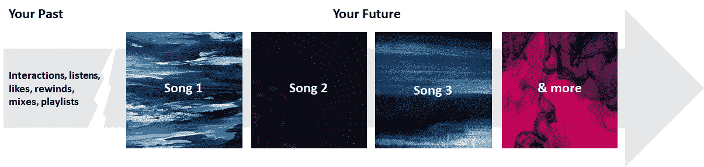
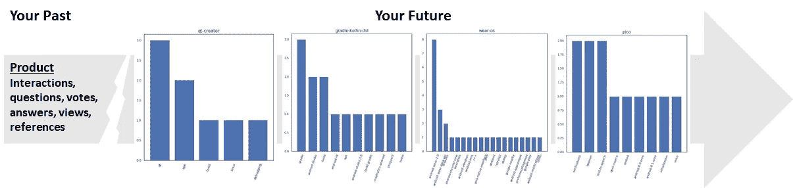
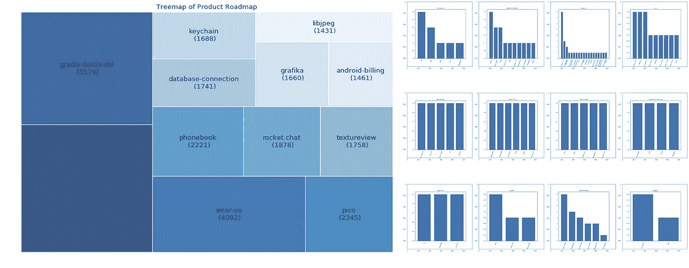
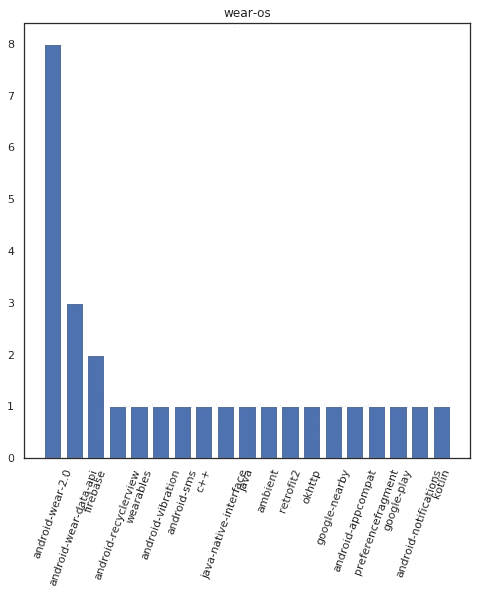
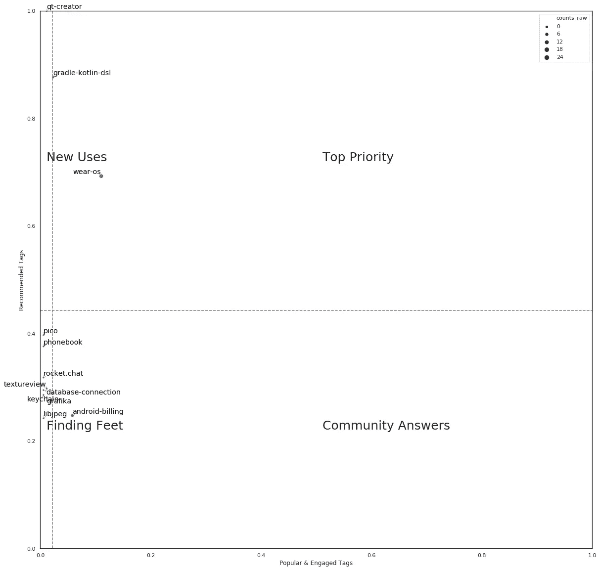
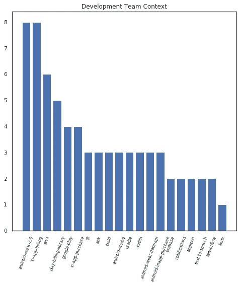

# 使用人工智能自动发现产品路线图

> 原文：<https://medium.datadriveninvestor.com/auto-discover-product-road-maps-using-ai-657b68be0bbb?source=collection_archive---------5----------------------->

我并不是试图向你推销这个想法，让你接受它，我只是想让你玩玩它。我想让你想想它的可能性，我不是想证明它。我只是把它作为一种生活的可能性提出来思考。

—艾伦·沃茨

我们可以玩一会儿，开始一次充满美好可能性的旅行吗？

 [## 模式和机器人:复杂的现实|数据驱动的投资者

### 哈耶克的名著《复杂现象理论》(哈耶克，1964)深入探讨了复杂性的话题，并断言…

www.datadriveninvestor.com](https://www.datadriveninvestor.com/2019/03/04/patterns-and-robotics-a-complex-reality/) 

音乐…我们今天如何发现它们？我们与 YouTube、Spotify 等应用程序互动，它们为我们推荐新的可能性。他们预测我接下来想听什么。

Music Playlist Example (Image Source: Unsplash.com)

今天的推荐引擎技术已经使得基于用户-歌曲交互进行预测成为可能，而不必知道歌曲或用户细节。通过这种方法，每首歌曲和用户都是一个向量，它封装了比描述性信息更多的信息，如流派、音乐节奏、歌词等。例如，它可以捕获文化，而这种文化很难作为显式项目捕获。

请你考虑一下，我们可以对产品做同样的事情。从推荐歌曲列表到产品功能列表。该产品的路线图。

产品不是用户，所以我们必须稍微调整一下方法。想象一下，你为每个用户预测下一首歌，然后算出哪首歌是最受欢迎的…你会得到什么？你得到的是“未来 Billboard Top 10”，而不是“当前”。这预示着音乐整体的未来，而不是特定用户的未来。让我们以这种方式为一个产品建模，并找到“未来广告牌 10 强”。

如今，产品可以在多个网站上获得反馈。从亚马逊这样的商业网站到 Stack Overflow 这样的开发者网站。我们将考虑一个开发者网站，因为它更接近产品开发过程。

(归属:标签数据来自堆栈溢出)

举例来说，让我们考虑 Android。Android 是一个很棒的平台/产品，对堆栈溢出有很大的交互作用。成千上万的用户提出了多达 120 万个问题。45 万个问题没有得到回答或者有一个回答被提问者接受。这其中包含了很多开发人员想要但却难以解决的智能，以帮助我们定义“产品特性播放列表”。

就像在音乐中一样…向所有用户进行矢量化…推荐…区分优先级=我们的产品功能播放列表…即“未来广告牌列表”

Product Feature Playlist

以下是路线图需要考虑的 12 大特点。对于每条建议，我们可以计算出人们围绕它询问的其他方面/标签，并进行排名，以提取更多的意义。

像任何产品路线图一样，这里面有很多东西。这是一个缩小的例子。条形表示人们提出问题的背景，可以检查确切的问题以获得更深入的背景。

这些是建议，可以通过多种方式进行处理。就像歌曲一样，根据你的个性，你得到的推荐是你最喜欢的，而不一定是最受欢迎的。顶部的受欢迎度检查将增加策略。类似地，人们可以检查用户社区对这些建议的受欢迎程度(和参与程度),并设计产品构建策略。什么是新的用例，在哪里可以利用开发人员社区？

人们也可以理解这些建议，并将路线图传达给内部团队。以下是人们围绕某项功能谈论的主要方面。人们可以看到围绕 android 集成、android 开发模块、特定语言、文本到语音等新功能以及 TensorFlow 等新技术开发的方方面面。他们通常会反馈给公司内的不同部门。路线图的典型输出。

这给出了一个你可能想知道的观点。所以我运行了一套算法…利用深度学习到传统的机器学习，找到了机器最推荐的。人们可以通过处理各种其他相关的用户反馈来增加路线图播放列表的健壮性……Google Play 应用程序反馈、Android 手机用户评论等。

在当今高节奏的世界中，路线图可以每个季度生成，而不局限于单一的年度练习。产品经理们…想想这种可能性，反省一下…你能处理这么多数据，并以这样的速度与一台机器竞争吗？

这是一种娱乐的可能性…产品功能的播放列表。越来越多的一切都是一个向量…是时候对其他可能的播放列表进行思想实验了…战略播放列表，市场播放列表，洞察力播放列表…享受人工智能可能性的新生活。智能被重新定义。