# 通过编码和人工智能自动生成报告

> 原文：<https://medium.datadriveninvestor.com/auto-generate-reports-via-coding-ai-29468cd48956?source=collection_archive---------0----------------------->

可以部门快照，市场研究，自由经营搜索，商业计划，竞争分析等。自动化并按需生成报告？

下面是一个医疗保健行业的快照，它是通过代码并使用各种人工智能技术自动生成的。在浏览之前，这里有一些注意事项:

*   该报告是一系列说明可能性的快照，并不打算全面。
*   忽略美学方面的缺失，因为 UX 不是本报告的重点。
*   重点是自动生成，因此避免了人工编辑。
*   唯一的人工干预是插入外卖以指出趋势等。(这些也可以是自动化的)
*   这些数据专注于印度的初创公司，时间跨度为 2017 年 12 月至 2018 年 4 月。
*   专利分析延长至 5 年。

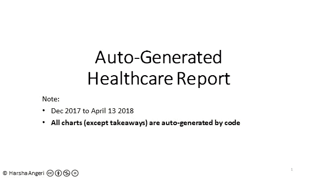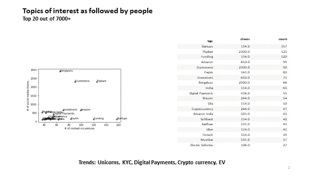

Slide 2: What are people following in the startup ecosystem?

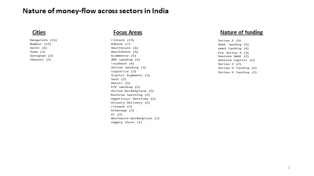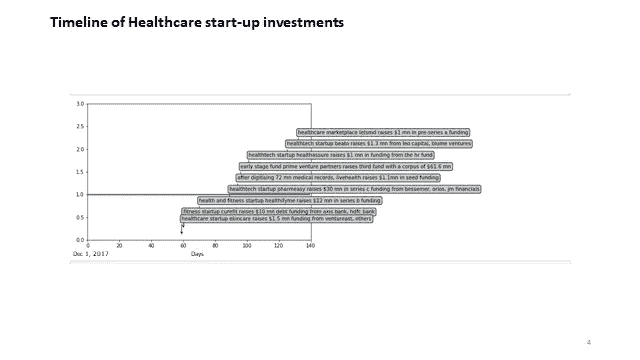

Slide 3 & 4: Which sectors raised money? Where does healthcare stack-up? Within healthcare which startups raised funding?

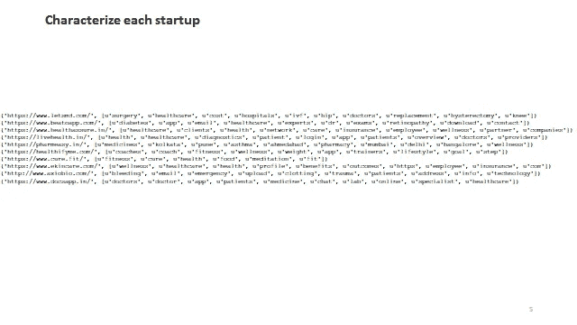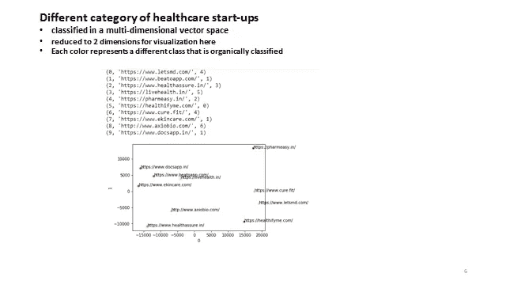

Slide 5 & 6: Expand understanding of the startups that received funding and classify them

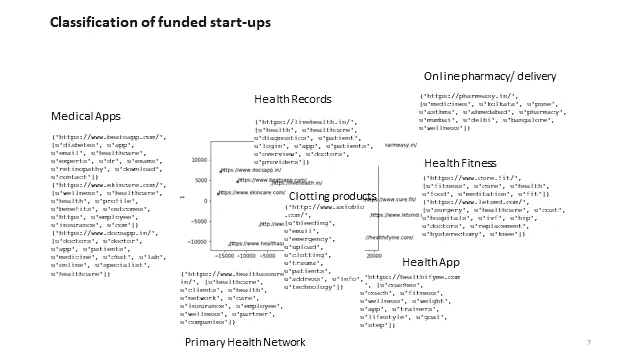

Slide 7: Organically come up with a new way to classify & cluster startups. This provides a great richness to understand startups and relevant competition

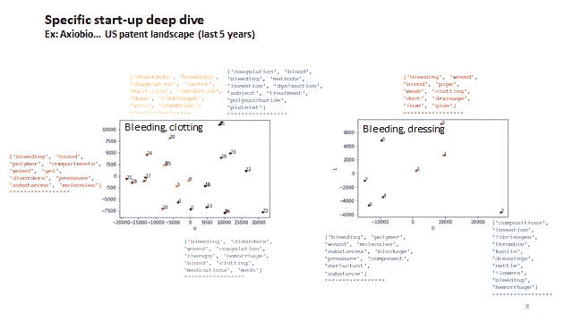

Slide 8: Conduct a technology deep dive on each startup. An example here — understand the patent landscape

这种报告可以随时生成。该报告将表示该段时间的状态，并且可以多次生成。使用 Python 库(如“python-pptx ”)自动生成幻灯片。这也可以用来添加标志和提高 UX 的视觉吸引力。

上述报告展示了各个方面。比如公司分析，VC 资金流向，专利分析等。这只是开始。还可以添加更多内容，如收入成绩单分析、投资者资料、创始人分析、同行评议出版物分析、公司形象分析等

建造这个的成本是最小的。前期的 R&D 是计算数据，清理数据并编写算法。运营成本主要是数据存储成本和任何第三方 API 调用费用。在如此低的报告生成成本下，可以开发新的商业模式，如微订阅模式，从而颠覆咨询、媒体、出版和报告生成行业。

上述报告是通过混合各种技术实现的，如下图所示。

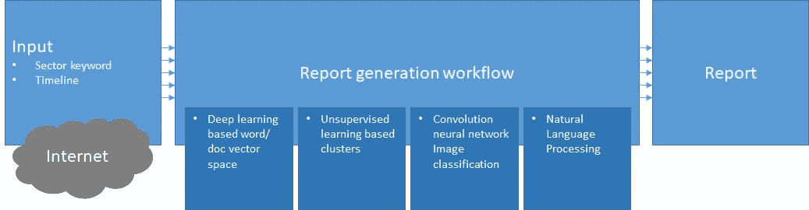

机会是在不同的细节深度构建不同的报告。为了说明这一点，请找到下面两张专注于人工智能和特定深度学习的图表。这是通过使用 AI 将专利转换到多维向量空间并对其进行聚类来完成的。人们可以通过基于特定领域知识的提取进行更深入的研究，如分析在使用深度学习提交的专利中使用了什么神经网络架构。在这两个图表之间，可以看到从大脑理解深度学习神经模型的趋势，应用于语音和图像数据集，以及分析电信网络数据包中的异常。

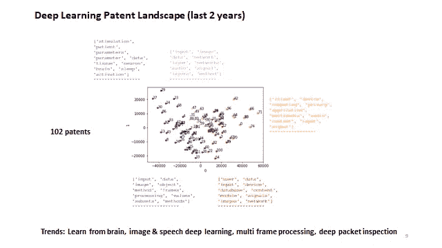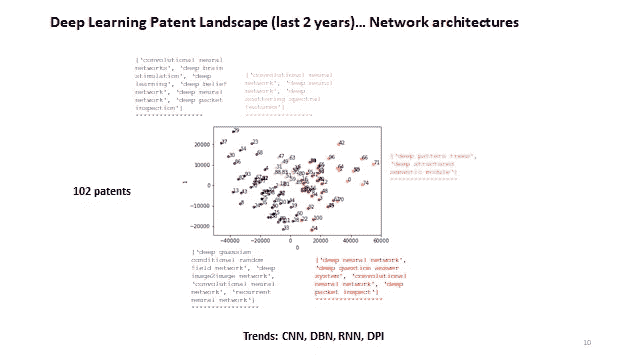

Slide 9 & 10: Understand upcoming technologies and architectural trends. In this case for Deep Learning

下一步是什么？

准确度可以通过更多的训练和更好的词汇积累来提高。人工编辑可以让它达到很高的水平。我认为增强人们写报告是一个很有前途的领域，我倾向于称之为 ***增强报告。*** 但是让我兴奋的是下面这张图。添加一个人工智能层，它可以接受上下文输入，并智能地生成报告的模式并生成它们。多层交织的人工智能就像我们的大脑。这是人工智能的未来，将渗透到更高端的战略任务中。

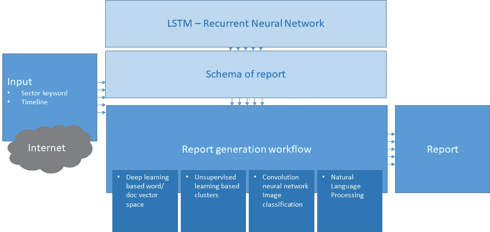