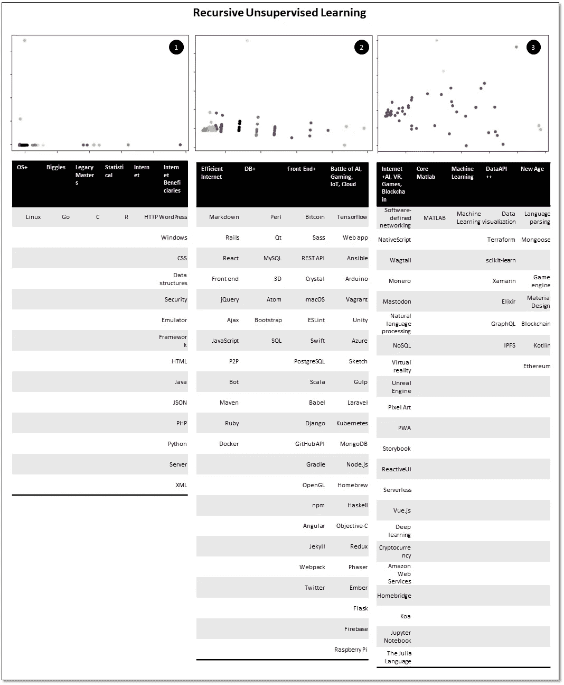
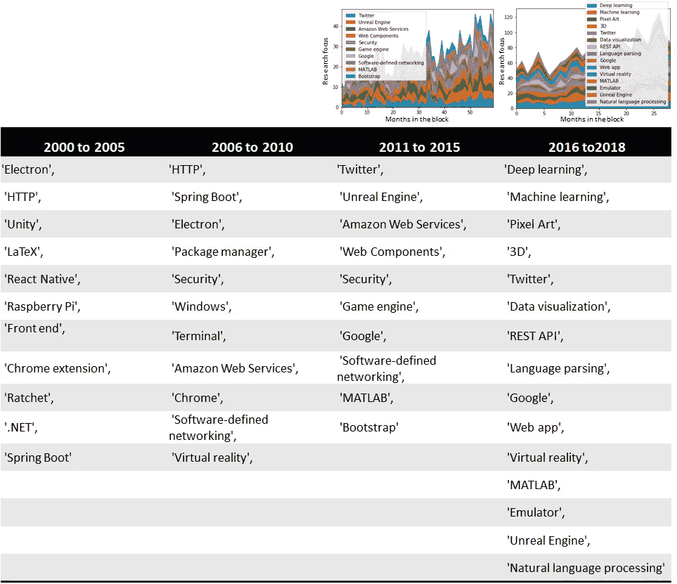
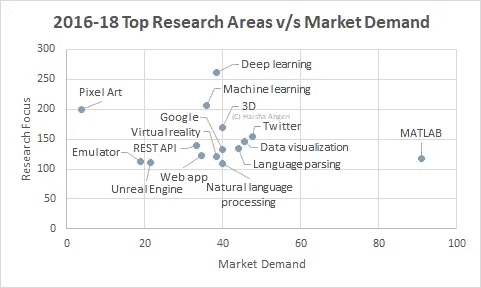

# 自动生成技术采用图

> 原文：<https://medium.datadriveninvestor.com/auto-generate-technology-adoption-maps-80869f87d23e?source=collection_archive---------2----------------------->

按照人工智能的说法，人类已经采用了一波又一波的技术。知道了这一点，我想测试这些浪潮和新技术的采用是否可以使用人工智能和代码自动生成。下图(图 1)是技术采用图。

Figure 1

这是如何获得的？无监督学习算法(AI)被注入了许多技术主题。主题以数字向量的形式提供，这些向量捕捉了关于出版物、代码、开发人员、bug 等的数据。人工智能系统处理了数据，并递归地指出技术集群的存在，如下所示(图 2)。

Figure 2

这些集群很有趣，例如有一个“C”集群，它是已经存在了几十年的基础语言。你可以看到一些趋势，如互联网的出现和从 SQL 到 NoSQL 数据库的演变。互联网的兴起也使 python、PHP、HTML 和 Java 激增，包括通过 Wordpress 等平台的传播。然后，就更好的前端和各种基于“框架”的客户端-服务器架构而言，互联网变得“高效”。随着你深入研究，你会看到人工智能、加密货币、物联网、虚拟现实和游戏的兴起。在这里，你可以开始感受到波浪的存在。深度学习的出现，后来就像 Tensorflow 一样，分解成具体的方面。Arduino 和 Raspberry Pi 的物联网(IoT)之“战”可见一斑。

艾露出了波澜。随着星际文件系统(IPFS)、Monero 和以太坊的兴起，加密货币开始流行。更深的递归抛出后面的波。Kotlin 的崛起还被观察到谷歌在 2018 年 I/O 大会上代言了 big time。当这些递归减少到二维时，突出的特征是“代码的扩展”和“代码开发人员基础的增加”，如图 1 所示。当沿着这些维度绘制时，人们可以看到它是浪潮和采用趋势的公平表示。不同的方面/波被不同地命名，因为它们由于维数减少而与递归完全不同。

有人可能会争辩说，这是等式的“供应”一边，表明了开发的范围(源代码、库等)。“需求”方是否证实了这一点？

行业的“需求”可以通过典型的使用周期来分解。这从研究开始，直到使用该技术实际生产/交付商品和服务。受股东要求驱动的公司在研究重点领域的投资和他们发布的内容方面非常勤奋。研究是未来的领先指标，但当某项技术的研究超过临界质量时，它也是公司采纳的标志。生产需要人们开发使用技术，因此工作是大规模采用技术的一个很好的指标。

虽然研究领先生产好几年，但在某些情况下，专利是研究成果的另一个衡量标准。在这篇博客中，专利还没有被使用，但在之前的博客中已经展示了这种可能性([通过编码自动生成报告& AI](https://medium.com/datadriveninvestor/auto-generate-reports-via-coding-ai-29468cd48956) )。通过研究代理代表的“需求”如下所示(图 3)。绘制了 5 年区块中的顶级研究区域。

Figure 3

请记住，研究领先，因此树莓 Pi 早在 2012 年初就发布了。可以看出，这些趋势与“供应”方面非常相似。从互联网到前端和云技术，再到 AI(深度学习、机器学习、自然语言处理)、虚拟现实(VR)、3D+游戏技术的兴起。在方向层面上，这验证了从人工智能生成的采用地图中看到的内容。

绘制这些顶级研究领域(最近的 2016-2018 年)的市场需求(广告的实际工作)研究重点描绘了一幅更加坚定的画面(图 4)。

Figure 4

人工智能(深度学习和机器学习)的工作需求很大，非常注重研究其在新领域的应用。像像素艺术这样的领域即将到来，公司已经开始招聘。所看到的趋势得到了市场中工作岗位的支持，这意味着预算和资源得到了部署。

人工智能已经自动生成了技术采用的方向图。这些报告可以根据需要实时生成。咨询、媒体、出版等“语言处理”是关键的多个行业正日益面临颠覆。它可以取代“白领”顾问进行调查和收集“CXO 语录”来解读哪些技术是重要的。互联网上数十亿的传感器和数万亿的文件已经有了答案，而且这个数字还在增加。

数据掌握着真理。代码+AI 可以解锁。

在人工智能的世界里，数据很重要，情报也很重要。