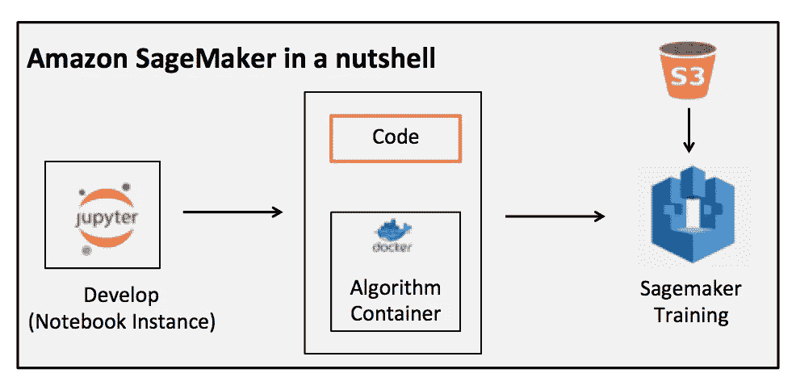
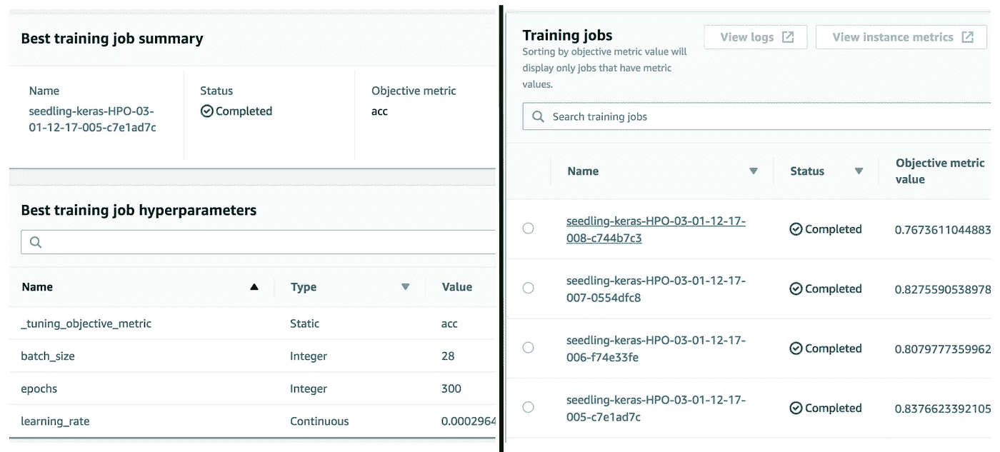
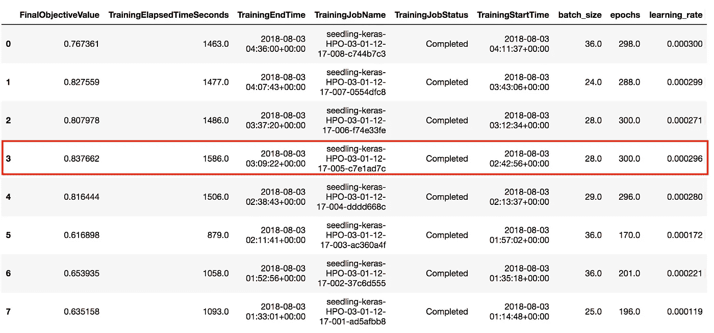

# Amazon SageMaker 上 Keras 的自动模型调整:植物幼苗数据集

> 原文：<https://medium.datadriveninvestor.com/auto-model-tuning-for-keras-on-amazon-sagemaker-plant-seedling-dataset-7b591334501e?source=collection_archive---------1----------------------->

在之前的[博客](https://medium.com/@amulyabadal/cnns-for-newbies-from-a-newbie-93457e34d536)中，我们讨论了 CNN，并接受了 Kaggle 的——幼苗分类挑战。我们建立了一个简单的 CNN 模型，模型的准确率在 70%左右。在这篇博客中，我们将看看学习和提高准确性的不同方法。

我们要尝试的技术是-

1.  图像增强
2.  迁移学习
3.  超参数优化

## 1.图像增强

准确性差的原因之一可能是数据不足。这可以通过图像增强来克服。

图像增强是一种通过处理(镜像、翻转、旋转、增加/减少亮度、对比度、颜色)图像来增加数据集大小的技术。

我将[图像增强](https://mxnet.incubator.apache.org/tutorials/gluon/data_augmentation.html) API 与 gluon 一起使用，但无法获得正确的组合来获得良好的准确性(13%！！！)，因为没有足够的例子来更好地理解它，所以我决定尝试一个不同的框架来使事情对我来说更容易。

## 输入 Keras …..

Keras 是一个用 python 编写的深度学习框架，它是**用户友好的**、**模块化的**和**可扩展的**，可以选择不同的后端，如 Tensorflow、Theano 和 MXNet。

**用户友好**

*   提供一致且简单的 API，
*   最大限度地减少常见用例所需的用户操作数量，
*   针对用户错误提供清晰可行的反馈

**模块化**

*   神经层、成本函数、优化器、初始化方案、激活函数、正则化方案都是独立的模块，可以组合起来创建新的模型

**可扩展**

*   新模型很容易添加领先的支持研究

以下是一些有帮助的资源— [Keras 文档](https://keras.io/)、 [Keras vs Tensorflow](https://medium.com/implodinggradients/tensorflow-or-keras-which-one-should-i-learn-5dd7fa3f9ca0)

一个基本的 keras 模型无助于建立准确性。这让我对 Keras 的迁移学习产生了兴趣。

## 2.迁移学习

> 迁移学习是机器学习中的一种方法，其中我们使用在不同数据集上训练的模型，但能够捕捉相同的特征，有助于用新数据集解决问题。

在之前关于卷积神经网络的[博客](https://medium.com/@amulyabadal/cnns-for-newbies-from-a-newbie-93457e34d536)中，我们讨论了 CNN 的分层学习，即在前几层，CNN 学习不同的边缘、曲线，然后学习图像中的不同对象/特征。如果我们使用在大型图像数据集上训练有素的现有模型，并将从中获得的模型权重用于我们在幼苗数据集上训练的模型的初始层，我们可能会获得更好的准确性。

您可以查看以下资源来帮助理解使用 Keras 的[迁移学习。](https://medium.com/@14prakash/transfer-learning-using-keras-d804b2e04ef8)

我首先在我的旧 mac 上，借助上面博客中的示例代码建立了一个模型。模型运行 15 小时，准确率为 80.53%。这是一个相当不错的准确性！但是需要很长时间才能达到不理想的精度。我不得不每隔几个小时痛苦地检查一下

我想要更快，更准确的东西。似乎如果我找到更好的超参数，它可能会训练得更快更好。

我最近参加了一个关于 AWS Sagemaker 的超参数优化的网络研讨会，并决定使用/探索它。

**3。超参数优化(模型调整)**

超参数(历元数、学习率等)控制算法的工作和模型的性能。这些超参数的值通常是手动调整的(在一些图的帮助下的试错法),直到找到提高性能的正确组合。手动技术可能很耗时，并且可能需要专业知识。像 [SigOpt](https://sigopt.com/) 这样的初创公司的产品可以自动完成这一过程。

# 简而言之，亚马逊 SageMaker

SageMaker 是 AWS 提供的机器学习服务。你可以使用 SageMaker 建立、训练、部署机器学习模型。它有内置的算法可供使用，带来您自己的算法和功能，如超参数调整，帮助我们获得超参数的最佳组合，以实现所需的指标目标。



Fig 1.

上图是 SageMaker 内部的高级表示。代码可以使用 sagemaker 的 Jupyter 笔记本实例来开发。就我而言，我将现有的笔记本上传到 sagemaker。sagemaker 处理算法容器有两种方式——

*   **内置容器** — SageMaker 内置了算法容器。如果有数据集，想尝试 XGBoost 算法，可以使用 sagemaker 提供的现有算法容器，进行训练和部署。它有流行的深度学习框架的容器，如 MXNet，Tensorflow，PyTorch & Chainer。
*   **构建自己的容器**——使用 Amazon SageMaker，您可以打包自己的算法，然后在 SageMaker 环境中进行训练和部署

我们将使用构建自己的容器方法，因为 Keras 容器不是现成的。所以我们将遵循这个[教程](https://github.com/awslabs/amazon-sagemaker-examples/blob/master/hyperparameter_tuning/keras_bring_your_own/hpo_bring_your_own_keras_container.ipynb)中的步骤。

# 帮助开始使用 SageMaker 的常见问题

*   那么 SageMaker 是如何摄取我拥有的代码的呢？

在 Sagemaker 中，您可以创建 jupyter 笔记本实例，并上传您现有的笔记本、python 文件等。然后，您可以将文件及其依赖项打包成 docker 容器。

*   代码依赖怎么办，我如何打包所有代码？

所有的依赖项都可以在配置文件中列出。内部库和自定义代码可以打包成一个 docker 容器，这个 docker 映像可以被推送到容器注册表( [ECR](https://aws.amazon.com/ecr/) )。然后，您可以使用图像、数据位置等创建 SageMaker 作业；逻辑上看起来如下

```
***submit_job_to_sagemaker(****container_image, data_location, instance_type, hyperparameters, …****)***
```

*   它支持哪些框架？

它支持许多常见的框架，如 Tensorflow、PyTorch、MXNet、Chainer 等，但您可以使用 docker 引入任何算法

*   我的代码如何获得它需要训练的数据？

您可以将数据上传到 AWS S3，并确保 SageMaker 使用的 IAM 角色有权访问数据

*希望这些问题能帮到你@newbiees*

# 如何在 SageMaker 中调校你的 Keras 车型？

我们将讨论在 Sagemaker 中调优 Keras 模型的步骤。你可以在这里查看我的代码[。](https://github.com/ThePrecious/ml_projects/blob/master/3_Sagemaker_Seedling/hpo_bring_your_own_keras_container.ipynb)

**初始化 SageMaker 会话**

初始化一个会话和默认的 S3 存储桶，我们将在那里上传数据

```
sagemaker_session = sagemaker.Session()
smclient = boto3.client(‘sagemaker’)
bucket = sagemaker.Session().default_bucket() 
prefix = 'sagemaker/hpo-keras-seedling'
```

**上传数据到 S3**

我们将使用从上一篇博客中准备的训练数据，并将其保存为 pickle 文件并上传。在上传到 S3 之前，我改变了输入形状(批量大小，高度，宽度，通道)。这一步可以在从 S3(在 start.py 文件中)下载数据后完成。

```
sagemaker_session.upload_data(path='npX_keras.pkl', bucket=bucket, key_prefix='data/hpo-keras-seedling/train')
sagemaker_session.upload_data(path='oh_npY.pkl', bucket=bucket, key_prefix='data/hpo-keras-seedling/train')
```

**创建 ECR 存储库并添加 IAM 角色**

创建一个 ECR 存储库，因为 SageMaker 需要一个算法容器。添加 IAM 角色，以便 SageMaker 可以访问 ECR。

```
aws ecr create-repository — repository-name test
```

**构建 Keras docker 映像**

如图 1 所示，SageMaker 需要一个包含所有库/依赖项的执行环境。因此，我们将代码、库、依赖项、CPU/GPU 偏好等打包，并构建 docker 映像。dockerfile 已经定义了在 start 上执行 start.py 的入口点。

```
ENTRYPOINT ["python", "-m", "trainer.start"]
```

我以前对 docker 没有什么经验，但幸运的是我不需要改变容器设置。我修改了 start.py 文件以包含所有的执行代码(构建和训练网络)

**将图像推送到 ECR**

现在我们有了一个容器映像，我们将它推送到容器注册表。

**正在执行 SageMaker 调优作业**

通过定义一个 JSON 对象来配置优化作业，该对象作为 TuningJobConfig 参数的值传递给 create_tuning_job 调用。在这个 JSON 对象中，指定:

*   要调整的超参数范围:*学习率、时期、批量*
*   调优作业可以消耗的资源限制: *MaxNumberOfTrainingJobs，MaxParallelTrainingJobs*
*   调优工作的客观指标:*准确性*

**指定培训工作配置**

通过定义一个 JSON 对象来配置调优作业启动的训练作业，该对象作为 TrainingJobDefinition 参数的值传递给 create_tuning_job 调用。在这个 JSON 对象中，您可以指定:

*   培训工作产生的指标:*我们将使用准确性作为监控的指标*
*   算法要训练的容器图像:*资源链接到我们构建并推送到 ECR 的图像*
*   训练和测试数据的输入配置: *S3 铲斗位置*
*   算法输出的配置
*   调整作业中未调整的任何算法超参数的值:*静态超参数*
*   用于培训作业的实例类型: *ml.p2.xlarge*
*   训练作业的停止条件:*最大运行时间(秒)*

**创建并启动超参数调整**

通过调用 create_tuning_job API 启动超参数优化作业。将您在前面步骤中创建的 name 和 JSON 对象作为参数值传递。

```
smclient.create_hyper_parameter_tuning_job(
HyperParameterTuningJobName = tuning_job_name,
HyperParameterTuningJobConfig = tuning_job_config,
TrainingJobDefinition = training_job_definition)
```

**通过 API 进行作业监控**

创建优化作业后，可以使用 describe API 监控优化作业的进度。

```
smclient.describe_hyper_parameter_tuning_job(HyperParameterTuningJobName=tuning_job_name)[‘HyperParameterTuningJobStatus’]
```

**也可以通过控制台进行作业监控**

您也可以转到 SageMaker 控制台->作业，查看已经创建的每个培训作业的进度



*在手动尝试不同的超参数值并在我的笔记本电脑上训练了几个小时后，SageMaker 的模型调整功能证明是一个福音！！！我甚至能够达到 83.76%***:)的准确率，比我的笔记本电脑更好更快。**

***模型调整统计***

*SageMaker 调优作业分析 API 提供了一个漂亮的 pandas 数据框架，其中包含所有作业运行时信息，我们可以用它来分析结果。后来的作业准确度更高。看起来它正在学习并朝着正确的方向前进:)*

```
*tuner = sagemaker.HyperparameterTuningJobAnalytics(tuning_job_name)
full_df = tuner.dataframe()*
```

**

***CPU vs GPU:速度和价格***

*最初，由于 GPU 实例非常昂贵，我想我应该从 CPU 实例的培训开始。我总共启动了 8 个调优作业，配置为仅使用 CPU (ml.m5.xlarge)最多运行 150 个周期，总的培训持续时间接近 20 小时。平均每个时期需要 4 分钟来完成。*

*速度= 4 分钟/纪元
总运行时间= ~20 小时
成本= . 269 * 20 = 5.38 美元*

*默认情况下，每个帐户都有 1 个 GPU 实例(ml.p2.xlarge)的服务限制，所以我决定试一试。培训要快得多，结果也便宜得多。*

*速度= 4.8 秒/纪元
总运行时间= ~3 小时
成本= 1.26 * 3 = 3.78 美元*

# *结束语*

*在 Kaggle challenge 上的工作帮助我探索、尝试和学习不同的技术，如数据扩充、迁移学习。这些技术中的每一个都是巨大的，并且具有大量研究的潜力，需要实践来掌握。*

*尽管训练模型和找出可以改进的地方既费时又费力，但像 SageMaker 这样的亚马逊服务可以帮上忙，加快速度。Sagemaker 的设置很简单，AWS github 中的教程帮助我理解了这个过程。超参数调整有助于减少寻找超参数值所花费的时间。我会向任何正在学习和探索深度学习技术的人推荐 SageMaker。*

# *参考*

**图片增强:*[https://mxnet . incubator . Apache . org/tutorials/gluon/data _ augmentation . html](https://mxnet.incubator.apache.org/tutorials/gluon/data_augmentation.html)*

**Keras 文档*:[https://keras.io/](https://keras.io/)*

**Keras vs tensor flow*:[https://medium . com/imploding gradients/tensor flow-or-Keras-which-one-should-I-learn-5 DD 7 fa 3 F9 ca 0](https://medium.com/implodinggradients/tensorflow-or-keras-which-one-should-i-learn-5dd7fa3f9ca0)*

**使用 Keras 转移学习*:[https://medium . com/@ 14 Prakash/Transfer-learning-using-Keras-d 804 b 2e 04 ef 8](https://medium.com/@14prakash/transfer-learning-using-keras-d804b2e04ef8)*

**亚马逊 SageMaker —自带 keras 容器教程*:[https://github . com/aw slabs/亚马逊-sage maker-examples/blob/master/hyperparameter _ tuning/keras _ bring _ your _ own/hpo _ bring _ your _ own _ keras _ container . ipynb](https://github.com/awslabs/amazon-sagemaker-examples/blob/master/hyperparameter_tuning/keras_bring_your_own/hpo_bring_your_own_keras_container.ipynb)*