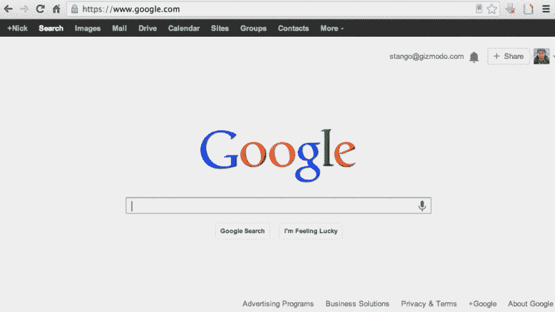
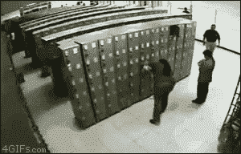
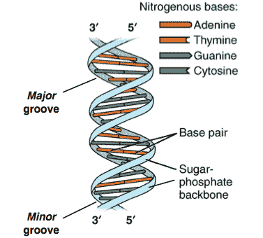
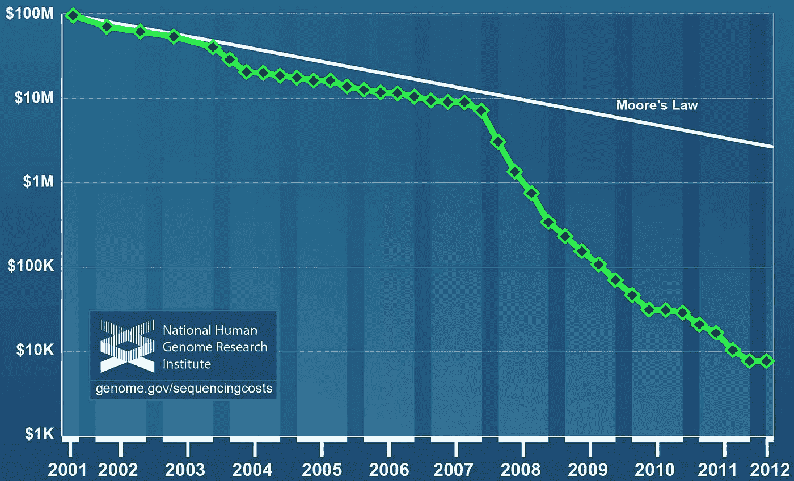
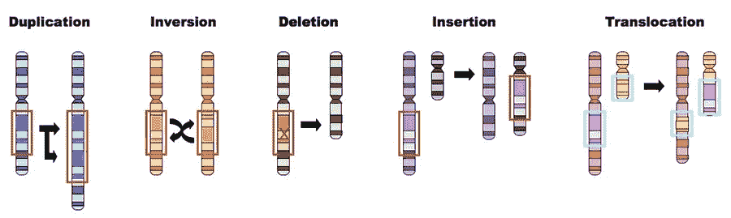
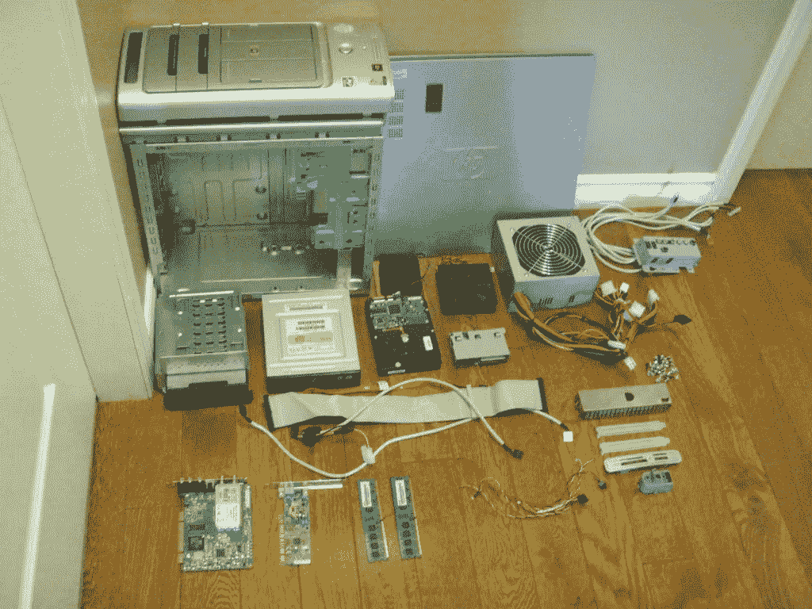
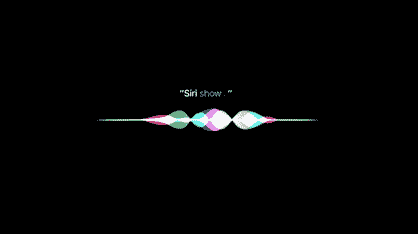

# 自动编码器:像谷歌，但是是针对你的基因组

> 原文：<https://medium.datadriveninvestor.com/autoencoders-like-google-but-for-your-genome-942b59046cbd?source=collection_archive---------0----------------------->

## 使用自动编码器神经网络使基因组数据更易消化

我们很幸运生活在一个信息如此丰富的时代。

我的意思是，我们可以接触到世界上几乎所有的知识，就在我们的指尖！我们所需要做的只是快速的谷歌搜索，我们就可以读到关于世界另一端发生的事情的文章！

如果有问题我需要答案，我可以问我的好友 Siri，她会在几秒钟内给我答案。即使发现这个答案的人花了一生的时间才弄明白。

我们已经想出了如何让所有这些信息变得如此容易获取，我们已经创造了如此多的系统来帮助我们导航我们的外部世界。

然而，仍然没有系统让我这样做，但导航*自己*。我的生物世界。没有办法谷歌到我细胞里发生的事情。

Me trying to understand myself

在日常生活中，我们实际上很少探索和进入我们的内部生物群落，并找出我们细胞内到底发生了什么，以及我们的身体为什么会这样做的原因。

但是搞清楚这一点真的非常重要！

# 我们的身体就像一个工厂

我们由所有这些部分组成，所有这些工人，它们形成了自己的系统，但仍然作为一个有凝聚力的单位一起工作。这些系统让我们成为我们自己，自我修复，完成不同的任务，并对我们的环境和疾病做出反应。

如果工厂出现问题，即使是一个微小的阶段，也会影响整个过程。即使一条传送带断裂，也可能导致堵塞，破坏整个系统。这就像多米诺骨牌效应。

Probably wouldn’t want this to happen inside your cells 😬

其中一些故障可能正在你的身体内部发生*，*，但除非你看到外部症状，否则你不会知道。除非你流鼻涕或咳嗽，否则你不会知道病毒是否进入了你的身体。但是如果你已经有了那种症状，你的身体已经出现了故障，多米诺效应已经发生了。

对于普通感冒，你可以等一等。但是对于像皮肤癌这种实际上可能致命的疾病，你会想马上知道是不是哪里出了问题，是不是根本原因。

 [## 医疗保健的未来正在被一场巨大的技术入侵所塑造——数据驱动的投资者

### 过去十年，全球经济的所有部门都经历了大规模的数字颠覆，而卫生部门现在…

www.datadriveninvestor.com](https://www.datadriveninvestor.com/2018/11/02/the-future-of-healthcare-is-being-shaped-by-a-big-tech-invasion/) 

这就是事实。你的健康很重要。**如果我们能够像对待 Instagram memes 一样获取关于我们健康的信息，我们就可以在疾病发生前阻止它。我参与了一些项目，旨在为负担不起昂贵治疗费用的人根除疾病，但是如果我们能在疾病发生之前就阻止它们呢？想象一下，我们还能活多久，我们会变得多么健康！**

# 人类有点复杂…

这就是为什么我们创造了不同层次的工厂，我们的生物学，叫做“组学”

有许多不同的组学，但我将概述其中的三种:

1.  基因组学:研究你的基因。这些就像我们在工厂里制造的任何东西的蓝图。你的基因序列，也就是你 DNA 中 A-T-C-G 的顺序，在很大程度上决定了其余组学的结果。
2.  **蛋白质组学:研究蛋白质，即基因编码的**。基因序列决定了哪些氨基酸组合在一起形成蛋白质。尽管 ATCG 氏症的数量是固定的，但形成蛋白质的氨基酸组合数量几乎是无限的，这就是为什么有这么多不同的蛋白质做不同的事情，从修复体外伤口到修复体内细胞损伤。
3.  **代谢组学:研究你的生化反应，**像[你的细胞如何制造能量。它涉及称为代谢物的分子来执行这些过程。](https://medium.com/@anupra.chandran_2789/free-radicals-are-killing-your-cells-as-you-read-this-heres-how-to-fix-it-2e80a3326b68)

这些系统有许多不同的组成部分。太多了，我们不知道的太多了。在这篇文章中，我将把重点放在**基因组学**方面，因为它是许多蛋白质组学因子、代谢组学因子等的基础。因此，如果基因组发生了变化，就会产生连锁反应。

但是，即使你只关注其中一个组学，仍然有如此多的数据需要处理！所以我们需要一点帮助…

# 神经网络可以了解我们，为了我们！

如果你真的看一看神经网络是什么样子的，**它就像我们大脑中的神经元！**

输入层就像树突，信息或信号首先在这里被拾取。它穿过试图理解它的隐藏层，如细胞体，以及轴突/轴突终末，后者接受新的输出并将其传递出去。

这是因为神经网络用于机器学习，或赋予机器执行任务的能力，而无需显式编码。基本上，让机器像我们一样思考！

但是我们不一定希望机器像我们一样思考，因为让我们的基因组数据对公众“可消费”并不是我们已经做过的事情。我们想创建一个“基因组谷歌”，因此这些神经网络应该能够比我们更快地处理数据，并消除这方面的人为错误。我们会犯错，但我们的电脑不会。

对于让基因组数据变得更易于消费和访问这一特定案例，我们需要神经网络来:

1.  取一个输入(我们的基因组数据)
2.  使用神经网络模型来学习数据的表示，而不必为每样东西都做特定的标签。我专注于使用自动编码器。
3.  输出的数据没有“噪音”或多余的数据，所以它是可消化的

# 输入:基因组测序数据

你的 DNA 是由双螺旋结构组成的。那些 ATCG 含氮碱基的序列有一对，在另一边。a 和 T 结合，C 和 G 结合，所有的碱基对都有一个由糖-磷酸构成的骨架。这些碱基对的序列是你内在生物工厂的蓝图。

人类基因组计划从 1990 年持续到 2003 年，在此期间，能够绘制出完整的人类基因组图谱。所有的 ATCG 氏症，所有的一切。这就是所谓的测序。

客观地说，人类基因组有 30 亿个碱基对。需要整整 31 年才能达到 10 亿。人类基因组计划能够对如此多的数据进行测序，这是我们以前从未做过的事情。

那个项目花费了将近 100 万 3B .对我来说更疯狂的是**现在，只需 200 美元**，就有可能对你的整个基因组进行测序。你现在就可以拿到这些数据，只需要发送一份唾液样本！这实际上比我们现在获取信息的方式——买一部 iPhone 还便宜！

😲!!!

所以我们可以访问这些数据。**我们只是不知道这意味着什么。**

我们只了解人类基因组的 2%。我们 98%的基因组尚未被探索。我们仍然不太了解不同的基因如何相互影响，或者我们的蛋白质和代谢物。这就是为什么将这些数据转化为可读的术语是如此重要。

基因是这些 ATCG 密码的一部分，编码不同的东西。例如，BRCA1 基因的突变(或改变)会导致更高的乳腺癌风险。一个碱基对可能被调换、删除、插入，或者序列可能被过早终止，这可能会导致以后出现这类问题。

Mutations, we should know about these

**因此，通过使数据更具可读性，我们可以更容易、更早地发现这些突变，并采取生活方式措施来防止负面影响。**

一旦数据被排序，它将显示为 ATCG 序列，以及它们各自的碱基对。

为了让神经网络能够读取数据，**我们需要将 ATCG 数据转换成数值。**

**我们将使用一键编码**来实现这一点。

因此，如果我们有一个序列 AGT，我们将在一个矩阵中有 4 列，标记为 A、T、C 和 G(或数据的二维排列)。所有的空格都有一个 0，除了第一个 A，第二个 G，第三个 T，因为这些是基因序列值。这些将有一个 1，因为 1 表示“是”，0 表示“否”。我们也对碱基对，DNA 螺旋的另一边，做同样的事情。

# 模型:超越人工神经网络

在一个**人工神经网络中，**一群“神经元”在不同的层中互相连接。这个名字实际上是对它的最好类比，它是一个模仿你的大脑输入和输出信息的网络，但它实际上不是你的大脑，它是一个计算机算法。

The more layers you have, the “deeper” the network is!

1.  输入层首先将我们的基因组数据带入系统进行处理
2.  隐藏层将基于**加权连接**(连线)将数据传输到每一层。这只是意味着每次数据从一个神经元转移到下一个神经元时，它都会乘以一个“权重”或一个与每个连接相关的数字。可以调整权重以提高精确度，或者获得正确的结果。
3.  就像每个连接都有一个“权重”，实际的神经元有一个“偏差”，它被添加到加权和或来自先前神经元的所有输入数据的和中。
4.  激活/单位阶跃函数被加到加权和上，以定义输出。某些激活函数将使输出为 0 或 1，或介于-1 和 1 之间的范围，或某事的小数概率(如基因突变是否癌变的概率)。

**如果我们已经有了可以通过网络“训练”它的标记数据，人工神经网络就很棒。**

就像如果我们有一个基因序列的数据集，包括有突变的人和没有突变的人。这样，模型可以根据我们告诉它寻找的特征来“学习”突变的特征。如果输入一个没有标签的新序列，它可以寻找突变的基因。这被称为监督学习。

但是关于基因组我们还有很多不知道的。我们可以尝试寻找一个特定的突变，但也可能有另一个我们没有想到去寻找或训练的突变。我们需要的是一种在数据中发现未标记模式的方法。那就是无监督学习。我们需要一个更加无人监管的神经网络。

# 自动编码器，其中输出是输入

等等，什么？

It makes sense, I promise

对于自动编码器，有一个输入、隐藏和输出层，就像人工神经网络一样。**但是输出只是输入数据的重构版本。**没有预测，什么都没有。完全相同的基因序列。在工厂里，这就像制造一台电脑，把它拆开，然后再组装起来。

我知道，这听起来很违反直觉。**但那是因为我们不关心输出层会发生什么，我们关心隐藏层会发生什么。**

如果隐藏层是一个瓶颈，神经元较少，这意味着输入数据必须被压缩。该模型正在通过权重和偏差进行学习，以创建这种真正密集的数据表示。

该隐藏层只需要自己学习数据的最重要的特征。这意味着在参考基因组(没有突变的基因组)上训练后，它会学习一些像突变一样的东西，一些不正常的东西。

如果我们获取这些数据并在瓶颈中压缩，我们将能够在几个不同的维度上可视化超级复杂的数据，比如基因序列。

很难理解工厂制造的计算机是如何工作的，但是如果我们把它拆开，看看所有不同的部件，就很容易把功能和部件对应起来。

What we’re doing with the data

换句话说，*自动编码器让普通人也能理解它！*

该算法的目的是遵循 Y(i) = X(i)函数，这基本上意味着编码器的输出(输入)与解码器的输出(输出)相同。**这样我们就不必为所有的数据创建标签了！**

有了自动编码器，我们需要的所有步骤都在那里:

1.  取一个输入(我们的基因组数据)
2.  使用模型来学习数据的表示，而不必为每样东西都做特定的标签。
3.  输出的数据没有“噪音”或多余的数据，所以它是可消化的

# 在未来，我们的健康可能最终掌握在我们自己手中

如果每个人都能直接从手机上使用自动编码器，它将变得像谷歌搜索一样正常。在等待 Siri 点我们的麦当劳时，我们可以向它索要我们的基因报告。也许一旦我们对自己的健康有了更多的控制，人们会想吃得更健康…？

但是严肃地说，如果我们一半时间都不知道发生了什么，那就很难管理好自己的健康。我们应该在疾病发生之前找到根本原因，而不是等待问题的症状在医生那里进行基因测试。或者，我们可以进行全面扫描，确保我们的内部工厂始终处于控制之下，而不是寻找可能发生突变的特定基因。

**来回顾一下:**

*   我们无法获得太多关于我们生物学的信息，这就是为什么我们的许多疾病只有在发现症状后才能被识别出来
*   你的基因和 DNA 序列决定了你的蛋白质是如何产生的，等等。正因为如此，许多疾病始于基因组水平，并产生连锁反应
*   我们可以通过测序获得基因组数据，这已经变得容易多了。我们只需要能够理解它，首先将 A-T-C-G 的顺序转换成计算机能够理解的数值。
*   神经网络允许计算机比人类更快地处理这些数据，并且错误更少，同时仍然使用与人类神经元工作方式类似的框架
*   自动编码器超越了人工神经网络，使用无监督学习来处理没有标签的数据
*   autoencoder 的输出与输入相同，我们关心数据被压缩的隐藏层，并且只包括最重要的特征。

普及医疗保健的最佳方式是首先确保人们真正了解自己的身体状况。我已经非常感激能够接触到所有这些关于外部世界的信息。但是如果我们对我们内部的生物群落也有同样的访问能力，那就是“基因组谷歌”,我们真的可以拥有另一个层次的力量。

***感谢阅读！！如果你喜欢这篇文章，给它几个掌声，*** [***查看更多***](https://medium.com/@anupra.chandran_2789) ***，与我联系***[***Linkedin***](https://www.linkedin.com/in/anupra-chandran-800b9814b/)***，并关注更多关于如何使用人工智能来理解人类的文章:)***