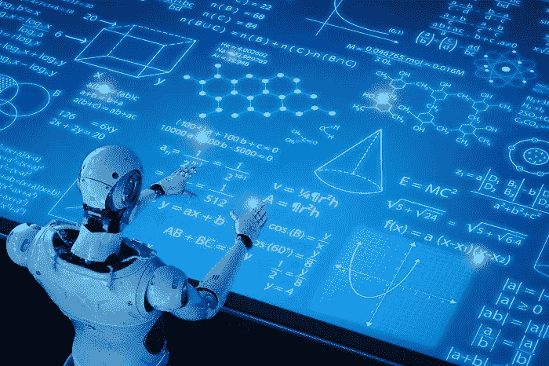

# 自动唇读可能会威胁到数据隐私(但暂时不会)

> 原文：<https://medium.datadriveninvestor.com/automated-lip-reading-may-threaten-data-privacy-but-not-for-a-while-b08392914351?source=collection_archive---------11----------------------->

## 想想唇语的错综复杂，你就明白了。

信不信由你，但是“专业的”唇读已经存在很长时间了。事实上早在 16 世纪。遇见一个可爱的名叫皮埃特罗·庞塞的西班牙本笃会小和尚，你可能刚刚遇见了专业唇读的先驱，因为他是第一个正式成功的唇读老师。当然，唇读的全部目的是为听力受损的人提供一种理解对他们说的话的方式，因为手语确实是双向的。谁知道——*谁知道*唇读可以通过机器学习*自动化*？

# 这就是今天科技领域正在讨论的——自动唇读

当然，面部识别使之成为可能，因为你需要一种算法来准确记录嘴部运动，然后通过至少接近精确的测量将这些运动与单词的正确发音联系起来。电脑实际上可以记录你的嘴唇的想法——这是一个新颖的想法，但也带来了数据隐私和黑客攻击的问题！

 [## 准备在 2019 年改变世界的技术-数据驱动的投资者

### 很难想象一项技术会像去年的区块链一样受到如此多的关注，但是……

www.datadriveninvestor.com](https://www.datadriveninvestor.com/2019/01/17/the-technologies-poised-to-change-the-world-in-2019/) 

然而，事情是这样的:*我们离这项精确的技术还有很长的路要走*。有充分的理由。

# 看看布莱德利·库珀和 Lady Gaga 对流行歌曲《肤浅》公认的糟糕的唇读吧

很惊人，不是吗？有趣，是的…但令人大开眼界。那些毕竟是*不是。的。歌词。敬。的。宋！那是必然的。但是当你看着嘴唇，听着话语，它看起来很有说服力。*

假设你不知道这首歌的歌词。然后呢？试试这个:把视频静音，试着跟着做。

如果你没有听那个糟糕的唇语，很难说你会听到什么。

长话短说，唇读艺术有巨大的价值，但就其本身而言，它远非完美。问题是我们能指望任何机器做得更好吗？值得怀疑。

# 简而言之，这是唇读的基本技术方面

其背后的科学包括识别一系列形状，将它们与一个单词或一组单词相匹配。这很容易，但是当嘴巴本身形成 10 到 14 种不同的形状时，这就成了一个挑战，并且有一个实际的术语来描述它。此外，几乎每个人都有不同的嘴型(试试米克·贾格尔或史蒂芬·泰勒的唇读吧)，如果你真的遇到了专业的唇读专家，就去找那个人签名吧。

很难做到。你必须是公认的天才。

该科学还包括这样一个事实，即语音包含大约 50 个特定的*音*；它们被称为*音素*。因为这个数字，你可以预期一个单独的*视位*可能代表几个独特的*音位*。

这就是为什么很容易听到与嘴唇运动相关的各种单词，并且完全确定你听到的就是这些单词。有没有听过一首歌，听到一套不同的歌词，即使*知道*他们是错的？每个人都会这样。同样的科学也适用于此。

# 想象一下，让一台机器自动读唇语需要什么…

进入 [*面部识别*](https://vigyaa.com/@pierre/will-apple-be-the-new-mission-impossible-863507f4/) 。这就是技术背后的症结所在。有了这项创新，一种算法可以根据嘴唇的运动考虑大量的排列，进行推断，然后提出最佳可能的解决方案，当然，这将*有意义*。这是关键。

一台机器通过测量嘴唇的高度和宽度、椭圆的细节特征、牙齿、发红度(一个人说话时显示的舌头)和轮廓来做到这一点。通过学习，机器可以相当准确地做出判断，但仍远非完美

举个例子，小胡子、胡须，甚至性别:它们都会影响准确性。研究结果证明，机器读懂女人的嘴唇比读懂男人的嘴唇更容易。确实不是每个人都是“可读的”有些人的嘴唇很难表达，这使得即使是计算机也很难确定正确的语言。

一位名叫 Hassanat 的科学家实际上开发了一个自动语音识别系统，取得了 76%的成功率。不算太坏。当然，实验是在严格控制的条件下进行的，没有考虑到不可预见的变量，但我们并没有要求太多。

它能好到近乎完美吗？可能吧。

# 计算机需要做什么来准确地视觉识别语音

最好的唇语阅读者通过其他因素获得成功，如上下文、肢体动作和对语言的丰富理解，而不仅仅是正确的语法。当计算机完成这一任务时——在今天这个技术创新的时代,*这是可能的,* —我们可能很快就会看到唇读机器人。

然而，这真的是一件值得关注的大事吗？我们是否会变得如此容易被人阅读，以至于在我们的生活中没有隐私可言？一个系统只需要从远处放大并记录我们的嘴唇，用一个算法来确定刚才说了什么，然后猜猜看:密码从来都不是隐私。可怕的想法。然而，我们非常确定这一点:当黑客和身份窃贼发现某项技术对我们有利而不是有害时，我们很可能已经有了防范措施。

也就是说…一些海鸥的时间到了:

[**你现在可以注册一个 VIGYAA 账户**](https://vigyaa.com/accounts/login/) ，一定要去 [**看看《数据驱动投资者》了解更多关于技术的见解**](http://datadriveninvestor.com) ！