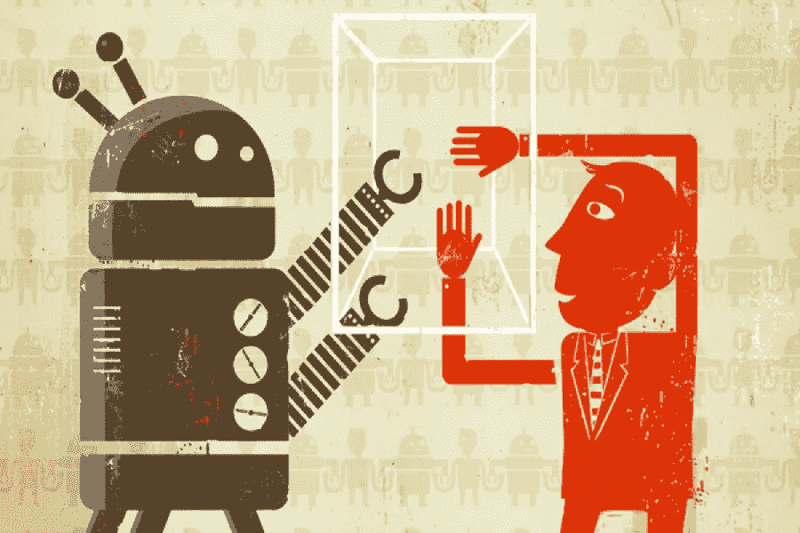
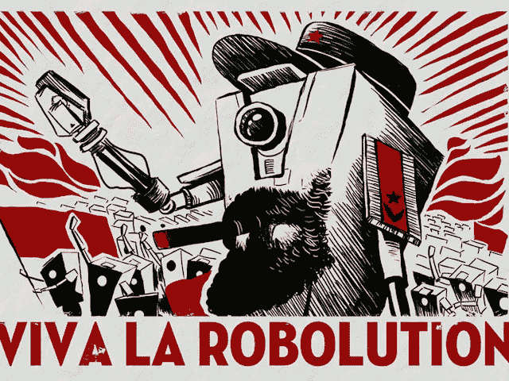

# 基于机器学习的自动化测试

> 原文：<https://medium.datadriveninvestor.com/automated-testing-with-machine-learning-ea18dbc3f72b?source=collection_archive---------2----------------------->

不管你喜不喜欢，机器人已经在这里了，而且它们已经来了。

脸书正在使用人工智能来扫描人们在 Messenger 上相互发送的图像，确保内容符合公司的规定。完全不是为了做广告。

当你抱怨披萨送晚了的时候，聊天机器人会处理你歇斯底里的态度。

我们大多数人都开始明白，人工智能的目的是让我们的生活变得更轻松，而不是偷走我们的工作。

把人工智能想象成可以扮演自动化助手角色的东西。

*但我是一名软件工程师，这并不影响我……*

**它确实存在，或者在不久的将来可能存在。**

没有人工智能可以取代你，但有人正在利用机器学习的力量，其效率比你高 10 倍。

开始实现机器学习的最好地方之一是在你的自动化测试中。

主要是因为测试是重复的，需要大量的维护。

如果你有一个自动化的助手来帮你做这件事会怎么样？

市场上有一些有趣的解决方案。您可以创建、管理和运行自动化测试的平台，无需编码，也无需担心维护问题。

我个人全心全意推荐 [**Endtest**](https://endtest.io) ，因为我相信他们在竞争中遥遥领先。

