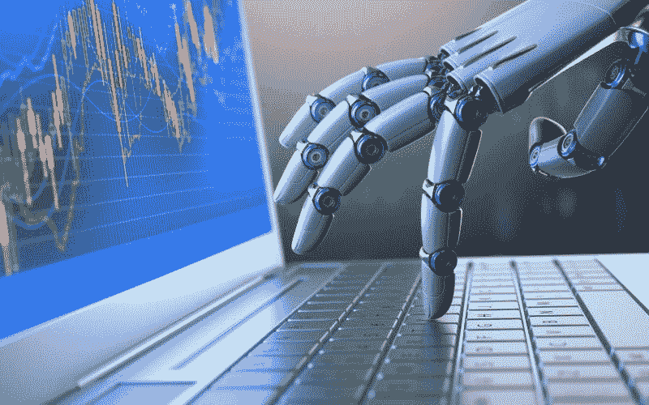

# 自动交易……新的标准？

> 原文：<https://medium.datadriveninvestor.com/automated-trading-the-new-norm-86e7157b3e86?source=collection_archive---------2----------------------->

今天有一个想法……关于金融市场的交易，有一件事&一直困扰着我。不要误会我的意思，我完全支持技术创新，但我觉得对于像我这样的普通投资者来说，交易已经变得有点太自动化了……交易机器人、算法交易&以及最近的人工智能交易模型。

在一个典型的日子里，50 %- 60%的交易决策是由计算机做出的&随着任何一轮波动性高峰，这一比例会跃升至高达 90%——我试图说明的一点是，所有机器都是根据它们运行的输入参数以相同的方式思考的，因此当触发点到来时，所有算法都会发挥作用，导致巨大的动量波动，在此过程中烧伤许多投资者。最近的例子是在今年二月，道琼斯指数一天内下跌超过 1100 点！

随着自动化的发展，在市场方向的决定中，人的作用继续减弱。我只是觉得在不久的将来，古老的买入并持有策略(特别是对股票而言)将成为历史——并不是说我很介意自己是一个日内交易者，但如果所有的灾难都随着机器的接管而失去，应该有某种安全阀(除了完全停止交易之外)!再说一次，波动性不是一件坏事——问问加密和外汇交易员就知道了——但如果它失控了，那就…

你们觉得怎么样…请随意评论或给出任何反馈。交易愉快！

Trading Platform for an active trader