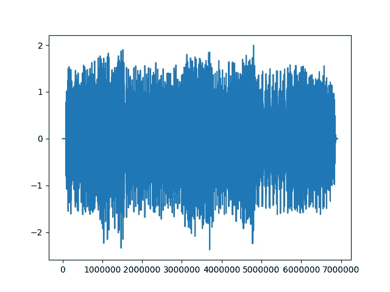
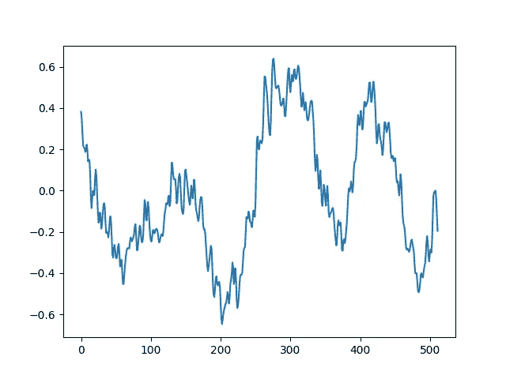
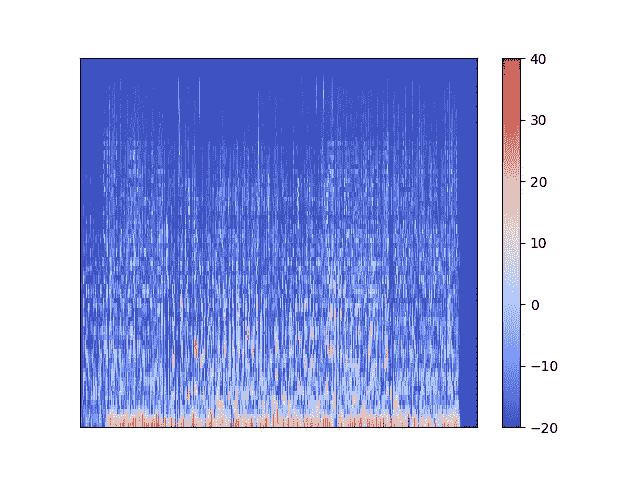
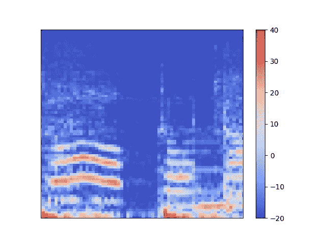
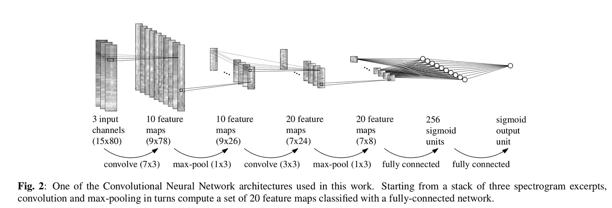

# 具有深度学习的节奏游戏的自动音符生成器

> 原文：<https://medium.datadriveninvestor.com/automatic-drummer-with-deep-learning-3e92723b5a79?source=collection_archive---------4----------------------->

这是我的日文原文的翻译版本，可以在这里找到:

https://qiita.com/woody_egg/items/01cc43fafe767d3edf62

*Taiko: Drum Master* or *Taiko no Tatsujin(太鼓の達人)* is one of the most popular rhythm action games in Japan.

[https://taiko-ch.net/product/](https://taiko-ch.net/product/)

虽然这个游戏是我最喜欢的游戏之一，但它有一个问题:选择播放的歌曲非常有限。我喜欢的一些歌曲在游戏中没有。这就是为什么我决定创建一个程序来听音乐并为我自己的音乐产生可演奏的音符(击鼓的时间)。

下面可以看到一些结果:

Peace Sign by Kenshi Yonezu

Your Best Nightmare by Toby Fox

a piano song by kinono

我们可以看到，该模型擅长于各种流派的音乐。这是可以实现的，因为我们也有各种各样的训练数据集，我稍后会解释这一点。

当我决定用深度学习来解决这个问题，并搜索类似的应用时，我发现了一篇名为*Dance Dance Convolution*[https://arxiv.org/abs/1703.06891,](https://arxiv.org/abs/1703.06891)的论文，它与另一款节奏动作游戏 *Dance Dance Revolution* 做了非常相似的事情。于是我决定模仿模型，看看这种方法能否应用到我最喜欢的游戏*太古野达进身上。*

在检查深度 CNN 模型之前，我想简单解释一下**傅立叶变换**，它是用于音频数据的预处理。

这是一首用于训练的歌曲的情节之一。如果我们仔细观察，它看起来像这样:

共有 512 个样本，相当于歌曲的 11ms 左右。现在我们将傅里叶变换应用于此，得到下图:

(它们实际上是变换结果的绝对值的平方)

在该图中，x 轴是**频率**，y 轴是**功率**。你可以忽略 x > 512 的值，因为它们是对称的，你得到的是 512 维向量，它告诉你当时的频率和相应的强度*。*通过使用称为 Mel-Scale 的方法将其转换为 80 维向量，并对音乐中的每 512 个样本应用整个过程，我们得到下图:

在该图中，y 轴是频率，x 轴是时间。权力用颜色来表示(红色代表强大)。你几乎看不出歌曲已经结束，右边就没有信号了，但是要看到每个声音太复杂了。所以让我们再仔细看看:

我们可以看到，从左手边，一个声音开始了，音高稍微上升，下降，然后结束。过了一会儿，另一个声音开始了…不管怎样。

最重要的是，这是一张图片。因此，我们可以将 CNN 应用于这些数据！这有点类似于物体分类:不是问“这张图片里面有猫吗？”，我们在问“*是在这个图像的中心发病的吗？*“当然，上图的宽度不足以检测发病，因此，在实践中，我将输入 15 帧，这将捕获 7 帧的目标帧。

通过改变样本的数量，我们可以获得不同的图像。我按照论文的要求，对 512，1024，2048 个样本进行了傅立叶变换。短帧有望捕捉突然的声音，如鼓声，而长帧则提供音乐的持久信息，如混响，从而提高准确性。

As for the dataset to train this network against, I utilized a clone game of *Taiko no Tatsujin*, *Taiko San Jiro 2(太鼓さん次郎 2).* In this cloned version, you can play any song you want with the game, provided that you have an audio file and a text file which specifies the timing of the notes. Fortunately, hundreds of songs with accurate labels for notes have been made by people and are publicly available, so the only thing I needed to do is to convert the file into timing, as a form of numpy array. I used around 150 songs for this project as a training set.

最后，深度 CNN 模型。我最初试图使用论文中提出的 R-CNN 模型(不同于对象检测上下文中的 R-CNN)，这是 CNN 和 LSTM 的组合，但失败了。模型的预测总是 0！我想知道为什么，并意识到，不同于*舞蹈革命*，*太古野达进*的发作非常稀少。为了平衡发病和非发病数据，我挑选了发病前后的数据。这意味着提供给模型的数据被缩减为很短的片段，很难将数据提供给 RNN。因此，相反，我使用了一个在*中提出的模型，用卷积神经网络*[https://ieeexplore.ieee.org/document/6854953](https://ieeexplore.ieee.org/document/6854953)改进音乐开始检测。

这种架构非常简单，没有那么深，但足够工作。

那么，这个算法好在哪里呢？你可以用这个算法玩任何你想玩的歌。你可能想提前使它成为一个自动鼓手！如果你感兴趣，我的 GitLab 资源库可能会对你有所帮助:[https://gitlab.com/woodyZootopia/soundgame](https://gitlab.com/woodyZootopia/soundgame)

感谢您的阅读！

也非常感谢 [ヨンユアンシー](https://medium.com/u/5483b829f25f?source=post_page-----3e92723b5a79--------------------------------) 修改校样！