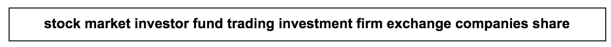
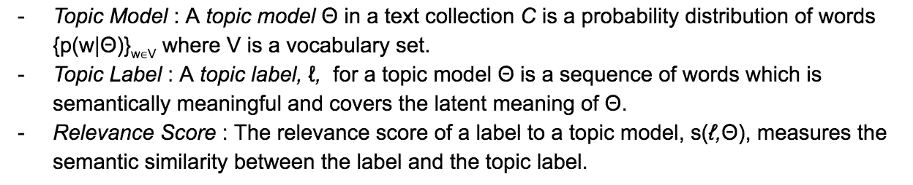
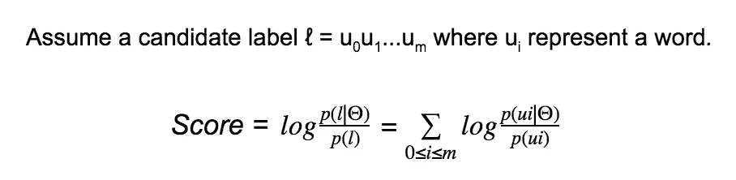
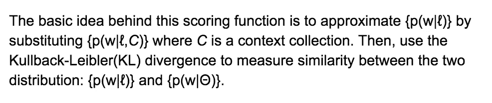
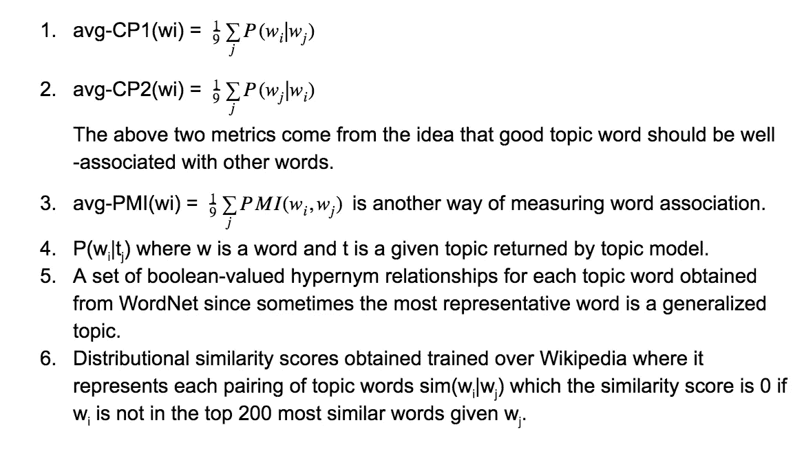

# 2018 年的自动主题标注:历史和趋势

> 原文：<https://medium.datadriveninvestor.com/automatic-topic-labeling-in-2018-history-and-trends-29c128cec17?source=collection_archive---------1----------------------->

这篇文章讨论了在主题建模中表示每个主题的缺陷以及解决这些缺陷的不同方法。

目录:

*   [**简介**](#b8bc)
*   [**梅等人 2007 年**](#5a21)
*   [**马加蒂等人 2009 年**](#0bc4)
*   [**刘等人 2010 年**](#bca3)
*   [**刘等人 2011 年**](#177d)
*   [【毛】等 2012 年](#d600)
*   [**赫尔普斯等人 2013**](#c758)
*   [**阿勒特拉斯和史蒂文森 2013**](#5b42)
*   [**梅赫达德等人 2013**](#f466)
*   [**卡诺等人 2014**](#975f)
*   [**巴蒂亚等人 2016**](#bdb4)
*   [**其他方法**](#1395)
*   [**参考文献**](#889d)

# **简介**

主题建模已经成为从文本文档中发现潜在主题的流行框架。标记每个主题的一种标准方式是用给定主题 *tj 中每个术语 *wi* 的最高边际概率 *p(wi|tj)* 的前 10 个术语来表示。*例如:

top 10 terms for a given topic

对于以上案例，我们可以暗示题目大概是关于“股市交易”[1]。但不幸的是，并非每个主题的热门词汇都是连贯的，因此想出一个好的标签来描述每个主题可能是相当具有挑战性的。此外，当处理大型文档语料库时，最好为每个主题提供良好的代表性标签，而不是查看每个主题的前 10 个术语，并找出每个主题可能是什么。总体而言，它在解释前 10 个词时带来认知负荷，容易产生主观性，并且缺乏可再现性/自动化[3]。

*主题标注*一般旨在指定一个或几个描述性短语来表示每个主题，并自动生成此类短语[2]。在这个研究领域已经有了很多尝试。在大多数生成主题标签的过程中，许多论文将他们的想法分成两个主要概念进行讨论:*候选标签生成*，即生成可能的主题标签；以及*候选标签排序*，即基于一些语义相关性评分方法对生成的标签进行排序。在这篇文章中，我们想要探究*主题标签*中关于这些概念的一些重要论文，并传达每篇论文是如何对该领域做出贡献的。

# **多项主题模型的自动标注(梅等 2007)**

本文首次将*主题标注*问题公式化，并将其定义为“给定一组以多项式分布形式从文本集合中提取的潜在主题，我们的目标是，非正式地，为每个主题生成可理解的语义标签”[1]。这样，它还定义了下面描述的有用术语。

此外，本文还讨论了好的标签的质量如下:可理解的，语义相关的，跨主题的区分，以及每个主题的高覆盖率[1]。

*   **候选标签生成**

本文使用以下两种技术从语料库中提取候选标签，如下所示。

*   组块/浅层解析:它使用 NLP 组块器来提取频繁的组块/短语。优点是组块器产生合乎语法和有意义的短语，但是准确性取决于训练的领域。
*   Ngram 测试:这种方法背后的基本思想是，彼此共现的频繁的 ngram 很可能是有意义的短语。优点是它独立于训练的领域，但缺点是那些提取的 ngrams 可能没有语言学意义，并且通常只对二元模型有效。
*   **候选标签排名**

该论文提出了下面描述的两个语义相关的评分函数。

*   零级相关性

Mei 论文[1]中的图 1 很好地总结了这种方法。该评分功能的基本思想是选择具有最高分数的标签，如下所述。

这个分数基本上意味着在给定主题的边际概率方面具有更重要单词的短语被假定为该主题的良好标签。

*   一阶相关性

本文讨论的另外两个重要概念是高覆盖标签和区别标签。选择高覆盖率标签的基本思想是使用最大边际相关性(MMR) [4]，它用于在信息检索任务中实现高相关性和低冗余。为了选择区分标签，重要的是实现主题间的区分。为了防止不同主题上的重复主题标签，该论文建议一种度量，该度量惩罚与许多主题具有高相关性分数的主题标签，从而选择与给定主题具有高语义相关性而与其他主题具有低相关性的标签。

# **主题的自动标注(Magatti et al. 2009)**

在 Mei 的论文之后，已经尝试为主题标注引入一些先验信息，以提高生成的候选标注的质量。下一篇论文显示了高度初步的结果，目的是引入先验信息以生成更好的标签，但也显示了一些前景。

本文结合了 Google 目录(gDir)的层次结构来生成候选标签。根据他们的假设，世界是由一组概念(等价地，主题)描述的，这些概念被插入到一个光本体中[5]，他们生成候选标签，这些候选标签具有与 gDir 层级的主题的本体对齐。

*   **候选标签生成**

在上述假设中，论文使用 gDir 构建了*主题树*，每个节点代表一个标签，本质上是 gDir 中定义的一个概念。

*   **候选标签排名**

他们使用 6 种不同的相似性度量:余弦、重叠、互、Jaccard 和 Tanimoto 相似性。

利用从 gDir 提取的*主题树*和作为单词列表的*提取的主题*，运行 ALOT 算法。该算法有两个主要部分:相似性度量和标记规则。上述相似性度量与单词列表(提取的主题)有关，标记规则使用主题树为每个主题分配最佳标记。基本思想是给定一组提取的主题，该算法计算 6 个相似性度量并为每个选择最佳标签。当所有相似性度量选择相同的最佳标签时，它在*主题索引* (TC)中，并简单地分配该标签。不在 TC 时，称为*话题不一致* (TD)。它分为两种情况:

*   SA:语义关联，其中所有标签共享不同于根的前置标签(子树中所有标签的最通用标签)。这种情况进一步分为两种情况，其中所有节点位于相同的**路径**中，我们在所选择的标签中选择最浅的标签，并且其中所有节点属于共同的**子树**，我们选择最不共同的祖先。
*   NSA:非语义关联，主题不共享除根之外的前任。有三种方法可以解决这个问题: **S-dmatp** ，它选择单个最深最大同意主题前趋(多数投票方案)；**M-dmatp**，它在多个最深最大同意主题前趋(最大出现次数)中选择最大出现标签；以及 **R-dmatp** ，当 S-dmatp 返回根节点并且至少两个前趋的最大出现次数相同时，它返回根节点。

# **主题标注的最佳主题词选择(Lau et al. 2010)**

本文提出了一个简单的想法，用前 10 个单词中的一个来表示每个主题，这是可视化每个主题的传统方式。为了使这种方法更好地工作，主题中的每个主题词都应该是连贯的，但事实并非如此。

*   **候选标签生成**

候选词是按边际概率排在前 n 位的词{ p(w |θ)} w∈V 其中 V 是词汇集。该论文使用 n = 10。

*   **候选标签排名**

如上所述，假设一个主题内的顶词之间具有连贯性，基本思想是“最具代表性的词应该容易被主题中的其他词唤起”[6]。

该论文使用 6 个不同的特征，这些特征将被馈入支持向量回归训练中，对照注释者挑选的排序，并用于单词的重新排序。

每个指标都可以单独作为一种排名方法，但本文在 SVM 使用了上述特征的各种组合，以获得更好的重新排名模型。

# **主题模型的自动标注(Lau et al. 2011)**

本文是 Lau 等人(2010 年)的自然进展。一个好的主题标签通常是用不在十大主题术语中的多词或术语更好表达的想法或概念。方法是使用英文维基百科生成候选主题标签，并相应地对它们进行排序。

*   **候选标签生成**

假设绝大多数概念/主题都包含在维基百科中，每个维基百科文章标题都被认为是一个有效的标签。候选标签按以下步骤生成:

1.  主要候选人:这些是通过查询(a)维基百科的原生搜索 API 和(b)网站限制的谷歌搜索生成的。由两个搜索引擎检索的前 8 个文章标题的组合集合构成了主要候选。
2.  次要标签:这些标签是通过使用 OpenNLP chunker 对生成的主要候选项进行组块分析来提取所有名词短语而生成的。二级标签通过只挑选有效的维基百科文章来删减。此外，使用文章的外部链接的类别成员资格，使用 RACO(相关文章概念重叠)再次修剪提取的与主题仅边缘相关的名词短语。
3.  最后，基于边际概率的前 5 个术语被添加到候选标签集中。

*   **候选标签排名**

作为 Lau 等人(2010)的扩展工作，本文在候选标签和主题术语之间使用了各种词汇关联度量。为了测量关联度，他们使用宽度为 20 的滑动窗口解析英语维基百科文章的完整集合，并计算候选标签和主题术语的术语频率。关联度量是候选标签和前 10 个主题术语之间的平均值。

标签和主题之间的词汇关联测量-10 个主题术语:

*   逐点互信息(PMI)
*   “学生”t 检验
*   戴斯系数
*   皮尔逊𝝌试验
*   对数似然比
*   Lau 等人(2010 年)描述的两种条件概率度量

还包括候选标签中前 10 个主题术语的原始术语数和相对术语数。最后，他们通过查询英语维基百科的本地副本，使用基于使用 BM25 术语相似性的 Zettair 搜索引擎的前 10 个主题术语，为每个标签使用搜索引擎分数。搜索引擎得分也是前 10 个主题术语的平均值。

# 【自动标注层次主题】(毛等 2012)

本文研究了层次主题的主题标注任务中主题之间的层次关系。实际上，大多数数据通常是以层次结构的形式出现的，因此这种方法对处理这种数据的人来说很有意思。为了获得数据主题的层次结构，他们首先在他们的文档集合上使用受监督的层次主题模型来创建初步的主题层次结构和标签，并通过纠正不准确的标签来判断生成的标签的质量。

*   **候选标签生成**

本文采用了 Mei 等人(2007 年)的相同方法。Ngram 测试和前 n 名主题术语的组合被提取作为候选标签。

*   **候选标签排名**

本文定义了关于结构关系的四个直观假设。

1.  标签应该是给定主题中具有代表性的重要术语。
2.  给定一个主题，在其子主题中更常见的术语是更好的标签。
3.  顶层的标签比底层的标签更通用。
4.  如果一个标签只出现在一个兄弟主题中，而其他标签更普遍地出现在其他兄弟主题中。(特异性)

他们产生了两种评分方法来整合上述假设，以从主题层次中挑选出最佳标签。它们具体分为两种方法。

*   基于术语加权的排名

他们修改了 TFIDF 方案以包含主题之间结构关系。例如，他们在文档集合上计算每个候选标签的 TFIDF，以测量假设#1，并使用 IDF 来测量假设#4。

*   基于统计显著性的排名

这种方法用于估计一个术语的出现在分配有主题的文档和具有统计显著性的其他文档之间是否不同，例如简森-香农散度(JSD)。这用于描述假设#2。

本文将两种方法结合起来，将每个指标相乘，并根据得分进行排序。

# **使用 DBpedia 进行无监督的基于图的主题标注(Hulpus 等人，2013 年)**

本文通过使用 DBpedia(本质上是一个维基百科知识图)进行类似的尝试，为生成候选标签带来先验信息。

*   **候选标签生成**

首先从前 n 个主题词(论文使用 n=15)中，他们使用[8]中描述的 DBpedia 链接和歧义消除方法生成种子概念(核心概念)，即 DBpedia 文章标题。然后，他们通过查询距离每个种子概念最多两跳的所有节点来提取意义图，通过采用某些边类型并通过共同包含的节点来合并意义图。在连贯的主题词应该保持连接的假设下，不属于主要连接成分的不连接的种子概念被认为是噪声概念。在修剪噪声概念之后，主连通图被认为是主题图。

*   **候选标签排名**

在提取主题图之后，工作是确定图的最中心概念(节点)并将其分配为给定主题的主题标签。假设是“我们假设在图中起重要结构作用的节点也与种子概念有重要的语义关系。”为此，本文介绍了不同的中心性度量，其中本文考虑了图中心性的两个重要根:

*   接近中心性:如果一个节点靠近网络中的所有其他节点，那么这个节点就是重要的。在主题图中，具有高紧密度中心性的节点指示语义相关的概念，因此与主题中的其他概念具有高关联性。
*   **中间中心性**:如果一个节点促进了其他节点之间的信息流动，换句话说，充当了一个枢纽，那么这个节点就是重要的。在语义学中，具有高接近中心性的节点表示在主题中的其他概念之间建立短连接的概念。

直观地，具有高中心性度量的节点被挑选作为给定主题的代表性标签。

# **使用图像表现主题(Aletras 和 Stevenson 2013)**

正如标题所示，有一种有趣的尝试，用图像而不是文本来标记每个主题。由于标记是一件主观的事情，例如依赖于用户的领域知识，所以将解释给定主题的图像的一些主观性留给读者，而不是给他们一个明确的标签，这听起来是一种有效的方法。这种方法优于用文本标注主题，因为图像是独立于语言的。

*   **候选标签生成**

前 5 个主题术语用于查询 Google 以检索前 20 个图像，这些图像用作每个主题的候选。

检索到的图像以两种信息为特征:文本信息，其由通过上述搜索检索到的元数据组成，本质上是链接的网页标题+图像文件名；以及视觉信息，其使用称为 SIFT 的低级图像关键点描述符提取，该描述符给出视觉单词包(BOVW)。

*   **候选标签排名**

类似于 Hulpus 等人(2013 年)，该图被构造成其中每个节点代表一个候选图像，并且每个边使用每个图像的两个特征表示两个图像之间的相似性得分。然后，他们使用个性化的 PageRank (PPR) [12]，这是一种改进的 PageRank 算法，它强调图中的某些节点，使 PPR 更喜欢与主题术语信息相似的图像。

他们使用 3 种不同的度量来对图的边进行加权:图像之间的逐点互信息(PMI ),具有通过滑动窗口 20 在维基百科上过滤的同现，显式语义分析(ESA ),这是一种基于知识的相似性度量，以及从图像中提取的视觉特征，其中视觉单词(如上所述)用于计算一对图像之间的余弦相似性。

按照排序方法，具有最高 PPR 分数的图像被分配为每个主题的代表性图像标签。

# **使用短语蕴含和聚合进行主题标注(Mehdad et al. 2013)**

为了整合主题标注的语义模型，而不仅仅关注词分布的统计模型，本文使用一种新颖的方法来表示每个主题，其中包含给定主题的给定句子集的最具代表性的短语。

*   **候选标签生成**

为了提取候选短语，他们用词条、词干、词性标签、词义标签和词块对每个主题聚类进行预处理。他们还将候选短语的长度限制在 5 个 n-grams 以内，并且不以停用词开头和结尾。然后，他们使用 TFIDF、第一次出现的位置和短语长度作为特征来训练朴素贝叶斯分类器，并应用监督模型从收集的候选池中提取候选短语。

*   **候选标签排名**

在从每个主题中提取一个关键短语池后，他们为每个主题聚类建立一个蕴涵图，其中节点表示关键短语，边表示蕴涵关系。为了识别蕴涵关系，他们定义了以下要处理的情况，其中 ph1 和 ph2 分别是关键短语:

1.  如果 ph1 和 ph2 具有相同的含义，那么它们中的任何一个都应该被删除。
2.  如果 ph1 能提供更多的信息，那么 ph1 应该包含 ph2。
3.  如果 ph1 和 ph2 有不同的含义，它们都应该留在图中。

构建图表后，他们使用三条规则来删减关键短语:

1.  在一个蕴涵链中，我们选择链根处的短语并修剪其他短语。
2.  当存在双向蕴涵时，我们选择具有更多输出边的蕴涵。
3.  当存在未知的蕴涵节点(相对于其他节点的新信息)时，我们选择没有传入边的蕴涵节点。

修剪图表后，他们用两个步骤聚合短语。

1.  短语概括:使用 WordNet，如果两个单词属于同一个 sysnet，并且在最短路径中最多 3 跳，用共同的父词(最少的共同祖先)替换这两个单词，并合并它们。
2.  短语合并:通过共享参与者用简单连接和连接合并两个短语。[14]

通过上述步骤简化图表后，如果一些节点不能进一步合并，那么它们使用图表中所有剩余的关键短语来表示每个主题。

# **通过总结从 Twitter 学习的主题模型的自动标记(Cano 等人，2014 年)**

本文提出了一种摘要方法来标注每个主题。在现有的自动主题标注方法依赖于外部知识源的方面，该方法是有趣的，但是当文本数据的目标集合没有依赖的外部源时，它们可能是无用的。

*   **候选标签生成**

在给定与每个主题相关的文档的情况下，本文使用了 4 种不同的多文档摘要算法。

1.  Sum Basic (SB):是一种基于频率的摘要算法，它用单词的平均概率对每个句子进行加权，然后从最可能的句子中挑选最可能的单词。
2.  混合 TFIDF (TFIDF):是基于 TFIDF 的总结算法。
3.  最大边际相关性(MMR):是一种基于相关性的排序算法，它通过测量给定文档和排序列表中先前选择的单词之间的不相似性来避免集合中的冗余。
4.  Text Rank:是一种基于图形的摘要算法，其中每个顶点表示集合中的每个单词，并使用 PageRank 算法对每个节点进行加权。

因此，集合中词汇表中的所有单词都是这种方法的候选词。

*   **候选标签排名**

基于在上述摘要算法中计算的权重对候选项进行排序，并且基于它们的分数检索顶部标签。

每个算法中排名靠前的术语用于表示每个主题，类似于 LDA 模型中使用前 10 个术语来描述每个主题。

# **自动标注带有神经嵌入的主题(巴蒂亚等人，2016)**

本文将神经嵌入引入主题标注空间，并通过使用检索到的维基百科文章的神经嵌入(word2vec，doc2vec)来提取候选标签，扩展了 Lau 等人(2011)的工作。

*   **候选标签生成**

与 Lau 等人(2011)提出的方法类似，他们使用维基百科文章标题作为两个搜索引擎检索的潜在标签。由于传统的 word2vec 模型为 unigrams 生成单词向量，所以他们贪婪地解析每篇维基百科文章，并生成自己的 word2vec 和 doc2vec 模型。通过潜在标签的向量表示，他们计算前 10 个主题术语之间的余弦相似性，并平均其分数，以分配每个标签的分数。他们对 word2vec 和 doc2vec 模型都这样做，并对它们进行同等加权，以产生排名方法中要考虑的顶级候选标签。

*   **候选标签排名**

在基于神经嵌入生成候选标签之后，它们基于监督学习排序模型对它们重新排序，该模型具有以下几个特征:

1.  字母三元模型:基于 Kou 等人(2015) [16]，该特征测量由三个字母组成的字符级相似性，以测量标签和每个热门主题术语之间的关联。
2.  PageRank:由于所有候选标签都是有效的维基百科文章，每个标签的 PageRank 分数都会被计算出来，并作为一个特征输入到模型中。
3.  NumWords:给定标签中的字数。
4.  TopicOverlap:候选标签和前 10 个主题术语之间的词汇重叠。

使用基于这四个特征的支持向量回归模型(SVR ),对照来自人类注释者的黄金标准标签来训练监督模型。

在训练 SVM 模型之后，具有提取特征的每个标签被馈送到 SVM 模型，并且该模型输出候选标签的排序。

# **要考虑的其他方法**

其他一些方法也值得考虑。Herzog 等人(2018) [18]最近发表了一篇采用类似方法的论文，应用于英国下议院演讲数据库。Smith 等人(2017) [19]也使用维基百科文章方法进行标注，但强调了可用于改进未来算法的各种语言模式。最后，Allahyari 等人(2017) [3]介绍了 KB-LDA 模型，该模型在概念上类似于 Mimno 等人(2007) [20]的模型。KB-LDA 模型包含一个本体作为自动主题标注的知识库。具体来说，它使用知识库从每个主题的顶词构建图表，并找到候选主题中最有优势的主题。Mao 等人(2016) [17]还提出了一种新的框架，使用带标签的 LDA (LLDA)进行快速主题标注，使用相似性保持哈希通过构建带标签的主题数据库快速标注新出现的主题，并将标注问题简化为 KNN 问题。

*注:这是 David Mimno***【Cornell】教授的* ***高级主题建模*** *中的一个副项目。**

# ***参考文献***

*[1]梅其芳，沈晓霞，翟春霞。2007.多项式主题模型的自动标注。第 13 届 ACM SIGKDD 知识发现和数据挖掘国际会议论文集，第 490-499 页。ACM。*

*[2] Mehdi Allahyari、Seyedamin Pouriyeh、Krys Kochut 和 Hamid R Arabnia。2017 年 b。一种基于知识的自动主题标注主题建模方法。国际高级计算机科学与应用杂志 8(9):335–349。*

*[3]刘振华、格里泽、纽曼和鲍德温。2011.主题模型的自动标注。《计算语言学协会第 49 届年会论文集:人类语言技术》第 1 卷，第 1536-1545 页。计算语言学协会。*

*[4]卡波内尔和戈尔茨坦。使用 MMR、基于多样性的重新排序来重新排序文档和生成摘要。在 1998 年 SIGIR 会议录第 335-336 页。*

*[5]马加蒂、卡莱加里、丘奇和斯特拉。2009.话题的自动标注。智能系统设计与应用，2009。09 年的 ISDA。第九届国际会议，1227-1232 页。IEEE。*

*[6]刘振华、纽曼、卡利米和鲍德温 2010.主题标注的最佳主题词选择。《第 23 届国际计算语言学会议论文集:海报》, 605-613 页。计算语言学协会。*

*[7]约安娜·胡普斯、康纳·海斯、马塞尔·卡恩斯泰特和德里克·格林。2013.使用 dbpedia 进行无监督的基于图的主题标注。第六届 ACM 网络搜索和数据挖掘国际会议论文集，465-474 页。美国计算机协会(Association for Computing Machinery)*

*[8] I. Hulpus，C. Hayes，M. Karnstedt 和 D. Greene。一种基于特征值的词义消歧方法。在 2012 年，2012 年。*

*[9]毛先礼，赵燕明，查正军，蔡达生，，严和.2012.自动标注层次主题。《第 21 届 ACM 信息和知识管理国际会议(CIKM '12)论文集》，夏威夷毛伊岛喜来登。*

*10 约安娜·胡普斯、康纳·海斯、马塞尔·卡恩斯泰特和德里克·格林。2013.使用 dbpedia 进行无监督的基于图的主题标注。第六届 ACM 网络搜索和数据挖掘国际会议论文集，465-474 页。美国计算机协会(Association for Computing Machinery)*

*[11]尼古拉·阿勒特拉斯和马克·史蒂文森。2013.使用图像表示主题。在 NAACL-HLT 会议录，第 158-167 页。*

*[12]塔赫尔·哈维里瓦拉、塞潘达尔·卡姆瓦尔和格伦·耶赫。2003.个性化网页排名方法的分析比较。斯坦福大学信息实验室 2003-35 年技术报告。*

*[13] Yashar Mehdad，Giuseppe Carenini，Raymond T Ng 和 Shafiq Joty。2013.基于短语蕴涵和聚合的主题标注。在 NAACL-HLT 会议录，第 179-189 页。*

*14 埃胡德·赖特尔和罗伯特·戴尔。2000.构建自然语言生成系统。*

*[15] S. Bhatia，J. H. Lau，T. Baldwin，“带有神经嵌入的主题自动标注”，第 26 届科林国际计算语言学会议，2016 年，第 953–963 页。*

*[16]万秋寇，，和蒂莫西·鲍德温。2015.使用单词向量和字母三元组向量自动标注主题模型。《第 11 届亚洲信息检索学会会议论文集》(AIRS 2015)，第 229-240 页，澳大利亚布里斯班。*

*[17]毛显灵，[易](https://dblp.org/pers/hd/h/Hao:Yi=Jing)，[周强](https://dblp.org/pers/hd/z/Zhou:Qiang)，[，](https://dblp.org/pers/hd/y/Yuan:Wenqing)，[林洋](https://dblp.org/pers/hd/y/Yang:Liner)，[黄](https://dblp.org/pers/hd/h/Huang:Heyan):一种新颖的基于相似性保持哈希的主题标注快速框架。[科灵 2016](https://dblp.org/db/conf/coling/coling2016.html#MaoHZYYH16):3339–3348*

*18 赫尔佐格、约翰、米哈伊洛夫。基于特定领域知识库的转移主题标注:对 1935-2014 年英国下议院演讲的分析。*

*[19] A .史密斯、T. Y .李、F. Poursabzi-Sangdeh、j .博伊德-格雷伯、n .埃尔姆奎斯特、l .芬德莱特。评估主题理解的视觉表征及其对人工生成主题的影响。在 ACL，2017*

*[20] D .明诺、w .李和 a .麦卡勒姆分层主题与弹球分配的混合。进行中。第 24 届机器学习国际会议(ICML)，俄勒冈州科瓦利斯，2007 年。*