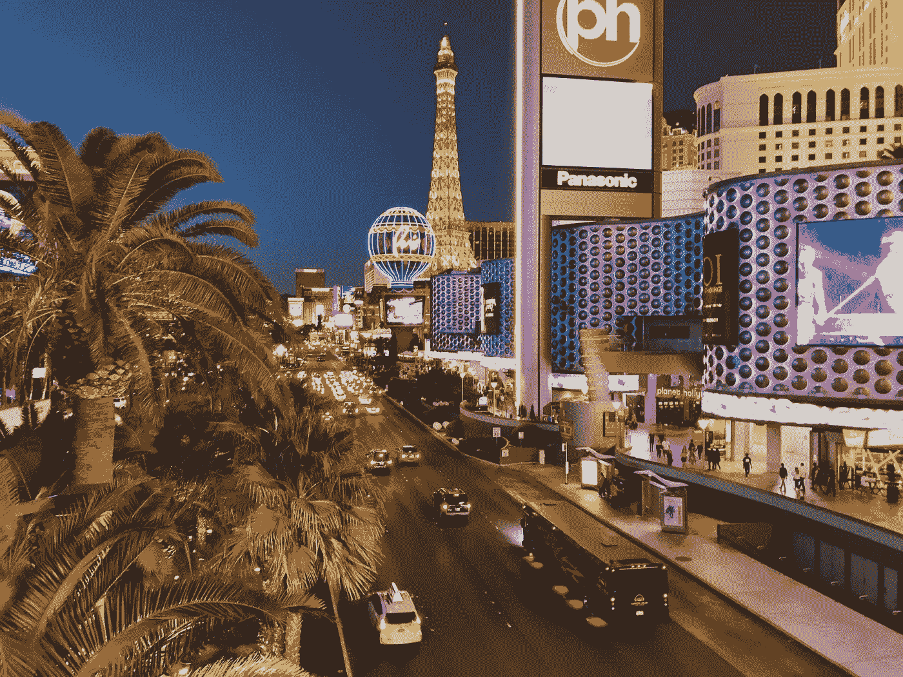
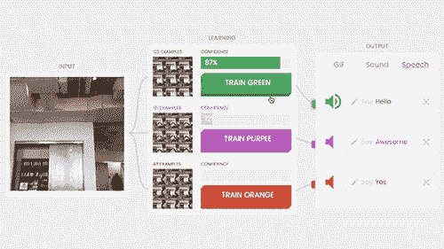
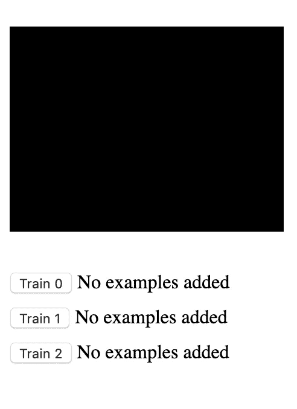
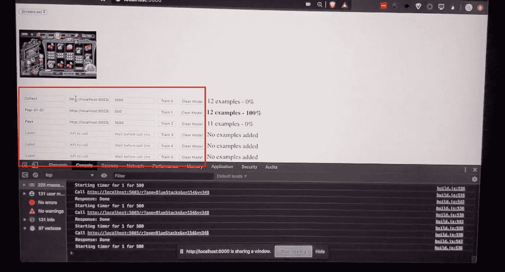
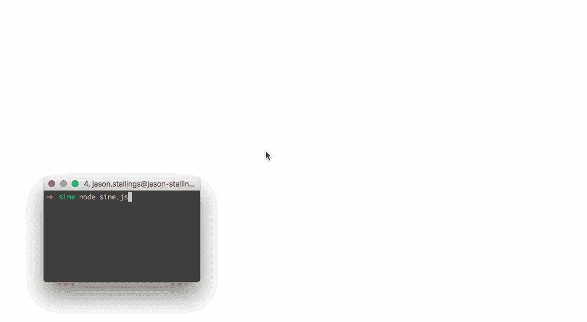
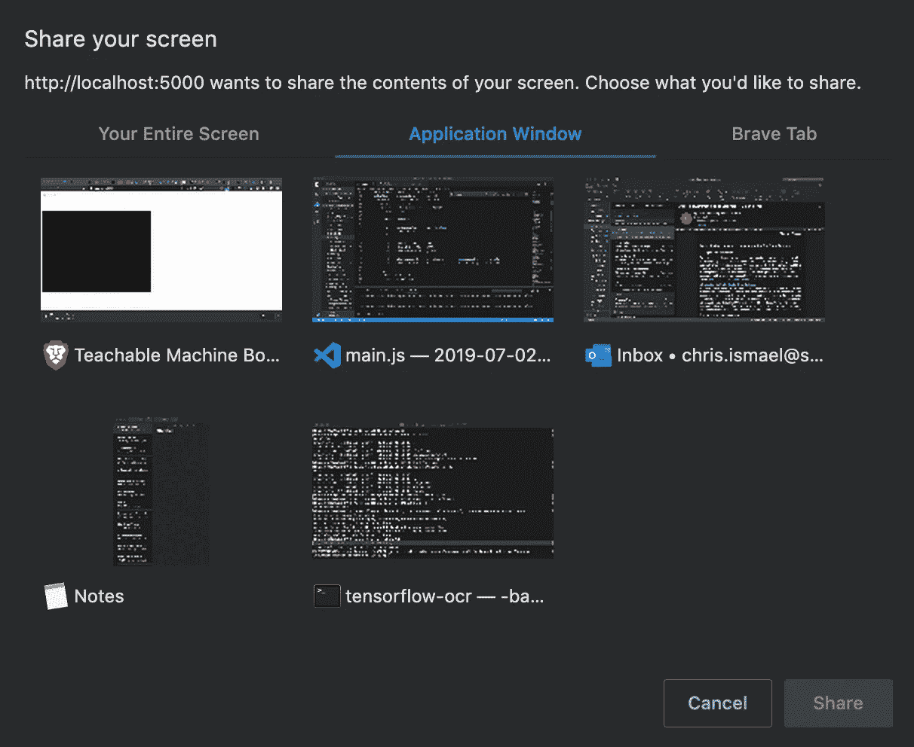

# 使用图像分类实现移动应用的自动化，以获得乐趣和利润

> 原文：<https://medium.datadriveninvestor.com/automating-mobile-apps-using-image-classification-for-fun-and-profit-39a62bde32ee?source=collection_archive---------10----------------------->

在维加斯免费住酒店的前景促使我自动化一些随机的手机游戏

Photo by [Nicola Tolin](https://unsplash.com/@nicolatolin?utm_source=unsplash&utm_medium=referral&utm_content=creditCopyText) on [Unsplash](https://unsplash.com/search/photos/las-vegas?utm_source=unsplash&utm_medium=referral&utm_content=creditCopyText)

去年七月，我们会见了一位家庭朋友，观看他们的儿子在拉斯维加斯参加空手道比赛。在我们的一次晚餐中，我得知他们免费住在 Aria 酒店，当时酒店客人很多，房价接近 400 多美元/晚！多亏了一款奖励你“硬币”的手机游戏，他们可以免费入住，这些硬币可以兑换成真正的酒店住宿。

不用说，我很好奇，问这个游戏是关于什么的。在不涉及太多细节的情况下，它涉及到**弹出一个气球，这个气球偶尔随机地从屏幕底部**爬到顶部，然后消失。我试了一晚上这个游戏，估计大约需要 6 个月(对我来说)才能赚到在 Aria 过夜所需的游戏币。我对这种事情太懒了，所以另一件事让我好奇— ***我能自动化这个游戏，让它自己玩并弹出气球吗？***

 [## DDI 编辑推荐:5 本让你从新手变成专家的机器学习书籍|数据驱动…

### 机器学习行业的蓬勃发展重新引起了人们对人工智能的兴趣

www.datadriveninvestor.com](https://www.datadriveninvestor.com/2019/03/03/editors-pick-5-machine-learning-books/) 

## *本帖的重点是机器学习的话题，而不是如何作弊的手游。*

Photo by [Hubert Mousseigne](https://unsplash.com/@northern_hubert?utm_source=unsplash&utm_medium=referral&utm_content=creditCopyText) on [Unsplash](https://unsplash.com/search/photos/warning?utm_source=unsplash&utm_medium=referral&utm_content=creditCopyText)

在这篇文章中，我将分享更少的代码，更多地谈论我用来实现 ML 驱动的气球弹出的技术。更重要的是，这只是我用一些东西做实验，然后把它们都扔进锅里，看看会发生什么。我绝不是一个有成就的学者——远非如此:P

说完这些，我们开始吧:)

首先，这里有一个我正在谈论的手机游戏的简短视频。(只有 12 秒，请随意观看)

The purple balloon on the left was popped automatically by machine learning hands.

游戏的身份是微不足道的。对于这个游戏和许多其他游戏来说，重要的一点是…

1.  **在一个特定的游戏屏幕上有一个动作要做，还有**
2.  如果游戏进入其他屏幕，你需要回到这个游戏屏幕。

这里的挑战是 ***多个屏幕会妨碍我们点击气球*** 。如果只是一个屏幕，我们就不需要识别屏幕，我们可以盲目地点击气球的路径。那有什么好玩的:)

我将下面的部分分成三个部分:

*   **图像分类部分**
*   **点击部分**
*   **看着手机屏幕**

—

## 图像分类部分

我已经玩过相当多的[谷歌的可教机器样板](https://github.com/googlecreativelab/teachable-machine-boilerplate)，这是他们流行的应用展示的准系统代码模板，演示了通过使用网络摄像头进行机器学习。

From [https://experiments.withgoogle.com/teachable-machine](https://experiments.withgoogle.com/teachable-machine)

上面的 gif 演示了 Teachable Machine 应用程序，它使用网络摄像头(左)来训练机器学习模型识别某些图像“状态”(中)，并调用相应的操作(右)。

样板应用程序看起来像这样…

See the boilerplate app in action here — [https://googlecreativelab.github.io/teachable-machine-boilerplate/](https://googlecreativelab.github.io/teachable-machine-boilerplate/)

它被剥光是有原因的——为了让你扩展到你喜欢的程度。

要在一组特定的图像上训练模型，您可以按住“训练”按钮，就好像您正在从网络摄像头拍摄几张快照一样。如果你已经捕捉了足够多不同的图像集，你应该能够将一组图像与另一组图像区分开来，如上面的 gif 图所示。**我强烈建议你尝试上面标题中的链接来了解这个过程。**

现在回到我们上面的视频…

你会注意到视频中的应用看起来有点像样板应用，只是多了一些东西…

上面的红框显示我们添加了额外的行和字段来保存 API 端点的值，以调用特定的游戏屏幕。我们稍后会谈到这一点。上面这张截图的总结是这样的:

***如果“网络摄像头”显示游戏画面 A，调用端点 Z.***

显然，在这一切之前，每一行都需要针对特定的游戏画面进行训练。过程类似-等待游戏屏幕显示，然后按下/按住特定行的训练按钮。冲洗并重复其他游戏屏幕(奖金阶段，应用程序内窗口等)。

下面是这些状态的顺序示例。每个代表 web 应用程序中的一行。

*开始→吃角子老虎机屏幕开始→气球从底部漂浮并在顶部消失→奖励回合屏幕出现→应用内购买屏幕出现→奖励回合结束并要求用户按下按钮返回吃角子老虎机屏幕→返回*

当一行被激活(“100%”)时，web 应用程序调用相应文本字段中指示的 API 端点。

—

## 点击部分——机器人

要点击屏幕上特定点的东西(后退按钮、确定按钮、气球等)，我们使用 [robotjs](http://robotjs.io/) 。Robotjs 是一个强大的 node.js 桌面自动化库。这是一种以编程方式模拟鼠标和键盘移动/点击的方式。

Ghost mouse! Gif from [https://github.com/octalmage/robotjs](https://github.com/octalmage/robotjs)

上面鼠标移动的代码看起来是这样的…

在我们的应用程序中，我们只需通过服务器代码公开相同的鼠标/键盘控制功能，然后等待类似这样的 API 调用..

**https://localhost:5003/r？x = 500&y = 200**

**x** 和 **y** 是点击屏幕的坐标。这些将是气球上升到屏幕上的路径坐标，确认收集奖励硬币的 OK 按钮，消除(烦人的)应用程序内购买提醒等。

接收服务器代码片段如下所示…

**当一行被“激活”时，它会用相应的 X 和 Y 鼠标坐标调用这个服务器代码。**幸运的是，我们正在自动化的游戏非常简单，一次只需点击鼠标即可控制。web 应用程序每行只能进行一次 API 调用。我不得不手动计算出屏幕元素的坐标，这样我就可以点击正确的位置。

一种更优雅的方法是在屏幕元素上进行对象检测，这样我们就不必手动输入屏幕坐标。(这个大概是为了以后另一个帖子)。

—

## 看着手机屏幕

你可能已经注意到了，我们没有使用一个指向手机的摄像头来训练游戏状态/屏幕的模型。(尽管这可能行得通)。在这种情况下，我们使用两种东西:

1.  [**Bluestacks**](https://www.bluestacks.com/) —一款适用于 Windows 和 Mac 的 Android 模拟器。在桌面上呈现可点击的移动界面可能还有其他方法，但这是我首先发现的一种。如果我们可以使用其他模拟或非模拟方法，请告诉我。
2.  [**navigator . media devices . getdisplaymedia**](https://developer.mozilla.org/en-US/docs/Web/API/MediaDevices/getDisplayMedia)—这是一个浏览器 API，让我们连接到桌面屏幕，而不是网络摄像头(getUserMedia)。这个界面很酷的一点是，它可以让你选择整个屏幕或特定的应用程序。以下是选择对话框窗口的外观:

选择和屏幕共享特定应用程序的额外好处是，我们可以在整个会话过程中保持 X 和 Y 坐标一致。

总之，我已经描述了我用来自动化移动应用程序的上述技术，由图像分类提供支持。我们把它们分成不同的部分:**图像分类、鼠标/键盘自动化和移动屏幕**。

虽然这似乎对这个特定的场景很好，但很可能对大多数情况都不适用。例如，用这种方法自动化一个侧滚的 2D 平台游戏是荒谬的。对于这些类型的场景，强化学习似乎是正确的方法。另一个警告是，静态屏幕几乎彼此相似。对屏幕之间如此细微的差异进行分类可能会变得很难。

话虽如此，我确实在部分导航办公室远程呈现机器人、识别咖啡壶声音和一系列其他奇怪的实验中尝试了这一点。令人惊讶的是，它们起作用了:有一天，我可能会写下这些。