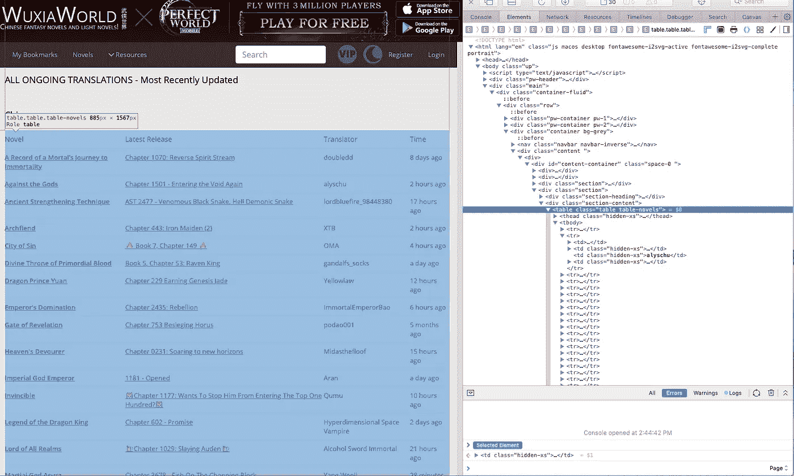
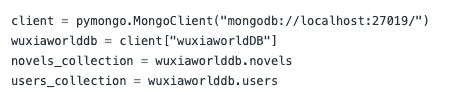
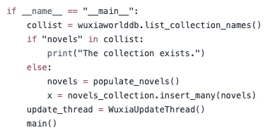
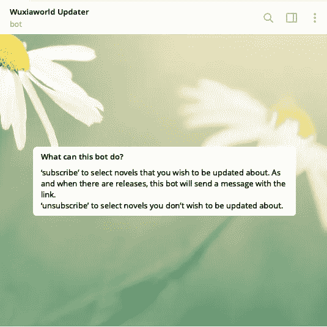
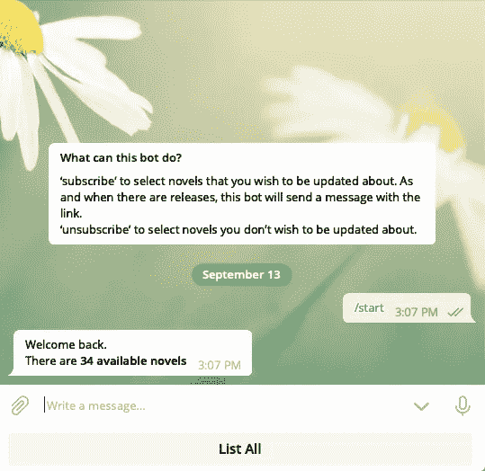
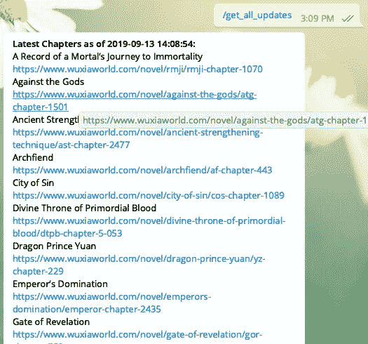

# 使用 Python 自动化重复任务！

> 原文：<https://medium.datadriveninvestor.com/automating-repetitive-tasks-with-python-18252d95f961?source=collection_archive---------1----------------------->

Image taken from [Unsplash](https://unsplash.com/photos/l4cSSdNrqak)

# 动机

我是中国小说的狂热读者， [**《武侠世界》**](https://www.wuxiaworld.com) 是我最喜欢狂读的网站。然而，一旦我找到了我最喜欢的小说，我就会反复检查更新，尤其是那些我每天都在看的小说。

所以，我想与其每天查看它，不如我写一个简单的脚本，在小说更新时更新我！

# 技术栈

既然我已经决定创建这样的软件，是时候想想我到底需要什么来完成它了。

*   MongoDB 存储更新的用户和小说列表
*   PyMongo 与 MongoDB 一起工作
*   BeautifulSoup 收集新的更新
*   将数据反馈给用户的电报

我选择了 MongoDB，因为它很容易设置，而且创建额外的字段是必要的。BeautifulSoup 是一个非常流行的框架，用于从 HTML 和 XML 文件中提取数据。最后，我有使用 telegram 机器人的经验，所以我使用 Telegram 来通知用户小说是否有更新。

## 从 HTML 生成数据

这个工作的关键部分是从网页中获取数据，在这个例子中，它将是武侠世界的最新更新页面，[https://www.wuxiaworld.com/updates](https://www.wuxiaworld.com/updates)

All the updates are within class “table table-novels”

Method to return all the novels and their updates

请查看 BeautifulSoup 文档，了解如何使用该库。我们在`populate_novels()`方法中所做的是:

*   请求整个 HTML
*   从“表格表格小说”类中以数组形式列出所有小说
*   对于每个**小说**，检索**名称**、**章节、**和 **url**
*   将小说信息追加到数组**小说**
*   返回数组

一旦我返回了包含所有信息的小说列表，我就将它存储在 MongoDB 中。

Define the collections and connect to mongodb

Main Method of the script

当集合不存在时(这意味着小说之前没有被填充，因此脚本第一次运行)，我将小说插入到一个**小说 _ 集合**。这就是我使用 MongoDB 的原因，它太简单了！

现在我已经有了初始收集，让我们看看如何将更新的小说填充到数据库中。

这个类运行在一个单独的线程上，并且每 60 秒持续触发`populate_novels()`来检查更新。对于找到的每本小说，它将检查**网址**是否相同，如果它们**不同**，它将**用最新信息更新**数据库。

现在我们唯一要做的就是通过电报机器人把这些信息呈现给用户。我不会详细介绍如何设置，请参考电报官方[页](https://core.telegram.org/bots)。

这显示了我如何设置电报机器人来做我想做的事情(显示在下面的一系列照片中)。请随意利用这一点，并相应地改变行为。

Beginning

Start to store the user in the database (and show number of novels)

List all novels available in the database

Subscribe to new novels (to receive message via telegram bot)

View profile summary

Get all latest available chapters

# 结论

只需几行代码，我们就能自动完成琐碎的任务，这样我们就可以专注于其他重要的事情。这可以应用于你经常查看的任何网页，比如你的住房申请，甚至是查看最新的快讯等。

如果你有任何问题，请在评论中告诉我。和往常一样，完整的源代码可以在下面找到:

 [## Bilguun132/wuxiaworld_updater

### 此时您不能执行该操作。您已使用另一个标签页或窗口登录。您已在另一个选项卡中注销，或者…

github.com](https://github.com/Bilguun132/wuxiaworld_updater)