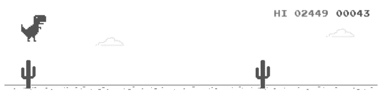
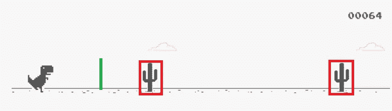
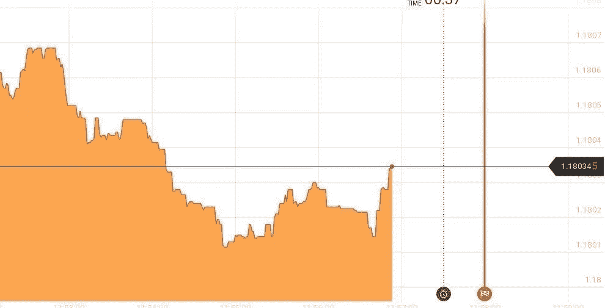

# 使用 Python 实现工作自动化

> 原文：<https://medium.datadriveninvestor.com/automating-your-job-with-python-f1952b6b640d?source=collection_archive---------0----------------------->

## 简单编码指南

## …并用它做一些其他很酷的事情

本文围绕 PyAutoGUI 的简单自动化展开。这是一个 Python 模块，用于以编程方式控制鼠标和键盘。期望有一点编程(或一般的 Python 数据结构)的先验知识，但这不是完全必要的。


Illustration from [Pixabay](https://pixabay.com/illustrations/analytics-information-innovation-3088958/)

本文分为以下几个部分:

1.  一个简短的介绍解释了我为什么对这个话题感兴趣；
2.  PyAutoGUI 安装和设置；
3.  关于 PyAutoGUI 鼠标和键盘功能的教程；
4.  自动化的编码例子。

如果你想跳过“无聊”的部分，请进入“*将一切付诸实践*”部分。

# 介绍

在我过去的经历中，我做过很多次数据输入的工作。大多数数据输入工作可分为以下几类:

1.  从表格(Excel、Google Sheets)中获取数据，并将其插入其他地方(网页或其他表格)。
2.  浏览网页(电子商店)或杂志，收集数据和文件(纯文本和图像)并将它们复制到数据库中。

我的收入不是固定的时薪，而是基于业绩:更多的作品，更高的薪水。每次我的性能在开始时值 4-6€/小时，但在 15-20€/小时的水平达到峰值，因为我变得更快了，并优化了我的工作以提高效率。

[](https://www.datadriveninvestor.com/2019/02/21/best-coding-languages-to-learn-in-2019/) [## 2019 年最值得学习的编码语言|数据驱动的投资者

### 在我读大学的那几年，我跳过了很多次夜游去学习 Java，希望有一天它能帮助我在…

www.datadriveninvestor.com](https://www.datadriveninvestor.com/2019/02/21/best-coding-languages-to-learn-in-2019/) 

我到底是怎么做到的并不重要。一个更重要的问题是:我能做得更快吗？这就是为什么我开始研究 Python 中的自动化模块，并认为答案是——“是的，我可以！”

# 穿上我的编码装备

如前所述，本文纯粹关注 Python 中的 PyAutoGUI 模块。你可以在这里 阅读文档和它的手册 [**。模块本身可以在命令提示符下非常简单地下载:**](https://pyautogui.readthedocs.io/en/latest/)

```
pip install pyautogui
```

要在脚本中使用它，您必须导入它:

```
import pyautogui as pag
```

这个“as pag”只是用来在下面的代码中键入较少的字符:pag.click()比 pyautogui.click()短得多，对吗？

现在，我们应该准备做一些整洁的事情。

# 控制您的键盘

*注:以下指令基于 PyAutoGUI* [*文档*](https://pyautogui.readthedocs.io/en/latest/mouse.html) *。下一节将介绍其中提供的一些示例，这样您在阅读更多相关内容时会感觉更舒服。在本文中，键盘功能被彻底检查，鼠标功能有一个简短的概述，其他功能在编码示例中解释。*

控制键盘最重要的命令是打字机()。举个例子，

```
pag.typewrite("Hello world!")
```

就像你写“你好，世界！”但不按任何键。酷！

要在按下每个键之间添加一小段延迟，您可以执行以下操作:

```
pag.typewrite('Hello world!', interval=0.25)
```

以四分之一秒的间隔书写每个字符。

*注:* *您只能用此功能输入信息。不能按 enter 键或使用 shift inside typewrite()函数。*

# 键盘按键列表

这里有一个键盘键的列表，你可以传递给 press()、keyUp()、keyDown()或 hotkey()函数。别担心，我们稍后会谈到这些函数。

```
['**\t**', '**\n**', '**\r**', ' ', '!', '"', '#', '$', '%', '&', "'", '(',
')', '*', '+', ',', '-', '.', '/', '0', '1', '2', '3', '4', '5', '6', '7', '8', '9', ':', ';', '<', '=', '>', '?', '@', '[', '**\\**', ']', '^', '_', '`', 'a', 'b', 'c', 'd', 'e','f', 'g', 'h', 'i', 'j', 'k', 'l', 'm', 'n', 'o', 'p', 'q', 'r', 's', 't', 'u', 'v', 'w', 'x', 'y', 'z', '{', '|', '}', '~', 'accept', 'add', 'alt', 'altleft', 'altright', 'apps', 'backspace', 'browserback', 'browserfavorites', 'browserforward', 'browserhome', 'browserrefresh', 'browsersearch', 'browserstop', 'capslock', 'clear', 'convert', 'ctrl', 'ctrlleft', 'ctrlright', 'decimal', 'del', 'delete', 'divide', 'down', 'end', 'enter', 'esc', 'escape', 'execute', 'f1', 'f10', 'f11', 'f12', 'f13', 'f14', 'f15', 'f16', 'f17', 'f18', 'f19', 'f2', 'f20', 'f21', 'f22', 'f23', 'f24', 'f3', 'f4', 'f5', 'f6', 'f7', 'f8', 'f9', 'final', 'fn', 'hanguel', 'hangul', 'hanja', 'help', 'home', 'insert', 'junja', 'kana', 'kanji', 'launchapp1', 'launchapp2', 'launchmail', 'launchmediaselect', 'left', 'modechange', 'multiply', 'nexttrack', 'nonconvert', 'num0', 'num1', 'num2', 'num3', 'num4', 'num5', 'num6', 'num7', 'num8', 'num9', 'numlock', 'pagedown', 'pageup', 'pause', 'pgdn', 'pgup', 'playpause', 'prevtrack', 'print', 'printscreen', 'prntscrn', 'prtsc', 'prtscr', 'return', 'right', 'scrolllock', 'select', 'separator', 'shift', 'shiftleft', 'shiftright', 'sleep', 'space', 'stop', 'subtract', 'tab', 'up', 'volumedown', 'volumemute', 'volumeup', 'win', 'winleft', 'winright', 'yen', 'command', 'option', 'optionleft', 'optionright']
```

函数 keyDown()和 keyUp()分别模拟按键的按下和释放。例如

```
pag.keyDown("enter")
pag.keyUp("enter")
```

按下并释放回车键。小心，不要落下钥匙。:)

函数 press()结合了前两者。您传递给该功能的键被按下并释放:

```
pag.press("enter")
```

前面的两个代码片段产生相同的输出！

要按多个键，可以将参数作为列表传递:

```
pag.press(['enter', 'tab', 'enter'])
```

最后一个键盘功能是热键()。它使得使用键盘快捷键更加方便。只需传递给它一些键，这些键将按顺序按下，然后按相反的顺序释放。例如:

```
pag.hotkey('ctrl', 'alt', 'delete')
```

相当于以下代码:

```
pag.keyDown('ctrl')
pag.keyDown('alt')
pag.keyDown('delete')
pag.keyUp('delete')
pag.keyUp('alt')
pag.keyUp('ctrl')
```

# 控制你的鼠标

屏幕上的位置由 X 和 Y 笛卡尔坐标表示。X 坐标在左侧从 0 开始，向右增加，Y 坐标在顶部从 0 开始，向下增加。

```
0,0       X increases -->
+---------------------------+
|                           | Y increases
|                           |     |
|   1920 x 1080 screen      |     |
|                           |     V
|                           |
|                           |
+---------------------------+ 1919, 1079
```

要了解您的屏幕大小，请使用大小功能:

```
pag.size()
```

它应该返回一个元组，例如(1920x1080)，为您提供屏幕分辨率。

以下是其他鼠标功能的列表:

```
pag.moveTo(600, 600)   *# moves mouse to X of 600, Y of 600* pag.moveTo(100, 200, 2)   *# moves mouse to X of 100, Y of 200 over 2 seconds*pag.move(0, 50)       *# move the mouse down 50 pixels relative to its previous location*pag.dragTo(100, 200, button='left')     *# drag mouse to X of 100, Y of 200 while holding down left mouse button*pag.dragTo(300, 400, 2, button='left')  *# drag mouse to X of 300, Y of 400 over 2 seconds while holding down left mouse button*pag.click()    #clicks the mouse
pag.click(x=100, y=200)  *# move to 100, 200, then click the left mouse button.*pag.click(button='right')  *# right-click the mouse* pag.doubleClick()  *# perform a left-button double click* pag.click(clicks=2)  *# double-click the left mouse button*
pag.click(clicks=2, interval=0.25)  *# double-click the left mouse button, but with a quarter second pause in between clicks*pag.scroll(10)   *# scroll up 10 "clicks"* pag.scroll(-10)   *# scroll down 10 "clicks"*pag.hscroll(10)   *# scroll right 10 "clicks"*
pag.hscroll(-10)   *# scroll left 10 "clicks"*
```

如果您有兴趣了解更多关于文档的信息，请点击 [**此处**](https://pyautogui.readthedocs.io/en/latest/mouse.html) 或 [**此处**](https://automatetheboringstuff.com/chapter18/) 。

# 将这一切付诸实践

每当你觉得你的工作相当重复时，就使用 PyAutoGUI。就我而言，我觉得在接受那些数据录入工作之前，我应该先了解它。

假设你是一家大公司的大老板，你想让你的 100 万名员工在一个流行的网站上拥有一个帐户。一种方法是手动操作。如果一个用户注册需要 30 秒，而你一周 7 天 24 小时都在做这项工作，那么这将比 347 天多花几个小时。很疯狂，对吧？相反，花一个小时编写代码，让计算机自己完成这项工作会更容易。你将赢得 8333 小时减去你开发代码的时间。我们开始吧。

您之前已经定义了他们所有电子邮件地址的列表:

```
emails = ["joe1@company.address", "linda2@company.address", "greg3@company.address", "hanna4@company.address", "oscar5@company.address", "helen6@company.address", ...]
```

让我们来构建代码。应该从导入开始，打开 *crazycoolwebsite* 平台(应该不行，我一般不推广这种垃圾信息)。

```
import pyautogui as pag
import webbrowserwebbrowser.open_new("crazycoolwebsite.com")
```

然后，您应该添加一些代码来浏览注册过程。假设它当前如下:

1.  Frontpage ->单击“开始”
2.  弹出窗口->点击“用电子邮件注册”
3.  电子邮件输入窗口->键入您的电子邮件并按回车键
4.  搞定了。关闭窗口，用户应该会得到关于其电子邮件地址的进一步说明。

代码应该是这样的:

```
import pyautogui as pag
import webbrowseremails = ["joe1@company.address", "linda2@company.address", "greg3@company.address", "hanna4@company.address", "oscar5@company.address", "helen6@company.address", ...]for email in emails:
    webbrowser.open_new("crazycoolwebsite.com")
    pag.click(x=xcoord1, y=ycoord1)    #Get started 
    pag.click(x=xcoord2, y=ycoord2)    #Sign up with email
    pag.typewrite(email)               #Type your email
    pag.press("enter")
    pag.hotkey('ctrl', 'w')            #closes current tab
```

就是这样！如果你知道点击的准确坐标( *xcoord1* 、 *ycoord1* 、 *xcoord2* 和 *ycoord2* )，那么这应该就可以了。请尊重这些知识，请不要把它作为垃圾邮件的手段。

注意:无论你做什么，自动化时都必须考虑时间因素。你永远无法预测，打开一个文件需要多长时间，或者网页加载需要多长时间。总是找到安全的间隔来“暂停代码”或实现确定页面是否已加载的函数(让 PyAutoGUI 检查一定数量的像素是白色(页面仍在加载)还是其他颜色(页面已加载！)).

关于一般的数据输入工作:这些工作中的大部分并不像上面描述的例子那样简单，从 A 获取数据并将其插入 B 的整个过程基本上是一样的。只有数据结构和资源不同。

# 运用一些想象力

这个模块也可以以许多其他方式使用。例如，有一些电脑游戏的精确度很重要。你认为你可以比你的脚本更准确地拖动鼠标或按下空格键吗？

## 恐怖迷宫游戏


Scary maze game

我想大概是 2010 年，我的一个朋友给我介绍了“恐怖迷宫游戏”。目标是通过蓝色路径移动光标。如果你触摸黑色像素，你回到起点。不吓人！

在我看来，最难的部分是走廊太窄的结尾部分。如果您可以创建一个 python 脚本来自己完成迷宫会怎么样？

## 谷歌恐龙游戏

再比如:你见过这个人吗？



Google Dinosaur game

他可能是所有 Chrome 用户中最不受欢迎的朋友，因为他只在没有互联网的时候访问。其他人可以在这里玩游戏[](http://www.trex-game.skipser.com/)**。目标只是躲避接近恐龙的障碍物。**

**您可以连续截取游戏屏幕的截图，并分析以下内容:**

*   **障碍物移动的速度有多快？**
*   **障碍有多高？**
*   **现在是白天还是晚上？*注意:像素在黑色和白色之间交替***
*   **目前显示了多少障碍物？**
*   **障碍物应该在哪里触发跳跃/闪避命令？**

****

**在此图像中，障碍物被分类在红色矩形内。如果红盒子碰到了绿线，恐龙应该跳起来。这需要更多的数学知识，但目前这并不重要。如果你有想要分享的工作代码，请在评论中随意链接，并添加你使用它所获得的最高分。你看我手动做的高分是 2449。**

## **推迟文本**

**你是否有过这样的情况:凌晨 3 点写完信/信息，却不知道是立即发出还是等到早上发出，以回避“你为什么不像正常人一样晚上睡觉”的问题？这里有一个解决方案:**

```
import pyautogui as pag
import timetime.sleep(21600)     #this is equivalent to six hours
pag.press("enter")
```

**这个脚本帮助您将发送消息的时间推迟 6 个小时(您可以随意更改延迟时间)。**

## **图表阅读器**

**几年前，我和我的朋友发现了一个有着惊人投资机会的网站。**

****

**A price chart for EUR/USD somewhere in 2017**

**你所要做的就是决定，当前时刻和红线之间的价格是上升还是下降。你打赌，如果你的观点是正确的，你会得到你的赌注+ 90%回来。所以我们认为我们需要一个统计正确率超过 56%的算法。我们希望我们能做出一个至少 70-80%正确预测的算法，我们将在巨大的金钱海洋中畅游。也许我们不是唯一喜欢这种“交易”方法的人，它很快被简单的外汇、股票、密码等所取代。交易。**

**在做交易算法的时候，我发现没有办法访问相同的价格数据。因此，我创建了一个函数来读取带有截图的图表。想法很简单:我用一个简单的 for 循环遍历 x 轴。如果指定了 x 坐标，我沿着 y 轴用另一个进行循环迭代，直到像素颜色是白色而不是橙色。该方法返回图中数据点的相对高度列表。相应的代码是:**

```
def get_price_data(screen):
    price_data = np.array([])
    for x in range(var.xstart, var.xend):
        for y in range(var.ystart, var.yend):
            pixel_color = screen.getpixel((x, y))
            if pixel_color == (43, 171, 63):
                price_data = np.append(price_data, -y)
                return price_data
            elif pixel_color == (255, 167, 77):
                price_data = np.append(price_data, -y)
                break
```

# **结论**

**PyAutoGUI 是一个神奇的自动化工具，有了创造性的思维，没有 python 脚本不能复制的动作。欢迎在评论中分享你的想法和代码。**