# 全程自动化-面向 IT 服务管理的机器学习

> 原文：<https://medium.datadriveninvestor.com/automation-all-the-way-machine-learning-for-it-service-management-9de99882a33?source=collection_archive---------0----------------------->

卡斯滕·莫宁、瓦尔德马尔·席勒、安德烈亚斯·沃迪施卡和安德烈亚斯·索德伦德

在[之前的博客文章](https://medium.com/@technoidsblog/machine-learning-cant-see-the-forest-for-the-trees-here-is-a-way-aab0071a8fcc)中，我们给了看似自由的机器学习(ML)算法世界一些结构。现在，我们将仔细看看一个适当的，已经很好建立的 ML 用例，IT 服务管理(ITSM)，包括一个典型的 ML 实现。

ITSM 致力于高效解决 IT 问题，并努力将业务中断降至最低。IT 服务团队面临着来自业务组织的持续压力，要求他们以更快的速度和更低的成本改善服务。智能数据和数据科学、云计算和移动计算等领域的技术进步不断加快，自带设备等 IT 消费化趋势也是快速发展的额外挑战:必须以更大的灵活性提供和维护更加多样化和个性化的技术设置。

此外,“智能事物”的数量不断增加，导致自动事件管理触发的事件激增，很明显，it 服务组织需要依靠最新的技术进步来保持领先地位。事实上，分析公司 Gartner 建议采取攻势，投资机器学习、大数据和其他智能机器技术，使当前和未来的 IT 服务台运营更加主动。Gartner 预测，到 2019 年，利用机器学习增强技术和人工智能的 IT 服务台不仅可以管理一切，还可以为更高价值的任务释放高达 30%的支持能力(Fletcher and Lord，2016)。在 IT 服务票证处理过程中，会产生大量与流程相关的数据，这使得使用这些数据进行 ITSM 优化的想法变得颇具吸引力，该想法使用 ITSM 自动化的现代 ML 算法。

事件和服务请求管理等关键 ITSM 服务的特点是标准化流程，从客户驱动的票证生成开始，然后由专业的 IT 服务台和支持团队进行手动票证分类和优先级排序、调度和解决(图 1)。

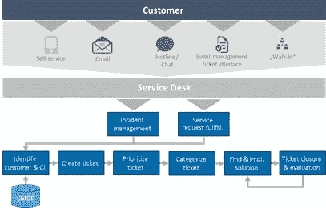

Figure 1\. Incident management and service request fulfillment process flows

分类对于此处理流程的质量尤为重要:错误的手动票证分类会妨碍票证分派给正确的支持团队，从而妨碍问题解决流程的及时启动。这通常会导致重复的票证重新分配尝试，并最终违反处理服务级别协议，将业务运营置于风险之中。

造成这些流程故障的手动步骤在本质上是部分确定的。也就是说，IT 人员关心的是将主要基于文本的故障单症状描述映射到预先确定的优先级和给定的支持主题类别，例如用户和访问管理、网络或工作场所管理。

此外，底层票据系统生成并存储大量的优先化和主题分类数据，即训练和测试数据。换句话说，这些票据处理步骤适合基于 ML 的自动化，其目标是人工干预，从而降低分类错误率并提高整体流程效率。相比之下，这是一个非常简单的 ML 商业案例。

我们的案例研究将 ML 算法应用于现实世界的票证数据，以实现自动票证分类原型，这为实现自动化、支持 ML 的处理管道的最终目标打开了大门，该管道从票证生成到票证分派和支持团队分配，全天候运行。最大限度地减少了手动票证分类和分派工作，IT 问讯台资源可以分配给价值更高的任务，并且可以减少流程故障的数量。这样，ITSM 优化的面向未来、可持续、低成本、及时和高质量票证解决方案的目标就可以更加现实地实现。*我们渴望激励读者接受这个相对简单的、商业案例驱动的 ML 场景，并开始考虑他们自己的 ITMS 自动化场景。*

由于图 1 所示流程的部分确定性，许多基于 ML 的流程自动化思想已在文献中提出(Di Lucca、Di Penta 和 Gradara，2002 年)(Diao、Jamjoom 和 Loewenstern，2009 年)(Diao、Jan、Li、Rosu 和 Sailer，2016 年)(Lin、Raghu、Ramamurthy、Yu、Radhakrishnan 和 Fernandez，2014 年)(Roy、Muni、Yan、Budhiraja 和 Ceiler，2016 年)，并且越来越多地被采用

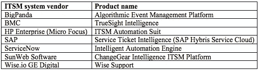

Table 1\. Product offerings by leading ITSM system vendors featuring ML capabilities. Infrastructure and operations software vendors are also moving into this domain with ML-powered products such as Splunk’s „IT Service Intelligence“ or Moogsoft’s „AIOps“ solution

基于 ML 的过程自动化思想尤其包括:

1.  自动票证优先化
2.  自动票据分类
3.  自动票证解决方案

优化备选方案 1 和 2 可以以具有两个或更多输出类别的监督 ML 分类问题的形式建模。选择 3 可以被视为一个无监督的最大似然聚类问题，分配一个新的标签到一个已知解决方案的集群。

我们的案例研究集中于基于 ML 的票类别的自动提议的原型，即备选项 2。备选方案 1 在结构上是相同的，但通常提供的即时商业价值较少。对于某些类型的问题或服务请求，备选方案 3 可作为全自动处理流程中的最后一步。

场景 2 实施的训练和测试数据集是从国际多站点 ITSM 生产系统中检索的。在欧洲 75 个地点的大约 300 名 IT 服务员工在该平台上运营，该平台处理大约 20，000 张各种类型的月票。

**使用案例和培训数据** 我们分别使用 6，500 和 12，000 个历史事件和服务请求数据集，这些数据集是从涵盖 2016 年六个月运营期的生产系统中检索的，用于培训和评估二进制和更通用的多类别票证分类使用案例:

1.  将传入票证自动分类为与密码请求相关的票证。
2.  将收到的票证自动分类为七个主题类别之一。

使用第三方分析平台实施和评估用例。下面进一步提供了指向其简单的、平台无关的实现的指针。

这两个训练和测试数据集的基本结构是相同的，并且由以下数据字段组成:

*   整数票证 ID，
*   40 个字符的德语和英语症状描述
*   主题类别文本字段。

“主题类别”文本字段提供顶级票证分类信息，包括以下七个类别之一:

1.  用户和设备管理(U&D)
2.  交流与沟通(E&C)
3.  位置、网络和服务器(L&S)
4.  客户应用程序(CA)
5.  项目、咨询和安全服务(P&S)
6.  行政和内部服务(A&I)和
7.  其他/清算(海外)

用例 1 数据集 Data2Class 由 6，500 条数据记录和两个(附加)带标签的类组成，即密码重置(PR)和其他，其中 PR 代表积极的密码重置请求案例，其他代表非密码请求票证。

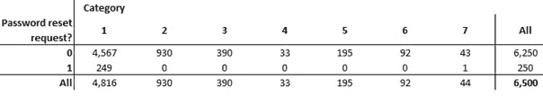

Table 2\. Binary contingency table of password reset indicator and ticket categories 1–7

不出所料，密码重置指示器和票证类别级别 1–7 的二进制列联表(表 2)显示，能够“稳健地”将传入票证分类为密码重置相关或不相关的 ML 算法(二进制分类问题)几乎等同于解决更具挑战性的多分类问题，即将传入票证分类为属于七个票证类别之一。(作为 Anaconda Python 发行版的一部分，使用 Pandas 和 Matplotlib 库计算列联表、描述性统计数据和直方图可视化。)因此，我们将自己限制在以用例 1 的形式处理更简单的二进制分类问题。

用例 2 数据集 Data7Class 由 12，000 条数据记录和 7 个(附加的)标记类组成，对应于上面列出的 7 个票据类别。

正如现实生活中 ITSM 数据的典型情况一样，图 2 和表 3 中分别显示的 Data2Class 和 Data7Class 的分布强烈偏向于七个票证类别中的前三个。(需要记住的是，由于下文中用于模型评分和选择目的的准确度、精确度和 F1 评估指标考虑了所有类别的值，因此它们的值对偏斜的测试数据分布很敏感。)

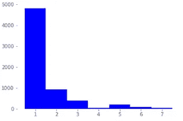

Figure 2\. Histogram of subject matter categories 1–7 in use case 1 data set, Data2Class

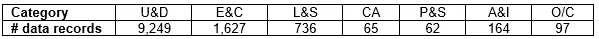

Table 3\. Distribution of use case 2 data set, Data7Class

**机器学习处理流水线**
这两种场景的 ML 处理流水线涉及文本分析相关数据准备的几个步骤，之后是考虑中的各种分类器算法的训练以及它们的评分和模型选择。

***数据准备***
应用于两个数据集的数据准备步骤包括针对双语症状描述的标记化、停用词及其词干的移除。使用“术语频率-逆文档频率(Tf-Idf)”对数据记录进行矢量化，这是一种用于测量术语在文本结构中的相对重要性的标准方法(Roy，Muni，Yan，Budhiraja and Ceiler，2016)。

***建模*** 在后续用例 1 和用例 2 建模阶段训练的分类算法包括线性(LinSVM)和径向基函数 SVM (RbfSVM)、k-最近邻(k-nn)和朴素贝叶斯(NB)。特别是，NB 已用于一般的文本分类和垃圾短信检测，这是一个类似于 Data2Class 分类问题的研究领域(Delany，2012)。正如 Di Lucca、Di Penta 和 Gradara (2002)所报告的，我们不考虑神经网络，因为它们对于这类结构良好的问题的性能相对较差。

***模型评分和选择*** 我们的模型评分和选择基于标准评估指标准确度、精确度和 F1 得分，定义如下:

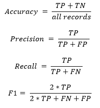

其中:

*   **TP** 代表真正分类数。也就是说，具有实际标签 A 的记录已被正确分类或“预测”为标签 A。
*   TN 是真否定分类的数量。也就是说，实际标签不等于 A 的记录已被正确分类为不属于标签 A。
*   **FP** 是误报分类的数量，即实际标签不是 A 的记录被错误地分类为属于类别 A。
*   **FN** 是假阴性的数量，即标签等于 A 的记录被错误地归类为不属于类别 A。

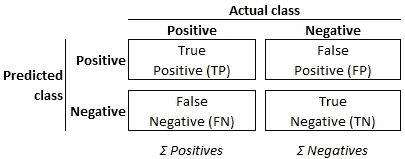

Figure 3\. “Confusion matrix” of predicted vs. actual categorizations

预测和实际分类的组合被称为“混淆矩阵”，如图 3 所示。在这些定义的背景下，各种评估指标提供了以下见解:

*   **准确性**:正确的模型预测总数的比例。
*   **精度**(也称为正面预测值):正确预测相对于该特定类别所有预测的比例。
*   **(也叫真阳性率，TPR，命中率或敏感度):真阳性相对于所有实际阳性的比例。**
*   ****假阳性率**(也叫误报率):假阳性相对于所有实际阴性的比例(FPR)。**
*   ****F1** :(更稳健的)精度和召回率的调和平均值。**

**除了这些评估指标，我们还考虑了用例 1 模型的“接收机操作特性”(ROC)图。ROC 图是通过绘制二元分类器的召回率(即真阳性率(y 轴))与其假阳性率(x 轴),生成的分类器结果的二维表示，如图 4 所示。ROC 图直观地显示了分类器在收益(真阳性)和成本(假阳性)之间的相对权衡，并且与评估指标不同，它对偏斜的数据分布不敏感。**

**ROC 图的(0，1)点代表完美的分类器预测，而点(0，0)对应于根本不进行任何肯定分类的分类器，点(1，1)相当于无条件地仅进行肯定预测的分类器。这些点之间的直线，即线 TPR = FPR，由随机预测类别的策略产生。由于可以预期任何分类器比这种随机预测策略执行得更好，所以由分类器产生的(FPR，TPR)-对应该位于随机策略线之上。更具体地说，分类器点离点(0，1)越近越好。**

**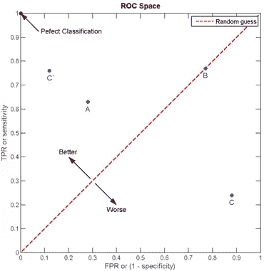**

**Figure 4\. Example of a “Receiver Operating Characteristic” graph for the evaluation of discrete (or discretised scoring) classifiers. Source: [https://en.wikipedia.org/wiki/Receiver_operating_characteristic](https://en.wikipedia.org/wiki/Receiver_operating_characteristic)**

**诸如 k-nn、线性和径向基函数 SVM 的离散分类器的性能产生单个类别标签作为预测，可以在 ROC 空间中被示为单个(FPR，TPR)对。朴素贝叶斯等分类器的性能可通过 ROC 曲线进一步说明，这些分类器生成的数值表示相对于给定类别成员资格阈值的类别成员资格“概率”:通过将阈值从 0.0 变为 1.0，这些“分级”或“评分”分类器生成的 ROC(图形)对在 ROC 空间中形成一条曲线，如图 5 所示。这进而允许分析该曲线下的面积(AUC ),以生成用于比较分类器评估的标量度量。**

**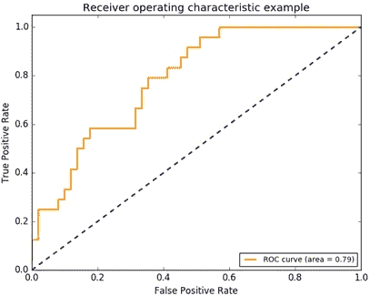**

**Figure 5\. Example of a ROC curve for the evaluation of converted discrete or “scoring” classifiers. Source: [http://scikit-learn.org/stable/auto_examples/model_selection/plot_roc.html](http://scikit-learn.org/stable/auto_examples/model_selection/plot_roc.html)**

**离散分类器的 ROC 曲线生成需要将其结果转换为数值。例如，参见 Fawcett (2006 年)作为参考。我们的讨论仅限于对四个分类器的 ROC 图的比较评估。**

**在多次数据准备、特征选择和模型训练迭代之后，用例 1 的模型训练获得的最佳得分和混淆矩阵分别如图 6(示例)和表 4 所示。**

**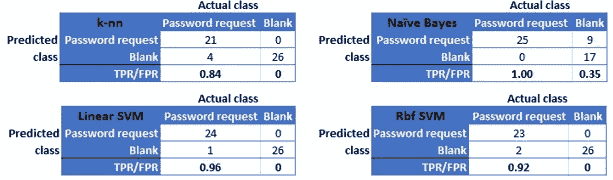**

**Figure 6\. Use case 1 confusion matrices and corresponding TPR, FPR values for a cross-validation subset example consisting of 25 (password reset request) positives and 26 negatives**

**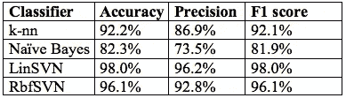**

**Table 4\. Model scoring in terms of accuracy, precision and F1 scores for use case 1**

**根据表 4 中的评估分数和图 7 中的比较 ROC 评估，线性 SVM 分类器建议最佳成本效益比，因此是用例 1 模型的选择。这与一般文本分类和垃圾短信检测领域的其他工作一致(Almeida，2011) (Delany，2012) (Joachims，1998)。远高于 95%的相对较高的模型分数与由人工操作员产生的典型票据分类错误率相比具有优势。**

**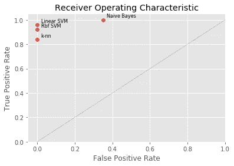**

**Figure 7\. ROC graph corresponding to the confusion matrix examples in Figure 6, with linear SVM indicating a superior hit rate-false alarm ratio**

**基于 Data7Class 的更一般和要求更高的用例 2 的建模结果如表 5 所示。**

**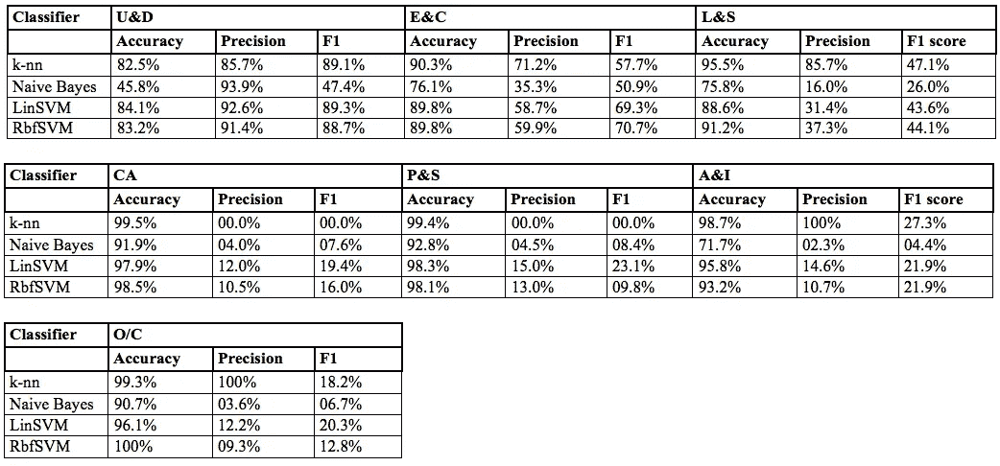**

**Table 5\. Model scoring in terms of accuracy, precision and F1 scores for use case 2**

**不出所料，这个更加精细的用例的模型分数不太容易解释:模型准确性始终很高。这不是因为模型性能非常好，而是因为定义准确性的方式:由于训练数据分布严重倾斜，只有相对较少的 Data7Class 记录可分别用于标签 CA、P&S、A&I 和 O/C。因此，即使分类器对新数据的预测能力不太可能是稳健的，并且在这些情况下不应该部署分类器，但是总是预测这些代表性不足的类不会出现也会导致高水平的准确性。**

**当进一步仔细查看精度值时，我们会得到一个指示，表明有多少记录被正确分类为该标签，有多少记录被错误分类为另一个标签:k-nn(针对不同 k 值的 k-nn 模型的训练导致 k = 5 个邻居为两种用例场景产生最佳结果)和线性 SVM 分类器根据此度量表现最佳。尽管注意到标签 A&I 和 O/C 的 k-nn 结果比这两个类别的其他分类器产生的结果好得多。同时，k-nn 为 CA 和 P&S 标签产生 0%的分数。这表明 k-nn 模型已经过度适应(偏斜的)训练数据，并且极有可能对新票据数据产生相当差的分类。在此背景下，更加平衡和稳健的 F1 得分值(也在图 8 中示出)揭示了用例 2 的线性 SVM 模型的整体优势。**

**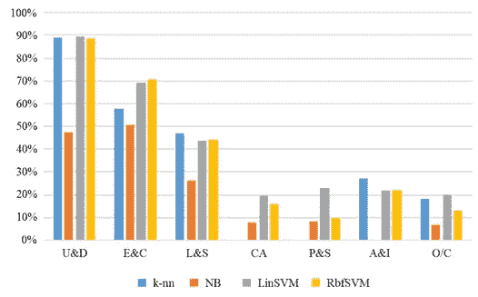**

**Figure 8\. Visualization of F1 scores for use case 2**

**因此，线性 SVM 再次代表了我们选择的模型。总体而言，Data7Class 的结果不如用例 1 的结果令人印象深刻，但与 Galke、Mai、Schelten、Brunsch 和 Scherp (2017 年)提出的关于科学论文标题分类的类似问题的其他近期结果相当。线性 SVM 分类器对最频繁出现的机票类别 U&D、E&C 和 L&S 表现良好，总体解释了所有标签的大约 80%。鉴于典型的现实生活中的数据缺点，人类操作员必须处理同样多，这代表了一个竞争的结果。**

**总之，基于 SVM 的线性模型适合两种用例场景的生产部署。在第一步中，这可以是以自动向在票据分类步骤中工作的服务台工作人员建议前三个最可能的类别的形式，从而显著降低错误分类的风险并加速整个票据分派过程。**

**在这种情况下，您需要克服的最大挑战与数据获取和准备阶段有关。票证数据本质上是高度结构化的，只有一个明显的例外:症状描述。他们的文本分析作为数据准备阶段的一部分，可以说是最具挑战性的处理步骤。为了使此步骤产生有用的模型特征，我们建议:**

*   **尽可能合理地从 ITSM 源系统中检索与票据相关的电子邮件通信和抄本，以丰富您的症状描述培训数据；**
*   **不要把自己局限于一元或二元模型，还要在特征生成过程中考虑单词三元模型。请注意，我们生成的结果仅包含 40 个字符长的症状描述，因此该方法有些“健壮”，但只能受益于额外的输入数据。**

**当从 ITSM 生产系统中收集这些数据时，您还可能会面对针对特定票证分类设置的倾斜的、分布不均匀的训练数据。某些票证类别(如用户管理)比其他类别(如客户应用程序或管理)出现得更频繁。要解决这个问题，您可能需要:**

*   **让 ITSM 用户手动创建更多数据。这通常很麻烦，而机器人过程或测试数据自动化的最新进展可能有助于在一定程度上自动化这一过程；**
*   **实施从 ITSM 生产系统到 ML 培训平台的反馈循环，以便在新的票证数据可用时，使用新的票证数据在初始阶段持续改进模型。**

**最后，为了避免在不断重新训练您的生产模型时过度适应时间的问题，需要考虑模型部署的生命周期管理。这可以是向训练数据添加显著性分数的形式，该显著性分数随着数据年龄的增加而降低。或者，旧数据可以被不断地从考虑中去除，以支持反馈到模型训练平台中的最新数据。**

**我们的讨论清楚地表明了一件事:支持 ML 的 ITSM 自动化是一个相当强大的命题。虽然我们使用了一个分析平台来实现模型，但我们首选的线性 SVM 算法足够简单，可以在 Amazon ML、Google Cloud ML、Microsoft Azure ML 等平台上或在您的内部 ML 环境中使用 sci-kit learn 等库来合理直接地构建原型。**

**可能的模型部署场景包括将 ITSM 生产系统与前面提到的任何平台上经过训练的模型的 RESTful web 服务相集成。或者，根据所考虑的 ITSM 系统的能力，训练模型可以直接在 ITSM 系统中静态实现。**

**这种模型的部署可以代表迈向完全自动化、面向未来的端到端票务处理管道的第一步，特别是当考虑在流程开始时将这些解决方案与 chatbot 前端集成以自动收集票务数据，并在流程结束时与支持 ML 的自动票务解决方案功能集成时。通过这种方式，不仅可以获得真正可扩展的 24/7 ITSM 解决方案，能够处理即将到来的票据量，还可以腾出 IT 资源用于更有价值和回报的活动，如问题解决和请求履行。**

**当您出于这一目的而选择打包解决方案时，请查看我们针对这一仍相当年轻的产品领域的领先供应商的提示，以便帮助您选择最适合您特定场景的产品。**

****参考文献** 阿尔梅达，t . a .【2011】。对垃圾短信过滤研究的贡献:新的收集和结果。美国加州山景城第 11 届 ACM 文件工程研讨会，第 259-262 页**

**Delany，S. J. [2012 年]。“垃圾短信过滤:方法和数据”，应用专家系统，第 39 卷，第 10 期，第 9899–9908 页**

**Di Lucca，G. A. D .，M. D. Di Penta 和 S. Gradara [2002 年]。“软件维护请求的分类方法”，程序。IEEE ICSM，第 93–102 页**

**刁，y .，H. Jamjoom 和 d . Loewenstern【2009】。“IT 服务管理中基于规则的问题分类”，Proc。IEEE 云，第 221–228 页**

**刁，y，E. Jan，Y. Li，D. Rosu 和 a . Sailer【2016】。“IT 服务管理的服务分析”，IBM 研究与开发杂志，第 60 卷，第 2–3 期，第 13:1–13:17 页**

**茨韦塔纳·福塞特[2006 年]。“ROC 分析介绍”，模式识别快报，第 27 卷，第 8 期，第 861-874 页**

**弗莱彻，c .和洛德，K. [2016]。“在 IT 服务台应用机器学习和大数据以支持数字化工作场所”，Gartner Inc .，美国康涅狄格州斯坦福**

**Galke，l .，F. Mai，A. Schelten，D. Brunsch 和 a . Scherp【2017】。“科学论文和新闻文章多标签分类的标题与全文比较”，eprint arXiv:1705.05311，提交于 2017 年 5 月**

**t .约阿希姆(1998 年)。“使用支持向量机的文本分类:使用许多相关特征进行学习”，Proc。第十届欧洲会议。《论机器学习》，施普林格出版社，伦敦，英国，第 137-142 页**

**Lin，d .，R. Raghu，V. Ramamurthy，J. Yu，R. Radhakrishnan 和 j . Fernandez【2014】。“揭示大规模企业 IT 中用于警报和事件管理的事件群”，Proc。第 20 届美国计算机学会国际。糖膏剂知识发现和数据挖掘，纽约，美国，第 1630-1639 页**

**Roy，s .，D. P. Muni，J.-J. Y. T. Yan，N. Budhiraja 和 f . ce iler【2016】。“IT 维护单的分类和标记”，载于:Q. Sheng、E. Stroulia、S. Tata 和 S. Bhiri(编辑。)，“面向服务的计算。ICSOC 2016”，计算机科学讲义，第 9936 卷，施普林格，第 829–845 页**