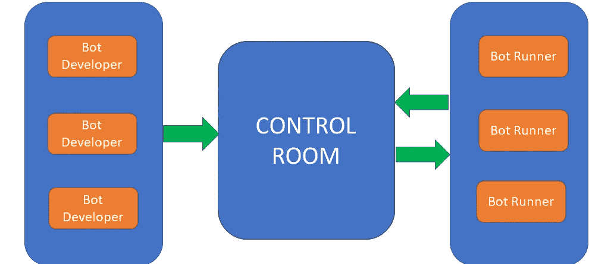

# 自动化无处不在&虚拟劳动力

> 原文：<https://medium.datadriveninvestor.com/automation-anywhere-the-virtual-workforce-d3dd91bfdd8?source=collection_archive---------3----------------------->

需要大量时间来完成的日常业务流程阻碍了员工专注于需要思考和创造力的任务。如今，机器人流程自动化(RPA)工具通过并行自动化大量业务操作，正在对业务环境产生巨大影响。

Automation Anywhere (AA)是世界上最大的 RPA 提供商之一。它提供了用户友好但功能强大的 RPA 功能，允许组织创建和部署各种类型的机器人，以立即自动化其任务。PWC、KPMG 和 IBM 等全球领先的科技公司正在利用这一工具来扩展其业务流程并最大限度地降低运营成本。

# RPA 体系结构

Automation Anywhere 架构由三部分组成。控制室、机器人创造者和机器人运行者。下面是该架构的可视化表示。

# 控制室

任何地方的自动化大脑。控制室允许您集中管理和部署机器人到机器人运行者。它提供了监视 RPA 基础架构各种组件的选项。

控制室组件如下:

> 仪表板
> 
> 活动
> 
> 蝇蛆病
> 
> 设备
> 
> 工作量
> 
> 审计日志
> 
> 管理

**组件 1:仪表盘**

控制面板包含子组件，这些子组件使用视觉效果和图表提供整个 RPA 基础架构的鸟瞰图，有助于做出业务决策。

*   主页仪表板:可以定制显示关键数据的定制部件。它显示活跃用户的总数，机器人的状态，队列和机器人的速度。
*   机器人仪表板:它提供对机器人的操作分析，如失败原因、机器人状态以及正在进行、暂停或停止的机器人的百分比。
*   设备仪表板:该仪表板侧重于环境的硬件方面。它显示有关 CPU 和硬件利用率的信息。
*   审计仪表板:它提供了控制室和客户正在执行的活动的快照。
*   工作负载仪表板:它提供关于队列、工作项目和设备池状态的信息。
*   Insights Dashboard:它帮助自动化专家分析数据并提供业务见解。

**第二部分:活动**

它提供了有关网络上正在发生的自动化的详细信息。它允许您监视已部署、已调度或正在运行的任务。

*   进行中:它提供了当前正在执行的所有活动的详细信息和状态。默认情况下，您可以查看由您触发或安排的所有活动。如果您拥有*查看我正在进行的活动的权限*，您可以管理和监控其他用户触发或安排的所有正在进行的活动。
*   已安排:显示已安排在以后进行的活动者列表。

## 组件 3:机器人

“机器人”选项卡显示从 AAE 客户端上传的所有机器人及其详细信息，如机器人和客户端名称。它由两个子组件组成。我的机器人和凭证。

*   我的机器人:从 AAE 客户端上传的所有机器人，文件，报告的集中位置。你也可以在这里安排机器人跑步者上的机器人。
*   凭证:也称为*凭证库*，它是一个集中的位置，用于存储由用户创建的关于自动化任务的敏感信息。

## 组成部分 4:设备

从“设备”选项卡，您可以查看连接到控制室的已注册客户端设备及其状态，以及它们属于哪个设备池。此外，您也可以从该选项卡创建设备池。

## 构成部分 5:工作量

在一个 bot runner 上执行所有工作项目是不可行的，因此在多个 bot runner 上战略性地分配工作项目以提高效率以及工作负载组件发挥作用的地方是非常重要的。它用于将自动化任务划分为小的逻辑工作项，并将它们分布在多个 bot 运行程序中，以便同时执行和优化资源。

 [## 人工智能和监督资本主义|数据驱动的投资者

### 大科技，总是现在:人工智能推动的大科技，已经使购物，搜索，在你的…

www.datadriveninvestor.com](https://www.datadriveninvestor.com/2020/03/04/on-artificial-intelligence-and-surveillance-capitalism/) 

## 组件 6:审计日志

审计日志组件显示控制室和客户端应用程序中正在执行的所有活动的时间戳。此外，它使您能够将时间戳导出到 CSV 文件。

## 构成部分 7:行政

管理整个 RPA 平台的设置。它由五个子组件组成，分别是设置、用户、角色、被许可方和迁移。

*   设置:使您能够配置客户端应用程序设置、凭据、电子邮件通知和僵尸工具配置等设置。
*   用户:用于创建新用户并分配其角色。
*   角色:允许您创建新角色，并显示预定义角色的列表。
*   迁移:用于将旧控制室的信息迁移到新的控制室。
*   许可证:显示已使用和已购买的许可证列表。

# 机器人的类型

Automation Anywhere 平台中有三种类型的机器人可用。每种类型的 bot 都是为特定类型的业务应用程序量身定制的。

## 类型 1:任务机器人

构成了 automation anywhere 功能的基础。它执行重复的基于规则的流程，并处理结构化数据。易于实现和调试。

## 第二类:智能机器人

智能机器人可以让你的应用程序增加认知能力。他们能够从半结构化和非结构化数据中提取数据。此外，每一次人类验证，智商机器人都会学习并变得更聪明。

例如，它们可用于在相当短的时间内自动处理数百个包含非结构化数据的文档，如发票。

## 类型 3:元机器人

它可以被认为是可重用的逻辑块。它们主要用于界面操作，如登录系统。它们能够执行视觉捕捉，包括前端自动化重用的 GUI 组件。此外，它们可以用于图像识别任务以及 API 级别的自动化。

# **创建机器人的方法**

Automation anywhere 提供了两种创建机器人的方法，要么使用记录，要么使用任务编辑器。

1) **屏显记录仪:**这种记录仪是标准记录仪，也是最简单的一种。它捕捉所有的鼠标和键盘点击。运行 bot 时，请确保使用与记录任务时相同的屏幕分辨率和操作系统。

2) **智能记录器**:也叫对象记录器，是桌面应用的理想选择。它捕捉单选按钮、下拉菜单文本等内容，并可以登录数据。此外，它还可以捕获使用 java、HTML、WPF、flex 或 Silverlight 的应用程序中的对象。

3) **web recorder:** 用于基于 Web 的流程，要求您从网站提取数据或在 Web 上填写表格。

4) **任务编辑器:**最强大的方式。它包含数百个下拉选项和命令，不需要太多的编程。主要用于从零开始手动自动化一项任务。

# 结论

总之，这篇博文详细介绍了 Automation Anywhere 平台的基础知识，并且很明显它可以如何帮助组织扩展其业务流程并最大限度地降低运营成本。