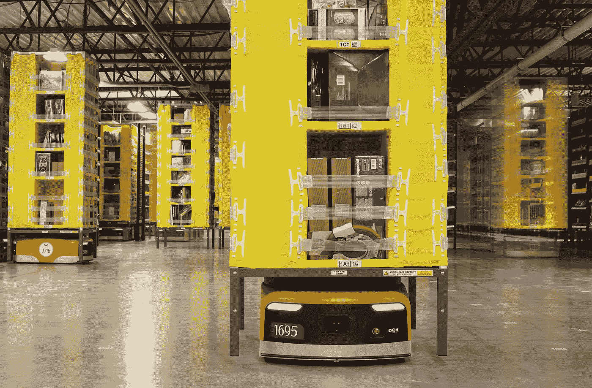

# 第四次工业革命中的自动化

> 原文：<https://medium.datadriveninvestor.com/automation-in-the-fourth-revolution-65c4e7b511fe?source=collection_archive---------12----------------------->

我们目前正处于第四次工业革命的风口浪尖。自从 18 世纪第一次工业革命以来，世界一直在迅速突破技术界限。例如，一个世纪后，第二次工业革命将电引入世界。在我们当前的数字时代，4IR 正在向我们展现，它的技术不仅在快速发展，而且呈指数增长。

这个词是由世界经济论坛(WEF)创始人克劳斯·施瓦布创造的，涵盖了自动化等多项技术进步。4IR 的这一部分将彻底改变我们的工作方式。

4IR 的一个方面是自动化应用的增加。亚马逊的员工已经配备了机器人，可以高效地完成曾经由人类完成的工作。在他们的工作站中，机器人搬运巨大的货物纸箱，并按照交付顺序排列它们。

2013 年，亚马逊有 1000 个机器人，三年后，这个数字上升到 45000 个，今天他们有大约 100000 个机器人。亚马逊使用机器人极大地提高了效率，然而公众关心的是机器人如何取代人类的工作。

Kiva robots moving inventory at an Amazon fulfillment center in Tracy, California. Reuters

自动化是为了取代重复性的日常工作而产生的。Johaness Moenius 博士声称，在未来十年，美国 50%的工作将实现自动化。这听起来像是一个世界性灾难的配方！人们失业，工会罢工和政治动荡。

尽管每一次变革都破坏了现有的工作体系，但 4IR 是不同的，因为与之前的变革相比，这些变革是巨大的。

技术不仅仅是改变特定的部门或行业；这影响了他们所有人。因此，自动化的引入将导致司机、接待员、外科医生和放射科医生等人员的工作被自动化机器人抢走。

另一方面，Howie Choset 认为，创新和技术将创造更多的就业机会，而不是摧毁它们。这背后的原因是来自过去的证明。十年前，web 开发人员这个职位是不存在的；今天，这是一份报酬丰厚的工作。同样，几年后它将不复存在。

随着创新和创造力的引领，新的工作将会出现。尽管自动化听起来是反乌托邦的，但数据输入、驾驶和机械任务等重复性和平凡的工作将由机器人完成，这一事实将使个人能够减少工作时间，增加实验和学习时间。

九到五个工作岗位将会减少，而数字技能和创造力将会蓬勃发展。在一个快速发展的世界中，个人必须灵活，拥有成长的心态，并发展广泛的技能。在同一个公司工作十年十五年，已经不适合未来几年即将到来的市场。

在一个知识被赋予、创造力和创新引领的世界里，谁知道接下来会发生什么。

4IR 在路上了。你准备好了吗？