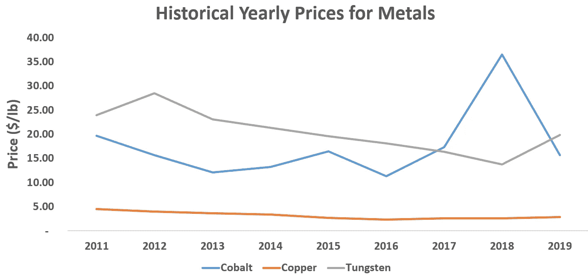
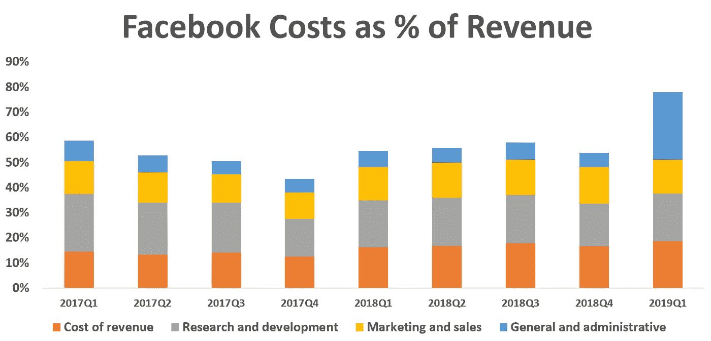
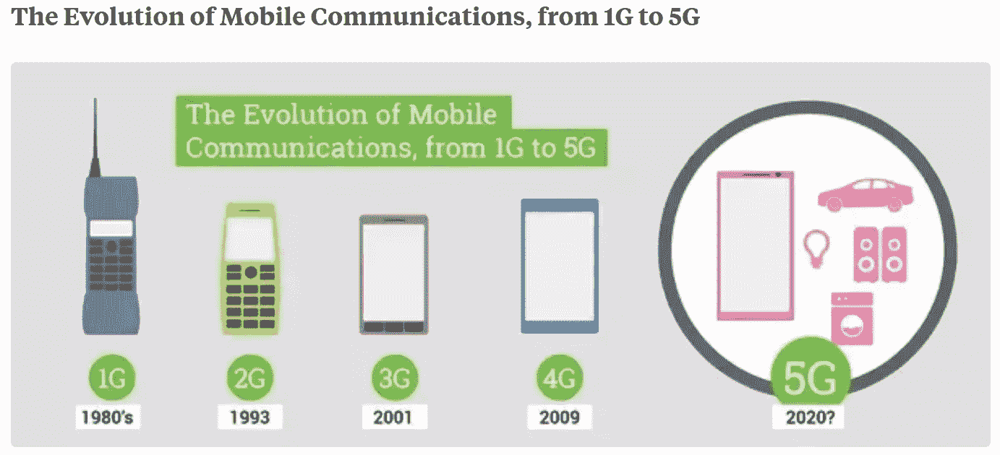
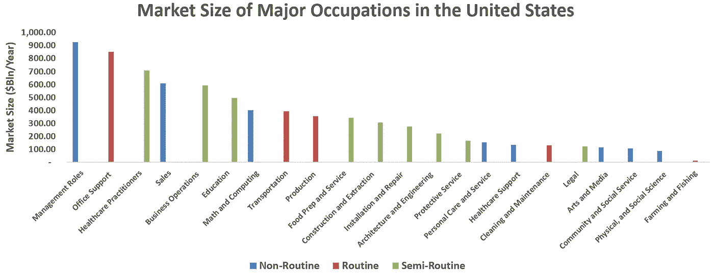

# 机器人越来越贵了

> 原文：<https://medium.datadriveninvestor.com/automation-is-getting-expensive-1a4656b1bd9a?source=collection_archive---------0----------------------->

注意:本文表达的观点仅是我个人的观点，并不代表我的雇主或任何其他人的观点。

随着机器人越来越多地做人类能够做的事情,“人工智能”、“机器学习”成了这些天的流行语。这不仅仅是像银行出纳员操作自动取款机或铲子操作拖拉机这样的日常工作，现在也进入了半日常工作。 [Spyce Kitchen 是一家拥有机器人厨房的餐厅](https://www.spyce.com/),[logic cull 是一款读取法律文件、标记并总结它们的软件](https://campaigns.logikcull.com/ediscovery-software-demo-request/?keyword=esi%20discovery&matchtype=e&gclid=CjwKCAjw5dnmBRACEiwAmMYGOeSWOtbDEIcVlkA3cGQWxAT7d3BWd1nJqkVd_CyW_MeDacPIXxsU5RoCHZoQAvD_BwE)，这样的例子不胜枚举。

按照这种速度，现在的预测是自动化将渗透到非常规领域，如十年前无法触及的管理领域。从表面上看，这一理论是正确的；自动化正以更快的速度增长，并渗透到我们经济的多个领域。另一方面，由于自动化的需求增长如此之快，自动化的成本也在飙升。它可能会变得如此昂贵，以至于自动化可能不值得。

 [## 不管准备好了没有，革命就在我们面前——数据驱动的投资者

### “对于技术如何影响我们的生活和重塑经济，我们必须形成全面的全球共识……

www.datadriveninvestor.com](https://www.datadriveninvestor.com/2019/02/12/ready-or-not-the-revolution-is-upon-us/) 

# **那么是什么让自动化变得如此昂贵呢？**

1.  **劳动力成本**——软件工程师的工资在过去几年里飙升[全国平均为 10.5 万美元](https://www.bls.gov/ooh/computer-and-information-technology/software-developers.htm)。[在谷歌、脸书等公司。这些人的薪水超过 15 万美元。机器学习的工资甚至更高，平均约为 11.5 万美元，在谷歌和脸书这样的公司，这些数字从 30 万美元开始，甚至可以高达 50 万美元，这取决于专业知识和多年的经验。劳动力是最大的成本之一，如果一家公司在机器学习工资上花费大量资金，成本效益分析就会变得更加可疑。以优步为例；优步最近上市了，而优步去年亏损高达 30 亿美元。](https://www.businessinsider.com/the-25-highest-paying-tech-companies-in-america-in-2017-2017-4)[这部分是因为他们在自动驾驶汽车上的积极投资，自 2016 年以来总计超过 10 亿美元，仅在 2018 年就有 50 万美元](https://www.wired.com/story/bet-uber-bet-self-driving/)。
2.  **材料成本** — AI 比普通的需要更多的计算能力。你正在筛选数十亿条记录，运行数千亿个数据集的组合。长期以来，我们一直认为摩尔定律是神圣不可侵犯的，计算能力总是会随着时间的推移呈指数增长。想想你的手机与 20 世纪 80 年代的 IBM 超级计算机相比有多大的计算能力。[根据英伟达首席执行官黄仁勋和其他许多人的说法，这一理论已经达到了极限。据 Applied Materials 称，这是由于用于连接晶体管的材料的限制，这些材料是钨和铜。](https://www.cnet.com/news/moores-law-is-dead-nvidias-ceo-jensen-huang-says-at-ces-2019/)[应用材料公司正在制造一套新的晶体管触点，使用钴作为导体。钴的吸引力在于它能够在更薄的阻挡层内填充更小的特征。](http://blog.appliedmaterials.com/enabling-ai-era-new-materials)简而言之，它可以向电路中添加更多的晶体管，从而提高性能。这是有意义的，也是跟上人工智能计算需求的必要步骤。然而，钴远比钨和铜昂贵。2018 年 3 月，钴的价格达到峰值，约为 40 美元/磅，而铜约为 3 美元/磅，钨约为 15 美元/磅。[由于刚果民主共和国(DRC)](https://www.reuters.com/article/us-cobalt-prices-electric/cobalts-price-crash-bottoming-out-stocks-to-hinder-quick-rally-idUSKCN1Q11EP) 的大量供应过剩，今天钴的价格已经急剧下跌到每磅 15 美元左右。为了应对高价格，刚果民主共和国从 2016 年到 2018 年将产量翻了两番，达到 25，000 吨/年。价格目前已经调整，但锂离子电池和晶体管等钴的潜在成本驱动因素意味着这些价格可能只会上涨。

***Source:*** [***Metalry***](https://www.metalary.com/cobalt-price/)***,*** [***Investing.com***](https://www.investing.com/commodities/cobalt-historical-data)***,*** [***MacroTrends.com***](https://www.macrotrends.net/1476/copper-prices-historical-chart-data)

3.**安全成本** —机器学习非常依赖于可以从中提取见解的数据。这些数据可以存储在本地，但通常存储在一个中心位置，云创建了物联网(IoT)。除了技术公司从云中提取数据时必须担心的额外计算能力，他们还必须担心网络安全。网络犯罪是世界上增长最快的犯罪类型，[根据 CSIS](https://www.mcafee.com/enterprise/en-us/assets/reports/restricted/rp-economic-impact-cybercrime.pdf?utm_source=Press&utm_campaign=bb9303ae70-EMAIL_CAMPAIGN_2018_02_21&utm_medium=email) 的数据，2018 年全球经济损失 6000 亿美元。网络安全[作为一个产业，已经从 2014 年的 700 亿美元增长到 2019 年的 1550 亿美元](https://cybersecurityventures.com/cybersecurity-market-report-q1-2015/)。最明显的例子是[摩根大通，在 2014 年](https://dealbook.nytimes.com/2014/10/02/jpmorgan-discovers-further-cyber-security-issues/)发生大规模数据泄露后，摩根大通的网络安全预算增加了一倍多，从 2014 年[的 2.5 亿美元](https://www.securitymagazine.com/articles/85854-jp-morgan-chase-sees-cyber-security-spending-doubling)增加到 2019 年[的 6 亿美元以上](https://www.cnbc.com/2019/04/04/jp-morgan-ceo-jamie-dimon-warns-cyber-attacks-biggest-threat-to-us.html)。[其他公司也存在类似趋势，特别是金融服务领域，2018 年网络安全支出增长了 70%。](https://www.marketwatch.com/press-release/cybersecurity-in-financial-services-market-is-booming-worldwide-ibm-accenture-airbus-2018-09-08) **所有这些都意味着数据，也就是机器学习引擎的油，正在以高价到来**。

4.**法规成本** — [最近在欧洲，他们通过了通用数据保护和法规，简称 GDPR。](https://eugdpr.org/the-process/how-did-we-get-here/)从本质上讲，这项法律赋予用户对其个人数据的控制权，允许他们决定是否可以使用自己的数据。[在加利福尼亚州，州长提出了一项“数据分割”计划，给予消费者使用其数据的费用。美国联邦政府最近通过了一项法案，赋予联邦通信委员会更大的权力去追踪和追查打电话给机器人的人。这些规则和建议只是冰山一角，还有更多的。](https://www.cnbc.com/2019/02/12/california-gov-newsom-calls-for-new-data-dividend-for-consumers.html)[这些新规定使得合规性方面的技术支出大幅上升，并且在未来几年只会增长更多](https://legal.thomsonreuters.com/en/insights/articles/cost-of-compliance-2018-report-your-biggest-challenges-revealed)。**为了应对这些法律挑战**，脸书的一般和行政预算从 2018 年第四季度的 [**到 2019 年第一季度翻了两番，达到 40 亿美元/年。**](https://investor.fb.com/financials/default.aspx)

5.**基础设施成本** —这与实现最终产品的总成本有关。以 5G 为例。5G 是全球新的军备竞赛，每个国家都试图成为第一个建立基础设施的国家。[据麦肯锡称，从现在到 2025 年](https://www.mckinsey.com/industries/telecommunications/our-insights/the-road-to-5g-the-inevitable-growth-of-infrastructure-cost)，网络相关资本支出预计将增长 60%;据《华尔街日报》称，威瑞森将在未来 7 年内花费 200 亿美元升级到 5G 。这有两个原因，首先是容量。根据麦肯锡的同一份报告，预计到 2020 年，美国将有一半的网站容量耗尽。像中国这样的其他国家预计将在 2025 年耗尽。无论他们是建设新网站还是升级现有网站，容量的耗尽都将是最大的驱动力。

第二个原因是对人工智能和机器学习的推动。人工智能需要更多的数据和互联网速度。目前的 4G 基础设施足以满足你的手机和热点，但对于一部可以打开你的汽车、电视、洗衣机等的手机来说还不够。

***Source:*** [***Carritech***](http://www.carritech.com/news/evolution-mobile-communication-1g-5g/)

# 这对自动化意味着什么？

所有这些都意味着，尽管自动化有好处，但成本也很高。**从一个非常基本的角度考虑自动化是非常重要的——机器人在经济上与人类竞争。**这意味着，如果一个人更贵，那么机器人就更便宜，反之亦然。在美国，劳动力非常昂贵，我们甚至从来没有想过机器人会比人更贵。[然而，在发展中国家，这种情况时有发生](https://economictimes.indiatimes.com/tech/hardware/cyborg-manufacturing-the-man-machine/articleshow/66930787.cms?from=mdr)。部分原因是，这些国家的工业技术没有显著提高，因为向这些工人支付低工资比雇用机器人更便宜。随着这些国家变得更加富裕，这种情况正在发生变化，这使得机器人的经济效益更具吸引力。

同样重要的是，不要认为机器人是在与一个人竞争，而是与一群人竞争。一个机器人不会比一个银行出纳员更便宜，但要产生同样的产出，它会比一组银行出纳员更便宜。

**人力成本** =(平均工资×工人数量)>自动化成本

自动化程度最高的行业是具有巨大自动化潜力的日常工作。[以快餐为例，有超过 500 万份快餐工作，平均年薪为 2.1 万美元](https://www.bls.gov/ooh/food-preparation-and-serving/food-and-beverage-serving-and-related-workers.htm)。这意味着这份工作的市场规模是

**市场规模**= 512.26 万工人*(21750 美元/工人*年)=**；1114 亿美元/年**

根据这种方法和来自[劳动统计局](https://www.bls.gov/bls/blswage.htm)的数据，最大的自动化行业是具有较大市场规模的常规和半常规行业。这些行业包括医疗保健、教育、交通等。这些行业要么是常规的，要么是半常规的，都挺贵的。另一个要考虑的因素是这个行业是否分散。 [**教育、建筑、法律等行业。非常分散，在自动化和整合方面都有巨大的提升**](https://www.business.com/articles/20-markets-ready-for-disruption/) 。这可能是为什么即使 Law 没有大的市场规模，它仍然有自动化的风险。

***Market Size of Industries by BLS. Routine, Semi-Routine, Non-Routine labels were subjective***

除了成本和常规，自动化还有一些障碍。有些行业需要人际互动。例如，办公室接待员可能是自动化的，但一些经理喜欢有人在前台问候人们。另一个障碍是许可。医疗保健和教育具有巨大的自动化潜力，但却是被大量许可的领域。**目前的法律不允许机器人在某些情况下做工作** [**但也许在未来，如果我们像对待人类一样对待机器人，它们就可以**](https://www.newscientist.com/article/mg23931892-400-robot-laws-why-we-need-a-code-of-conduct-for-ai-and-fast/) 。

关于这一点，有两点需要注意:

1.技能水平对此并不是重要因素。面临自动化风险的工作在某些情况下是低技能的，比如卡车司机，但却是中高技能的，比如法律和教育。理论上，技能水平也应该反映在薪水上。如果这些是高技能的工作，工资应该更高。

2.理论上，每项工作都可以成为常规。如果你是一名管理顾问，你的工作是非常规的，但如果你做这份工作超过 5 年，你就不会再感到惊讶了。对于常规和非常规都在一个时间框架内的大多数行业来说都是如此。外科医生的工作是非常规的，但 15 年后和他交谈，这是非常规的。有一些高度创造性的工作，如艺术、音乐、设计等。它们永远不会成为常规，但它们是例外。

总之。自动化有许多好处，并将继续以指数速度增长。鉴于自动化变得如此昂贵，问题是它将以什么样的速度增长，以及它将首先渗透到哪些行业。