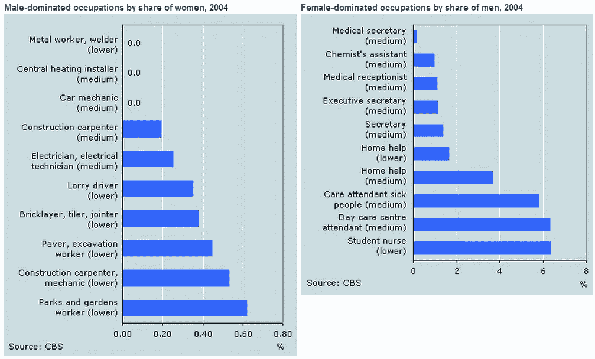

# 自动化让我们更人性化，而不是更不人性化

> 原文：<https://medium.datadriveninvestor.com/automation-makes-us-more-human-not-less-dad3c2827a86?source=collection_archive---------5----------------------->

## “我是一名战士，这样我的儿子可能是一名商人，这样他的儿子可能是一名诗人。”

*――约翰·昆西·亚当斯*

关于我的一个有趣的小事实是，我有机器人编程的证书。另一个重要的事实是，我可能几年内都不会用到它。在获得认证并被认为准备好进入俄亥俄州制造业的新时代后，我的第一份工作是一名包装乳液机器的机械师。看不到瓦力和夏娃。有趣的是，当我面试这份工作并问他们是否会有机器人时，他们说可能不会，因为瓶子太独特，更换太频繁，不容易自动化(他们没有；这些管子有三种尺寸，形状都一样，而且机器本身经常很容易被换成新的尺寸。我敢肯定，工厂的老板对他们以每小时 14 美元(公平地说，周末是这个价格的两倍)的工资雇佣的众多员工感到非常自豪，他们认为这些人在其他任何地方都找不到工作。刚下船的移民，精通几种语言，通常受过正规教育，在乳液瓶子上贴标签。八个月的孕妇每天健康站立八小时(以保持血液为婴儿流动)。他们甚至考虑得很周到，没有在安全培训上浪费时间，因为这只有在工作中才能真正学到*反正*。这家工厂出于对人民利益的远见卓识，满怀善意地站在那里。因此，考虑到所有这些，我知道一开始提出需要改进似乎有点好斗，但我不得不抱怨的一件事是，我实际上花了很少时间做这件事，因为这个地方太混乱了。但你大概能猜到原因。

我意识到他们没有雇用机器人，因为他们可以获得人，并像对待机器人一样对待他们。听着，我知道这是我应该谈论我们担心会抢走我们工作的许多其他发明的部分，但是很有可能，你已经知道它们了。因为你每天都在使用它们。我只想说，如果你想摆脱手机，让电话接线员重新工作，请便，请便，考验一下我的傲慢吧。

 [## 如何使用自动化从您的数据中获得更多价值？数据驱动的投资者

### 去年的新闻故事不停地谈论机器学习变得多么先进。电脑现在…

www.datadriveninvestor.com](https://www.datadriveninvestor.com/2020/02/27/how-to-use-automation-to-get-more-out-of-your-data/) 

事实是，人类不是很有效率，也不一致，而且完全对他们不利。机器人没有艺术感、直觉力或创造力，这完全对他们不利。甚至 YouTube 上弹出的各种视频介绍“这个故事是由机器人写的”这一艺术媒介，仍然是人类的喜剧性足智多谋。所以考虑到这一点，我想让你说一句流行的话“自动化将取代人类”。说几次，让它渗透到你合理的前额叶皮层(我确定)，你渴望兴奋的杏仁核，你敏锐而好奇的枕叶，想象一个世界，在那里人们戴着我们用来制造他们的钛制成的链条。

我想看到他们也把这种讽刺编程到机器人身上，让我的自命不凡自动化。那么，为什么我们一直在谈论机器人取代人类，而我们已经经历了几百次(我们写的)这种歌舞表演了？因为埃隆·马斯克说过这次会不同。**肯定会有工作中断。因为将要发生的是机器人将能够做得比我们更好。……我指的是我们所有人”。根据我的经验，我完全同意。我非常同意，我认为我们应该选择一个更好的埃隆·马斯克，更多的“人类被低估了，让我们给他们工作吧”，而不是“你只需要更[厚脸皮](https://www.theverge.com/2018/11/30/18119832/tesla-elon-musk-discrimination-harassment-racism)”。**

*与此相关，我认为放慢自动化的一个原因是，人们仍然可以与大量媒体联系起来，谈论有多少工作*很难做*。人类超越日复一日的体力劳动，去实现更伟大的意义，这是一件令人着迷的事情。嗯，首先我们需要让人们从事这些工作，这样他们就可以抱怨 it *有多糟糕*并实现超越等等。*

*仍然相关的(我保证)，这里有一些更有趣的琐事:这里有一份大多数人实际上可以理解的政府文件(至少那些想理解的人)！:[这表明每个部门都有许多空缺职位](https://www.bls.gov/news.release/jolts.t01.htm)。你会在这个展览中注意到，空缺职位最多的行业恰好是 LinkedIn 肥皂拳击手预言将被自动化摧毁的行业。女士们，先生们，以及中间的每一个人，我们都在为那些一开始就没人填补的工作岗位被抢走而焦虑不安。*

*但是，如果我不继续学习一段时间，我就不能很好地完成我的哲学辅修课。我承认(即使作为一个充满幻想的千禧一代)提到的一个常见例子让我担心，当他们取代卡车司机时，我们会做什么。让我们假设完全自动化发生在未来十年(实际的估计到处都是，所以我用了更可怕的估计)，不管怎样，忽略许多没有被填补的职位。我担心会发生的是，卡车走后，美国会找借口逃跑。*

*嘿，还记得我之前提到的机器人认证吗？花了三个星期才得到的。*

*这里有一件事:*

**

*好了，现在我已经吓跑了那些“你会谈论工资差距”的人，现在我们可以进行一次真正的对话了。我们在女性方面已经取得了很大的进步，到目前为止，你不能告诉一个单身母亲她正在从一个努力工作的家庭男人那里夺走一份工作。但实际上，如果你仍然能听到许多以自己不是女权主义者而自豪的女性抱怨说，她们如何加倍努力才能获得一半的尊重**或**在育儿和/或教学领域，仅仅因为她们的存在就获得一半的尊重，那么我们在哪里？我们达成一个解决方案是我们的现状。我们需要更多的项目，比如我的机器人培训，但希望不是九个男人对一个女人(别担心，这将是有机生长和非转基因多样性！)就像我的一样。*

*最终，我们将不得不更加认真地对待培训和再培训。职业需要再次合法化，以使害怕的收银员成为自豪的蓝领职业者。然而，那些为自己在不稳定的昂贵大学里趾高气扬而自豪的人，请收起你的假笑。其中一部分不仅仅是告诉那些不想去/不能去上大学的人他们不必去，它还会让更多以前不想去的人去上大学。毕竟，我真的不在乎谁给我的自动驾驶汽车编程，让我可以在工作前回去睡觉。见鬼，可能是我。*

****但是等等，还有更多！****

*诚然，许多将上述工作自动化的公司可能会将这些工作重新投资到董事会成员和首席执行官身上。但是哪里有意愿，哪里就有相对自由放任的资本主义。当我拿到机器人证书时，我住在 airbnb。在同一个 airbnb，主人每天早上都优雅地做早餐，我会和住在那里的其他人聊天，他们的工作没有人会猜到。她的全部工作只是培训这个生活援助社区的各个部分的所有者，告诉他们如何有策略地和有同情心地与人们交谈，在适当的时候把亲爱的爸爸妈妈放进这个社区。几十年前，她可能会在同一家公司做簿记员之类的工作。做出这种决策的公司将赢得垄断游戏(想想亚马逊)。*

*总之:感谢自动化公司接受了我的工作，让我可以得到一份新的、更好的、更有成就感的工作，也给了我时间写这篇文章。如果你为我做的，你也会为其他人做，我会很高兴，但是我知道你需要我们的帮助。*

**