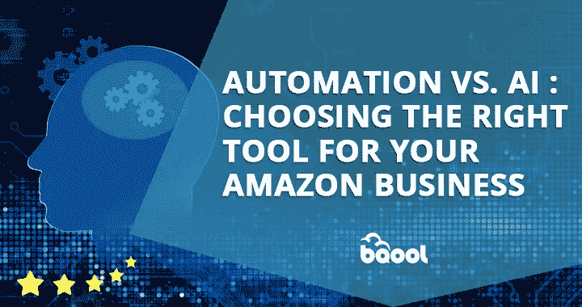
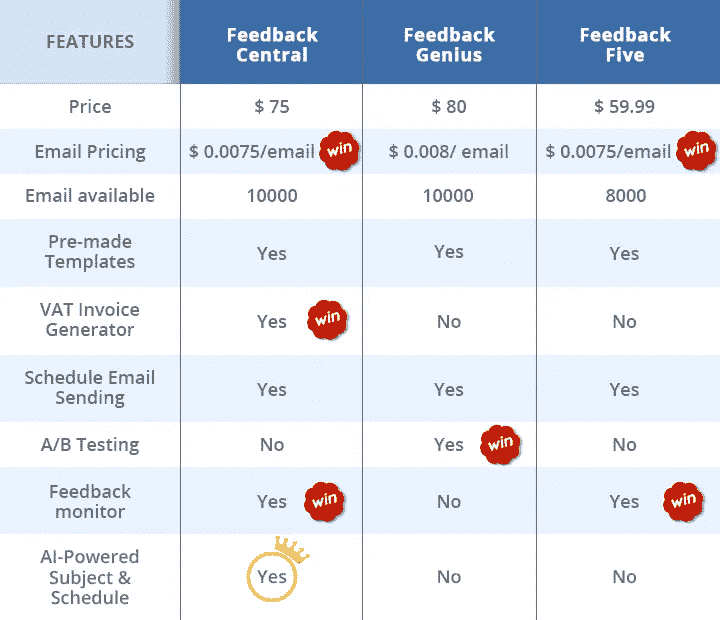

# 自动化与人工智能:为你的亚马逊业务选择正确的工具

> 原文：<https://medium.datadriveninvestor.com/automation-vs-ai-choosing-the-right-tool-for-your-amazon-business-5fe9a34d8684?source=collection_archive---------20----------------------->

Image created by BQool

经营亚马逊业务不是一项简单的任务，这就是为什么你需要亚马逊卖家工具来简化你的在线业务，从而节省你的时间和金钱。然而，市场上现有的大多数亚马逊卖家工具都不足以完全自动化你的商店。

幸运的是，对更完整的亚马逊卖家工具的需求催生了一种具有革命性人工智能技术的工具。转而使用更先进的人工智能亚马逊卖家工具的亚马逊卖家可以轻松击败竞争对手。

## 那么自动化和 AI 有什么区别呢？

你现在可能对自动化和人工智能(AI)之间的区别感到困惑？

自动化是遵循逻辑或规则以完成重复任务的系统或软件。例如，当您外出度假时，您需要在 Gmail 中设置一个假期回复程序，自动回复收到的邮件。

人工智能是能够像人类一样工作和反应的机器或计算机。Gmail 的“智能回复”和“智能撰写”是人工智能使用增加的很好例子，并展示了人工智能如何帮助提高生产力。

所以，自动化和 AI 的最大区别在于自动化是由手动配置驱动的。你必须建立规则，使机器或系统可以遵循特定的模式，并使行动发生。

然而，自动化在一些领域并不像一些人预期的那样好。例如，当卖家发送后续电子邮件以请求评论和反馈时，许多卖家依靠自动化电子邮件工具来安排在订单被确认、装运或交付后的特定时间向他们的客户发送电子邮件。

亚马逊卖家还被要求进行多次 A/B 测试，比较不同邮件主题行和发送时间的邮件打开率，以达到最佳效果。但如果卖家使用人工智能技术支持的亚马逊电子邮件工具发送电子邮件。AB 测试将变得过时，因为 AI 知道发送主题行打开率最高的电子邮件的最佳时间。机器学习现在是未来，它让任何自动化系统在决策时都能像人类一样思考。

## 你还在比较不同的亚马逊卖家工具吗？考虑选择 BQool 反馈中心。

随着超过 5 亿件产品争夺数十亿美元，许多卖家投资于亚马逊卖家工具，这些工具可以自动为他们执行繁琐的手动任务，以便他们可以节省宝贵的时间来进行其他活动，如与家人和朋友共度时光。因此，你需要一个带有人工智能解决方案的亚马逊反馈工具，可以完全自动化你给买家的电子邮件！

借助大数据见解和人工智能技术，BQool Feedback Central 可以帮助高效和有效地获得更多亚马逊反馈和评论。通过自动找到最佳电子邮件主题，并为每封电子邮件安排理想的发送时间，人工智能解决方案为您提供了高电子邮件打开率和更多成功的评论和反馈请求。

BQool Feedback Central 还有一个内置的增值税发票生成器，可以快速生成增值税发票，并自动按履约类型发送给您的欧盟客户。这个功能极大地缓解了耗时的任务，毕竟，在亚马逊上销售时，时间就是金钱！

## 最后的想法

选择合适的亚马逊卖家工具就像雇佣一名优秀的员工。一个好员工的品质是可靠的(智能自动化系统)，高效的(默认&可定制的模板)，并能适应不断变化的情况和环境(人工智能驱动的主题和时间表功能)。再加上性价比更高。

你还在等什么？给[反馈中心](https://www.bqool.com/products/feedback-central/)一个机会，它可以完成工作并为您提供出色的结果！

*   *本帖原载* [*此处*](http://blog.bqool.com/automation-vs-ai-amazon-seller-tools/) *。*