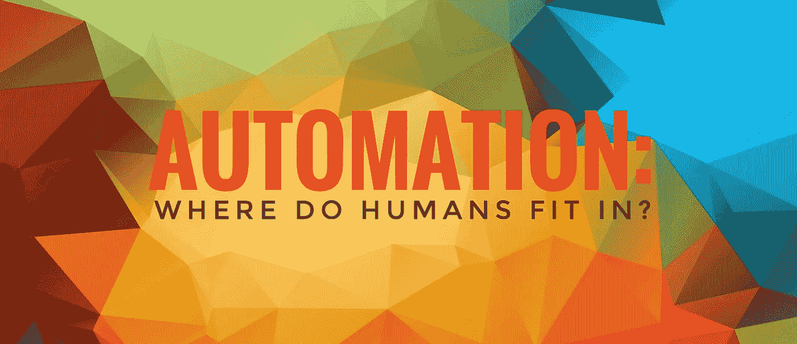

# 自动化:人类在哪里？

> 原文：<https://medium.datadriveninvestor.com/automation-where-do-humans-fit-in-30740e8bdc13?source=collection_archive---------5----------------------->

## 系好安全带，欢迎来到未知世界。

简单工作的自动化发展速度超过了我们的劳动力适应的速度。曾经有一段时间，你可以在一家公司里低着头，非常努力地工作以获得晋升——那些日子已经一去不复返了。我强烈建议你抬起头四处看看。如果你的专长是服务行业，你可能已经注意到，无论你如何努力，你都跟不上。在过去的 5 年中，许多服务行业的服务速度呈指数级增长。这包括客户服务、*食品服务、送货服务等等。*

让我们浏览一下我列出的一些例子。第一，客服。还记得苹果推出 Siri 的时候吗？我们都在我们的 iPhones 上测试了它，认为它真的很酷。它不能做所有的事情，但仍然很酷。几年后，我们正处于争夺最佳虚拟助手的竞赛中。苹果的 Siri 现在正在与亚马逊的 Alexa、谷歌的 Assistant、三星的 Bixby 竞争，我敢肯定还有很多其他公司。今年，虚拟助理达到了新的高度，并进一步威胁垄断客户服务工作。言语无法描述谷歌将他们的虚拟助手带向了多么不可思议的地步，你将不得不亲眼目睹。点击观看[完整视频](https://youtu.be/P0P0GcwQqMQ)。

不同的自动化服务也给食品服务带来了许多变化。仅仅是食品供应在短短几年内就发生了巨大的变化。到目前为止，我们都已经接受了新的食品配送服务，允许我们通过智能手机订购食品，并将其送到任何地方，最终通过我们的虚拟助理。像 Skip the Dishes、DoorDash 和其他众包外卖服务公司正在把你想要的任何外卖送到你所在的任何地方。这项服务需要一定的费用和较长的等待时间，但许多寻求便利的人并没有因此而放弃。我们离机器人送货也不远了，这将消除高工资，以及任何可能的交通，如果这些机器人也是无人机的话。DoorDash 已经在硅谷推出送货机器人，正如你所见，前景看好[看这里](http://www.businessinsider.com/doordash-delivery-robots-starship-technologies-2017-3)。我们离在其他主要城市看到这一幕不远了。

所有这些颠覆性的变化以及更多的变化正在动摇我们所知道的每个行业的基础。对于一些人来说，这些变化对他们的生计构成了威胁，他们认为一旦机器接管，人类可能变得无关紧要。但是对一些人来说，包括我自己，自动化并不可怕。

这时你应该说，“嘿，艾普丽尔，你不是刚被解雇了吗？”为什么是的，我做到了。可以说这是自动化的结果。我以前的雇主没有让我的工作自动化，但我们无法跟上那些已经自动化的公司。即便如此，我仍然没有被自动化吓倒。在管理整个创意部门之前，我在印刷行业做了多年的平面设计师。在一个越来越依赖视觉效果的世界里，对创意的需求非常高。既然我们仍然生活在一个虚拟的世界里，你可能想知道发生了什么变化？答案是软件。不久前，即使是最小的文本更改也需要由图形设计师来完成。许多公司建立内部设计团队，以满足其营销团队的创意需求，并避免支付高昂的创意代理费用。创意机构处理宏大的愿景和战略，随之而来的是高昂的价格，让他们做简单的改变并不划算。

公司设计是我多年来在不同公司安家的地方。这些内部工作室通常以适中的预算完成快速变化和小型营销活动。我们被训练成“品牌大使”,并遵守品牌准则。这种类型的设计通常基于模板，以保持所有设计师在品牌范围内，并允许更高水平的速度。对于营销人员来说，时机就是一切，当他们提出要求时，他们通常需要尽快完成。模板允许我们为他们做这件事。

## **软件创新如何影响企业设计？**

软件已经取得了许多进步，最引人注目的是 SaaS——软件即服务。是啊，现在是真的了。如果大部分开发的创意都依赖于品牌标准规定的严格公式，那么未经培训的营销人员可以通过“即插即用”软件轻松完成。点击这里看例子，是的，这意味着我的工作，以及许多其他工作，正处于完全自动化的边缘。我应该生气吗？也许我应该感到愤怒。恰恰相反，我奇怪地松了一口气。我想可以肯定地说，我不是唯一一个对来自营销部门的一切都感到厌恶的设计师。

所以我在这里，失业，没有销路。尽管如此，**我发现自动化令人兴奋。**

## 为什么？

游戏变了，意味着规则变了。如果你像我前面提到的那样抬起头来，你会看到在最新一波自动化浪潮之后，到处都在发生变化。如果你看得足够仔细，你会注意到自动化只带我们走了这么远，换句话说，在自动化出现的任何地方都有机会。引用作家兼《纽约客》专栏作家马尔孔·格拉德威尔的名言，“要擅长机器做不到的事情。”简单。不容易，但是简单。

## 仍然不确定人类适合哪里？

无论在哪里，我们都能融入。

让我们都记住一件重要的事情，自动化是由我们创造的。它需要我们去设计它，开发它，测试它，等等。如果你睁开眼睛，你会发现你可以融入其中。你认为创造一个送外卖的机器人只需要一个人吗？你以为一个人给亚马逊编程所有购物算法？也许只有一位女士是顶级虚拟助理的端到端创作背后的大脑？我不这么认为。需要很多人来开发这么大的破坏。它需要研究、旅程规划、开发等等。我们需要把我们的思维定势从“按要求去做”转变为“三思而后行”。人类在策略中——这是机器不擅长的。每一项创新都需要更多的策略。让我们从这里开始吧。