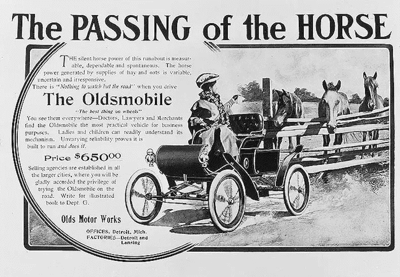
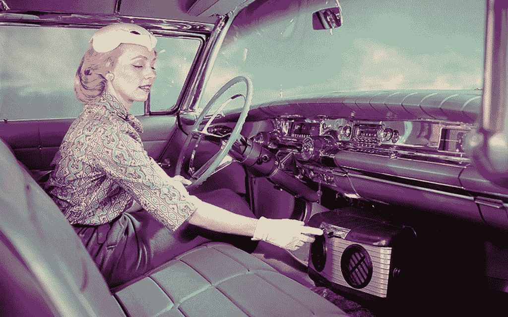
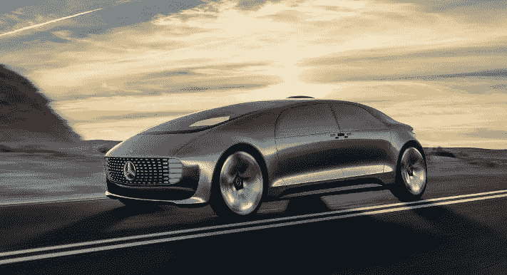

# 汽车卢德分子

> 原文：<https://medium.datadriveninvestor.com/automobile-luddites-d736f2120143?source=collection_archive---------2----------------------->

技术变革往往会给人类社会带来剧变；很少有比 19 世纪末 20 世纪初从动物动力到机器动力的转变更能说明问题的了。

这种转变不仅改变了我们运送人员和货物的方式，也是运输所用能源的重大变化。主要由马提供的动物能量来自用来喂马的食物，新能源最初是煤、蒸汽动力和用于内燃机的汽油。最终，我们都知道内燃机赢了。

 [## 在自动驾驶汽车发生事故的情况下，谁应该承担法律责任？-数据驱动型投资者

### 我仍然认为自动驾驶汽车是一种奢侈品，而不是必需品…

www.datadriveninvestor.com](https://www.datadriveninvestor.com/2018/11/02/who-is-legally-accountable-in-the-case-of-an-autonomous-vehicle-accident/) 

从马力到汽油驱动的汽车和卡车的转变起初是一场斗争，有人抵制这种变化。这一转变花了大约 50 年才完成。

美国蒸汽机专家罗伯特·瑟斯顿在 1894 年写道，马不仅，

> “……自我供给、自我控制、自我维护和自我再生，但它们从给定重量的燃料中所能产生的能量来看，比任何其他现有形式的发动机都要经济得多。”

勒德分子(来自韦氏词典)

> “19 世纪早期一群英国工人中的一员，他们毁坏节省劳力的机器以示抗议；广义地说，反对技术变革的人。勒德派认为自动化摧毁了工作岗位。

新路德主义是一种反对或怀疑现代技术的哲学。勒德分子的内涵是反对技术变革的人，比如说，可能像宾夕法尼亚地区的阿米什人或门诺派教徒一样，他们不使用电话或汽车等现代技术。

这个词以一种讽刺的方式被应用于那些缓慢采用新技术或抵制使用新技术的人。我想我们都知道有些人仍然不使用电脑(或者他们打印出电子邮件和网页以供阅读),即使他们有智能手机，他们也不会使用智能手机的一小部分功能。

这种勒德分子心态从汽车诞生之初就影响了汽车。甚至连汽车的存在都受到了人们的抵制，他们认为马以及由马驱动的马车作为人和货物运输的主要来源是不可替代的。

早期的汽车基本上是带有原始气体发动机或电动机的马车。尽管马匹很难相处，但所有人都没有立即接受新的机械装置。毕竟，马已经为人类服务了几千年，为什么现在要改变呢？一些早期采用新汽车的人听到“买匹马吧！”偶尔对他们大喊大叫。

一只城市的老黄牛每天在城市街道上倾倒 20 到 50 磅的粪便，以及大约一加仑的尿液，这吸引了苍蝇和与所有这些相关的疾病。想象一下纽约这样的大城市有多乱。步行过马路就是一个挑战。现在，这种混乱已经被数百万辆燃烧汽油的汽车造成的空气污染所取代。然而，从马到汽车的转变很可能拯救了我们的大城市。

随着汽车解决了严重的问题，很难想象有人会反对用汽车代替马。我们知道这种转变对某些行业如马鞭制造商和马车制造商产生了严重的后果。一些像斯图贝克这样的马车制造商很聪明，开始生产汽车。这让斯图贝克的生命又延长了几年。

许多技能也受到了影响，比如马房经理、驯马师、马鞋匠等等。汽车创造了新的商业机会和新的工作机会，尽管这些工作需要新的技能。那些足够幸运、足够聪明、能够利用这种转变的人茁壮成长。

今天汽车工业中正在进行的技术变革，不仅仅是另一种能源的变革，可能会产生与汽车首次推出时相同甚至更多的勒德式阻力。

汽车在 20 世纪有了显著的发展，今天仍在快速发展。早期重要的技术改进包括电点火和电起动器，而不是手动曲柄(都是由查尔斯·凯特林在 1910-1911 年为凯迪拉克发明的)，独立悬架和四轮刹车。我怀疑是否有人反对这些技术变革，因为它们使汽车更容易使用，更安全。

后来，空调使人们在炎热的天气里旅行变得舒适，盘式制动器提高了安全性和动力转向，动力辅助制动器使驾驶变得更容易，可选的自动变速器使无法驾驶手动变速器的人能够驾驶。燃油喷射取代了化油器，提高了燃油效率和可靠性。

Early car air conditioning from [Automobile](http://www.automobilemag.com/news/automotive-air-conditoning-history/)

当巡航控制和防抱死制动系统(ABS)被引入时，我们第一次看到汽车从驾驶员手中夺走了一些控制权。

牵引力控制系统和紧急制动辅助系统，或电子稳定控制系统(ESC)和自适应巡航控制系统继续使用旨在从驾驶员手中夺走一些手动功能的技术。宝马在 2001 年推出的 iDrive 给许多宝马买家带来了一个问题，因为他们很难理解这个新的控制系统。

手动控制相对于自动的，计算机控制的汽车驾驶，我认为许多汽车的反对者会有问题。有复杂的娱乐和全球定位系统，但你可以选择使用或不使用这些系统。有些驾驶控制不是可选的，对于不喜欢改变的人来说，这种情况只会变得更糟。

如果你想买一辆新的法拉利，你不会找到一辆全手动变速器的。如果你正在寻找一辆二手的、最新型号的跑车(法拉利、阿斯顿·马丁、保时捷、兰博基尼等)，大多数也不会有完全手动的变速器。一些将有一个 4 轮驱动，所以用后轮驾驶汽车的经验消失了。是的，真的有人在想这样的事情。

即使你不是跑车爱好者，但喜欢控制和手动驾驶你的汽车，你也可能不喜欢未来的新汽车。人类对驾驶的控制正被逐步淘汰出汽车设计。

如果你在过去几年里没有买新车，你可能会对许多新车和卡车的新技术感到惊讶。最近买了一辆新车，10 年来第一次。现在新车上可用的技术与 10 年前相比已经大不相同了。驾驶中有更多的辅助设备来提高安全性，并从司机那里拿走一些控制权。

带有行人检测的自动紧急制动、与前车保持固定距离的自适应巡航控制以及引导汽车返回车道的技术是几款丰田车型的标准配置。本田将司机瞌睡检测作为一个选项。

**自动驾驶汽车**

技术将使更多的人可以使用汽车，否则他们将只能被降级为乘客。我们正在进入一个新时代，任何人都可以使用汽车，即使他们不知道如何驾驶，没有驾照或有能力驾驶汽车，如盲人或有残疾的人无法驾驶汽车。全自动驾驶汽车不仅不需要司机，也不需要乘客！

自汽车发明以来，自动驾驶汽车是汽车技术的最大进步。这将引出天生的汽车勒德分子，并可能暴露那些不知道自己是汽车勒德分子的人。我们可能会看到人们按年龄分组，年轻人接受和喜欢这项新技术，而一些老年人不喜欢或接受这些变化。这将类似于个人电脑、互联网和智能手机的情况。

[Mercedes-Benz F015](https://www.mercedes-benz.com/en/mercedes-benz/innovation/research-vehicle-f-015-luxury-in-motion/)

勒德派反对者将抵制失去控制和隐私。只要主人允许，智能手机就会追踪我们的一举一动，隐私的丧失已经是一个问题。

对于自动驾驶汽车，我们可能没有选择关闭位置跟踪。这些汽车会互相交谈，在交通中顺利通过，不会发生事故。

我们将如何适应？勒德分子能够减缓变革的速度吗？还是他们将被迫接受未来？我建议我们学会适应未来，以及它带来的技术创新和生活变化。