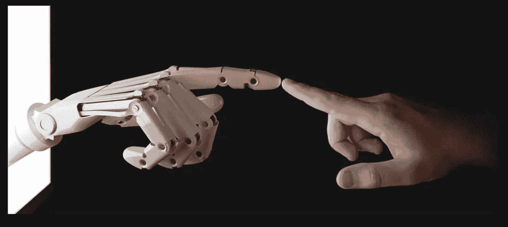
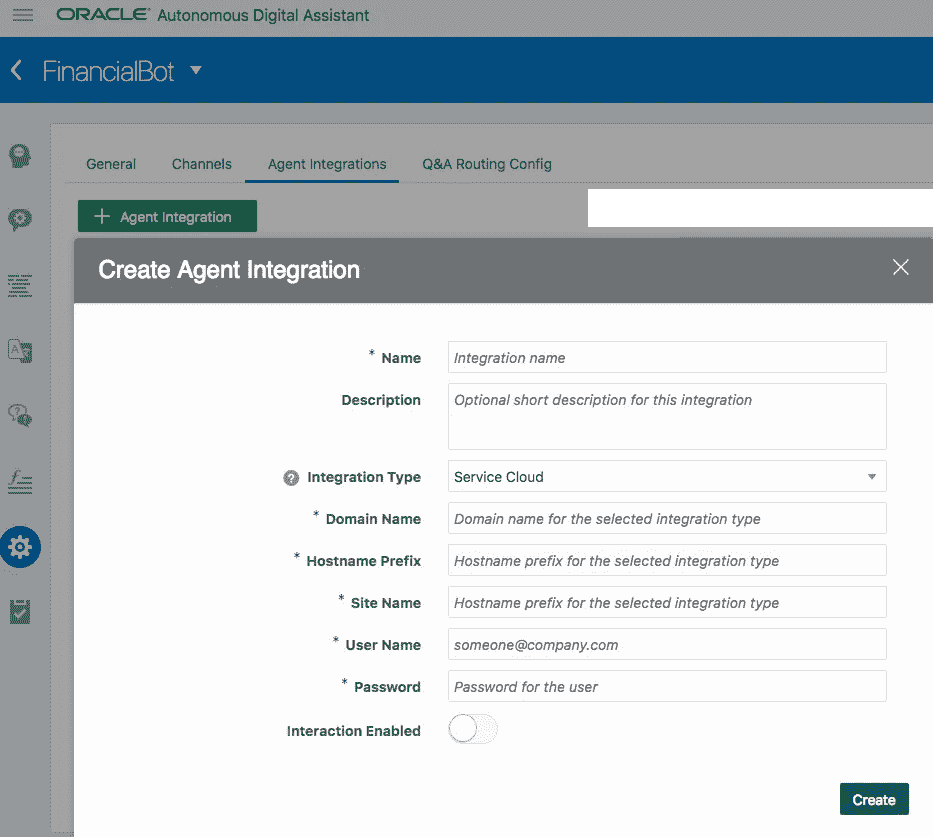
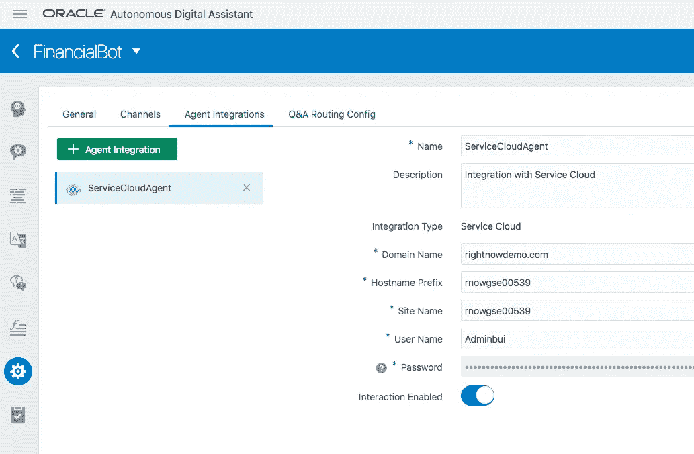
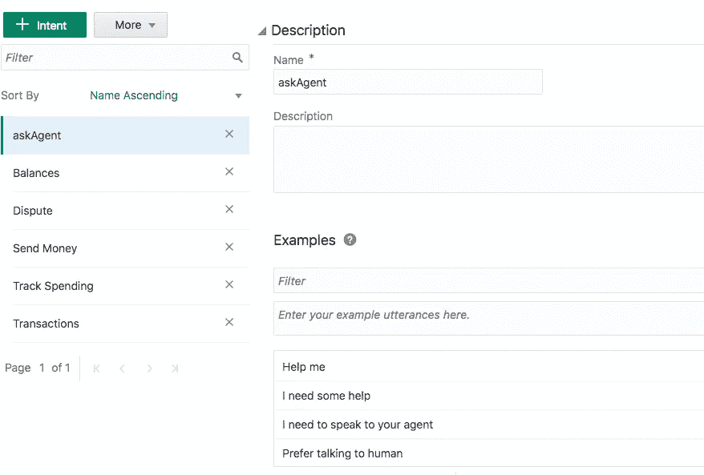
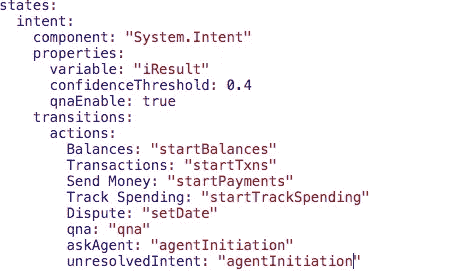
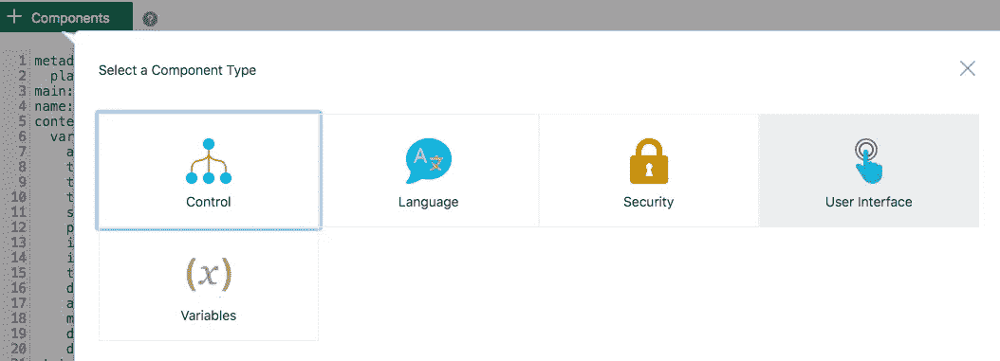
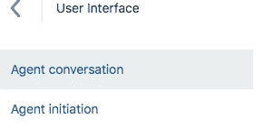
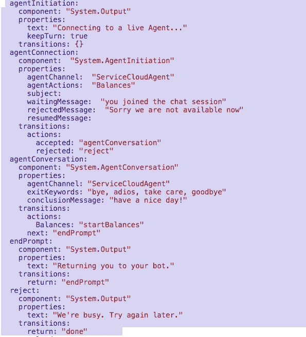
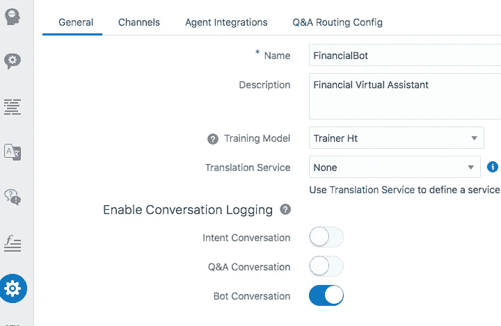

# 人类代理无缝切换的自主数字助理

> 原文：<https://medium.datadriveninvestor.com/autonomous-digital-assistant-to-human-agent-seamless-handoff-902b0065f070?source=collection_archive---------12----------------------->

在之前的文章中，我讨论了 [**自主数字助理**](https://medium.com/@vijaykumar.yenne/oracle-autonomous-digital-assistant-the-new-incarnation-for-conversation-interfaces-3d1a9ce9b9dc)[**提供**](https://medium.com/@vijaykumar.yenne/provisioning-autonomous-oracle-digital-assistant-35c664b688aa) 数字助理，构建技能并使其成为 [**多语言**](https://medium.com/@vijaykumar.yenne/building-a-multi-lingual-bot-on-the-oracle-chatbot-platform-52474574ad04) 。在这篇文章中，我想进一步讨论当机器人无法处理对话，而是将聊天重定向到人工代理时，需要人工干预的某些场景。

聊天机器人可以增加呼叫中心的互动，减轻代理回答最常见问题和自动化交易的负担，但是，总有机器人无法理解的复杂查询，客户希望与代理交谈。这就是机器人和人类的杀手组合将更有效地推动客户参与的地方。您可以在客户经常参与的地方使用聊天机器人，例如脸书、Whatsapp、Slack 等消息平台，此外，您还可以允许客户在需要时与人聊天，消除他们在与聊天机器人互动时遇到的问题得不到解决时的挫折感。

让我们来看一下在 Oracle 服务云**中将 Oracle Digital Assitant 中设计的机器人无缝切换到实时代理的配置步骤**

****步骤 1:配置代理与您的聊天机器人的集成。****

**开箱即用，ADA(自主数字助理)支持 Oracle Service Cloud 作为实时代理。**

****

**Provide the Domain Name, Hostname, Site Name and the Admin user set up in service cloud for the agent interaction. Enable the switch for Interaction.**

**Oracle service cloud Agent Web UI URL 的一般模式:[https://rnowgse00539.rightnowdemo.com/AgentWeb/](https://rnowgse00539.rightnowdemo.com/AgentWeb/)**

**下面是该配置的外观:**

****

**Sample Configuration Screen with Service Cloud Details.**

****第二步:检测对话中的转移动作，当机器人无法处理或客户特别要求时，将聊天重定向到人工代理。****

**您可以使用 **AgentInitiation** 系统组件轻松地将访问者转移到您的客户支持团队。在对话流程中的任何一点，多次将您的客户引向您的人类专家。将实体和对话流传递给转移操作，以便实时代理可以完整地查看聊天流并做出相应的响应。**

**创建一个意图来检测与代理交谈的用户输入，并编辑您的 BotML 来捕获对话流中的意图。**

****

**我们还可以映射未解决的事件来启动代理移交。**

****

**将代理启动和代理对话系统组件添加到对话流中。**

************

**Added a System.output message so that the customer is aware that the Bot is about to connect to a live agent.**

**确保根据步骤 1 提供 agentChannel 信息。(集成的名称)**

**注意，在 AgentConversation 模板中有一个传递实体流的选项。这使得代理能够像机器人一样做出响应，如果客户询问机器人可以做出响应的信息，但是机器人不能适当地检测意图。**

**这就是代理移交所需的全部内容。**

***提示:确保启用了机器人对话开关，以便将机器人聊天历史传递给实时代理。***

****

**以下是聊天机器人与实时代理互动的视频:**

**感谢您花时间阅读这篇文章。**

***原载于 red thunder . blog 2018 年 9 月 21 日***