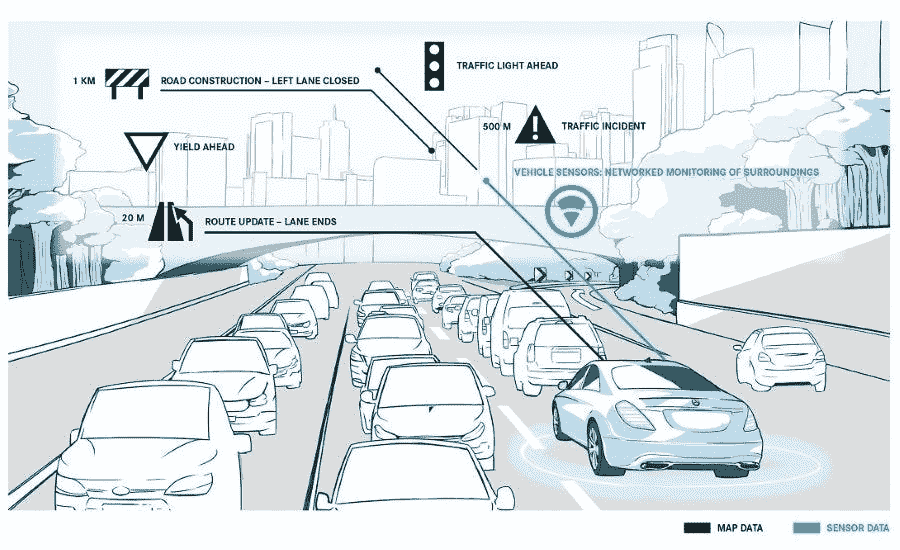

# 自主的个人空间

> 原文：<https://medium.datadriveninvestor.com/autonomous-personal-space-39000783688d?source=collection_archive---------30----------------------->

当自动驾驶汽车最终变得无处不在时，不断有人提出的愿景是，一个拥有计算精确寻路能力的车队。通过相互交谈，他们将能够在高速公路上行驶，保险杠在几英寸之内，重新安排他们的分组，以便实现最大的空气动力学和最有效的行驶时间。在这些交通工具设计的范围内，计算机的反应速度可以比我们快几千倍，如果我们给它们跨平台相互交流的能力，它们可以很好地避开彼此的行进路线。

但是，正如我们所知，或者许多人所怀疑的，最好的、最有效的解决方案并不总是“最好的”(无论如何，对于“最好”的人类舒适度而言)。飞机上的自动驾驶仪可以在暴风雨中顺利着陆，但决策会保持飞机完好无损，很少考虑乘客的舒适甚至安全。这个世界充斥着人类“最佳”领先于效率的例子。每个人都想要一个靠窗或靠过道的座位，如果到达的电梯看起来太满，人们会花时间等待下一部电梯(即使它仍然在其重量范围内)。对电脑来说“最好”的东西并不总是对人“最好”。

这让我想到了定制，用户对这类车辆的偏好。我的意思是，很明显你可以开车时保险杠之间的距离在 5 英寸以内，但任何把手放在方向盘上的人都会更舒服，更熟悉“两秒钟规则”，即司机在你的车和你前面的车之间保持两秒钟的距离。当然，在操纵一堆 2000 磅重的碳纤维和钢铁时，有些人似乎没有个人空间的概念，但总的来说，大多数司机都会在他们周围的汽车之间保持一个舒适的距离。

当你安全地坐在你的自动驾驶车里时(假设你没有被一部电影或某种质量的"[个人时间](https://www.fastcompany.com/90264809/self-driving-cars-will-be-for-sex-scientists-say)")分心，你可能一点也不喜欢你的车尾随别人或别人的车尾随你的车。最有效的旅行方式可能会让那些没有经历过这种旅行的人感到头疼。

我认为最初的解决方案是允许“用户偏好”。你可以在手机上选择唤醒时间和铃声，因此汽车制造商可能会允许用户设置与前方汽车的最小距离或最大尾门距离等事项(事实上，咄咄逼人的人类司机可能会利用两辆汽车的车主要求他们周围有一个大缓冲区的交通间隙)。汽车会在彼此之间交流这些偏好，并在行驶过程中将其纳入驾驶计算。