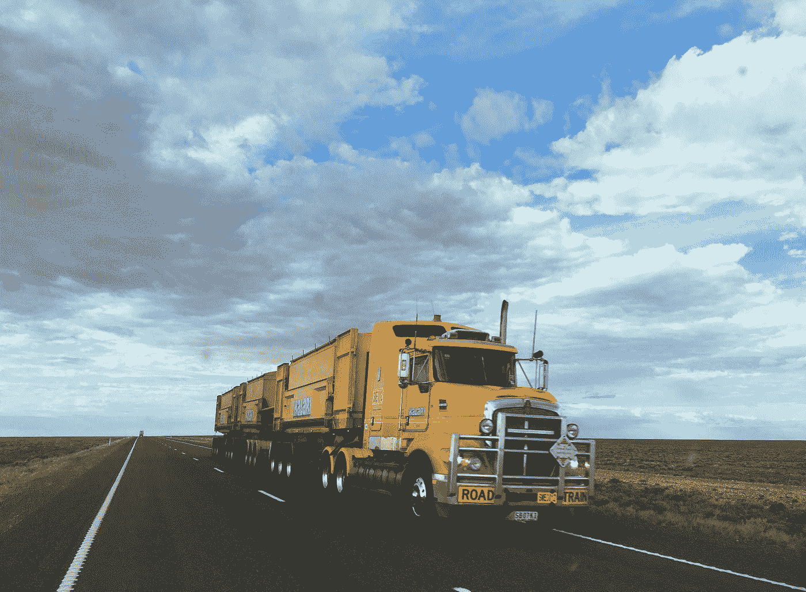

# 自动卡车

> 原文：<https://medium.datadriveninvestor.com/autonomous-trucks-48e80bcce2dc?source=collection_archive---------12----------------------->

Photo by [Rhys Moult](https://unsplash.com/@rhysatwork?utm_source=medium&utm_medium=referral) on [Unsplash](https://unsplash.com?utm_source=medium&utm_medium=referral)

## 为什么自动驾驶卡车会比你想象的更快到达

由[本杰明·戈登](https://medium.com/authority-magazine/5-things-i-wish-someone-told-me-before-i-became-the-ceo-of-cambridge-capital-9d97d1b93cfa)的[剑桥首都](https://cambridgecapital.com/team/)

Self-driving trucks in industrial markets are already going operational

[本杰明·戈登](http://bengordonpalmbeach.com)，在[棕榈滩](http://bengordonpalmbeach.com/2017/08/palm-beachs-top-5-historical-moments/)的[剑桥资本](http://www.cambridgecapital.com)的 CEO，在这个[采访](https://vimeo.com/354565818)中讨论[自动驾驶卡车](http://bengordonpalmbeach.com/2017/07/ben-gordon-palm-beach-self-driving-trucks/)。

在很短的时间内，自动驾驶汽车已经从遥远的科学项目变成了公认的智慧。

 [## 在自动驾驶汽车发生事故的情况下，谁应该承担法律责任？数据驱动的投资者

### 我仍然认为自动驾驶汽车是一种奢侈品，而不是必需品…

www.datadriveninvestor.com](https://www.datadriveninvestor.com/2018/11/02/who-is-legally-accountable-in-the-case-of-an-autonomous-vehicle-accident/) 

首先，像 Waymo 这样的初创公司吸引了工程师的注意力，承诺进行彻底的变革。与此同时，Mobileye 证明了通过常规车辆的自动化实现渐进发展是可能的。

然后，更大的公司进来了。[英特尔](http://www.intel.com)以 150 亿美元收购 Mobileye。 [Lyft](http://www.lyft.com) 和 [Waymo](http://www.waymo.com) 结成伙伴关系，合作研发自动驾驶汽车。奥托成立不到一年，优步就以超过 6 亿美元的价格收购了奥托。

今天，财富 500 强公司正在下大赌注。一个很好的案例是福特汽车公司。福特研究了自动驾驶汽车的这些突破。他们将这些变化描述为“100 年来最快的转变”当福特看到这些趋势时，他们决定用关键的投资和收购来应对。福特在硅谷成立了一个战略风险部门，名为福特研究和创新中心。福特随后投资了几家自动驾驶汽车先驱，包括威力登激光雷达、民用地图、SAIPS、ARGO AI 和尼伦伯格神经科学。今天，笑话是 FMC 现在代表“福特汽车公司”。

这些举措都反映了对自动驾驶汽车未来的信心。

然而，自动驾驶汽车真的准备好了吗？

正如最近的一篇福布斯文章所反映的，像 2016 年 5 月特斯拉 Autopilot 撞车和 2018 年 3 月优步自动驾驶汽车撞车这样的事故引发了警报。兰德公司(Rand Corporation)最近发布的一份报告表明，现有车队可能需要“数十年甚至数百年才能行驶这些英里”，才能确保真正安全的自动驾驶。

那么……自动驾驶汽车准备好进入幻灭的低谷了吗？

事实证明，自主技术有一个更好的早期采用者:卡车。

[小松](https://www.youtube.com/watch?v=F_Re68mLf9Q)提前出发了。小松于 2016 年在 Minexpo 上推出了其“创新的自主运输车辆”。从此开始商业化。从那时起，小松开始在澳大利亚的矿井中操作这些卡车。

另一个突破是在美国高速公路上，与 [Peloton](https://peloton-tech.com/) (软件公司，不是健身自行车)。Peloton 正在为公司提供机器对机器的通信，这种通信允许卡车像自行车比赛一样依次相互牵引。当第一辆卡车刹车时，第二辆、第三辆和第四辆卡车可以紧随其后。这种技术被称为队列技术，现在被财富 500 强公司和卡车司机使用，并得到英特尔、BP、洛克希德·马丁、诺基亚、UPS、沃尔沃、三井、斯伦贝谢等公司的支持。

总之，传统观点是错误的。无人驾驶汽车炙手可热，但无人驾驶卡车是牛排。卡车运输的渐进发展是自动驾驶汽车的未来。而且已经到了！

要了解更多信息，请在[https://www.youtube.com/c/BenGordon1](https://www.youtube.com/c/BenGordon1)观看 [YouTube](https://www.youtube.com/c/BenGordon1) 视频，在这里阅读[www.BenGordonPalmBeach.com](http://www.BenGordonPalmBeach.com)关于自动驾驶卡车的文章[。](http://bengordonpalmbeach.com/2017/07/ben-gordon-palm-beach-self-driving-trucks/)