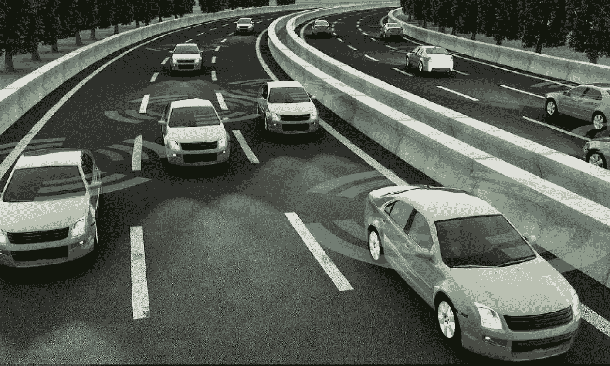

# 自主车辆的现状及发展趋势

> 原文：<https://medium.datadriveninvestor.com/autonomous-vehicles-current-development-analysis-53ee054b1bb5?source=collection_archive---------27----------------------->

## 写于 2018 年 3 月 22 日

在过去的 50 年里，技术的发展一直超过了社会和个人的能力(胜利者)。随着技术创新的不断出现，在复杂的社会技术系统中预测特定创新的效果变得更加困难但也更加重要。因此，自动驾驶汽车(AV)作为 21 世纪的流行趋势之一，引发了个人消费者、科学家、商业巨头和政治家的热烈讨论。AV 本身有一个充满希望的未来，因为它代表了自主技术和人工智能的发展。它将通过降低事故率、提高运输效率以及使用更环保的燃料来造福社会。然而，在现阶段，由于技术和社会两方面的原因，AV 还远远没有准备好，还有很长的路要走。

首先，我认为现阶段的 AV 技术还不够成熟，不足以消除事故率。兰德公司的研究表明，“如果没有司机的失误，车祸就会减少。”因此，AV 有望消除 90%的人为事故，因为他们总是遵守交通规则，从不分心(西蒙)。然而，人们往往会高估这样的技术。AV 技术有几个层次来区分它们。从人类驾驶员完全控制汽车功能的第 0 级发展到第 4 级，汽车可以在没有人类驾驶员的情况下自动从 A 点行驶到 B 点(Ward)。在今年 1 月 22 日发生的特斯拉 Model S 事故中，司机声称当汽车撞上一辆停下的消防车时，汽车是“自动驾驶的”。然而，特斯拉后来解释说，“Autosteer 不是为了让 Model S 绕过物体而设计的”。车主手册确实教导司机要全神贯注，把手放在方向盘上(斯图尔特)。在这种情况下，司机显然对特斯拉 Model S 有更多的期望，因为该车已经在高速公路上成功行驶了数英里，而没有意识到它实际上是一辆需要司机保持警惕的 2 级自动驾驶汽车。加州理工学院自主系统和技术中心的工程学教授 Aaron Ames 也声称，半自动和自动之间的广泛误解是导致此类事故发生的主要原因，不幸的是，这种误解“只会随着时间的推移而增长。”(斯图尔特)

此外，由于对当前 AV 技术的功能误解和高估而导致的许多事故似乎是不可避免的。在谷歌测试司机对半自动驾驶的态度的实验中，一组司机被告知他们在驾驶半自动驾驶时必须保持警惕。但是，当他们发现汽车可以自动平稳行驶数英里后，大多数人都分心了。通过实验发现，人们倾向于依赖半自动驾驶机器，高估了机器的判断能力，因此，驾驶二级 AVs 不能有效地降低事故发生率。这就是为什么谷歌和其他公司选择直接开发和推出 L4 AV。由谷歌开发的最新 L4 概念 AV 甚至没有方向盘，显示了其在没有人类干预的情况下使汽车完全自主的决心。然而，L4 AV 尚未在市场上推出，因为 AV 技术尚未成熟-传感器仍然无法在恶劣天气下识别路况-甚至可能导致算法透明度和道德问题方面的新危险。优步自动驾驶汽车杀死亚利桑那州行人的最新事故表明，自动驾驶系统仍然难以应对不可预测的人类行为。虽然在大多数情况下，这些算法可以帮助 AVs 做出比人类更优化的决策，但 AVs 优化的目的是什么，整体人类福利，他们的客户司机或路上乘客的安全可能会因其算法的优先级而带来道德问题(Shashkevich)。为了解决这个问题，从事技术研究的研究人员应该与伦理专家、社会学家或心理学家合作，改进算法，并教会机器在处理紧急情况时做出类似人类的伦理选择。总而言之，尽管许多汽车制造商登上了半自动驾驶列车，渴望为他们的消费者创造机会，为新开发的豪华功能支付更多的钱，但在四级自动导航系统完全成功开发和广泛实施之前，当前的自动导航技术无法帮助降低事故率，以及提高公众对算法的信心，相信他们可以在改进后为人类司机做出最佳和道德的选择。

另一方面，AVs 的支持者承诺的 AVs 的大部分好处，如更方便的交通、增加的流动性、解决停车不足、更少的交通标志和燃油经济性的增加，都是基于 AVs 的广泛实施，而 AVs 的广泛实施现在受到两个主要因素的阻碍:成本(材料和技术)和市场(客户口味)。福特和其他公司主张汽车工业将发生巨大变化，在未来 5 年内将汽车工业提前 50 年，智能汽车可以做人们今天无法想象的事情。然而，许多好处很难实现，直到道路上的大多数或所有车辆都是 AVs。可能阻碍从非 AVs 到 AVs 完全转型的主要问题是自动驾驶汽车昂贵的成本以及汽车爱好者对剥夺驾驶体验的反对。尽管维多利亚研究所的研究人员预测，到 2050 年，大多数中等收入家庭将拥有一辆自动驾驶汽车(Litman)，但一辆 AVS 汽车的价格现在约为 25 万美元，包括 11.7 万美元的激光雷达设备，高灵敏度的激光传感器，1 万美元的雷达，6000 美元的摄像头，5000 美元的个人电脑和汽车本身的价格(LeVine)。根据麻省理工学院技术评论(Felton)的说法，激光雷达的主要成本目前还不能被其他更便宜的选择取代，因为这是为 AVS 在高速下运行提供数据的唯一方法。即使 R&Q 的成本下降，但在市场上，与手机或电脑等产品不同，汽车成本更高，寿命更长，因此消费者不太可能仅仅为了获得一项新技术而为新车支付额外的费用(利特曼)。与此同时，许多汽车爱好者和驾驶者可能不想要 AVs，因为他们不想放弃驾驶车辆的体验，或者他们更喜欢手动变速器。对他们来说，驾驶车辆不仅仅意味着到达目的地，但有了 AVs 驾驶，这部分意义就失去了。由于选择的自由，很大一部分人可能会拒绝 AVs，并产生有关“混合交通”的新的道路管理问题。

总之，AV 是最受欢迎的未来趋势之一，但在现阶段，它是昂贵的和不完善的。虽然自动驾驶的好处很多，但大多数好处只有在技术成熟并在 AVs 车辆上大规模实现时才会出现。这可能是对未来充满信心的预测，但仍有大量问题需要克服。在技术和市场尚未完善的现阶段，公司和社会应该更加关注 AV 技术的开发和研究，如改善深度人工智能学习和雷达等硬件，以便将更多合格和实惠的产品投入市场，而不是简单地吸引更多消费者并过早推出新产品，以实现他们对 AVs 未来可能提供的好处的承诺。

**字数:1254**

**作品引用:**

沃德巴德。"自动驾驶汽车:利弊和不可知的耶鲁气候联系."*耶鲁气候连线*，2018 年 3 月 16 日[www . Yale Climate Connections . org/2016/04/electric-cars-pros-consens-and-unknowables/](http://www.yaleclimateconnections.org/2016/04/electric-cars-pros-cons-and-unknowables/)。

史密斯，布莱恩特·沃克。"人为失误是车辆碰撞的一个原因."*互联网与社会中心*，2013 年 12 月 18 日，cyber law . Stanford . edu/blog/2013/12/human-error-cause-vehicle-crashes。

斯图尔特，杰克。"人们不能再把特斯拉和自动驾驶汽车混为一谈了."*连线*，康泰纳仕，2018 年 2 月 1 日，[www.wired.com/story/tesla-autopilot-crash-dui/](http://www.wired.com/story/tesla-autopilot-crash-dui/)。

莱文，史蒂夫。"把一辆汽车变成自动驾驶汽车的真正成本是什么."石英，石英，2017 年 3 月 5 日，qz . com/924212/将汽车变成自动驾驶汽车的实际成本是多少/。

费尔顿瑞安。"这是自动驾驶技术仍然如此昂贵的另一个原因."jalopnik.com，2017 年 7 月 27 日，Jalopnik . com/heres-another-reason-why-self-driving-tech-is-so-1797298527。

“利弊——自动驾驶汽车。”*谷歌网站*，sites.google.com/site/unibathautonomouscars/services.

亚历克斯沙什克维奇。“斯坦福大学教授讨论涉及无人驾驶汽车的伦理问题。”*斯坦福新闻*，2017 年 9 月 1 日，News . Stanford . edu/2017/05/22/斯坦福-学者-研究人员-讨论-关键-伦理问题-自动驾驶-汽车-出席/。

利特曼，托德。*自动驾驶汽车实现预测*。维多利亚交通政策研究所，2017 年。

获胜者是兰登。自主技术:技术失控是政治思想中的一个主题。麻省理工学院出版社，1978 年。