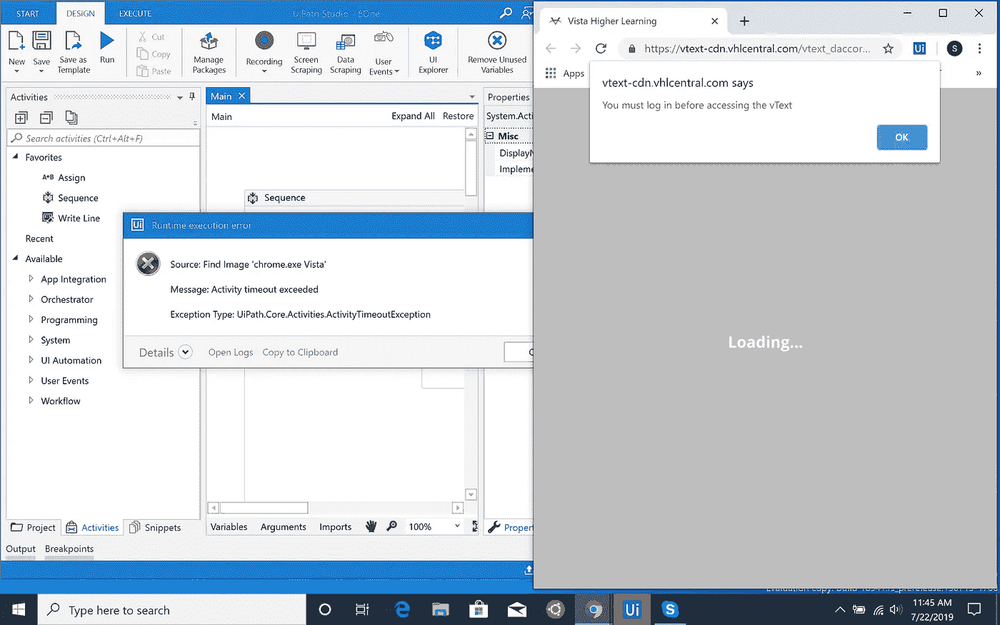
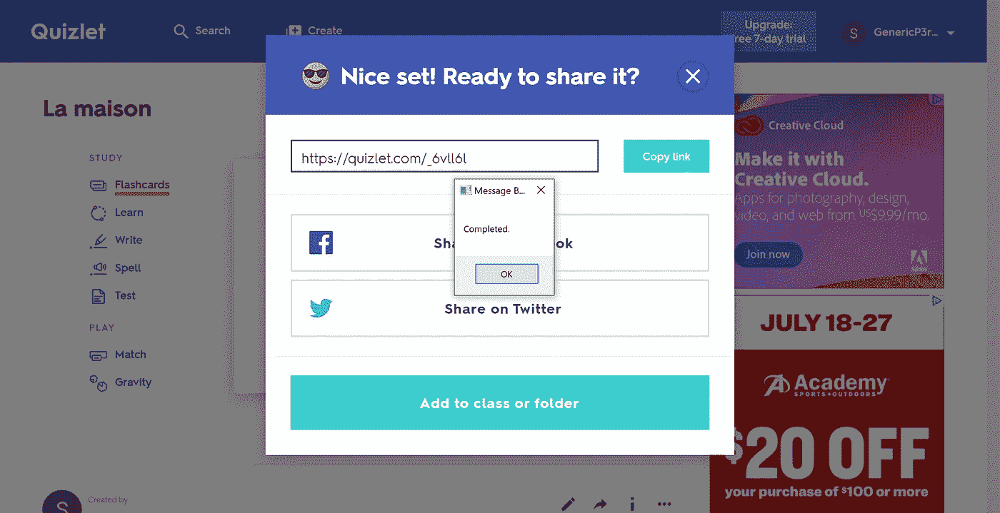

# AutoVocab:自动化作业

> 原文：<https://medium.datadriveninvestor.com/autovocab-automating-homework-2953d9519b70?source=collection_archive---------2----------------------->

嘿，你们好。我刚刚用 UiPath 创建了我的第一个原创项目，我希望能与你分享？

(If you couldn’t tell, I really like this image. Thanks, Colin Behrey, for making it!)

所以…我的想法是这样的。如果你不能从上面得到标题，我基本上想自动化我的作业。更确切地说，我想自动化法语作业。

 [## 教科书行业如何最终被颠覆，并将继续改变|数据驱动…

### 就此而言，教科书产业在美国乃至全世界都有着悠久的历史。事实上，他们已经…

www.datadriveninvestor.com](https://www.datadriveninvestor.com/2018/09/25/how-the-textbook-industry-has-finally-been-disrupted-and-will-continue-to-change/) 

Yes, I’m an American studying French. That’s not weird at all…

简而言之，我们从教科书中获取了大量词汇。现在，我正在复习法语三的书(开学时我会上法语三)，但是把所有的词汇都抄到 Quizlet 里是一件痛苦的事情。它占用了太多的时间，老实说，我认为我花在抄写课文上的时间比实际学习和复习的时间还多。随着夏季的时间紧张，这不是最佳的…所以我决定自动化它。

I am so thankful that my textbooks don’t look like that.

那么…它是如何工作的呢？好吧，我要用我的初学者通行证来说我知道这不是最好的，更安全的做事方法，但绝对比手工快得多，效率高得多。话虽如此，我先告诉你我在 auto vocab 0.0 版中有哪些特性，然后再告诉你我希望在 auto vocab 0.1 版中看到什么等等。

So… we’re starting with AutoVocab 0.0.

欢迎使用我的程序如何工作的分步指南。

0.(这些是前提条件。)开始时，用户必须登录到 VHL (Vista 高等教育；我的法语电子书所在的地方)和 Quizlet(这个超赞的答题学习平台)。如果用户没有登录，将会出现错误，程序将无法运行。

There’s a pop-up from the website and a timeout error from UiPath Studio. In short, please log in!

1.  正如你从上面看到的，程序会直接打开教科书。
2.  使用目录，程序就可以点击进入页面。
3.  该程序使用放大镜自动调整屏幕。
4.  这个程序使用这个叫做 OCR(光学字符识别)的奇特工具来阅读。
5.  程序打开了 Quizlet。
6.  该程序创建一个新的集合，并将词汇输入其中。
7.  创建器械包，并显示“已完成”弹出窗口。

Voila! It worked!

现在，在我们继续之前，先做一点评论…

我发现 OCR 非常非常酷，非常有用。我不知道有这么神奇有用的工具存在！此外，使用 UiPath Studio 使实现它变得非常容易。(非常感谢 UiPath 让整个项目变得不那么难创建。)

If you haven’t played with UiPath, I would totally recommend you do that!

我的程序是功能性的，超级有帮助，但是…它还有很大的改进空间，只能变得更好。

Everything has room for improvement!

当创建 AutoVocab 的下一个版本时，我将总体上增加更多的用户交互(即输入书籍、输入词汇页码、输入各种偏好参数等。).当直接编辑代码时，许多这些参数可以被改变；然而，我想让我的代码更加可用和可重用。我将添加的另一个特性是检查用户是否登录；在那里，它会根据需要请求登录凭证。

资料片会带来更多的挑战和乐趣。在编写 AutoVocab 的第一个版本时，我至少遇到了两个主要问题。

These problems were temporary stop signs. But, never fear, after you hit a deterrence, a good programmer keeps on going!

首先是访问 VHL 网页。出于某种原因，当我试图让光标点击输入页码框时，这个程序似乎从来没有工作过。它就是不能正确点击或输入。在进行了大量的互联网搜索和大量失败的代码之后，我决定通过点击目录表来选择另一条路线，结果非常完美。

I may not have solved the problem, but taking a detour was the most efficient way. I will, however, come back to conquer that problem!

接下来是时机问题。由于计算机运行如此之快，页面加载速度不够快，导致程序在页面之前崩溃。我避免这种情况的方法是添加一个“等待图像”块。我基本上是告诉程序在期望的网站上等待一个图标图片，比如 quizlet 徽标。这样做的一个主要问题是:( a)有时程序找不到图像(导致它仍然崩溃),( b)用户界面一直在变！我的临时解决方案有效，但它肯定不是最好的，也不是最健壮的。我希望在这方面做更多的研究。

Yay! You made it!

还有……就这些了。这篇博文比我以前的博客要长得多；如果你有任何建议或真的什么，请回复或发电子邮件给我。非常感谢！