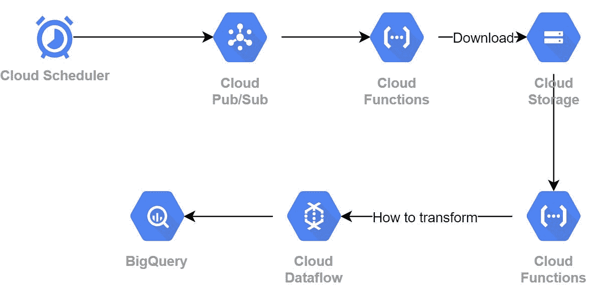
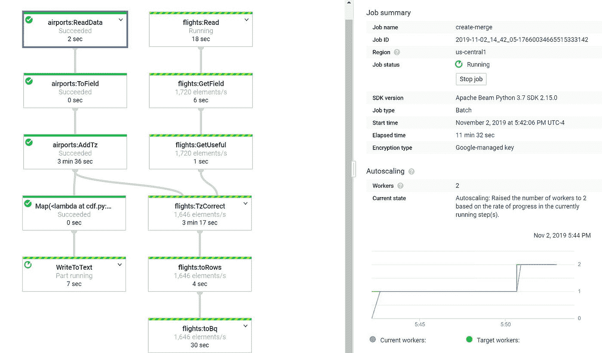
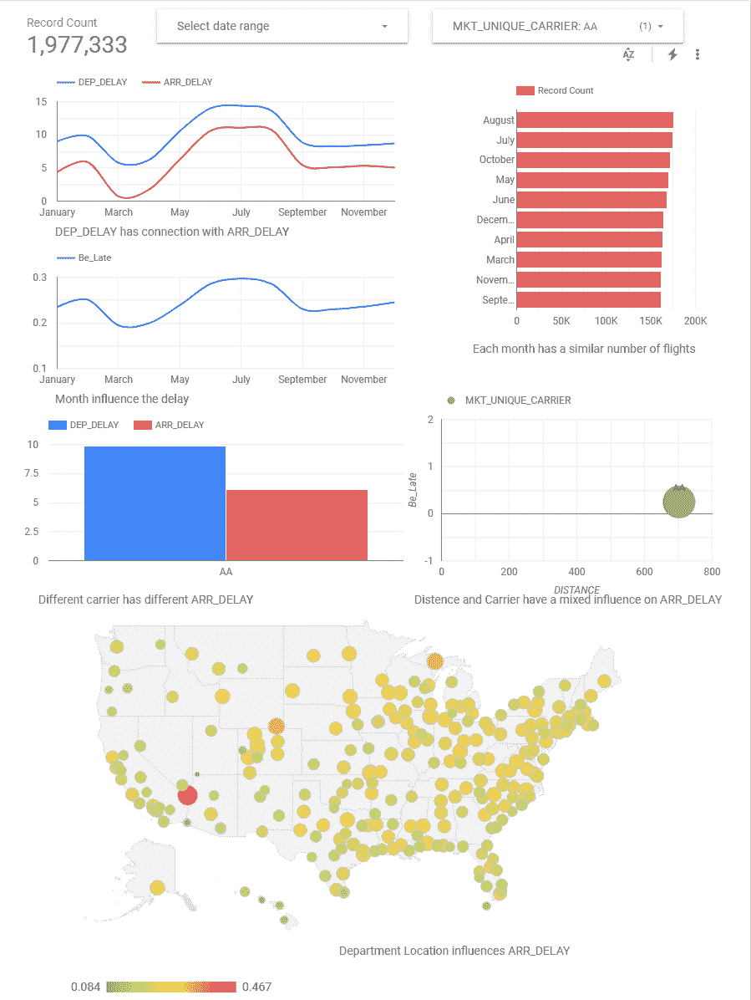
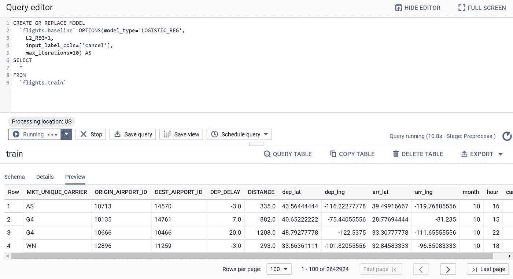
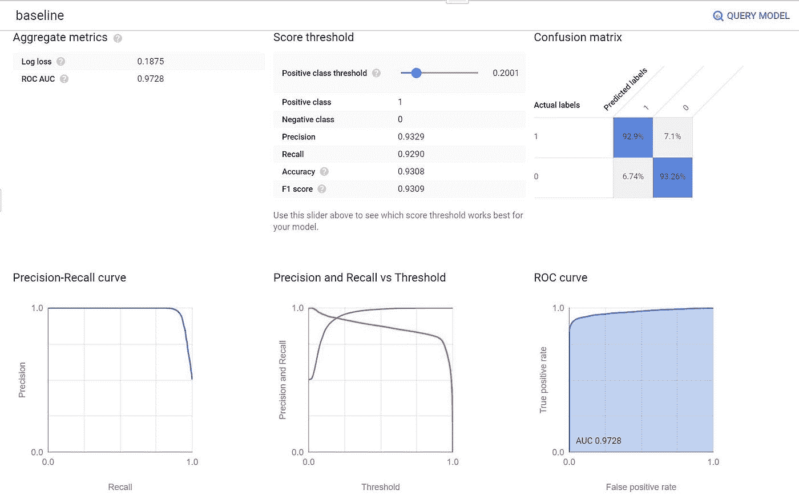
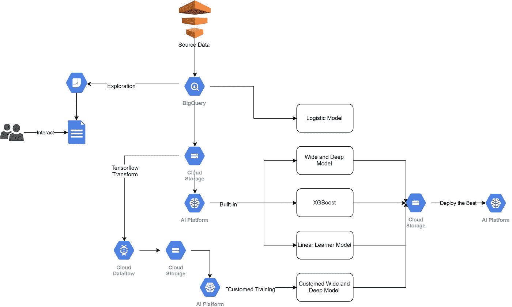
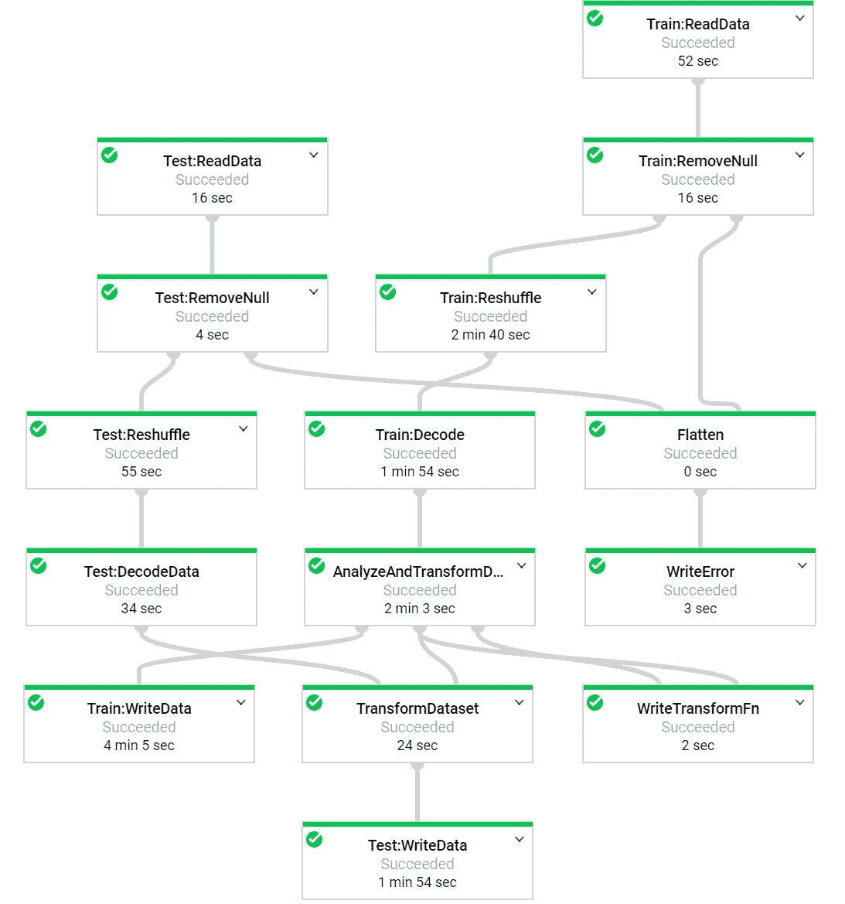
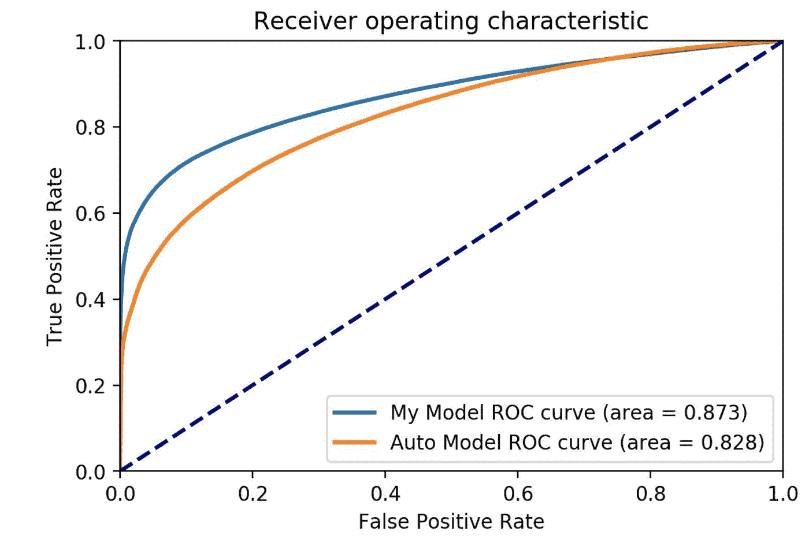
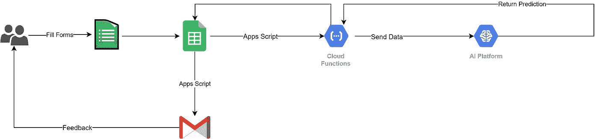
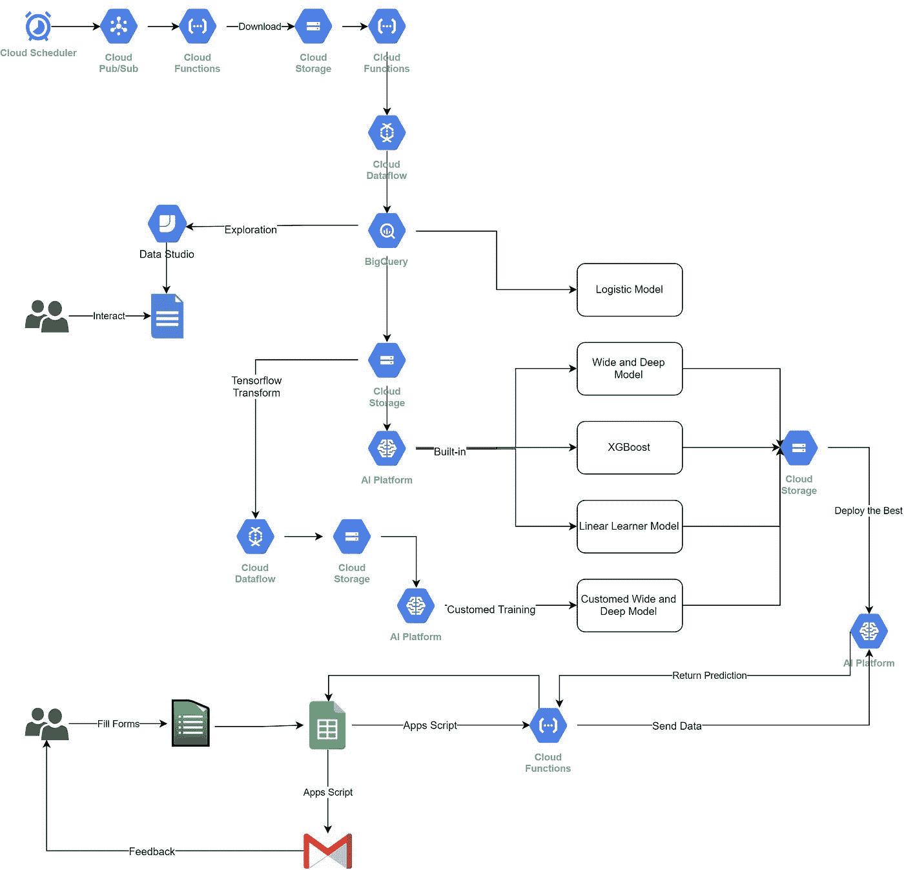

# 避免迟到的会议——GCP 的一个玩具项目

> 原文：<https://medium.datadriveninvestor.com/avoid-late-meeting-s-a-toy-project-on-gcp-461969692e77?source=collection_archive---------8----------------------->

本文展示了谷歌云平台(GCP)上的一个玩具项目。

想象一下，你在飞机上，你将在一个偏远的地方参加一个超级重要的会议。如果你会迟到，最好早点取消(当轮子掉下来的时候)，而不是让 CEO 或 CTO 等着你的到来，烦你怎么敢不尊重他们。

尽管如此，有人迟到**不到 10 分钟**还是可以接受的。作为一个非机器，很难做到每次都守时，这是可以理解的。

你想知道你是否有可能预测你是否会太迟。然后，你可以尽可能多地召开不晚的会议，那就太好了！

这个项目的目标是让这一愿景成为现实。我将建立一个深度学习模型，它可以为您提供是否取消会议的建议。

 [## 信息图:云之旅|数据驱动的投资者

### 聪明的企业领导者了解利用云的价值。随着数据存储需求的增长，他们已经…

www.datadriveninvestor.com](https://www.datadriveninvestor.com/2018/09/22/infographic-journey-to-the-clouds/) 

我用的是来自 [Transtats](https://www.transtats.bts.gov) 的 2018 年的飞行数据。我利用 GCP 完成了以下任务:

1.  构建可以每月自动下载和清理数据的微服务器
2.  批量下载 2018 年数据并处理
3.  随机抽取 80%的数据构建深度学习模型
4.  使用剩余数据的一半来评估模型
5.  部署模型

我知道你可能想先试试。[这里](https://forms.gle/SYNVKpKsd7vy3qYT6)你去吧。

# 发展

# 微服务器实现自动下载

在这一部分，我准备了训练目标模型的数据。下面是这部分的示意图。

我使用云时间表、云 Pubsub、云函数和云数据流作为微服务器，一起执行每月自动下载、处理和保存任务。

云调度程序将向云发布订阅的“每月提醒”主题发送消息。当消息到来时，它将触发一个云功能，该功能将从 Transtats 下载最新的月度数据，将其解压缩，更改名称并将其作为 CSV 文件保存到云存储中。当新的 CSV 文件成功保存在云存储中时。它将触发另一个云函数，该函数将向云数据流提交一个作业。然后，云数据流将消化新数据，进行一些转换，并最终将其存入数据仓库 Bigquery。

让我举例说明其中的一些组成部分。

云数据流—数据准备

数据流是“用于执行各种数据处理模式的托管服务”它可以处理大量数据，如 1 TB 或更多，以及数百 MBs 大小的数据。

Apache Beam 是它的“主人”，或者说，数据流是 Apache Beam 的一种运行者。Apache Beam 抽象了数据处理管道，它统一了编程模型来定义和执行数据处理管道，包括批处理和流处理。因此，我不需要关心硬件、语言、平台，甚至是批量数据还是流数据。我只需要实现*如何*处理数据，只关注数据流。

此外，数据流可以自动调整机器数量，以优化成本和运行时间之间的平衡。费用是基于杯子的数量和你使用的时间。因此，运行 1000 个 CPUs 1 小时与运行 1 杯 1000 小时的价格相同。如果 1 小时能解决一个问题，我为什么要等 1000 个小时？尽管如此，价格考虑了供应机器的时间，因此 1000 个 CPU 将需要更多的准备时间，从而产生更高的成本。

对于这里的转换，它完成了两项任务:删除没有到达时间的记录，并将所有本地时间转换为 UTC +0，这是一种时间戳规范化。处理情况如下。

Bigquery + Datastudio —数据探索

Bigquery 就是数据仓库，其成本相当于 Google 存储的成本。这样一来，即使我把数据存储在这个可以和数据交互的地方，成本也不会增加。

我说的“与数据互动”是什么意思？在 Bigquery 中，我可以查询我感兴趣的问题，比如一些航空公司是否更有可能晚点，或者季节是否会影响航班的延误。此外，数据可以加载到 Data Studio 中，这是一个由 Bigquery 提供支持的可视化工具。

在这里，我把我的问题的结果展示在下面。承运人的类型、季节、距离和地点都与延误有关，这符合我的直觉。(我知道你会对一些反直觉的东西更兴奋)。

此外，它不是一个静态的可视化工具。当我说它由 Bigquery“驱动”时，我的意思是你可以通过触摸这些图标来“查询”数据。例如，您可以选择特定的日期范围。所有的可视化结果都会自动改变。

从 Data Studio 的探索中，我注意到承运人、地点、部门延迟、距离和日期时间或多或少都会影响航班的延迟。因此，我选择了相关的特征，包括' arr_lat '，' dep_lat '，' dep_lng '，' arr_lng '，' DEP _ 延迟'，'距离'，'小时'，'月'和' MKT_UNIQUE_CARRIER '来训练一个复杂的模型。但在此之前，让我们回到 Bigquery。

Bigquery 不仅仅是一个提供基本 SQL 函数的工具。我可以在这里建立一个逻辑模型，作为我未来复杂的深度学习模型的基线。

我使用“rand()”函数对训练数据集、评估数据集和测试数据集进行采样。哦，不要忘记作为机器学习中的常识，在训练数据中平衡负样本和正样本是至关重要的，即，有类似数量的“取消”数据和“非取消”数据。然后，我可以使用 Bigquery 中的 ML 训练函数来训练这个数据集的第一个基本模型，并查看它的性能。

不要被训练结果所迷惑，下面是真实的评价表现。尼斯，logistic 模型，可以达到 0.798 左右的 AUC。这是我需要打破的底线。

# 模特培训

这部分我训练了四类模型，部署了最好的。下面是这部分的示意图。

我认为，训练一个机器学习模型就像烹饪一样。如果有食谱的话，我应该先试试现有的食谱。重新发明比萨饼并不有趣，新的比萨饼可能没有“有经验的”比萨饼好吃。在 AI 平台中，有三种内置算法，我应该先试试。了解机器学习工作的基本设置，我就可以利用谷歌人工智能的“神奇”力量。

这三种算法是 XGBoost、广度和深度模型以及线性学习者模型。XGBoost 树是一种传统的机器学习模型。像随机森林树一样，它基于决策树集成，该集成结合了多个分类和回归模型的结果。广度和深度模型将学习和“记忆”广泛规则的线性模型与“概括”规则的深度神经网络相结合。线性学习器模型为每个输入特征分配一个权重，并对权重求和以预测数字目标值。查看更多详情。

他们的最终评估结果比较如下。奇怪的是，内置算法日志中的最终评估似乎只使用了部分评估数据。结果，后来，我不得不使用所有的评估数据来评估最好的内置模型。

很明显，宽而深的模型在这里表现最好。现在，是时候写我的代码了，看看我是否能打败谷歌的自动化。

在这里，首先，我使用了 Tensorflow Transform，它是数据处理的一个扩展。它具有 API 来处理特征调整(例如，缩放和归一化数值)、表示转换(例如，桶化)、特征构造(例如，特征交叉)等。此外，它可以使用数据流来运行处理作业。我们之前提到过，dataflow 可以处理 TB 级的作业，也可以处理 MB 级的作业。因此，对数据进行处理并为培训做好准备是很有时间效益的。此外，它会将转换附加到导出的模型上。因此，它解决了恼人的预处理挑战——训练服务偏斜。这种偏斜是训练和服务的预测性能之间的差异。这在很大程度上是由培训和服务管道中的数据处理方式之间的差异造成的。更多信息见[此处](https://cloud.google.com/solutions/machine-learning/data-preprocessing-for-ml-with-tf-transform-pt1)。

在这里，对于数字数据，如“DEP 延迟”和“距离”，我将它们归一化为“0–1”。对于字符串特性，比如“MKT_UNIQUE_CARRIER ”,我首先将它们散列到值中，并对它们进行一次性编码。对于像“纬度”、“经度”、“小时”和“月”这样值，我将它们放入桶中，以便可以表示这些特征的类别信息。最后，我通过将“纬度”和“经度”交叉并分类来创建一个新的特性。我可以利用我的知识击败谷歌的自动化。

https://gist.github.com/0ae8437446a1ebae317eb4f2d572af0c

对于超参数，包括层数和第一个隐藏层的大小，我可以写一个. yaml 文件，如下所示。然后 AI 平台会用它的算法去搜索这些值的最佳组合。等待不到一个小时，我可以看到我的结果。幸运的是，我的比谷歌的自动数据处理和模型创建要好。

【https://gist.github.com/4f9289ee6458505c20f7beee78743892 

在这里，我们可以做模型检查，以便我们可以知道模型的利弊，然后可以“有针对性地”完善模型。例如，使用假设工具([https://pair-code.github.io/what-if-tool/](https://pair-code.github.io/what-if-tool/))。然而，从我的经验来看，这个工具对人工智能平台并不友好。此外，它与 GCP 没有直接关系。所以，我跳过这部分。

然后，是时候部署模型了。

# 模型部署

在这一部分，我使用 Google Sheet 作为平台，AI-platform 作为后端来部署我的模型。下面是这部分的示意图。而以这种方式使用 Google Sheet 的想法来自于“[如何将电子表格成长为应用程序，Google Next 2019](https://www.youtube.com/watch?v=vnm6ViI06MM) ”

正如我在以前的一篇文章中提到的，这里至少有三个解决方案。

首先，只需单击“部署模型”。然后，GCP 将它部署在 ML 引擎上，并处理所有其他流程。第二，可以自己部署模型，使用 docker 让模型服务容器化是选项。基于 [TensorFlow Serving](https://github.com/tensorflow/serving) 编写 Dockerfile 并使用 [Google Build](https://cloud.google.com/cloud-build/) 将模型包装到容器中并部署到 [Kubernetes](https://cloud.google.com/kubernetes-engine/) 会非常快。最后，为了实现最大程度的 DIY，你可以选择使用虚拟机，做你想做的事情。但是，在这种情况下，您必须设置网络转发规则、安全规则等..

为了简单起见，我选择了第一个选项。这里值得注意的是，要调用部署在 Google ML 引擎上的模型，需要[一个“ML 引擎开发人员”的角色](https://cloud.google.com/ml-engine/docs/access-control)。一个有用的做法是创建一个具有该角色的服务器帐户，并将该服务器帐户授予一个 Google Functions 上的微服务器。

我选择 Google Sheet 作为平台来创建一个演示应用程序。Google Sheet 拥有数据库、UI、安全性和大量内置 API。为了匹配这个平台，我使用 Google Forms 作为应用程序 UI。

数据是从谷歌表格中收集的。在用户提交表单后，它会触发我在 Google Sheet 中编写的“应用程序脚本”，它会将来自用户的信息转换为单个有效载荷，并调用 Google Functions 上的微服务器。微服务器会将有效载荷中的数据转换成我的模型可以接受的格式。为什么需要它？因为这样做，我可以隐藏我的模型的秘密。此外，这也是关注点的分离。稍后，Google Sheet 将从我的模型接收预测结果，并根据结果发送电子邮件。如果模型预测用户参加会议不会太晚，电子邮件将鼓励用户保留会议。否则，它会建议用户取消会议。

[https://gist.github.com/f4277a695b3ceec7713a4093bf7babe2](https://gist.github.com/f4277a695b3ceec7713a4093bf7babe2)

# 包裹

让我们总结一下整个结构。

好看吗？可以试试！

快乐创作！

*最初发表于*[*【https://github.com/Moo-YewTsing/airline_demo】*](https://github.com/Moo-YewTsing/airline_demo)*。*