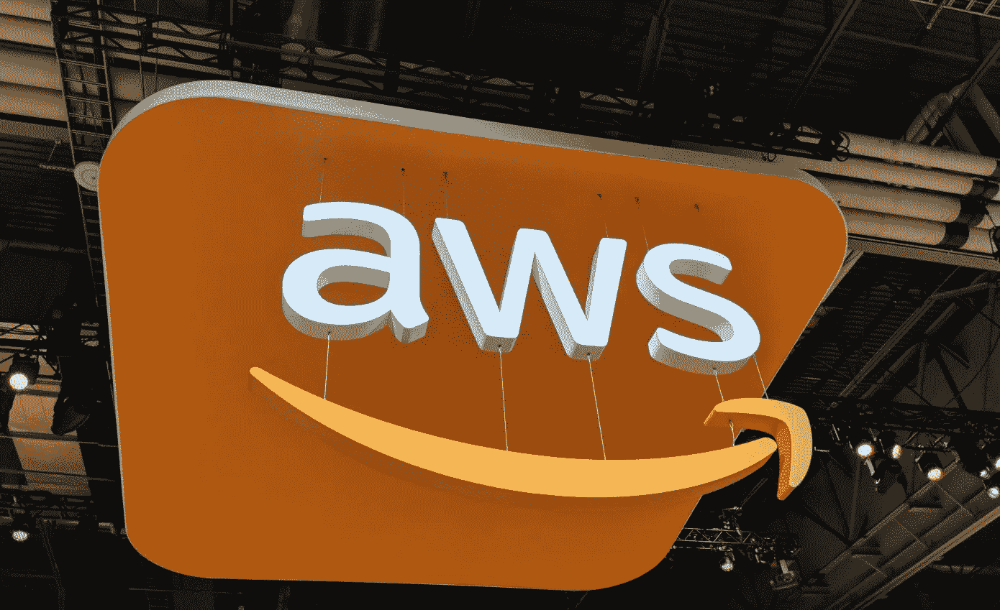

# AWS 着火了

> 原文：<https://medium.datadriveninvestor.com/aws-on-fire-df0996af28bf?source=collection_archive---------8----------------------->

上周，AWS 在拉斯维加斯举行了年度创新大会。可以概括为“AWS 火了。”这是一次壮观的活动，AWS 不仅展示了他们如何取得技术领先地位，更重要的是看到了业务增长和大型企业对 AWS 云的采用。企业越来越明显地意识到，如果不采用公共云技术，业务现代化就无法实现。(这里的云不包括 SaaS)

虽然我们仍处于企业采用云的第一或第二阶段。它正在变成一场三家公司的竞赛，AWS 作为第二和第三大重要参与者，大幅领先于微软和谷歌。其他云玩家没有资源(金钱和技术)来玩这个游戏。如果企业采用除这三种之外的任何其他云，都应该谨慎。

AWS 不仅在 15 年前发明了云技术，而且以前所未有的速度持续创新，目前的年运行率为 270 亿美元。云是一个价值 1800 亿美元的市场，虽然整体市场正以 22%的健康速度增长，但 AWS 的增长率为 46%，几乎是市场增长率的两倍。AWS 不仅受益于云增长，还受益于市场份额。Andy Jassy 报告称，根据 Gartner 的数据，AWS 的全球 IaaS 市场份额为 51%，相比之下，微软为 13.3%，谷歌为 3.3%。然而，微软和谷歌的总云收入正以 100%的速度增长。

在核心层面上，你可以把 AWS 的增长归结于一件事:“他们对开发者的关注”。“AWS 最初是一家面向开发人员的 API 公司，并一直专注于开发人员。与其他云供应商相比，AWS 提供了广度和深度的服务。

在这个阶段，AWS 是一辆失控的火车，只有微软(他们有一个很好的企业战略)和谷歌(有伟大的 ML/AI，移动和云原生故事)。剩下的云厂商很快就会大败。总体而言，客户将从这些科技巨头的良性竞争和创新中受益匪浅。

AWS 大会有三个核心主题:

**1。AWS 进入云混合解决方案:**

去年，AWS 和 VMware 宣布合作，您可以在 AWS 上运行在客户数据中心运行的相同虚拟机软件，使用现有虚拟机工具进行管理，并将工作负载从数据中心无缝迁移到 AWS。

今年，AWS 正在扩展他们的合作伙伴关系，这将使 AWS 能够通过 AWS 前哨提供混合云市场。AWS 前哨将本机 AWS 服务、基础架构和运营模式带到几乎任何数据中心。有了它，您可以在内部和云中使用相同的 API、相同的工具、相同的硬件和相同的功能，以提供真正一致的混合体验。借助前哨站，客户可以将他们的关键工作留在本地。

AWS 前哨站有两种形式:

1.AWS Outposts 上的 VMware Cloud 允许您使用与运行基础架构相同的 VMware 控制平面和 API，

2.AWS Outposts 的 AWS 本机变体允许您使用与在 AWS 云中运行时完全相同的 API 和控制平面，但在本地运行。

在这种情况下，AWS 正在从微软 Azure 的 Azure 战略中抽出一章。有趣的是，AWS 没有提供任何与 VMWare 合作关系相关的数字。他们在新模式下的表现如何，还没有定论。

**2。云迁移**

有很多关于云迁移的重点。在 Andy 的主题演讲中，他提到过渡到云需要 2 到 5 年的时间。AWS 正在构建许多工具来帮助企业完成迁移之旅。AWS 正在编纂和构建工具来简化和加速迁移。例如，嘉德保险公司就是展示客户之一。嘉德保险是一家有着 158 年历史的公司，拥有 715 亿美元资产和 2600 万订户。他们采用了 AWS 平台，并将 200 个应用程序迁移到 AWS。

**AWS 控制塔**为客户提供自动化的“登陆区”,使他们可以轻松设置多帐户环境，并通过安全、运营和合规性规则持续管理他们的 AWS 工作负载。

**AWS 湖形成**:当前构建和管理数据湖的步骤是手工的，非常复杂。AWS Lake formation 是一项托管服务，通过简化和自动化许多通常需要的复杂手动步骤，包括收集、清理和编目数据，使客户更容易构建安全的数据湖。它使用机器学习来移动、保护、分类和清理数据。它在多个服务之间实施安全策略。

**AWS 安全中心**是管理整个 AWS 环境的安全性和合规性的中心位置，因此客户可以在一个全面的视图中快速查看他们的 AWS 安全性和合规性状态。AWS 安全中心还集成了许多领先的安全供应商(中心合作伙伴)，这保护了客户的投资，提高了客户的价值。它获得并管理新的洞察力。

**3。AI 与机器学习:**

而亚马逊一直在用 AI 和机器进行亚马逊业务；去年，它推出了 Sage AL/ML 服务，并在该领域挑战包括谷歌、微软和 IBM 在内的竞争对手。今年，AI 和 ML 处于中心位置，AWS 正在做出重大改进。AWS 报告称，他们已经有 10，000 多名使用 Sage 的活跃客户，并且它正在被多个垂直行业采用。

今年，他们对人工智能和人工智能进行了重大改进，其功能针对以下三个角色:

1.ML 和 AI 领域的研究人员和专家，速度更快，成本更低。

2.增强 SageMaker 套件和 ML 框架的开发人员和数据科学家。

3.对人工智能知之甚少的应用程序开发人员通过提供他们可以利用的服务，而不需要他们具有特定的人工智能知识。

总的来说，AWS 的主题是；

1.降低 AI & ML 开发和运营的成本。

2.如何处理大量数据

3.面向更广泛受众的 AI 和 ML 的易用性。

AI/ML 中的一些重要公告包括:

**亚马逊弹性推理:**这为任何亚马逊 EC2 实例增加了 GPU 加速，以更低的成本实现更快的推理——节省高达 75%。通过附加弹性推理，当检测到主要框架(TensorFlow、Apache MXNet 或 PyTorch)时，它将工作转移到弹性推理。弹性推理匹配按需从 1 TFLOPS 扩展到 32 TFLOPS 的能力。

**AWS 推理:**由 AWS 定制设计的高性能机器学习推理芯片。这种芯片是 GPU 的替代物，用于训练。它将更具成本效益，并将支持所有主要框架。它也可以作为弹性推理使用。AWS 声称将成本提高 10 倍。

AWS 声称，在弹性推理和推理之间，它将是一个游戏改变者。

**亚马逊 SageMaker 地面真相**:拥有高质量的标注数据对监督学习至关重要。Ground truth 通过使用机器学习建立了高度准确的训练数据集，并将数据标注成本降低了 70%。当自动置信度较低时，它还允许人工注释。

**机器学习的 AWS 市场:** SageMaker 已经提供了一套广泛的内置算法。机器学习市场亚马逊提供第三方算法，模型在 SageMaker 平台上立即可用。目前，市场上有 150 种算法，预计将呈指数级增长。

**亚马逊个性化:**这是实时个性化和推荐服务，基于 Amazon.com 使用的相同技术。最重要的因素是，使用这项服务不需要洗钱。下划线技术是一样的。个性化和推荐引擎与推动 Amazon.com 零售业务的引擎相同。当你可以使用世界一流的推荐引擎时，为什么要重新发明轮子呢？

客户正在采用基于云的技术来更新他们的代码系统，扩展数字体验，采用新技术来保持竞争力和相关性。从数据中心到基于云的技术有一个巨大的转变。从业务和技术角度来看，没有哪家公司比 AWS 更有优势。AWS 统治着市场，目前，还没有人能与之匹敌。