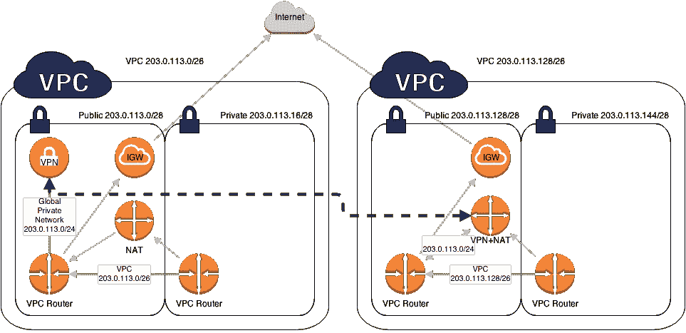

# AWS 初学者 VPC

> 原文：<https://medium.datadriveninvestor.com/aws-vpc-for-beginners-eee01e7083d1?source=collection_archive---------1----------------------->

## AWS 认证开发人员助理考试的简明 VPC 参考

Photo by [King's Church International](https://unsplash.com/@kingschurchinternational?utm_source=medium&utm_medium=referral) on [Unsplash](https://unsplash.com?utm_source=medium&utm_medium=referral)

本周，我总结了我对亚马逊虚拟私有云(VPC)的了解。如果你想看看我对 AWS 还了解些什么，那就看看我的 [DynamoDB 概述](https://medium.com/@lewisdgavin/aws-dynamodb-overview-184e53aedcd6)和 [S3 概述](https://medium.com/@lewisdgavin/aws-s3-overview-6fe9ca2a1e0a)。

如果你正在考虑参加 AWS 开发人员助理考试，并且想要一个地方来帮助复习，这篇文章更多的是作为参考。

# 这是什么？

VPC 是 AWS 中特定于您的虚拟网络，用于保存您的所有 AWS 服务。它是 AWS 中的逻辑数据中心，将有网关、路由表、网络访问控制列表(ACL)、子网和安全组。

需要注意的事项:

*   每个子网存在于一个可用区域内。
*   安全组是有状态的，ACL 是无状态的
*   VPC 的可以在同一个账户内或跨 AWS 账户查看
*   传递对等是不允许的，这意味着你不能通过另一个 VPC 从一个 VPC 跳到另一个。你必须有直接的途径。

# 为什么要用 VPC？

当您在公共云中开放服务时，它实际上是向全世界开放的，并且可能面临来自互联网的攻击。为了锁定您的实例并保护它们免受来自外部的攻击，您将它们锁定在 VPC 中。VPC 限制什么样的流量、IP 地址以及可以访问您的实例的用户。

这可以防止不受欢迎的访客访问您的资源，并保护您免受 DDOS 攻击之类的攻击。并非所有的服务都需要接入互联网，所以这些服务可以安全地锁定在一个专用网络中。然后，您可以只将某些机器暴露在互联网上。

显然，如果你想安装软件或从被互联网封锁的私有实例访问互联网，那么这是一个问题。然而，对于这个问题有几个解决方案，我将在下面介绍。

# NAT 实例

NAT 实例可以用来解决“我如何在我的安全私有实例上安装来自互联网的东西”的问题？

NAT 实例创建在可访问互联网的公共子网中。一旦您允许从您的私有实例访问您的 NAT，您的私有实例就能够向 internet 发出请求。这种访问是单向的，即来自互联网的人无法访问您的实例。

需要注意的事项:

*   NAT 实例必须在公共子网中
*   它必须有一个弹性 IP
*   必须有一条从您的专用子网到 NAT 实例的路由
*   您可以使用自动扩展组和多个子网手动创建高可用性
*   与 Bastian 不同，因为 NAT 用于提供对私有实例的 internet 访问，Bastian 用于管理使用 SSH 的实例。
*   它们现在已经被废弃，被 NAT 网关所取代

*图片取自*[*【wrathofchris.wordpress.com】*](https://wrathofchris.wordpress.com/2014/04/14/crossing-the-amazon-vpc-boundary/)

# NAT 网关

NAT 网关基本上取代了 NAT 实例，因为它们允许从私有子网以相同的安全性访问互联网。然而，它们更容易设置和扩展，因为这都是由 Amazon 管理的。

需要注意的事项:

*   自动扩展至 10Gbps
*   不需要手动打补丁——Amazon 会处理这个问题
*   不与安全组关联
*   自动分配了一个公共 IP

# 网络访问控制列表(ACL)

默认情况下，VPC 将带有网络 ACL，它将允许所有入站和出站流量。然而，如果你创建一个默认的网络 ACL，它将**阻止**所有的入站和出站流量，你将不得不自己手动允许流量。

VPC 中的每个子网必须连接到一个网络 ACL，但是，每个子网一次只能连接到 1 个 VPC。但是，ACL 可以连接到多个不同的子网。

要记住的事情:

*   网络 ACL 包含允许流量的有序规则列表
*   惯例是从 100 个规则开始，以 100 为增量递增。
*   将考虑这些规则，以确保如果您希望允许除特定 IP 地址之外的所有 ssh 访问，请在允许所有规则之前添加阻止规则。
*   入站和出站流量有不同的规则，因此您必须为每个流量设置规则。
*   它们是无状态的，这意味着对入站流量的响应取决于出站流量规则，反之亦然。
*   使用网络 ACL 而不是安全组阻止 IP 地址

# 跳回

对于弹性，建议始终拥有 2 个公共子网和 2 个私有子网，并确保它们都位于不同的可用性区域。这同样适用于弹性负载平衡器。

NAT 实例要实现高可用性要稍微困难一些，所以建议使用 NAT 网关，因为所有这些都会得到处理，不需要人工操作。

通过打开 [VPC 流量日志，您可以随时监控 VPC 内的流量。](http://www.lewisgavin.co.uk/AWS-VPC/)

***注册成为中级会员*** [***使用此链接***](https://lewisdgavin.medium.com/membership) ***可以访问我的所有文章(其他人也一样！).***