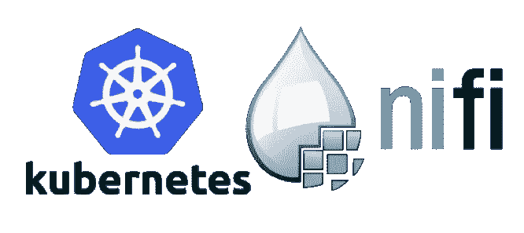

# 使用 B23 Kubernetes 运算符为 Nifi-Fn 发布无服务器数据流

> 原文：<https://medium.datadriveninvestor.com/b23-announces-b23-data-platform-integration-with-the-google-kubernetes-engine-gke-56941d75ace3?source=collection_archive---------24----------------------->

**Announcing Serverless Data Flows using B23 Kubernetes Operator for Nifi-Fn**

Apache NiFi 为获取和转换数据提供了一个庞大而多样的处理器库，并提供了一个流注册中心来管理这些复杂的数据流。B23 在多个基础设施和编排平台上使用 NiFi，包括 Kubernetes。我们开创性的 NiFi 工程工作使我们能够使用预先存在的、同类最佳的数据流库，以编程方式提供数据流，这些数据流是我们在多年的运营使用后开发和完善的。由于 Cloudera 的 Sam Hjelmfelt 最近在 NiFi-Fn 项目上的开发工作，现在有了一条直接在 Kubernetes 上运行 NiFi 流的直接路径，而不需要管理复杂的 NiFi 集群。

NiFi-Fn 项目为 NiFi 带来了作为无服务器应用程序执行预先存在的数据流的能力。这对于 NiFi 用户来说意味着，现在可以按需启动流，并通过成功处理作为流输入发送的所有流文件来成功运行。NiFi-Fn 的 *B23 Kubernetes 操作员*将特定流的作业管理卸载给 Kubernetes。我们工作的一个灵感来自于 Google 最近发布的用于 Apache Spark 的开源 Kubernetes 操作器。

在 B23，我们选择在 Google Kubernetes 引擎(“GKE”)上运行基于容器的工作负载。对我们来说，通过利用自定义资源定义(“CRD 的”)来管理我们作为 Kubernetes 一等公民的 NiFi 流非常重要。这允许我们像 Kubernetes 中的任何其他资源一样创建和管理我们的数据流。使用我们熟悉的命令，如“ku ectl create-f nif IFN-flow . YAML”或“kubectl get NiFiFn ”,我们可以创建新的流，并列出正在运行或已完成的数据流。

操作员将处理一个 *Kubernetes Job* 资源的创建，并在从注册中心提取后执行所需的流程。这让 Kubernetes 处理重试和清除的语义，同时让用户控制流的逻辑和执行。

用于 NiFi-Fn 的 *B23 Kubernetes 操作器是开源的，并且获得了 Apache 许可。它已经通过 docker-for-desktop 在本地进行了测试，并通过 Google Kubernetes 引擎在云中进行了测试。关于如何改进这一新功能，我们有许多想法，我们期待着与 NiFi 社区密切合作，进一步开发它。如果您想亲自试用这个操作符，请前往 github 库开始:[https://github.com/b23llc/nifi-fn-operator](https://github.com/b23llc/nifi-fn-operator)*

NiFi-Fn 项目的 JIRA 入场券:[https://issues.apache.org/jira/browse/NIFI-5922](https://issues.apache.org/jira/browse/NIFI-5922)