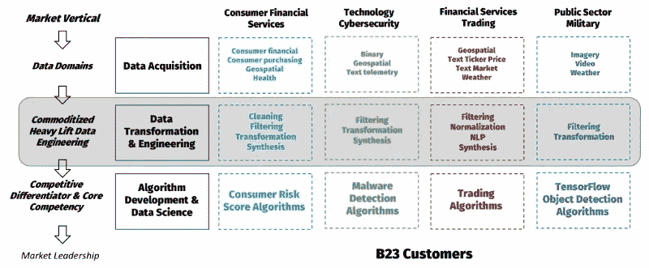

# Jefferies Battlefin 会议上强调 B23

> 原文：<https://medium.datadriveninvestor.com/b23-highlighted-at-jeffriess-battlefin-conference-1f6225f10f13?source=collection_archive---------19----------------------->

我们的团队刚刚从迈阿密的另一个极其富有成效的 Jefferies BattleFin 会议上回来，思考了我们在金融服务和对冲基金人工智能(“AI”)市场中观察到的几个主题。Jefferies BattleFin 会议有 470 名与会者，是观察、听取和会见对冲基金替代数据和人工智能相关专家的首要活动。会议本身的规模不断扩大，与技术驱动型投资者相关的数据提供商和技术服务也越来越多样化。我们很高兴今年能够再次参加一个小组讨论，讨论的主题是我们有着高度信念和经验的主题，与这么多新的和熟悉的行业专家会面非常有意义。

今年活动的主题概述包括:

使用合格的第三方技术合作伙伴(如 B23)提高数据工程即服务的接受度

大规模的机器学习与公共云基础设施的结合越来越紧密

替代数据本身能够提供的 T2 阿尔法值的数量更加实用

在如此频繁的人员流动和交叉授粉的情况下，采用新的创新理念面临的挑战

***对冲基金的数据工程即服务***

今年非常流行的一个新兴主题是接受外包数据工程或数据工程即服务。与我们交谈过的许多机构正在迅速适应这一趋势，这与我们在非金融服务垂直领域的观察结果一致。很明显，越来越多的机构继续追求一种策略，将数据工程的“无差别提升”外包，以便这些公司专注于定量投资分析的高阶结果。

The Heavy Undifferentiated Lift of B23’s Data-Engineering-as-a-Service in Gray

越来越多的资金被用于构建基于云的数据湖，或者开发托管在分布式处理引擎上的持久且高性能的提取、转换和加载(“ETL”)应用程序。相反，他们正转向更合格、更值得信赖的技术合作伙伴。利用数据工程即服务的结果是一个熟悉的基于 SQL 的仪表板，如 Tableau、自定义数据 API 或一个更小的功能更丰富的数据集，可以在商用笔记本电脑上使用 Excel 或 Jupyter notebook 进行建模。

***关注核心竞争力***

正如任何商业和管理咨询公司从第一天起就建议客户的那样，专注于核心竞争力和外包无差别的任务，尤其是当这些无差别的任务可以由第三方以更低的成本更好地执行时，这是一个非常好的商业计划。金融机构的核心能力显然不是数据工程，而是越来越多地使用数据驱动的投资策略做出有利可图的投资决策。我们在 BattleFin 见到的大多数组织都没有忘记这个基本前提。

与我们继续亲眼目睹云计算如何强化大规模构建和运营计算和存储基础架构对于几乎所有组织来说都是无差别的不同，我们在会议上遇到的大多数机构对数据工程的认识水平也在迅速提高。

***拥抱基于云的机器学习***

在与许多金融机构和技术供应商会面后，我们观察到的另一个主题是，使用谷歌、亚马逊、微软等基于云的机器学习的认识。是一个比*自己动手 AI* 更有效的策略。这些“技术巨头”可以获得的大量培训数据和廉价基础设施让组织很难跟上步伐。灯泡时刻云既是一个更好的基础设施，也是一种人工智能能力，这是一种趋势，从一年前的几乎零理解，到今年的完全接受。最终结果是，基于云的人工智能对许多公司来说是一个更大的强制功能，让他们更积极地采用云计算

**另一个观察结果是，围绕替代数据的炒作持续高涨，我们很清楚，最具生产力的组织正在使用传统财务数据、一些替代数据和老式人类直觉的组合来做出明智的业务决策。我们怀疑，除了少数机构之外，所有机构都有能力仅使用替代数据做出投资决策，不管大多数数据提供商怎么说。**

*****注入创新*****

**最后一个观察结果与交叉污染和一小组数据购买者的公司之间的人员流动有关。我们不清楚组织将如何保护他们希望使用替代数据生成的 *alpha* ，因为这些个人数据购买者经常更换雇主。我们还不清楚新的创新思想将如何渗透到这个被认为是由人和技术提供商组成的封闭生态系统的环境中。作为一家从外向内看的技术公司，我们觉得有很大的机会带来新的想法、技术和做事方式，以增强已经非常好的工作，而不仅仅是复制其他人可能已经在做的事情。**

## **来自 DDI 的相关故事:**

** [## 为什么数据会改变投资管理

### 有人称之为“新石油”虽然它与黑金没有什么相似之处，但它的不断商品化…

medium.com](https://medium.com/datadriveninvestor/why-data-will-transform-investment-management-4a60966c1c81)  [## 数据科学和软件工程哪个更有前途？

### 大约一个月前，当我坐在咖啡馆里为一个客户开发网站时，我发现了这个女人…

medium.com](https://medium.com/datadriveninvestor/which-is-more-promising-data-science-or-software-engineering-7e425e9ec4f4)**