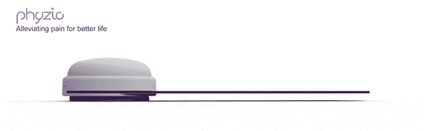
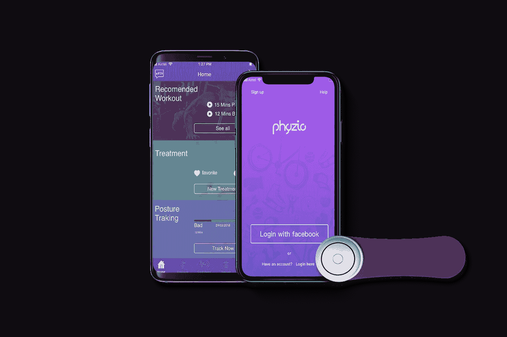

# 背痛是你办公室工作的阻力吗？

> 原文：<https://medium.datadriveninvestor.com/back-pain-acting-as-resistance-in-your-office-work-phyzio-empowered-with-advance-ai-for-prevention-75ae9c8fb68b?source=collection_archive---------17----------------------->

***概要:*** *许多员工每天都遭受背痛的折磨，并依赖麻醉剂/阿片类药物处方来控制其疼痛。名为* [*Phyzio*](https://www.phyzio.co/) *的人工智能驱动可穿戴设备可以为麻醉药物提供更有利可图的替代方案。*

Slouching while working?

你在办公室工作过很长时间吗？是的，我知道一个愚蠢的问题。

曾经工作到脖子或后背开始疼的时候，我知道另一个愚蠢的问题，问一个员工关于脖子和后背的问题，这可能更老套，但是你是怎么处理的呢？去健身房或瑜伽，或者在办公室当着同事的面做那些笨拙的伸展运动。但是你有没有想过为什么我们会感到疼痛？

疼痛是我们日常生活中经常用到的一个词。虽然这似乎是一种基本的身体感觉，但其背后的科学相当复杂，用最简单的话来说，疼痛信号是通过神经细胞通过小型电子模拟传输到大脑的。疼痛是我们大脑警告我们即将受到伤害的方式。

**背部，**然而另一种野兽对自己背部的疼痛可以是急性的，也可以是慢性的。**急性背痛** : —如果背痛持续不到 3 个月**慢性背痛** : —如果背痛持续超过 3 个月

# 什么原因导致背痛？

在大多数情况下，背痛是机械性的。其他原因可能是扭伤和劳损、与年龄相关的椎间盘退化、椎间盘突出或破裂、由于神经根压迫引起的神经根病、由坐骨神经压迫引起的坐骨神经痛、脊椎前移、椎管狭窄、外伤或骨骼不规则。一些可能导致背痛的潜在疾病是关节炎症性疾病，如关节炎和脊椎炎、骨质疏松症、子宫内膜异位症和纤维肌痛。

# Phyzio 能帮你什么？

Phyzio 是为任何患有背痛、关节炎疼痛、神经疼痛、肌肉疼痛以及纤维肌痛、坐骨神经痛和其他疼痛疾病的人设计的？如果你在办公室工作，抽不出时间进行日常锻炼，你就有患上背痛或腕管综合征(手/手腕疼痛、麻木)的风险。此外，你可能会抱怨由于上班时间姿势不当而引起的肩膀和脖子疼痛。

你所有问题的解决方案是 Phyzio。这种新的非麻醉可穿戴设备是它的一种，因为它可以立即缓解疼痛，帮助保持良好的姿势，并通过帮助你训练肌肉来改善身体运动，以防止未来的疼痛。在 100 多人中进行的临床试验中，这些人经历了至少 75%的疼痛缓解(使用 Phyzio 后，疼痛水平从最初的 10 级降至 2.5 级)。

Phyzio 是一种更好的药物替代品，具有以下优点:— 100%无药物，无副作用

–一次性购买，终身使用

–疼痛缓解进度分析

–用于姿势检测的人工智能辅助传感器

–轻巧、方便、易于随时随地使用

无药解忧，助身体恢复常态！

你的背痛对你的健康有危险吗？[阅读更多](https://www.phyzio.co/is-your-back-pain-dangerous-for-your-health-know-the-science-behind-your-back-pain-and-get-a-step-closer-to-relief/)