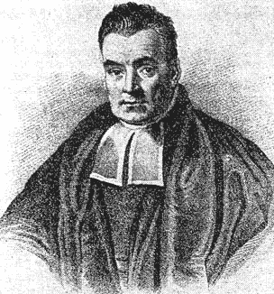
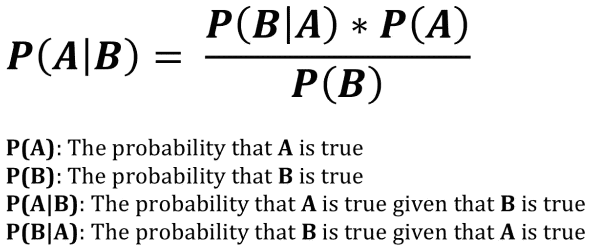

# 回到贝叶斯-ics

> 原文：<https://medium.datadriveninvestor.com/back-to-bayes-ics-e5dd4405c927?source=collection_archive---------5----------------------->

O’Donnell, Terence. *Portrait of an Unknown 19th-Century Presbyterian Clergyman Identified as Thomas Bayes (Book: History of Life Insurance in Its Formative Years, 1936 via Wikipedia)*

在我继续我的 NLP 项目之前，我需要重温一下贝叶斯法则。NLP 中的一个分类模型是基于贝叶斯定理原理的*朴素贝叶斯分类器*。贝叶斯推理是基于已知的以前已经发生的事件的概率。换句话说，贝叶斯定理是在事件 *B* 已经发生的情况下，事件 *A* 发生的概率。

# **应用公式**

Bayes’ Theorem. Note that the numerator on the right hand side (the probability of B occurring given that A occurred multiplied by the probability that A occurred) is equal to the probability of A and B both being true.

假设我们要去美国的任何一个城镇玩不给糖就捣蛋的游戏。你一手拿着一个小的南瓜灯样式的桶，另一手拿着一个大的枕头套。我们注意到一些奇怪的事情，因为在这个镇上开门的成年人只分发巧克力棒或葡萄干。你把小桶和大枕头套都装满了，*当然一路上没有吃任何糖果*，并决定把所有的战利品都堆在客厅的地板上。但在此之前，我们先计算一下每个容器中每种零食的数量。数字如下:

 [## 金融中的机器学习|数据驱动的投资者

### 在我们讲述一些机器学习金融应用之前，我们先来了解一下什么是机器学习。机器…

www.datadriveninvestor.com](https://www.datadriveninvestor.com/2019/02/08/machine-learning-in-finance/) 

*   南瓜灯:80 块巧克力和 20 盒葡萄干
*   枕套:54 块巧克力和 120 盒葡萄干

我们开始把零食倒在地板上，忘记了所有东西是从哪里来的。你偶然挑选了一样东西，幸运的是它是一条巧克力。如果出于某种奇怪的原因，我们想知道巧克力棒来自南瓜灯桶的概率会怎样？

这是一个简单的例子，只需用南瓜灯里的巧克力条的数量除以巧克力条的总数就可以得到答案。让我们将这些数字应用于贝叶斯定理，因为它将帮助我们理解后面更复杂的例子。

总共有 134 块巧克力(80 块来自南瓜灯，54 块来自枕套)和 140 盒葡萄干(20 块来自南瓜灯，120 块来自枕套)。

*   **P(A)** =零食来自南瓜灯的概率(*南瓜灯中的 100 个零食/274 个总零食* ≈ **0.3650** )
*   **P(B)** =款待是巧克力棒的概率( *134 块巧克力棒/274 次款待总数* ≈ **0.4891** )
*   P(A|B) =给定零食是巧克力棒，零食来自南瓜灯的概率
*   **P(B|A)** =假设零食来自南瓜灯，那么零食是巧克力棒的概率(80 *巧克力棒/南瓜灯中的 100 个零食=* **0.80** ，*对于我们的公式*是必要的)

将这些值代入贝叶斯定理，我们得到:

**P(A | B)=(0.8 * 0.3650)/0.4891**

**P(A|B) = 0.597**

我们的巧克力棒来自南瓜灯桶的概率是 0.597。当概率不容易得到或者如果有更多的类别需要考虑时，应用贝叶斯规则变得更加复杂。

# 经典医学测试示例

我第一次学习贝叶斯法则时，有人给了我这个例子，它来自保罗·d·伯杰(Paul D. Berger)和马克·g·基恩(Mark G. Kean)教授的《经理人统计》(2010)。想象一下对某种疾病的医学测试。测试结果可以是阳性(受试者患病)或阴性(受试者未患病)。1%的人口患有这种疾病，97%的患病者将检测为阳性，95%的未患病者将检测为阴性。*到目前为止，这似乎是一个不错的测试，对吗？*假设某人的检测结果为阳性，我们希望找出此人患病的概率:

*   **P(A)** =一个人得这种病的概率( ***1%*** )
*   **P(ā)**=一个人没有患病的概率( ***99%*** )
*   **P(P|A)** =在已知患者患有该疾病的情况下，测试结果为阳性的概率( **0.97** )
*   **P(N |ā)**=在已知该人没有患病的情况下，测试结果为阴性的概率( **0.95** )
*   **P(P |ā)**=在已知该人没有患病的情况下，测试结果为阳性的概率( **0.05** )
*   **P(N|A)** =在已知患者患有疾病的情况下，测试结果为阴性的概率( **0.03** )
*   **P(A|P)** =在测试结果为阳性的情况下，一个人患病的概率

这个方程的分子很简单: **P(P|A) * P(A)** 。但是分母呢，我们怎么计算从人群中随机抽取一个人的阳性检测结果的概率呢？

我们需要分解这个问题。我们知道一个人患有疾病的概率是 1%，而已知这个人患有疾病的阳性检测结果的概率是 97%。我们还知道，一个人没有患病**P(ā)**的概率是 99%，而已知这个人没有患病**P(P |ā)**的阳性检测结果的概率是 0.05%。这意味着阳性测试结果的概率为:

*   **P(P)= P(A)* P(P | A)+P(ā)* P(P |ā)**
*   **P(P)=**(0.01 * 0.97)+(0.99 * 0.05)
*   **P(P) = 0.0592**

把所有这些放在一起算出 **P(A|P)** :

*   **P(A | P)= { P(P | A)* P(A)}/P(P)**
*   **P(A | P)=(0.97 * 0.01)/0.0592**
*   P(A|P) = 0.1639

如果一个人的检测结果呈阳性，那么这个人患这种疾病的概率是 16.39%。设计师们需要从头开始。

# 结论

贝叶斯定理是许多高级机器学习技术的基础。当设计像垃圾邮件过滤器这样的朴素贝叶斯分类器时，这个定理可以应用于 NLP。上面的医学例子显示了某些概率如何提供了一个测试有效性的不完整图像。