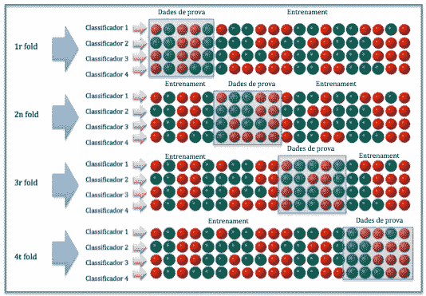

# 回溯测试:是什么和不是什么

> 原文：<https://medium.datadriveninvestor.com/backtesting-what-it-is-and-what-it-aint-58e85d6a22c6?source=collection_archive---------4----------------------->

Image: Wikimedia

*算法不能只靠回溯测试生存；而是在真实的市场上用真实的钱进行的每一笔真实的交易。*

也就是为了确认策略真的有效。

在自动交易的背景下，回溯测试是证明算法策略最低生存能力(或没有生存能力)的重要工具。这通常是战略编制完成后的第一步，并在适用的情况下进行培训；然而，许多开发人员在仅仅完成第一步之后就无法抗拒将他们的策略推向市场的诱惑，而不是继续进行更高级的测试。对于最终用户来说，这部电影没有一个美好的结局。事实上，它几乎总是反气候，而且通常非常昂贵。

回溯测试需要使用历史数据和交易策略的编程模型来模拟过去的交易。这是决定战略的自动执行是否已为市场做好准备的第一个障碍，但绝不是最大或最后的障碍。回溯测试本身不够充分的原因有很多，这里将概述其中的一些。

# **模型**

最佳实践表明，自动交易模型从一开始就应该定义良好；这符合常识，并极大地增加了该策略长期有效的机会。因此，在考虑测试之前，可能有许多编辑原始模型的阶段。这需要相当多的工作，草率、懒惰和/或不耐烦的开发人员开发了一种替代方法，本质上归结为粗制滥造一大堆半生不熟的策略，并让回溯测试将它们分类。由于回溯测试不一定是最有效的过滤器(稍后将详细介绍)，这种方法允许不合标准的策略比它们应该到达的地方更远，有时一直到达一个没有怀疑的客户。

# **回溯测试**

回溯测试作为一个独立的指标也是不可信的，因为它可以很容易地从一开始就被操纵，以歪曲战略的有效性——点击[此处](https://www.youtube.com/watch?v=wQrQwuWQ1FI)观看[卢切纳研究](http://lucenaresearch.com/)的联合创始人关于这个主题的完整视频，或者阅读我在 Twitter [上的摘要，此处](https://twitter.com/josgrebta/status/998264581666562051)。最后，如果不采取适当的步骤来创建平衡的和有代表性的回测，那么结果对于确定一个策略是否适合在金融市场上操作将是完全无用的。

此外，过于冗长的回溯测试会导致基于不相关的(在一定程度上)测试结果的过多和不必要的特性被添加到策略中——也就是所谓的“过度适应”过度拟合可以导致良好的测试结果，并且可能在市场上产生良好的短期结果，但是随着时间的推移，由于不适当的参数，几乎肯定会失败。

# **接下来的步骤**

回溯测试成功后的下一步通常是“纸上交易”或实时模拟交易(相对于使用历史信息)，如果结果令人满意，就用实际资金在市场上交易——通常一开始使用少量资金，逐渐积累到策略预期的操作水平。毕竟，这是战略有效“实施”的地方，也是确保它有效并将继续有效的唯一真正的方法。正是在这最后一步，赌注真正提高了，战略和它的开发者有得也有失。

如果任何人要相信机器会告诉他们何时、何地或如何投资，或者直接为他们投资，那么必须有一定程度的信心，相信该解决方案是经过精心和有条不紊地构建的，能够按预期发挥作用。作为一名投资者，如果你对利用自动化策略感兴趣，而开发人员能向你展示的唯一性能统计数据来自回溯测试结果，那就尖叫着往另一个方向跑吧！最好的情况是，你花钱做试验品，而最坏的情况是，开发者已经知道这个策略在实践中行不通，并打算拿着你的钱跑路。