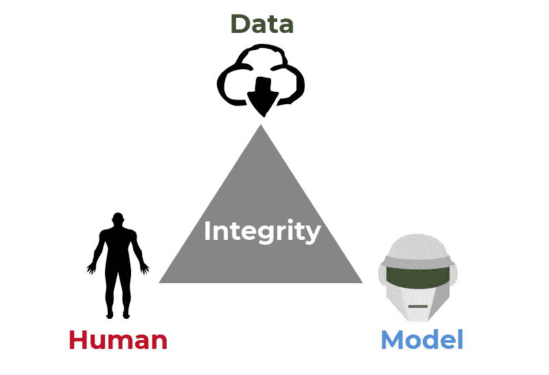

# 回溯测试——为什么没人相信结果？

> 原文：<https://medium.datadriveninvestor.com/backtesting-why-no-one-trust-the-results-265404e177f6?source=collection_archive---------12----------------------->

回溯测试是系统投资的基石。这就是系统基金在很大程度上所做的工作。他们非常依赖历史来告诉他们什么行得通，什么行不通。但是如果你做一个调查，你会发现很多人不信任回溯测试的结果。特别是，那些坚信自己的分析和投资决策技巧的怀疑论者经常嘲笑这种方法的简单性。

对于那些开发了一个好模型并认为你有很大机会获得资金或工作的人来说，你可能会失望。除了你自己，许多人会以至少一点谨慎的怀疑态度看待你的主张，或者，如果不是的话，完全不信任。这甚至包括像我这样系统投资的人。但是不要误解我，我完全支持回溯测试。毕竟，这是我工作中的一个关键因素。那为什么呢？

# 是因为历史不是未来表现的保证吗？

这是周围最常见的争论之一。但是不，这不是原因。对我来说，这个论点没有什么意义。为什么不反过来，让他们给你举出一个能保证未来业绩的东西？这是他们对市场时机的完美把握吗？或许是他们无懈可击的选股技巧和适应能力？或者也许是他们对市场的完美把握和预见事情如何发展的能力？任何有这种想法的人都是高度妄想。没有什么能保证性能。所以，这根本不应该成为一个论点。唯一合适的地方是基金招募说明书或营销材料的法律免责声明。

那些了解市场的人不会为了担保而回顾历史。相反，他们回头去学习。这和自主交易者利用历史数据、图表、事件、分析和过去的经验来帮助形成自己的想法没有什么不同。一个精心制作的回溯测试通过将一个概念性的想法转化为更具体的东西，给你很多洞察力。从收集的数据中，你可以更好地了解它在过去是如何工作的。为什么这很重要？好吧，这可能不是唯一的前提，但如果你设想的某件事在过去甚至从未成功过，那么你有什么基础让它在未来成功呢？

 [## 值得购买的 4 大人工智能股票及其原因|数据驱动型投资者

### 人工智能(AI)在 2019 年继续进入大众意识。通过应用程序…

www.datadriveninvestor.com](https://www.datadriveninvestor.com/2019/03/06/top-4-artificial-intelligence-stocks-to-buy-and-why/) 

好吧，这不是原因。那到底是什么？

# 没有人真正知道幕后发生了什么

系统交易者或投资者把他们模型的内部细节带进了坟墓。根据合同，那些为金融机构工作的人不得泄露任何细节。但即使他不受这些约束，他也没有理由自由地与他人分享。模型是绝对可以复制的。更多的人使用它只会意味着更多的竞争，导致空间的过度饱和，并最终稀释利润。其次，模型是你的想法，它们代表你的价值。你愿意把它送给别人吗？没有强有力的证据，大多数人不会放弃他们的模型。在行业内，这是双向的。没有一个同行会无缘无故地给你他们的算法，他们也不会四处探索并向别人询问他们模型的确切细节。

但当然，也有很多例外。例如，有些人可能会与他们信任的人或同事分享。其他人可能会对他们受益的社区做出贡献。还有其他人可能是出于学术目的。或者，他们正在寻求将他们的投资策略货币化。但是在大多数情况下，我们可以安全地假设，除了高层次的细节和回溯测试结果，我们不会看到它背后的东西。不幸的是，这不可避免地引发了许多关于回溯测试的重要问题。如果这些问题不能得到充分解决或验证，信任就很难获得。

这些问题是什么？它们主要围绕三种类型的完整性:数据、模型和人。

# 数据完整性

回溯测试的第一步是收集必要的数据。如果你的第一步做错了，整个回溯测试就会被毁掉。人们可以就此提出许多问题。

你用了什么数据？是交易所交易的吗？粒度是多少？你从哪里得到它的？如果是在股票上，分红算不算？它们被再投资了吗？你调整了分裂吗？如果是期货，那么在回溯测试之前，你是否调整了相邻的合约并考虑了滚动成本？有坏数据吗？你清理干净了吗？您是否使用任何代理或方法来外推或内插任何数据，以解决缺口或数据不足？你是在一大堆股票上测试你的模型吗？如果是这样的话，你的数据没有生存偏差吗？这可以一直持续下去…

但所有这些问题最终都导致回答一件事:你的数据可靠吗？因为如果这个失败了，那么继续下去就没有意义了。因此，从一个不了解这些细节的人的角度来看，他的任何疑虑都是完全合理的。

# 模型完整性

现在，让我们假设你确定了数据，并设法说服了其他人。听起来像好消息？的确如此。但坏消息是，我们才刚刚开始。

## 数据长度

回溯测试期有多长？是否足够长来捕捉不同的市场条件和周期？虽然没有必要把事情追溯到 100 年、50 年甚至 20 年前，但让它经历不同的市场周期和条件仍然是更可取的。这让我们更好地理解该战略在不同体制下的表现。举个例子，展示一个在牛市中表现出色的只做多模型，却不告诉我另一面的情况，并没有多大帮助。

## 正向偏压

这是新手常犯的错误，如果没有对回溯测试做进一步的验证，这将是致命的错误。当一个人提前使用数据来预测未来时，就会产生前向偏差。这样的模型看起来很棒，直到你把它操作化。您将意识到，在您需要数据的时候，您却没有这些数据。因为它们还不可用。

我们来举个例子。你想建立一个系统，在每天结束时预测指数第二天的收盘水平。在你的回溯测试中，你以某种方式结束了使用第二天的收盘价作为你的输入之一。不用说，你会得到一些令人瞠目结舌和难以置信的回测结果。但是，除非你有时间机器或水晶球，否则你无法破解这个。如果你有一个水晶球，为什么还要一个模型？我知道这听起来很荒谬和牵强，但我亲眼目睹了这一切。

## 逻辑错误

当你在处理复杂的回溯测试时，事情会变得相当棘手。你将你的概念转化为一个模型，并假设它按照你想要的那样工作。但有时，你可能会遇到令人讨厌的惊喜。除非您在不同的点和选定的场景中执行检查，否则意外总是会发生。举个例子，也许你认为一旦你的模型被停止交易，它会在一段时间内不交易。然而，你的模型在止损后马上恢复了交易。这完全违背了停车的初衷。

## 曲线拟合

曲线拟合是另一个众所周知的问题，也是一个特别难以解决的问题。因为，从技术上讲，它们不是错误。而且几乎每个人都会经历这个。回溯测试者经常陷入完美的陷阱。鉴于后见之明的力量，有些人就是无法抗拒扮演上帝的诱惑。他们不断地添加参数，优化他们的模型，精确到小数点后一位，直到他们的模型以非凡的精度符合历史。但是这种模型在实践中有多少用处呢？如果运气好的话，这可能会持续你几个月。但更多的时候不是，这个模型从一开始就会崩溃。我遇到过这样的比赛，回溯测试条目在历史数据上做得非常好，但一旦用看不见的数据进行测试，就会非常失败。

曲线拟合的另一种更微妙的形式经常被误认为是适应。人类有调整事物的癖好，特别是当他们认为他们所做的事情是一种进步的时候。每当模型碰壁时，他们会重新优化参数或引入更多变量。例如，假设您的模型在部署后不久就崩溃了 20%。这不是你所期望的。所以你开始调整你的模型，直到崩溃被清除干净。每当你的模型似乎要垮掉时，这种情况就会重复出现。如果您必须时不时地这样做，将模型束之高阁并置于观察之下可能是一个更好的选择。但是对于那些不了解你在这个过程中所做的所有这些特别的、随意的“适应性”改变的人来说，他们怎么能确定你的模型的真实性能呢？

## 流动性/容量

策略的流动性和能力经常被忽视。所有策略的容量都是有限的(可伸缩性如何)。我这么说是什么意思？当你想买的时候，你希望有尽可能多的卖家；当你想卖的时候，你希望看到一大堆现成的买家。这可以让你快速有效地进出一个位置。一个流动性强的市场足以做到这一点。另一方面，非流动性债券则相反。在后一种情况下，一个大的买入或卖出订单可能会引发证券的上涨或下跌。这使得你的交易成本大大增加。为了最小化你的订单对市场的影响，你可能需要把你的订单分开，在一段时间内执行。

我们来看一个简单的案例。你可以配置 10 亿美元来建立一个美国股票投资组合。仅在纽约证券交易所上市的股票就拥有超过 30 万亿美元的市值。十亿只是沧海一粟。但是你不能在[柬埔寨股票市场](https://en.wikipedia.org/wiki/Cambodia_Securities_Exchange)做同样的事情，因为它的总市场资本只有不到 5 亿。

对于不太可能遇到此类问题的散户投资者来说，这可能不太重要。但如果你正试图说服一家机构相信你的策略，那么就要做好充分准备，给出你的策略所能达到的最大资产规模的数字，并为其提供支持。如果你从空气中取出数字，那么你最终会得到空气。

## 交易成本

许多人忽略了交易成本，如佣金、滑点、买卖差价、市场影响。隐含的假设是，这种成本太小，不会对结果产生重大影响。如果你在一个流动性强的市场上使用低成本经纪人来实施低周转率策略，那么是的，这可能成立。然而，如果你交易的是流动性差的东西，或者做的是短期交易，你可以在一个月、一周或一天内将整个投资组合周转几次。那么不考虑交易成本的回溯测试结果可能会产生严重的误导。即使是几个基点的适度交易成本，也会对高频策略的结果产生巨大影响。想象一下，每天做 100 轮交易，每轮成本为 5 个基点。这相当于每天 5%左右。它完全有能力把一个看似优秀的回溯测试结果翻个底朝天。

# 人类的完整性

我们讨论了数据和模型的完整性，但是还有一个更复杂、更棘手的完整性问题——人的完整性。没有独立的制衡，回溯测试很容易被操纵。我并不是说所有或大多数人都不诚实。事实上，大多数错误都是无意的，源于无意识的偏见、缺乏经验或疏忽。但是总会有一小部分人会毫不犹豫地伪造结果，让事情朝着对他们有利的方向发展。一个有经验的人总能让结果看起来可信，并在背后编一个令人信服的故事。这可能会带来相当大的挑战。虽然如果我们知道问题出在哪里，我们可以很容易地修复一个损坏的模型，但不幸的是，没有解决损坏的思想的方法。

# 如何才能弥合信任鸿沟？

只要对方愿意认真考虑模拟结果，就有办法弥合信任差距，至少是部分弥合。假设你已经提供了尽可能多的细节，除了秘方，剩下的就是建立可信度了。

**1。把你的钱用在你所说的地方。**

您可以在模型上部署真实的资金来构建一个实时的跟踪记录，进一步支持您的回溯测试结果。根据策略和市场走向，这可能意味着几个月到几年。例如，利用短期市场低效率的高频策略可能需要更短的跟踪记录。交易较少的长期策略需要更长的时间。当然，你需要从一个可靠的经纪人那里得到可证实的声明。不要通过使用多个账户或不同的经纪人，然后将结果到处链接，使事情变得复杂或模糊。如果你想要的是信任，那就让事情简单而切题。你也可以考虑使用像 [Fundseeder](https://fundseeder.com/home) 这样的独立方来验证和跟踪你的表现。

**2。实时发布您的信号，以便他人跟踪。**

无论是在纸上还是在现场，您都可以在运行回溯测试模型时提供信号。这让其他人可以跟踪你的交易，了解你的模型在一段时间内的表现。但是如果你运行的是一个短期的时间敏感的策略，那么传递及时的信息是很棘手的。

**3。在第三方平台上编写模型代码。**

前两种方法不能防止有人干预模型，无论是通过调整它还是用任意输入覆盖它。有时，实时或步行前进的结果揭示了关于它的线索，例如，与模型过去的表现有明显的偏差。然而，这并不总是显而易见的。所以为了获得更高的可信度，你可以在独立的回溯测试平台上编写你的策略。一个著名的提供商是[量子乌托邦](https://www.quantopian.com/)。他们也是一个众包对冲基金，将资金分配给符合他们标准的策略。您将保留您创建的所有模型的知识产权，但不幸的是，您必须接受您的代码现在驻留在您自己的个人电脑之外的其他地方。

*原载于 2019 年 7 月 16 日*[*https://investmentcache.com*](https://investmentcache.com/backtesting-why-no-one-trust-the-results/)*。*