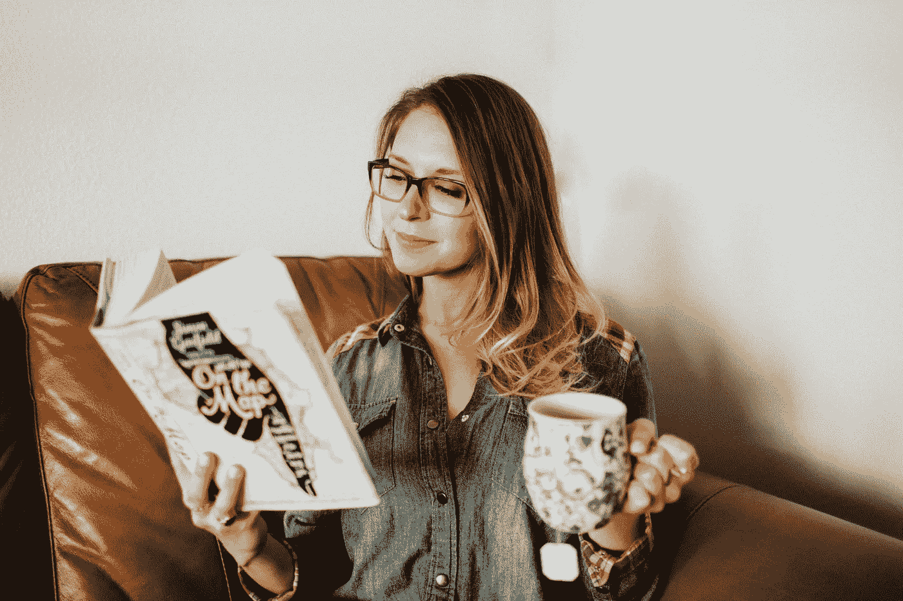

# 平衡动作

> 原文：<https://medium.datadriveninvestor.com/balancing-act-5695f76c57ca?source=collection_archive---------8----------------------->

Photo by [Wiley Putnam](http://www.wileyputnam.com) via [www.instagram.com/chelseaglaser](http://www.instagram.com/chelseaglaser)

我总是听到人们，尤其是企业家，谈论如何在生活中找到平衡。就好像那里有一个配方，如果我们仔细遵循它，我们将消除混乱，创造平衡、和谐和满足。和我交谈过的许多人一样，我花了很多时间感觉自己必须坚持严格的常规，这样我才能在所有竞争的优先事项中找到平衡。然而，这极具挑战性，并被证明是令人疲惫不堪的。我变得坐立不安，焦虑不安，我感到没有灵感，受到限制，被自己给自己设定的规则和界限所束缚。我很快意识到我不是一个循规蹈矩的人。我只是喜欢过好每一天，一分一秒。我发现，找到平衡是一种日常实践，即在个人和职业需求出现时做出回应，倾听我的直觉，并与我爱的人共度时光。平衡，对我来说，每天看起来和感觉都不一样，有无限的方法去找到它。

这并不是说我反对常规。我认为在生活中有一些常规是非常有益的，它们帮助我们感到有条理并能控制我们的责任。常规是我们生活中最接近指导的东西，帮助我们做决定，避免迷失。然而，关键是不要把自己束缚在严格的规章制度中，尤其是当它们限制了你自己的成长和进步的时候。此外，重要的是不要躲在你的常规后面，用它们作为不追求你想要的东西的借口，或者因为害怕破坏、混乱或未知而拒绝新事物。当我们经历成长和进步时，每天都有新的机会出现，新的障碍出现，我们必须通过改变我们的优先事项来应对。

我鼓励你试着跳出常规几天。放松地面对生活带给你的变化，把它们视为成长和进步的自然副作用。如果你开始感到不知所措，深呼吸，列一个清单，重新考虑你一天的优先事项，知道它们明天可能会改变——这没关系。平衡不是一种被动的状态。就像开车、游泳或爬楼梯一样，平衡包括积极的运动和对未来的评估。