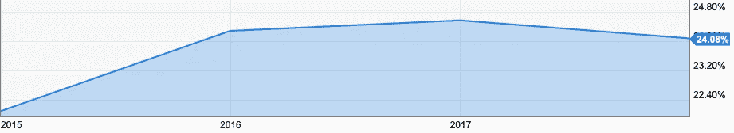

# 英格兰银行行长提议用数字货币取代美元

> 原文：<https://medium.datadriveninvestor.com/bank-of-england-governor-proposes-digital-currency-to-replace-us-d14cff32dc7f?source=collection_archive---------23----------------------->

英国银行行长马克·卡尼在美联储会议上提出，美元作为世界储备货币的日子已经屈指可数了。然而，与其被另一种法定货币(如中国人民币)取代，一种类似脸书提出的 Libra 的数字货币可能是一种替代选择。

美国经济占全球 GDP 的%

来源:[https://y charts . com/indicators/us _ GDP _ as _ a _ percentage _ of _ world _ GDP](https://ycharts.com/indicators/us_gdp_as_a_percentage_of_world_gdp)

虽然美国仅占全球 GDP 的 [24%多一点(它只占世界人口](https://ycharts.com/indicators/us_gdp_as_a_percentage_of_world_gdp)的 [4.27%)，但美元对许多经济体的影响是巨大的。因此，一种由选定的国家货币和选定的交易所交易基金/指数基金支持的货币，从而可以投资于商品、债券、房地产和股票，这将更能代表世界经济。这也将减轻美国经济对其它国家的影响。如果特朗普继续他的排外立场，即减少全球化，增加民族主义，一种不那么依赖美元的世界储备货币可能会受到其他经济体的欢迎。](https://www.worldometers.info/world-population/us-population/)

卡尼表示，“经济政策不确定性加剧、彻底的保护主义，以及对由于政策空间有限而无法充分抵消进一步负面冲击的担忧，这些因素结合在一起，加剧了全球经济的反通胀倾向。”

卡尼发表声明的时机很有意思，因为几个月后他将从英格兰银行行长的职位上卸任——他是在将自己定位于参与一个将创造全球数字货币的组织吗？

更多数字字节每周电子邮件 Jonny.Fry@TeamBlockchain.net