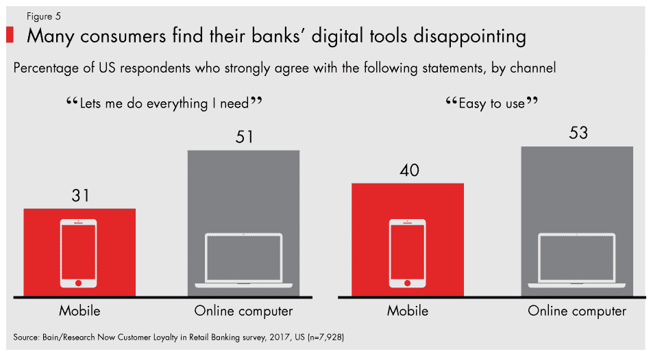
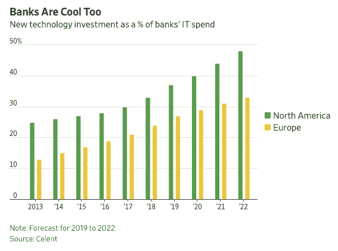
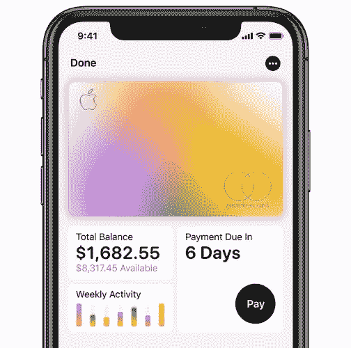

# 银行面临与技术的不公平竞争

> 原文：<https://medium.datadriveninvestor.com/banks-face-an-unfair-fight-vs-technology-5288b913bcc0?source=collection_archive---------8----------------------->

2019 年已经是金融科技投资[破纪录的一年](https://www.spglobal.com/marketintelligence/en/news-insights/trending/6CaOwNm2SwfRh9Y6f6jwjw2)。早期投资者、成长型股票和银行已经在技术解决方案上投入了数十亿美元，以解决当今银行最大的一些痛点。在退一步审视当前的形势后，银行似乎处于一种没有胜算的境地。

数字化的兴起以及核心客户群的转变，创造了一个要求更高的客户群。人们希望所有最新的技术都包装在一个易于使用、视觉上吸引人的界面中。根据以下数据，消费者对他们当前的解决方案并不满意。

为了解决消费者参与的问题，许多银行已经探索与 fintech solutions 合作，为他们现有的客户群提供更好的产品。

 [## 分散金融的出现|数据驱动的投资者

### 当前的全球金融体系为拥有资源、知识和财富的人创造了巨大的财富

www.datadriveninvestor.com](https://www.datadriveninvestor.com/2019/03/14/the-emergence-of-decentralized-finance/) 

许多金融科技公司因创造新产品而闻名，这些产品旨在增强用户对其资金的体验。 [Robinhood](https://robinhood.com) 通过取消经纪费增强股票交易； [Acorns](https://www.acorns.com) 和 [Stash](https://www.stashinvest.com) 通过综合储蓄功能增强了投资体验，使用户在为下一天存钱时感觉不那么痛苦；挣工资提高了零工经济工人的生活，因为他们可以在工作后立即获得挣来的钱，而不是每两周等待一次。

银行的等级性质和内在惰性结合在一起，维持着一种非原创的结构和形象。近年来，许多银行试图改变这种耻辱，无论是通过雇用更多的技术人才还是启动加速器入职计划，但大多数银行创新都是以收购的形式出现的。

[https://www.wsj.com/articles/technology-is-banks-new-battleground-11568114378?utm_medium=email&utm_source=fintechweeklycom](https://www.wsj.com/articles/technology-is-banks-new-battleground-11568114378?utm_medium=email&utm_source=fintechweeklycom)

对银行来说不幸的是，这是一个卖方市场，金融科技是白热化的。一般来说，私募股权的估值现在可能被高估了，但金融科技公司尤其主要是根据增长而不是基本面来估值的。例如，根据上一轮的数据，私人市场对 Robinhood 的估值约为每位用户 1300 美元，而 Square 的 Cash 应用在公开市场的估值约为每位用户 120 美元。这并不是一个完美的对比(尽管 Cash App 正在尝试一项功能，允许用户交易股票而不收取佣金)，但 Cash App 拥有 2300 万用户(相比之下，Robinhood 的用户数为 500 万)，并拥有多种收入来源(相比之下，Robinhood 只有一种收入来源——交易的月度订阅服务)。

这就是说，如果银行真的决定通过收购来推动创新，它们很可能不得不为此支付高额溢价。此外，银行通过与金融科技公司合作实现的竞争优势变得短暂，因为客户将继续期望他们现有的银行提供竞争对手银行提供的任何最新产品。

科技公司也开始进入银行业。谷歌、亚马逊和贝宝已经在这个领域运营了一段时间，本月早些时候推出的 Apple Card 只是进一步表明了科技公司的长期意图。

银行对金融科技公司和在该领域运营的科技公司的抱怨之一是，它们能够在不应对所有监管的情况下，享受作为金融服务提供商的所有好处。在这一点上，银行可能是对的，但在国会赶上之前，它们只能抱怨。

很难说银行将何去何从。我个人认为，在监管赶上数字化之前，银行将被迫为热门交易支付过高价格，以保持相关性。五年后，回顾并注意今天正在进行的一些 M&A 交易的股东效应，将是一件有趣的事情。