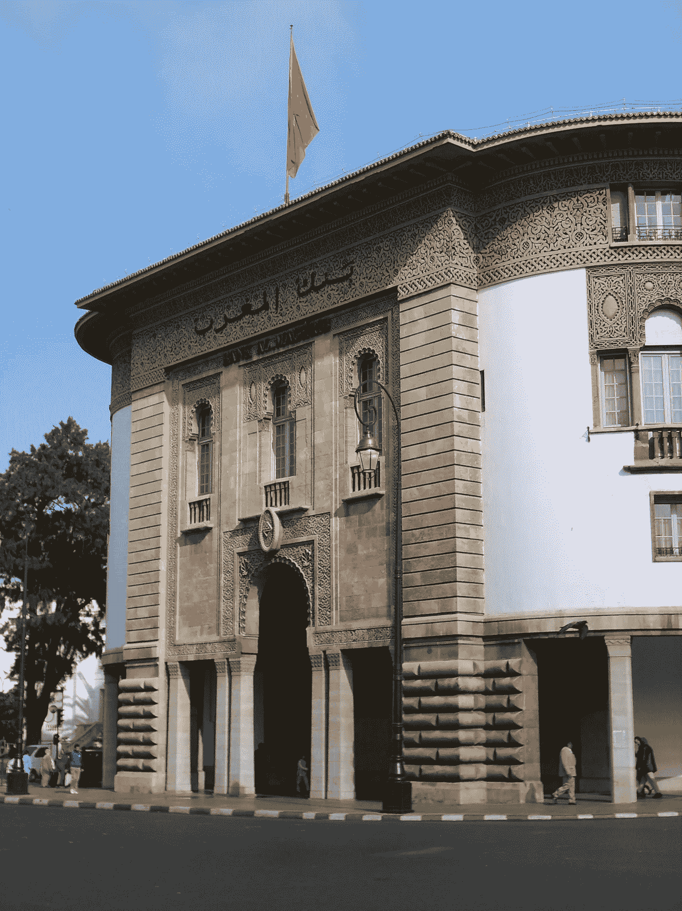
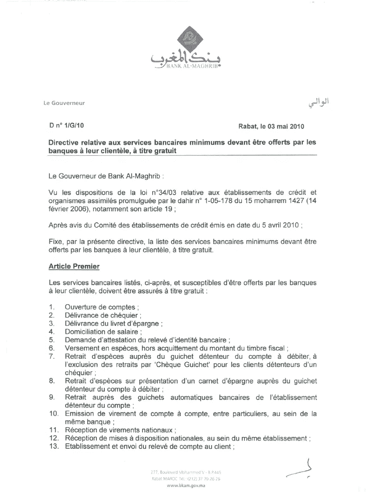
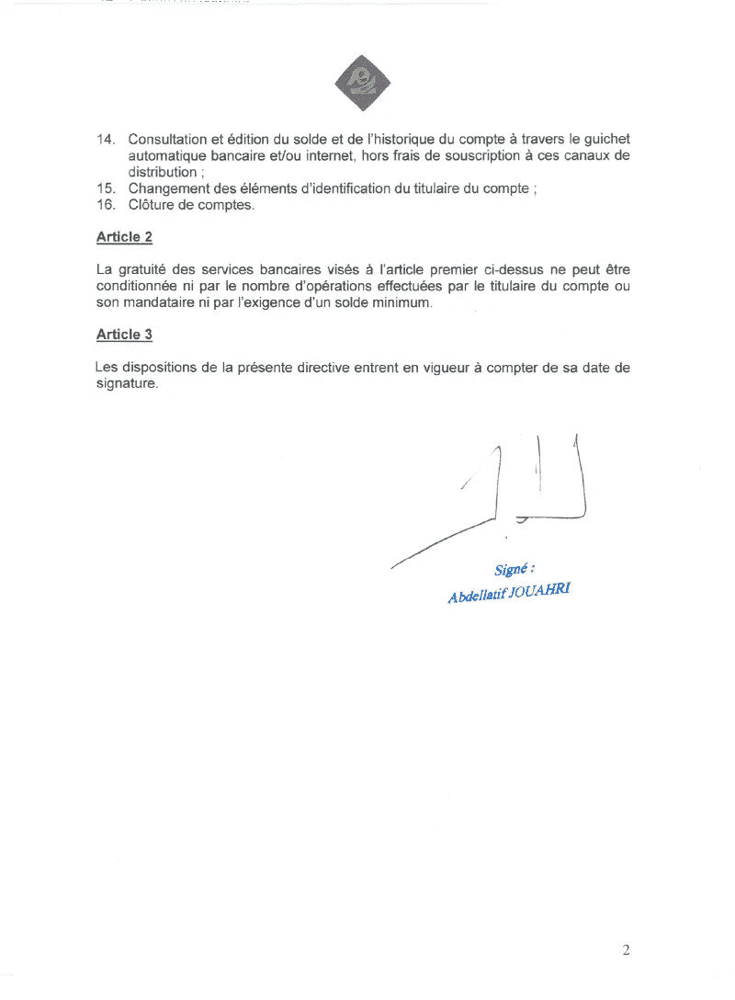
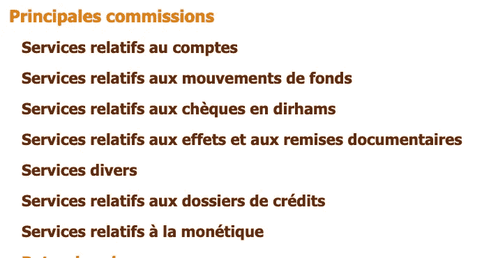
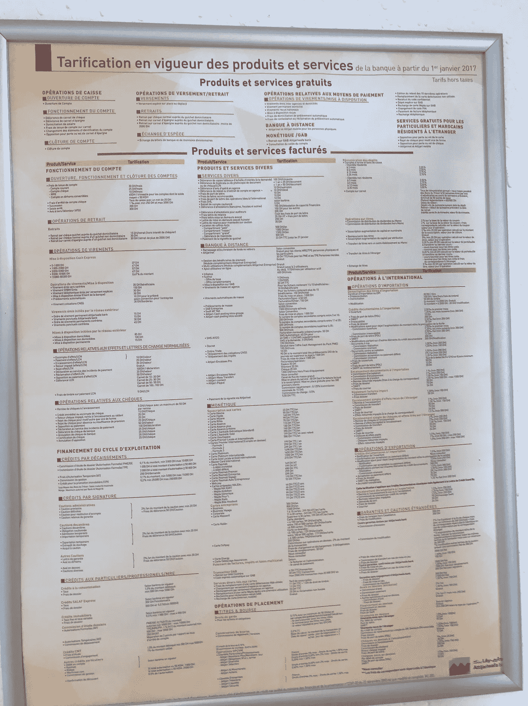

# 摩洛哥的银行:费用、隐藏费用…以及更多费用

> 原文：<https://medium.datadriveninvestor.com/banks-in-morocco-fees-hidden-fees-and-more-fees-d0b4d047e54e?source=collection_archive---------4----------------------->

facade of Bank of Bank Al-Maghrib (the central bank of Morocco), in [Rabat](https://commons.wikimedia.org/wiki/Rabat) centre, avenue Mohammed V, Wikimedia

发达国家的大多数人在年满 18 岁时就有了自己的第一个银行账户，有些人甚至更早。在一些地方，拥有一个银行账户已经成为一种必需品，甚至是一种人权。此外，拥有一个银行账户并积极使用它可以证明对账户持有人、银行和整个国家都非常有用。因此，获得一个银行账户应该尽可能的简单，尽可能的便宜，这样我们就可以让尽可能多的人拥有一个银行账户，并且有能力继续使用它。

为了做到这一点，这个硬币有两个方面，第一个是可及性，第二个是可负担性，摩洛哥银行在这两方面都做得不够理想。在这篇文章中，我们将把重点放在硬币的可负担性这一面，而把另一面留给下一次。那我们开始吧。

 [## 金融科技初创公司正在颠覆全球银行业|数据驱动的投资者

### 传统的实体银行从未真正从金融危机后遭受的重大挫折中恢复过来…

www.datadriveninvestor.com](https://www.datadriveninvestor.com/2018/10/20/fintech-startups-are-disrupting-the-banking-industry-around-the-world/) 

首先，让我们确定一些事实:

1-摩洛哥中央银行(马格里布银行)是管理和监督机构，负责发放银行执照、管理银行并确保它们合规。

2-谈到银行可以向客户收取的费用和佣金，摩洛哥银行必须遵守一些规定和协议。

*   BAM 指令*N 1/G/10 du 03/05/10*:*银行必须免费提供 16 项基本银行服务*

****

*Bank Al Marghreb’s directive *N°1/G/10 du 03/05/10**

*   *作为其监管职责的一部分，BAM 发布了一份年度报告，在该报告中，它关注市场的平均价格，并理应通知收费明显高于平均价格的银行，以便它们重新考虑其定价。[最新报道在此](http://www.bkam.ma/Supervision-bancaire/Indicateurs-et-publications/Rapport-annuel-sur-la-supervision-bancaire/Rapport-annuel-sur-la-supervision-bancaire-exercice-2018)。*
*   *据 BAM 称，银行必须使其费用和佣金透明，并以所有相关形式(线下和线上)提供给消费者。*
*   *摩洛哥银行在 2018 年获得了惊人的 140 亿 MAD 利润*
*   *摩洛哥的银行已经设法获得了 11%的股本回报率，这与非洲/中东的比率一致，但几乎是欧盟的两倍。*

# *费用:*

**

*Morocco Dirham Coins*

*计算出你的银行账户每月、每季度或每年将花费你多少钱几乎是一项不可能完成的任务，因为所有传统银行的收费结构完全是一个迷宫。换句话说，没有一个“基本账户”包会明确说明你必须支付什么，并作为回报给你一个可以进行基本资金流动的账户和一张可以用来在现实世界中花钱的卡。到目前为止，这似乎是非常晦涩和理论性的，所以，让我们来看一个例子。*

***银行:人民中央银行集团—市场份额:26%***

*客户正在寻找:基本帐户，发送和接收转账，设置直接借记，在自动取款机上获取现金和在线/离线支付的卡。*

*在花了不合理的长时间寻找数据之后，事情是这样的:*

*   *我先看了一下银行的主页面 [www.gbp.ma](http://www.gbp.ma/BanqueParticulier/Pages/Home.aspx) (都有，AR 和 FR)什么都没有发现*
*   *然后，我谷歌了一下，发现了这个:[这里](http://www.gbp.ma/BanqueParticulier/VotreBanque/Pages/Nostarifs.aspx)*
*   *为了一次可视化所有费用，我在页面上应用了一些 JS 魔法，以便展开所有费用，否则，祝你好运得到一个概述*

**

*List of fees per category of “services”, only one category is expandable at a time (JS magic fixed that)*

*所以，这是我的发现:*

*   *基本账户:180 马德/年*
*   *基本卡(仅限本地使用，不支持在线支付):50 马德/年*
*   *基本在线支付卡(Carte La I-c @ rd):79 马德/年*
*   *汇出汇款:mad 20/操作*
*   *直接借记*:mad 15/操作+ 1.5 增值税*

*因此，假设每月有一种交易类型，您的基本账户费用为:*

*   *(180/12)+(50/12)+(79/12)+20+15+1.5 =**mad 62***

*算出作为一个消费者在另一家银行要花多少钱，这样你才能做出正确的决定，因为你会这样做。*

*假设您将该集团与 AttijariWafa 银行进行比较:*

***银行:AttijariWafa 银行—市场份额:27%***

*我花了相当多的时间来寻找美国运价表提供的价格，但是，我不能在网上找到任何东西，不得不请一位朋友谁是该银行的客户，从他们的一个分支机构拍摄他们的费用。*

**

*AttijariWafa Bank fees sheet by Ali Lakrakbi*

*如果普通消费者想知道他们的银行账户会花掉他们多少钱，这基本上就是他们所看到的。因此，回到计算我们定义的银行账户的成本，这里是我们得到的:*

*   *基本账户:360 马德/年*
*   *基本卡(VISA Espace):199 马德/年*
*   *汇出汇款:mad 20/操作*
*   *直接借记*:mad 10/操作+ 1 增值税*

*因此，假设每月有一种交易类型，您的基本账户费用为:*

*   *(360/12)+(199/12)+20+10+1 =**mad 77.5***

*因此，我们可以看到，美国农业银行的基本账户比 GBCP 的基本账户贵 20%。然而，我认为，这项工作的主要结论不是摩洛哥的银行收费有多不同，也不是银行服务有多贵，而是这里的主要教训是收费缺乏透明度，普通消费者很难知道他们在做什么，以及他们使用的服务会花多少钱。*

*有趣的事实:当我在网上搜索时，我可以找到除了摩洛哥之外的所有国家的 AttijariWafa 银行的费用。几乎没有办法知道他们在摩洛哥的服务价格。如果你想知道，你必须去分行，希望你不会头痛，或者更糟，被骗…*

# *隐性费用*

**

*Photo by [Abdul Azis](https://unsplash.com/@greywolfski?utm_source=medium&utm_medium=referral) on [Unsplash](https://unsplash.com?utm_source=medium&utm_medium=referral)*

*我在摩洛哥开第一个银行账户的时候，还记得他们通知我两件事，账户本身要花我多少钱，卡要花我多少钱。我有人民银行的账户，他们告诉我账户每月 15 马德，卡每年 50 马德。*

*一切似乎都很好，直到你想开始向朋友转账，使用直接借记支付账单，使用网上银行支付账单或网上购物。我在这里提到的所有银行业务都是**而不是**免费的，它们都要花你更多的钱，而且大多数时候直到费用被扣除后你才知道。因此，对于一个消费者来说，用他们的银行账户去买银行的东西，他们必须付钱。*

*此外，还有与银行服务本身性质相关的费用，如银行转账或网上支付。这种远程交易需要更高的安全性，这可以通过遵循标准流程和服务来实现。其中之一是通过提供客户通过短信获得的代码来确认交易。顾客收到的这条简单的信息通常要花 3 美元。要知道，我目前每月大约执行 10 笔交易，仅仅确认转账或付款就要花费我额外的 30 马德。此外，短信成本如此之高本质上并不是问题所在，但问题在于该银行不提供免费的替代方案，如基于移动应用的一次性密码或基于应用的密钥对挑战。因此，这些不是“可选”费用，而是客户最终支付的更多隐藏费用。因此，银行客户试图减少他们对这种操作的使用，这本身就与银行客户的期望相反。*

# *更多费用(国家支付)*

**

*Photo by [Markus Spiske](https://unsplash.com/@markusspiske?utm_source=medium&utm_medium=referral) on [Unsplash](https://unsplash.com?utm_source=medium&utm_medium=referral)*

*记住我之前说过的，拥有并使用银行账户对消费者、银行和整个国家都有好处，原因如下。*

*   ***消费者**:对一个人的财务状况有一个正确的了解，他们赚了多少钱，他们花了多少钱，他们把钱花在了哪里，这对于客户过上健康的财务生活非常有帮助。*
*   ***银行**:银行对消费者的数据了解得越多，就能更好地了解人们想要什么，做出更好的产品投资决策，开发新产品，在客户申请汽车贷款或抵押贷款时对他们进行准确的风险评分。这将导致更快的贷款申请，更低的违约率，并最终为银行带来更多的收入和利润？*
*   ***国家**:如果客户可以从他们的银行账户轻松管理他们的财务生活，他们可以设置直接借记或使用网上银行支付账单，减少延期付款，减少现金交易，减少在服务提供商处的排队时间，这将节省人们的时间，甚至减少交通流量。此外，如果银行能够准确地对客户进行风险评分，他们就可以以更低的利率更快地发放贷款和抵押贷款，最终促进更多的经济活动，从而增加 GDP 产出。*

# *结论*

*BAM 必须更加重视摩洛哥银行业的可负担性和透明度。让银行变得更加负担得起和透明的一个方法是，在银行必须免费提供的基本服务清单中增加更多的银行业务，并迫使银行提供透明的服务包，如*基本服务包*、*高级服务包*、*花哨的名字*..其中*基本*始终涵盖基本账户的法律定义。否则，我们将受困于一个充斥着无法追踪的现金、金融信息错误的公民和一堆无法预测的费用的经济体。*

*有想法？例子？或者只是想分享你的银行手续费经验，欢迎随时联系或者在这里留言。*