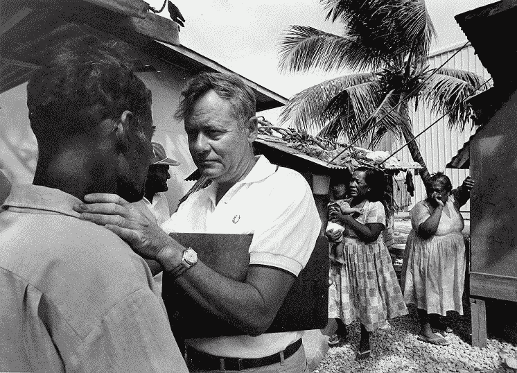
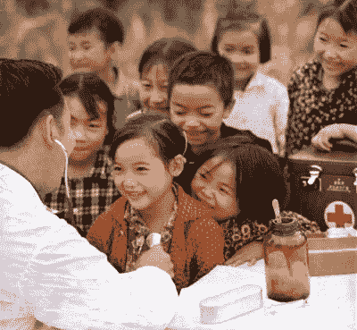

# Barefoot Doctors (赤脚医生)

> 原文：<https://medium.datadriveninvestor.com/barefoot-doctors-%E8%B5%A4%E8%84%9A%E5%8C%BB%E7%94%9F-and-their-impact-on-launching-chronological-evolution-of-primary-care-fbcbb26be0b0?source=collection_archive---------16----------------------->

# 以及它们对初级保健医学按时间顺序发展的影响

Barefoot Doctors (赤脚医生)

医学是治疗和超越治疗的科学。它仅仅是将身体、情感、心理和社会福祉的综合状态传递到一个特定时代和住所的单独和谐中，这提供了资源和经济地位的可用性。

医学是一门在过去的一个世纪里取得了巨大进步的科学。然而，它在整个社会经济格局中的分散程度却大大减弱了。有着真诚功绩的杰出人士努力挽救[破碎的医疗体系](https://www.datadriveninvestor.com/2019/10/19/medical-societies-and-their-flop-of-a-century-old-quest/)。

在努力确定医疗服务提供模式被认为是方便每个人，而且负担得起，这种护理不会强加生活在第三方利益的摆布。

# 但是，谁是赤脚医生呢？

赤脚医生的直觉是 1920 年中国“农村重建运动”的结果，该运动是由一位中国导师和组织者发起的，他因在大众扫盲和农村重建方面的工作而受到广泛理解，Y.C .晏阳初和梁漱溟在中国农村开始了一个试点项目，并在 1930 年后得到已故共产党领导人毛泽东的许可，最终实现了工业化。十字军东征被认为是一场战争，直到被改编。在当时的中国国民党政府执政期间，它一开始是一个不受限制的、独立的计划，但被认为比毛泽东共产党提出的革命替代计划更加强大。

 [## 医疗保健的未来正在被一场大型技术入侵所塑造|数据驱动型投资者

### 过去十年，全球经济的所有部门都经历了大规模的数字颠覆，而卫生部门现在…

www.datadriveninvestor.com](https://www.datadriveninvestor.com/2018/11/02/the-future-of-healthcare-is-being-shaped-by-a-big-tech-invasion/) 

Barefoot doctors (Chinese: 赤脚医生; pinyin: chì jiǎo yī shēng) were at large the group of rice farmers, with traditional folk healers, rural health care providers, and graduates who held minimal basic medical and paramedical training working in rural villages. The goal was to deliver healthcare to rural neighborhoods where urban doctors would not toil.

赤脚医生帮助和促进了基本卫生、预防性保健和计划生育。他们还治疗常见的疾病。这个名字是南方农民的缩影，他们经常赤脚在稻田里工作，同时也是医生。

赤脚医生通常是中学毕业生，因此在县医院或社区医院接受了三到六个月的额外培训；他们在基层发挥着初级保健提供者的作用，并被允许分发西药和中药。

Primary health

赤脚医生的工资被认为是农业劳动；报销了受过传统训练的医生的一半工资。

在他的一次著名演讲中，毛泽东谴责了当前医疗系统的市政偏见，并呼吁制定一项政策，更优先考虑农村社区的福祉，这就是后来的 6 月 26 日指令。在 1968 年那次演讲之后，中国的卫生政策发生了变化。

赤脚医生计划在“农村合作医疗系统”的名称下成为国家医疗保健系统的一个组成部分。赤脚创业努力让社区参与农村卫生服务的提供。

中国政府的重大公民改革吸引了世界卫生组织(世卫组织)的注意，1978 年的阿拉木图宣言批准了这个已经适应的标准，作为世界初级保健医疗实践方法热潮的顶峰。中国的裁决激发的情绪彻底改变了中国农村地区和全球的病人护理状况。

赤脚医生制度是短暂的，1981 年随着农业合作社社会网络的终结而被废除。但它的遗产无疑已经在初级保健医学和联合供应商的头衔下在世界范围内变得越来越有名。

中国更为宽松的经济政策刺激了以家庭为单位从集体主义到个人主义的转变。赤脚医生模式随着 1985 年中国医疗改革的到来而正式达到顶峰。后者与“赤脚医生”一词从医疗保健系统中被淘汰并被“乡村医生”的名称和概念所取代的时间相吻合。这引发了卫生保健系统向私有化的转变，并使赤脚医生边缘化，他们强调预防医学和初级卫生保健。因此，赤脚医生可以选择参加国家考试，如果通过，他们将成为乡村医生。否则，他们将被视为乡村卫生助理。一些乡村医生后来考上了医学院，获得了医学学位。

赤脚医生的航行大大减少了中华人民共和国的医疗费用，同时为农村人口提供了初级保健治疗。世界卫生组织(世卫组织)将农村重建运动视为解决农村地区医疗服务匮乏问题的成功范例，因为赤脚医生以可承受的价格提供了关键的初级卫生保健，并确保了中国在联合国和世卫组织的重要席位。

# 赤脚医生运动成功的秘密

没有理由去争论颜延哲和梁漱溟的任务是那个时代的天才。它没有触及当前最紧迫的难题之一，而是从基层着手解决。不足为奇的是，共产党把它作为击败国民党政府的工具，尽管它最初并不是社会主义学说。它不得不进行改革和重新分类，最初是通过共产主义政权的农业合作社的官僚统治，后来从集体主义过渡到温和的社会主义家庭单位，并在“乡村医生”的概念下废除和改革，从而转向医疗保健系统的公司化。

最初的版本成功不是因为其官僚主义的理解，而是基于基层解决方案的现实；它赋予个人权力，最重要的是，它是个人的。赤脚医生的原则是关于一个人的；不是群体；是关于技能，而不是头衔；关于社区，而不是政治。自下而上的重组属于自上而下的解决方案。它定义了希波克拉底医学的复兴，以满足他们那个时代的公共医疗需要。

# 但是废除赤脚医生是一个错误

先说清楚！赤脚医生的运动被消除了，但没有消亡或转变。它从来没有打算通过初级保健所有权的优点来创建一个今天的预防保健卡特尔。今天的赤脚医生运动在某些方面将与 20 世纪 30 年代的赤脚医生运动有很大不同，但基本原则将保持一致，尽管受到了 Y.C .晏阳初和梁的想法的启发，但国际机构必须使他们版本的赤脚医生计划与 20 世纪的企业和政治计划相匹配，无论是通过许可，会计和教育垄断。

现代初级卫生保健模式完全依赖于自上而下的战略，其中最初的农村重建运动是一个基本的社区核心概念。

社会政治气候对赤脚医生的赋权是完美的，因为盛行的共产主义政权可能会通过调整以下政策，彻底改革它，从而在对其民族主义对手的斗争中占据上风。

# 赤脚视力是什么样的？

赤脚医生的使命是[对其创始人詹姆斯·严](https://en.wikipedia.org/wiki/Rural_Reconstruction_Movement)富有远见的反映，他对小社区的主权、个人统治和农村生活进行了推测。他的眼光正对着他所聚集的金钱。

他的使命是废除法西斯主义和偏见，因为他预见到它们是个人主权的敌人。他预测赤脚医生作为一个独立的社会经济运动的潜力。尽管如此，他可能没有想到它会被采用，被用来影响政治权力，被扭曲，并在世界各地以不同的方式使用。农村社区的普通人成了他的动力。尽管他是耶鲁大学和普林斯顿大学的毕业生，但他相信在没有头衔偏见和与众不同魅力的情况下利用个人技能。詹姆斯认为应该抑制每个社区的潜力，这是他们特定文化和规范的代名词。例如，将中西医结合用于中国农村稻农，而将类似的愿景用于菲律宾农村重建运动。

他是一个虔诚的基督徒，但也很现实，能够适应人们的需要，不管他们信仰什么。为了确保不偏不倚地解决基层问题，严回忆了他与教会的关系，并注意到自己是“与耶稣有关系的基督的追随者，而不是“基督徒”，这将使他直接隶属于教会。他从未因批评传教士不了解中国农村的实际需要而失败，而是非常欢迎那些解决村庄危机的中国和外国基督教组织的支持。

无论政治派别如何，各国政府都对他的使命表示欢迎，因为他的行动是真诚的、自由的。但那些受到鼓励的人拒绝了他的遗产，重新定义了他在严的威望下生活的目的。他的观点适合他的时代，因为他是当代的，自由的，触动了每个人的心灵，并且与政治无关。最重要的是常识。

如果今天尝试过，它仍然会起作用，与其技术、资源和战略的适应进展同步(统称为赤脚医生的现代化)，通常被称为无国界医疗。

与 1920 年中国农村倡议最初提出并取得成功的内容相反，1978 年的《阿拉木图宣言》完全令人失望。赤脚医生通过[执照](https://link.medium.com/nfi0p1D4w1)、[社团](https://medium.com/data-driven%20investor/medical-societies-and-their-flop-of-a-century-old-quest-2734c9c90f72)和政治角力被解读为执业护士(N.P .)、医师助理(PA)、助产士、家庭执业医师、内科医生和儿科医生。所有的标签和头衔都倾向于充当一个人在一个班级中描述指定技能的标题，因为最终的结果仍然是限制自上而下控制的偏见中的重要技能。

 [## 自理是医疗吗？

### 健康是个人的——它是一个人一生中最神圣的财富，尽管知道它会结束…

www.linkedin.com](https://www.linkedin.com/pulse/self-care-medical-care-adam-tabriz-m-d-/) 

# 赤脚医生使命在今天意味着什么？

利用 1978 年的夸夸其谈，我们正朝着错误的方向前进。在选择了最初由人民为人民制定的政策后，我们正在遭受重大分歧的后果。但是今天它仅仅是通过政府雇佣人来复制公司的使命。那是精确到什么程度。

现在还不算太晚，因为正如严镜海所设想的那样，我们拥有超越社会经济界限的所有储备。这可以通过奠定医生的病人基础并在此基础上建立技术和现代科学结构来实现。这个系统在 20 世纪 20 年代运行良好，今天仍然适用，将来也不会有任何疑虑。因此，社会心态和自己的独立推理必须是健全的，并由更高的行政保证。

在人口卫生系统的严格应用下，改变赤脚医生目的的民粹主义思维已经并将永远停留在角色上。

个性化医疗保健是希波克拉底医学。赤脚医生是他们那个时代个性化医疗的缩影。选项、机会、现实的激励预期、将个人情况置于任务中心的长期和短期战略解释是这些努力成功的基础。

赤脚的遗产是持久的，即使在政治战场上失败了，它也是历史上的一道明确的痕迹。因为是个人；并且是透明的。它能适应当下和经济形势。最重要的是，它集中在最需要改变的地方。

# 赤脚医生运动的底线

我们生活在过时定义的无限中，个性化正由基于人口的企业医学的混合模型呈现。当初级医疗保健实践作为一个专业进行推广时，它所反映的只是一个[管理式医疗保健协议建立的名称](https://medium.com/datadriveninvestor/starks-law-corporate-safe-harbor-in-contradiction-of-impartiality-to-physician-decree-f572890707eb)。技能被医疗、政治和执照组织所垄断，而人们需要的只是原始技能和才能。

信仰、宗教、良心、人性、责任感，或者做你自己和为每个人的更好生活而合作，作为驱动因素，以确保对适当使命的正确定义。这就是中国农民的任务所暗示的；就像，个人成就，而不是追求公司条例。今天，我们相反地为它担保。

*原载于 2019 年 11 月 25 日*[*【https://www.datadriveninvestor.com】*](https://www.datadriveninvestor.com/2019/11/25/barefoot-doctors-%e8%b5%a4%e8%84%9a%e5%8c%bb%e7%94%9f-and-their-impact-on-launching-chronological-evolution-of-primary-care-medicine/)*。*

 [## 斯塔克法则，与医生法令的公正性相矛盾的企业避风港

### 贿赂及其形式化版本；根据目前的定义，回扣行为无疑是最…

www.linkedin.com](https://www.linkedin.com/pulse/starks-law-corporate-safe-harbor-contradiction-decree-tabriz-m-d-/)