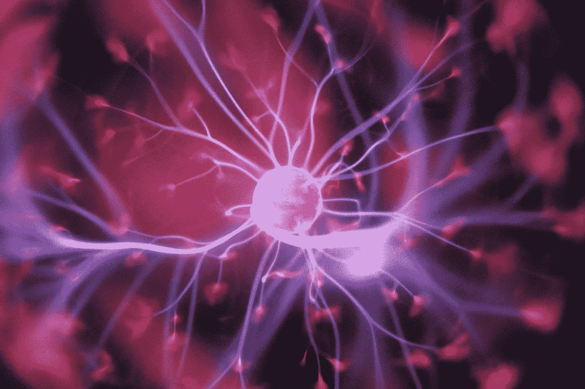

# 创新的障碍:全有或全无的心态

> 原文：<https://medium.datadriveninvestor.com/barriers-to-innovation-all-or-nothing-mentality-4da6ab78e1b2?source=collection_archive---------17----------------------->

全有或全无的情况是一回事，但是对人们全有或全无的态度是一个大的危险信号。

如果你遇到一个人对他们身边的人抱着要么全有要么全无的态度，你可以知道，无论你在他们身上投入多少，你被切断联系只是时间问题。了解这一点并能够识别这一特性是非常有用的。

正常人在人际关系中寻求妥协、清晰和友情——全有或全无的信仰者永远不会寻求与他人的平等，他们会觉得要与他人相处很平静。

可能会有妥协的说法，但是你会注意到在这方面你一直在说话，你甚至会感觉到你并没有真正被听到。

你会进行一次又一次的讨论，但仍然不清楚它们到底来自哪里——通常你只会对自己的行为开出处方。当你不站在他们后面时，他们会变得充满敌意，他们会自毁关系或自我。这就是为什么成瘾者和相互依赖者表现出高度的这种特征——通常有一个施虐者将这种心态教给了他们。(也是极度自恋的追踪)。这是最容易预测的特征/行为模式之一。

如果有人给你“我的方式或公路”的待遇，公路将是你更快，更稳定的成功之路。

“要么全有，要么全无”的心态对采用这种心态的人来说可能像是一种防御策略，一种他们认为通过不接受妥协来保持自身安全的方式，但它的核心是一种反应性的思维框架，阻止任何类型的创新。

如果你和这个人有某种关系，认为你可以改变剧本，你会对每一次转折和挑战感到失望。这就是为什么全有或全无的行为是一个重要的危险信号。

《创新的障碍》是一个系列，在这个系列中，我分解了我们心理中抑制成长和创新的不同方面和现象，以及如何识别和解决它们。