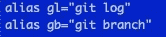

# Bash 概要——Bash RC:Alias，终端的代号

> 原文：<https://medium.datadriveninvestor.com/bash-profile-bash-rc-alias-the-code-names-for-terminal-a46b039e8ccd?source=collection_archive---------8----------------------->

Code-Names of Bash: Aliases

如果你经常呆在终端里，你会发现有一些命令是重复的。对我来说，我经常使用 Git，因此像`git commit -am`或`git status`或`git log`这样的命令总是被输入。

一定有办法减轻我手指的压力，减少我必须做的打字量。这就是方便的别名功能发挥作用的地方。

## Vim 导师

首先，熟悉 Vim。终端的内置文本编辑器。一开始有点棘手，但是很容易。Mac OS 终端上有 Vim 教程，任何人都可以上。只需输入命令:`vimtutor`教程就开始了。

 [## 2019 年最值得学习的编码语言|数据驱动的投资者

### 在我读大学的那几年，我跳过了很多次夜游去学习 Java，希望有一天它能帮助我在…

www.datadriveninvestor.com](https://www.datadriveninvestor.com/2019/02/21/best-coding-languages-to-learn-in-2019/) 

如果您熟悉 Vim，那么跳过这一步，您需要做的核心工作就在这里。

## 。bash_profile 或者。bashrc

向这篇文章的标题致敬，我们应该讨论你应该把你的别名放在哪里。嗯，你可以选择把它们放在**中。bash_profile** 或 **.bashrc.** 您可能想知道有什么区别，以及应该将别名放在哪个位置。

**。bash_profile** 用于执行登录 shells。只有当您登录或者让 bash 充当登录 shell 时，才会加载这个概要文件。**。bashrc** 用于执行非登录 shells。主键。每次启动新的 bash 副本时，都会重新加载 bashrc。

我建议将你的登录和非登录功能分开。从而将您的别名放入。bashrc 文件。

## 别名的命令

1.  在你的终端键入`vim ~/.bashrc`。这将打开您的. bashrc 文件。键入`i`开始编辑文件。
2.  打开后，添加一个注释到文件中，使用`#`并在这一行声明你正在添加别名。这会让你回来时知道它是什么。干净的代码，最好的代码。
3.  别名部分很简单。只要输入`alias <what ever you want it to be> = <"the normal command">`就大功告成了。这里有一张图供参考。

Alias examples from my .bashrc

4.保存并退出文件后，可以通过键入`:wq!`，键入 source ~/来完成。巴沙尔重新装弹。现在您的更改应该被保存了。测试他们！

我希望这篇文章是有帮助的！如果您有问题或者有使这篇文章变得更好的建议，请联系我们！