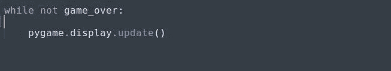
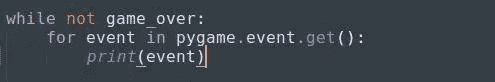
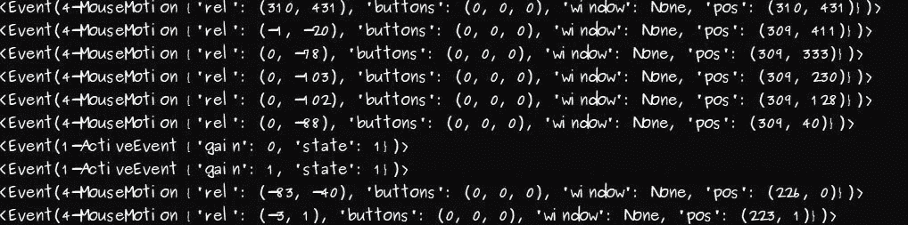
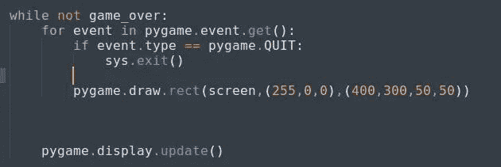
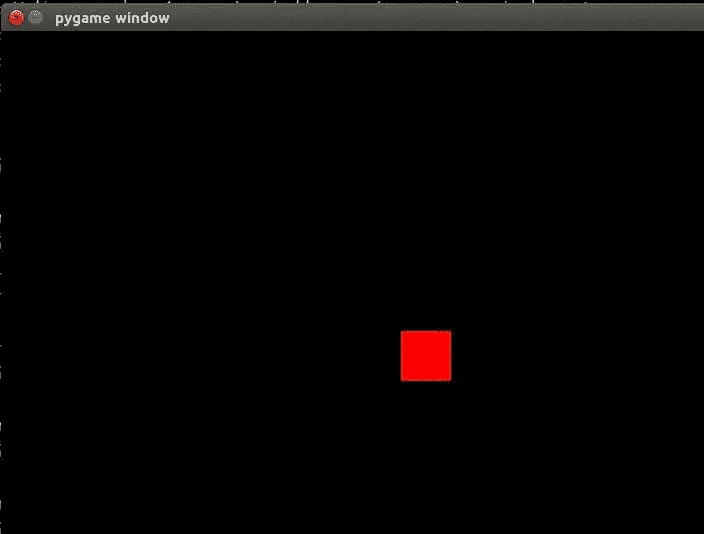
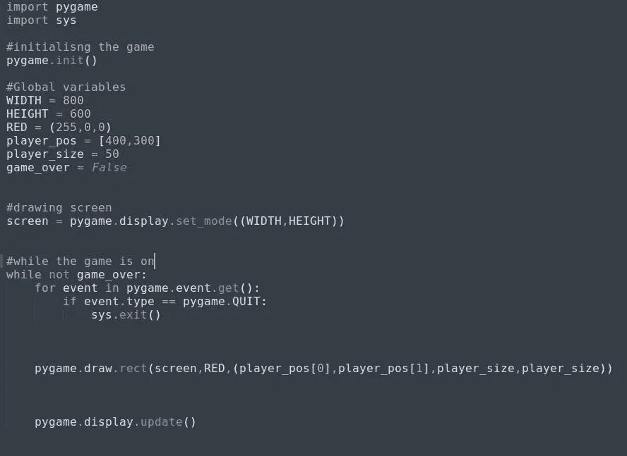

# Python 中的基本二维游戏(第 1 部分)

> 原文：<https://medium.datadriveninvestor.com/basic-2-d-game-in-python-part-1-5547e8f5e4b7?source=collection_archive---------10----------------------->

由于 [*全文*](https://medium.com/@asishraz/basic-2d-game-in-python-38574c339c50) 有点冗长，我决定把那篇文章分成几个部分。这是文章的第一部分，在这里我们将能够绘制游戏控制台和播放器。

main_image

在继续之前，如果你想看这个游戏的原始视频，请点击 [*这里*](https://www.youtube.com/watch?v=-8n91btt5d8&lc=z22dzrcysrrsd5yvmacdp435unyj5zbexr0inn5bewhw03c010c.1571697702780616) 。Keith Galli 做得非常好，如果你有兴趣通过游戏学习编码，请访问他的频道。

 [## 人工智能和虚拟现实的融合-你能期待什么|数据驱动的投资者

### 在技术领域，融合是合乎逻辑的一步。就在几十年前，你可能需要一个专门的…

www.datadriveninvestor.com](https://www.datadriveninvestor.com/2018/08/30/the-convergence-of-ai-rv-what-you-can-expect/) 

> 这篇文章是写给对编程和 python 有一点了解的人的。我将尽可能用最简单的方式来说明。

让我们开始吧…

我在这段代码中使用的主库或模块是'[***py game***](https://www.pygame.org/wiki/about)'。这是一个开源的 python 库，负责制作像游戏这样的多媒体应用。我们必须在代码中导入这个库。但在此之前，我们必须在我们的系统中安装这个库，以便在我们的代码中使用它。

> > **pip3 安装 pygame** (针对 linux 用户)>>**pip 安装 pygame** (针对 window 用户)

现在我们可以在代码中导入它。之后，我们必须初始化所有导入的 pygame 模块，因为即使模块失败也不会出现异常:

> >**导入 py game**
>>**py game . init()**

如果你执行这段代码，如果你会得到一个类似于:pygame 社区的
***py game 1 . 9 . 6
Hello。***[***https://www.pygame.org/contribute.html***](https://www.pygame.org/contribute.html)

你走对了。如果你有一些错误，请在线检查或在这里评论。

现在，我们必须设计一个游戏控制台，我们的迷你游戏将发生。对此，我们在 pygame 中有一个模块，即[***py game . display***](https://www.pygame.org/docs/ref/display.html#pygame.display.set_mode)***。*** 该模块负责控制显示窗口和屏幕。

但是我们必须初始化一个窗口或屏幕来显示我们的游戏。为此，我们将使用:[***pygame . display . set _ mode()***](https://www.pygame.org/docs/ref/display.html#pygame.display.set_mode)

这个函数将创建一个显示屏幕，我们必须在里面传递一些参数。据此，屏幕尺寸将出现在我们的系统中。
>>**py game . display . set _ mode((800，600))**
以上函数将取 [*元组*](https://www.geeksforgeeks.org/tuples-in-python/) 中的参数。这里(800，600)将是屏幕的尺寸。800 宽和 600 高，单位是像素。

现在，如果你运行代码，在上面提到的维度中会出现一秒钟的黑屏。

重要的是，' **pygame'** 是一个基于事件的模块，它将跟踪我们所有的事件。同样，在游戏世界里，游戏会一直运行，直到游戏结束。为此，我们必须设置一个 while 条件，当条件为真时，游戏将运行，当条件为假时，游戏将退出。

早些时候，游戏控制台出现了一秒钟，然后关闭。我们将通过更新屏幕直到条件为真来解决这个问题。
>>**py game . display . update()**

[***【py game . display . update()***](https://www.pygame.org/docs/ref/display.html?highlight=pygame%20display%20update#pygame.display.update)*将更新整个屏幕或部分屏幕。如果在 *update()* 内部没有传入参数，将会更新整个屏幕。*

**

*pygame.display.update()*

*该方法将持续更新屏幕，直到条件为假。*

*(*注:——我把一个变量'****game _ over****'赋值为****False****。因此，上面的循环将运行并向我们显示游戏主机* )
*(我知道，您在关闭游戏主机时遇到了问题。为此，您可以通过任务管理器终止应用程序。)**

**或者为了克服，我们可以这样做:**

**

*sys.exit()*

*这里，我们导入' [***sys***](https://docs.python.org/2/library/sys.html) '库，它负责提供 python 解释器的常量、方法和函数的信息。*

*我们在这里检查事件类型是否为 [***pygame。退出***](https://inventwithpython.com/pygame/chapter2.html) ，这意味着如果你点击关闭按钮，那就和执行 pygame 一样。退出事件，那么控制台或终端将通过'[***sys . exit()***](https://docs.python.org/2/library/sys.html)'关闭。*

*[**pygame。' QUIT**](https://inventwithpython.com/pygame/chapter2.html) '正好和' **pygame.init()'** 相反。它停用了 python 库，所以应该在'**sys . exit()【T27]'之前提到。否则，你的 IDLE 会挂起，因为程序会在没有停用程序中使用的 python 库的情况下终止。***

*现在，我们将捕捉事件，这是这个游戏最重要的部分。我们将使用'[***pygame . event***](https://www.pygame.org/docs/ref/event.html?highlight=pygame%20event#module-pygame.event)'模块来与事件进行交互。无论我们将执行什么事件或活动，它都会通过'[***py game . event . get()***](https://www.pygame.org/docs/ref/event.html#pygame.event.get)'捕获并显示在终端中。它从队列中取出事件，并遍历它，打印动作，你将看到我们所有的事件。*

*事件是指移动光标、按键和点击按钮等。*

**

*pygame.event.get()*

*我们将获得以下信息:*

**

*event capture*

*我们所有的鼠标移动和鼠标或键盘的任何事件都通过这个模块被捕获。*

*现在我们进入游戏的第一步，那就是制造玩家。我们将制作一个出现在游戏屏幕上的矩形方块。为此，我们使用了[***‘pygame . draw***](https://www.pygame.org/docs/ref/draw.html?highlight=pygame%20draw#module-pygame.draw)模块。在这个模块的帮助下，我们可以在屏幕上画出任何形状。在这里，我们将绘制一个矩形，为此，我们将使用'[***py game . draw . rect()***](https://www.pygame.org/docs/ref/draw.html#pygame.draw.rect)'方法。它需要 3 个参数，第 4 个是可选的:***py game . draw . rect(surface，color，rect_position，width=0)*** 。*

***表面** -要在哪些表面上绘制(这里，它将是屏幕)
**颜色** -它将采用 RGB 格式，这意味着对于红色，值将是(255，0，0)
**rect _ position**-将采用 x，y 坐标和矩形的厚度，即- (left_position，top_position，width and height)
**width = 0-**这是如果 width = 0，您将会看到一个彩色的矩形，但是如果 width=1，矩形将会有线条。默认情况下，宽度= 0。*

**

*pygame.draw.rect()*

*我已经采取了表面作为一个屏幕，颜色在 RGB 格式和矩形的位置。如果您运行上面的代码，您会看到类似这样的内容:*

**

*our player in rectangular form*

*我希望，你也一样。万一你发现什么错误，一定要告诉我。注意:-我们必须将所有可重用的值赋给全局变量，这样将来就可以很容易地修改它。否则，我们必须在许多地方，在我们使用这些价值观的地方，进行变革。)*

*我按照我的理解做了。*

**

*assigning reusable values to global variables*

*我们来到了第一部分的结尾。到目前为止，我们可以创建一个游戏控制台和该控制台上的玩家。第二部分请点击 [*此处*](https://medium.com/@asishraz/basic-2-d-game-in-python-part-2-5b1b75b24ac8) 。如果你觉得这篇文章有趣，请鼓掌并分享给你的朋友。也可以通过点击 [*这里*](https://medium.com/@asishraz/basic-2d-game-in-python-38574c339c50) 查看它的主要文章。*