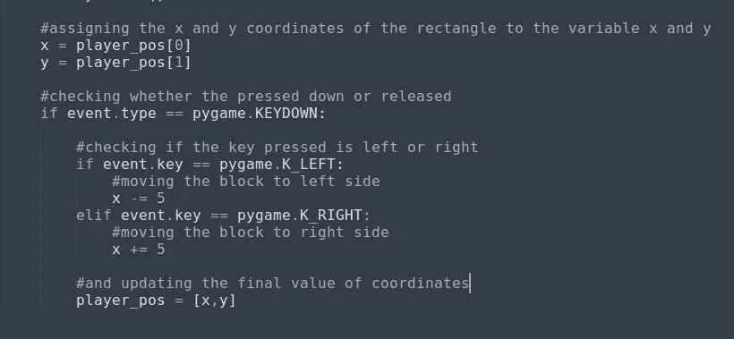
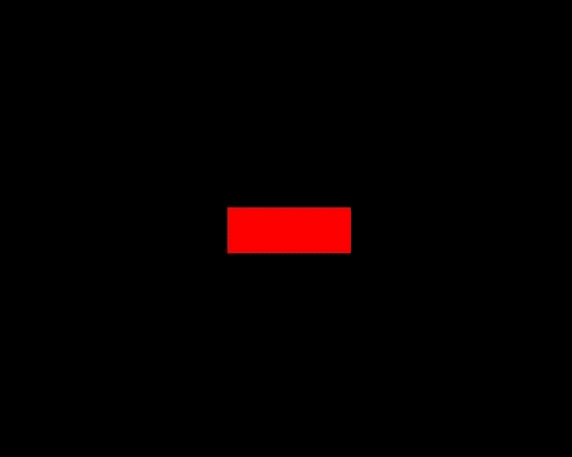
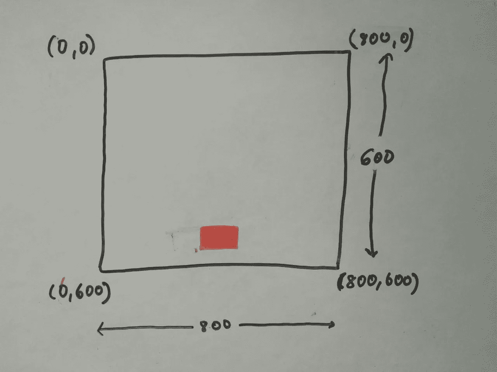

# Python 中的基本二维游戏(第二部分)

> 原文：<https://medium.datadriveninvestor.com/basic-2-d-game-in-python-part-2-5b1b75b24ac8?source=collection_archive---------17----------------------->

文章的第二部分，在这里我们将能够向左右方向移动玩家。

*在更进一步之前，如果你想看这场比赛的原视频，请点击* [*这里*](https://www.youtube.com/watch?v=-8n91btt5d8&lc=z22dzrcysrrsd5yvmacdp435unyj5zbexr0inn5bewhw03c010c.1571697702780616) *。* [*凯斯加利*](https://medium.com/u/d4ac622fea59) *做得很棒，请访问他的频道，如果你有兴趣通过游戏学习编码*

向左或向右移动也是我们必须控制的事件类型。对于左右移动，我们通过按下左右箭头键来进行键盘事件。要执行它，我们得看看 pygame 中负责按键事件处理的模块，那就是 [***pygame。KEYDOWN***](https://stackoverflow.com/questions/25494726/how-to-use-pygame-keydown)*负责捕捉按键是否被按下。这是一种事件类型，因此我们将使用“event.type”方法进行检查。记住我们正在迭代游戏中的所有事件:*

*> >**for py game . event . get()中的事件:***

*现在，我们将检查特定事件是否是按键按下，如果是，那么我们将进一步检查按键是向左还是向右按下，据此我们将移动块。记住，我们是在左右方向移动方块，也就是 x 坐标。然后我们将分配一个变量，它将取矩形块的 x 坐标，我们将改变这个变量的位置。
**>>x = player _ pos[0]
>>y = player _ pos[1]***

*为了更好的理解 [***关键事件***](https://www.pygame.org/docs/ref/key.html) ，可以参考本页。*

*对于左箭头键和右箭头键，我们必须分别检查 **K_LEFT** 和 **K_RIGHT** 。如果按下的键是左，移动到左边，按下的键是右，移动到右边。就是这样。非常非常简单。*

**

*moving the key left or right*

*运行代码，你会看到这个块在两个方向上移动，但是(*我知道*)它没有离开原点。我们不希望木块像这样移动。如果你对这部分代码有任何疑问或问题，请随时评论。*

**

*block not leaving the origin*

*好的，木块不会离开原点。怎么办？解决这个问题非常简单。相信我。*

*[***. screen . fill((color))***](https://sites.cs.ucsb.edu/~pconrad/cs5nm/topics/pygame/drawing/)*是用上述颜色填充整个屏幕的方法。**

**例如:- screen.fill((0，0，0))。每当方块离开它先前的位置(在整个游戏屏幕中)，它就会将颜色从红色变为黑色。**

**好了，现在我们有了播放器，它正在按照我们的指令移动。是时候把这个方块放在屏幕下方了，这样我们就可以从上方迎接我们的敌人了。**

**还是那句话，你可以根据自己的方便来放置播放器(块)。我是这样放置的:**

****

**player position**

**为了让你更好地理解坐标，我将画出游戏机的复制品。**

****

**coordinates**

**这部分结束了，到目前为止，我们可以让我们的玩家向左右方向移动。第三部分请点击 [*此处*](https://medium.com/@asishraz/basic-2-d-game-in-python-part-3-f6f8910ff972) 。如果你还没有读完第一部分，点击 [*这里*](https://medium.com/@asishraz/basic-2-d-game-in-python-part-1-5547e8f5e4b7) 。如果你觉得这篇文章有趣，请鼓掌并分享给你的朋友。**